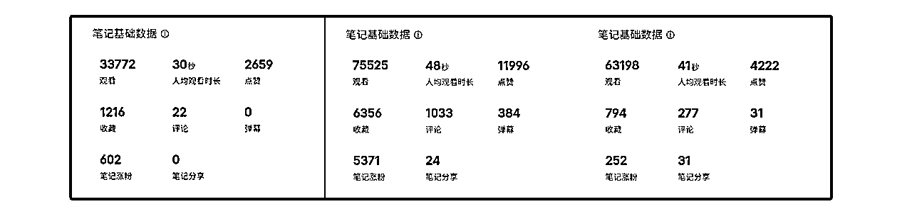
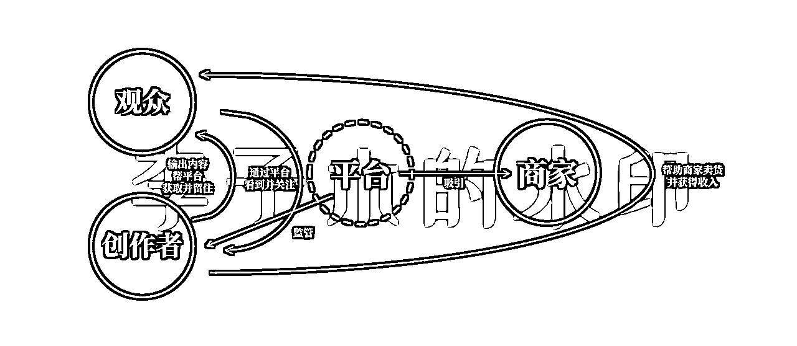
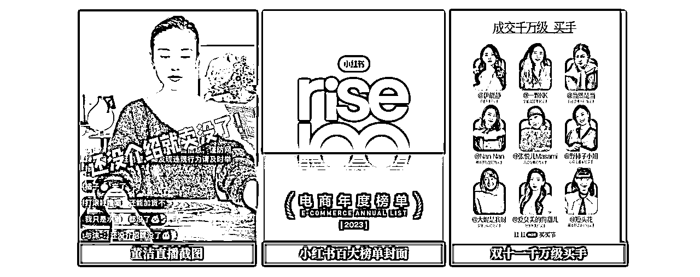
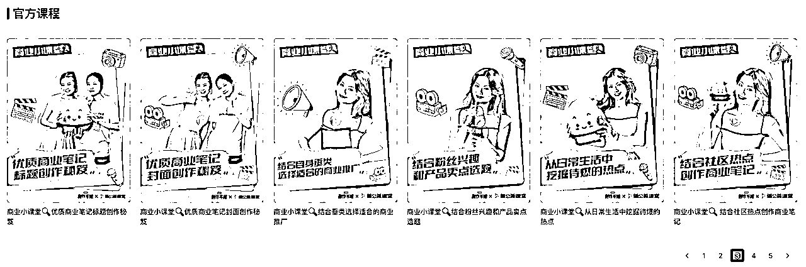
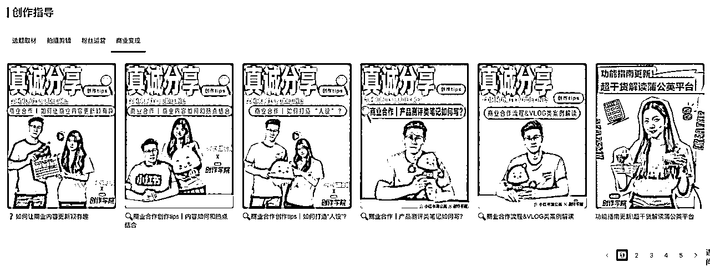
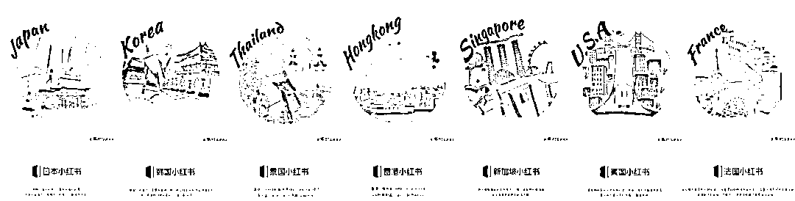
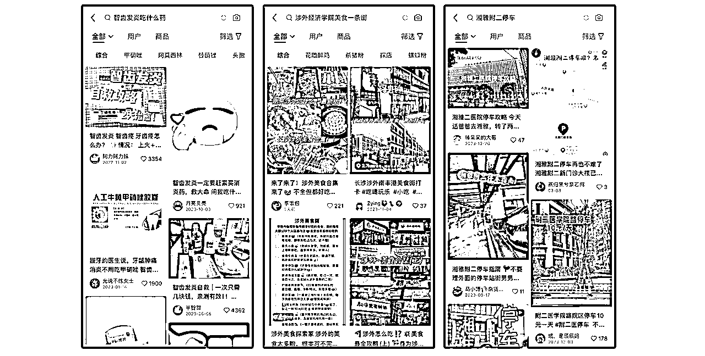
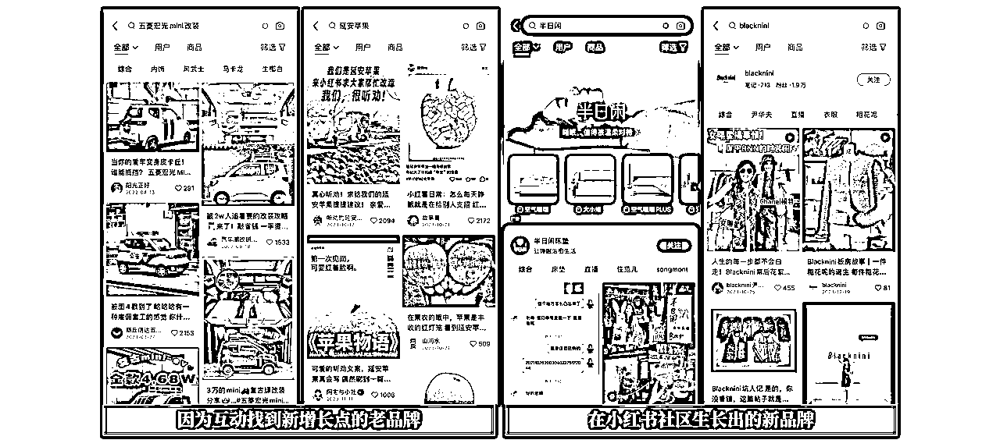

# 2024年小红书运营趋势分析

> 来源：[https://m08zlw24sg0.feishu.cn/docx/Sd8Tdoh8votCXAxJSXUciolsnlb](https://m08zlw24sg0.feishu.cn/docx/Sd8Tdoh8votCXAxJSXUciolsnlb)

对于所有想在小红书获取流量、获得影响力、拿到变现结果的创作者而言，或许我们要了解小红书这个生态、了解自己在其中的位置，才能更好地持续拿到想要的结果。

我陆续研究小红书1年，做过一周引流600+的同城交友内容、做过千万播放的原创爆款模型、也做过变现过万的千粉账号……这在圈里算不上什么好成绩，但我希望，能在2024年做出一点好成绩，因为我认为，2024年，小红书仍然是对于普通人、对于个人内容创业者而言的最好平台之一。

为了更好地了解小红书，我花了一些时间查阅资料，结合自己10年营销工作和自媒体运营的经验，梳理了小红书的需求与趋势，得出2024年小红书运营的7个方向，供大家参考。

有任何不同的意见或想法，欢迎随时交流，共同进步～

# 零、小红书的本质是一个平台

小红书的本质，是一个平台，无论它是一个多么新型的社区，归根结底它仍然是一个平台，对于一个平台来说，核心的关键点，只有2个：获取流量、商业化变现。

流量即用户，小红书作为内容平台，用户包括创作者、观众，我们属于小红书用户中的创作者，在小红书的生态中，所处的位置和作用如图：

创作者是小红书作为一个内容社区，其流量、商业化的重要环节，创作者与平台的利益交换也是围绕这2点展开：

*   在流量方面，

平台利用创作者输出的内容，可以获取新的观众，并通过让观众观看内容，来留住观众。

而创作者通过在平台上发布的内容，吸引平台上的观众关注，获得在平台上的影响力。

*   在商业化方面，

平台引导创作者进行好物分享、攻略分享等方式，帮助商家卖货，获得商业化变现的能力。

创作者通过带货、或种草品牌，获得收入。

后面的内容，会围绕小红书2024年的流量与商业化展开。

同时，前有抖音跑马圈地，后有视频号手握微信大盘，小红书要在流量、变现上杀出自己的一条路，要依托自己一直以来的差异化，所以也会把小红书的不同单独拿出来讨论。

*   本文大纲：

流量-小红书的破圈与人群聚焦

商业-小红书商业化加速与创新

不同-小红书的差异化

启示-2024年小红书运营启示

# 一、小红书的破圈与人群聚焦

在品牌或者产品的推广周期里，一般会有两个阶段：

*   第一阶段，商业模式未成型，品牌会做增长，但投入比较克制。流量是会过期的，3个月前的流量，在3个月后去做商业转化，又需要重新养一遍，花的成本并不会比获取新流量低多少；

*   第二阶段，商业模式有了雏形、验证出成果，会增大对于流量增长的投入，因为这时，能够接得住流量的转化，不会浪费。

2023年，小红书买手有了较大的突破，单场gmv过亿、也出了百大买手榜单，带货数据还不错。

当时我想，小红书应该会在流量获取上有更大的动作了。

果然，12月，小红书官宣与龙年春晚的合作，在总台旁边联合搭建直播间《大家的春晚》，总曝光10亿，互动超1.7亿，#大家的春节#话题阅读量近13亿。

春晚是一个巨大的流量池子，能帮助小红书更快地获得流量。

春节之后，小红书又联合8家全国连锁品牌，覆盖356个城市的4万多门店，赠送奶茶，参与人次3500万。

这里我们可以注意到重点：小红书在探索流量破圈的同时，仍然聚焦的是年轻人。

随着小红书的流量破圈，这个曾经的“流量洼地”有越来越多的竞争对手进入，同时，还有更多的品牌商家进来瓜分流量，小红书还好不好做，取决于：平台的月活增长，用户的使用时长，是否能满足大量新涌入创作者的流量需求？

毕竟，在众多kol口中、在众多运营网站的声明中，小红书依然是2024年最值得做的平台，我也注意到，身边越来越多人的新年计划是：想要做一个小红书账号。

那么，现实的问题仍然是：平台的月活增长、用户的使用时长，是否能满足大量新涌入创作者的流量需求？

我没有找到23年3季度之后小红书的月活数据，当时公布的月活是2.6亿，同期抖音月活用户约为7亿多，单从这个数据来看，小红书还有较大的流量增长空间，但是，这也意味着人群的泛化：大基数的流量，意味着各个年龄阶段、不同层级市场的全面涌入，但是这或许与小红书想要打造的社区氛围相悖。

走到这个十字路口，其实流量规模和社区质感，就成为了一道选择题。

从小红书CEO星矢的十周年分享、COO柯南在极客公园接受的访谈来看，小红书会选择社区质感。

所以，我们可以因此推断出，虽然小红书在做流量破圈，但不会太快，所以平台上的流量，在变得越来越珍贵。

所以，作为创作者可以感受到，小红书的爆款概率在变低。

同时，从发布内容的基本流量来看，小红书的内容权重，远大于账号权重，很多几十、几百个粉丝的新人，能拿到千赞、甚至万赞爆款，而许多十几万粉的博主，可能点赞只有十几个，所以，小红书仍然对新人友好。

但是，创作者人均分配流量变少、爆款概率变低、账号权重影响较弱，这也意味着：小红书账号会开始变得不值钱。

如果你做小红书，主要的变现方法仍然是接广，那么，你的压力会越来越大，因为，品牌方投放广告，会看重你的数据稳定性，但是，在流量变稀缺、账号权重影响力小的小红书，维持账号数据的稳定，会变得更加困难。

而且，小红书平台有着比其他平台更加隐晦的规则，封号、限流、删文，有时候不小心踩了某个坑，账号就没了。

所以，真正会赚钱的人，都不再重点关注小红书的粉丝量、点赞量，而关注带货GMV、引流数据。

在2024年做小红书，不要想着涨多少粉、接多少广告，而是去卖货、引流，去做能直接赚钱的事，去做积累你自己私域的事。

# 二、商业：小红书商业化加速与创新

查看小红书创作者中心会发现，在小红书创作服务中心的30个课程里，与“商业种草”直接相关的课程有13个，置顶课程更是商业合作中心的上线通知。

可见小红书在近期，在商业变现上仍然主推商业种草。

什么是小红书的商业种草？

在合作中心可以看到，小红书目前主推的三种商业种草合作方式是：

*   博主合作，可以理解为广告植入合作，品牌方发布招募需求、内容预算，博主进行合作预约，结算方式是单篇内容买断，也就是常说的“接广子”；

*   买手合作，是小红书的带货合作，包括笔记带货、直播带货，平台目前主推的是直播带货，博主可以在选品中心选品带货，品牌方也可以定向邀约博主进行带货，两者的区别主要是佣金比例的不同；

*   探店合作，是小红书本地生活的探索，在本地探店，发布内容，可获得流量扶持及佣金分成。

平台上已推出的功能是现状，未来的趋势，或许可以在高层的对外发言中窥见一二，我看了小红书CEO星矢和COO在小红书十周年之际的讲话和访谈，发现，在商业化这块，小红书可能想要的有：

### 1、多元业态

小红书自己对于“种草”的定义是，用优质内容触达用户、影响用户。

确实，小红书比抖音、b站，更有做内容电商的基因：2013年，小红书的1.0版本，是7个国家的购物攻略文档，“购物攻略”天然跟“电商”有着强关联。

而在其后，推出的社区是“海外购物分享社区”。由此可见，从小红书成立，就是冲着生活方式分享、商业购物来的。

12月22日，小红书举办will商业大会，提出“万物皆可种草”，将种草的范围再一步放大，不局限于消费品，还包括服务、体验、虚拟内容、甚至是对于个人IP的种草。

这个概念，有点类似当年“万能的淘宝”，也是打包多种各样的业态，但是，淘宝的纯电商属性，让它在本地生活、虚拟内容、个人IP、大宗商品交易等方面有弱势。

小红书打造的内容电商业态能不能突破这种局限？我认为这也是小红书正在探索，并且已经取得初步成效的。

对平台来说，商业是一个现实的游戏，仅仅“想要多元业态”是不够的，它需要打造成功样板，吸引从业者入驻、留下，完成一定的GMV、形成一定的行业入驻规模，才可能成为一个“业态”。

所以，小红书会重视对于除消费品外其他业态的商业化。当然，这是一个循序渐进的过程：

*   首先，是加速消费品商业种草业态的成熟，这可以成为小红书商业化的基石，这个基石成立之后，可以更加从容地去探索其他商业化方式，所以，2024年，买手直播的形式仍然会受到平台鼓励，小红书买手直播仍然值得入场，只是竞争者快速涌入，动作要快。

*   其次，是对于新行业的孵化，小红书为自己的商业化差异点定义为“特色人群、高质量种草”，所以新行业的孵化是小红书乐于去做的，它能更凸显出小红书与抖音、视频号等其他平台的差异化。小红书是一个“颜控”、“品质生活”平台，所以，年轻人喜欢的、品质感的可视化新兴行业，在小红书上有机会。可视化指的是，能通过图片、视频直观呈现的，比如新国风的原创设计服饰、定制宠物毛毡等等，可以在ins等国外相同风格的社区或网站寻找机会。

*   再次，是对于本地生活的商业化探索，也就是“万物皆可种草”中包括的服务与体验。抖音早2年开始做本地生活，从这个业态的商业化推动上比小红书早一点，但是，几年前小红书上的探店内容就火过一轮，很多分享生活方式的博主也具有探店分享的优势，所以在这一块，小红书具有自己的优势，小红书上的探店合作值得关注。

*   至于虚拟内容，目前在小红书靠卖资料、卖壁纸变现的人很多，我暂时没有看到官方的扶持，但应该会在前面的业态基本摸索成型后，也会有相应的动作。

而个人IP的种草，我暂且打一个问号，具体在四、小红书的差异化的去中心化中来聊。

### 2、搜索商业化

在极客公园对小红书COO柯南的访谈中，柯南提到了一个很有意思的数据：70%的月活用户在小红书有搜索行为，3成的月活用户打开小红书第一件事就是搜索，许多新用户接触小红书也是因为搜索。

对于想要留住新用户的小红书，必然会重视对于搜索流量的优化。柯南也提到，小红书未来，可能会更加重视搜索的商业价值，以及搜索内容为平台留住用户的用户价值，这意味着未来的搜索排名可能会有变化：

01、内容的带货能力会成为内容搜索排名更重要的依据，这是搜索的商业价值；

02、内容的真实性、差异化也会成为搜索排名的重要依据，这是搜索的用户价值。

所以，创作者在小红书进行内容带货时，可以更重视小红书的搜索流量：

*   内容的关键词布局，在标题、开头、话题、封面文字中使用垂直细分的关键词；

*   注意优化种草内容的带货数据指标；

*   内容更加生活化、真人感、有具体细节，比如这几个例子：

### 3、互动与复购

除了成交单数的增长之外，柯南还提到，希望帮助商家的长期经营。

从品牌经营的角度来讲，长期经营包括：品牌形象的树立（形象），品牌与用户的互动（声量），体验与复购（销量），其中最关键的，其实是交互与复购。

在交互层面，小红书已经树立了不错的样板案例：爆改五菱宏光mini、听劝的延安苹果……

但在复购层面，这存在一些bug：

*   对高客单、或者是小型工作室而言，都希望把客户引入私域，这样不用反复支付高额的佣金；

*   对服装饮料等快消品而言，用户的习惯是哪里优惠就到哪里复购，而低客单不是小红书想做的。

所以这一块，我个人并不看好。

另外，虽然小红书的商业化探索跟2年前相比在加速，但是，我认为仍然会保持谨慎的态度，不会走得太快。

去年8月，小红书CEO星矢在内部分享中提出，商业价值，不是以效率提升为主，而是liberal arts，让art的部分创造更大的商业价值，所以，品质感、高客单，仍然会是小红书未来的追求。

# 三、不同：小红书的差异化

小红书的公众号只有一句话简介：真实、向上、多元，我认为这是小红书官方对平台调性最真实的总结。

在12月小红书官方发布的《小红书2023年度趋势》中，有这样一句总结：

这些趋势，不是来自意见领袖的市场教育，也不是昙花一现的热点流行，而是小红书日益多元的用户，互相激发探索生活的热情，让新趋势不断破圈，不断吸引新的受众，逐渐变成更多人可感可知的生活方式。

多元的背后，是小红书坚决执行的

### 1、去中心化

得出这个结论有3个依据：

*   运营体感，小红书的账号权重目前在各平台是最少的，而素人账号的爆款概率，也是各平台中最高的；

*   小红书的头部达人粉丝量及达人数量在各个平台中是更少的；

*   小红书不会造神，而会通过一群做某件事的人，吸引对这件事有兴趣的人，以最近的直播买手标杆打造为例，从董洁、到伊能静、章小蕙，再到百大买手榜单，小红书更喜欢将鸡蛋放在很多篮子里，而不是一直往一个篮子里堆；

柯南也表达过，小红书想要长成大社区，服务更多用户，但是，它是由小社群、小圈层融合在一起的。小社区、小圈层，意味着不需要大IP。

对内容平台而言，需要树立一些标杆，才能吸引大家愿意进来创作，但小红书不希望自己依赖于这些标杆，而是希望这些标杆随时可以被替换掉，不会因为博主的走失，让自己面临流量的走失。

平台与博主的利益平衡，一直是个现实问题，大家涌入小红书，因为这里有不错的氛围、不错的内容，一旦提供氛围和内容的人，失去了继续创作的动力，而新人被其他更好的平台吸引，也容易曲终人散。

所以，我对于“多元业态”中“IP的种草”的观点是，小红书欢迎IP来到，但不会让过IP过于做大。

这对于并不一定需要成为国民大IP、而是吸引1000个铁粉即可实现职业自由的普通人而言，并不是什么坏事。

既然小红书选择了去中心化，就会持续释放流量给新账号，让新人尽快尝到甜头，有动力持续地进来。

所以我的判断是，在未来比较长一段时间，新人入局都有机会。

同时，也要再一次强调，在小红书，不要以养账号接广告为最终目的，而是以卖货、引流为最终目的，尽快赚到，把钱或人抓到手里，才是正经。

### 2、积极生活

小红书选择的内容切入点是，对于生活方式的分享，因为与生活关联更紧密的，商业化的可能性也更高。

小红书对于自己的定义是“温暖的小社区”，社区的主流氛围是：珍惜自己当下的生活，并且为之付出努力。我们可以看到，哪怕许多“年纪轻轻就躺平”的、“97年生人早早退休”的，看起来是一种颓废，但其实仍然是对于生活的积极态度，想要打破现状、找到更好地自我的一种努力。

所以，在小红书，更受欢迎的分享内容是温暖、是积极、是分享细枝末节的美好的东西，而不是矛盾冲突、不是负面情绪，这也是创作者在小红书进行内容创作时需要注意的。

# 四、小结：2024小红书仍然值得一做

通过分析梳理，得出7个2024年小红书运营的方向，总结一下：

### 1、新号入局仍有机会

并且在未来较长一段时间内，都有机会。

虽然视频和直播在瓜分流量，但不同于其他平台，小红书的图文仍然是特色，有许多低粉爆款，创作成本较低，所以对于新创作者而言，小红书仍然是最好入局的平台之一。

### 2、别追求涨粉，去做离钱更近的事

在2024年做小红书，不要想着涨多少粉、接多少广告，而是去卖货、引流，去做能直接赚钱的事，去做积累你自己私域的事。

### 3、直播带货值得一试

### 4、可视化、品质感的个人品牌可以考虑以小红书为主推平台

### 5、重视搜索流量，做好关键词布局

### 6、留意小红书本地化、探店方面的动作

### 7、内容属性温暖、细节、生活化

以上内容都是偏宏观层面的思考，做自媒体几年来，我有一个很大的感受：宏观的、方法论的东西看了很多，但落到细节上，其实还是容易迷茫的，不知道到底该怎么做。

所以我也会不定期拆解新近数据表现好的高活跃博主、或者近期的爆款标题，这样更能把握微观的细节，知道怎么具体去做。有兴趣的话，可以留意我后续的分享，一起生财～

参考内容：《小红书电商2023年度榜单发布 ！》《小红书“制造”千万级买手》《小红书2023年度趋势报告》《小红书COO柯南：好社区长出了好商业，社区与商业不对立、不矛盾》《小红书CEO星矢十周年分享：科技为笔人文精神为墨，创造广阔而温暖的社区》