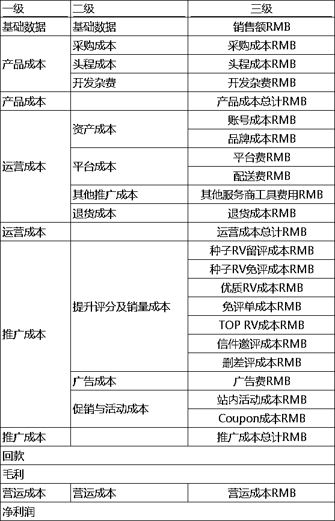

# 做转化的核心 —— 价格（亚马逊版）

> 来源：[https://blrwwxfhox.feishu.cn/docx/NwEcdx9PHoNnrjxTu69cRk42nNd](https://blrwwxfhox.feishu.cn/docx/NwEcdx9PHoNnrjxTu69cRk42nNd)

我叫小紫，今年是我在跨境电商行业的第七年了。

从0-1做过千单爆款，转化率高达79.3%。

目前是多家深圳跨境亿级卖家企业顾问。

我不定期会给大家分享一下专业知识，当作对自己的一个沉淀。

这是转化核心的第三期。

之前和大家分享了如何做图片、文案。

有许多读者朋友反馈，希望图片和文案能开成一堂课具体讲讲，

小紫有机会都给大家安排上~

今天准备和大家继续转化的话题，聊聊价格，是如何影响转化，又应该如何定价，如何优化。

* * *

# 1、价格是如何影响转化的？

顾客想买一个太阳能灯，

首先，会打开亚马逊主页，

再输入“solar light”关键词，

紧接着，类似的产品就会根据权重先后展示在他们面前，

权重大小是如何展示的，在我之前的文章都有提到过。

在搜索结果中，同类的产品都被放在一起，

这就给顾客提供了对比，提供了选择。

在传统定价中有一个观点：我们要按照产品价值来定价。

在线上购物环节中，这个观点就是无效的。

因为关键词搜索出来，

同质化的产品都被系统安排一同展示给买家，

意味着买家有多重参考。

买家可以对比同类产品的首图、标题、评论、价格、促销来决定，要不要点进我们的链接。

价格高于市场平均水平百分之50以上的流量是很难倾斜的。

买家也会觉得产品价格不值，购买的意愿会降低。

其次，价格太低也会被限制，因为它违背了市场的价格原则。

可能会让消费者怀疑产品的质量，同时也会降低产品的盈利。

亚马逊上定价，一定要清楚一点，

市场的定价，首先要参照你的对手，而不是看你的产品价值。

在实操中，我们一定要可以通过市场调研来确定我们自身产品，最合适的产品定价。

找准自己的产品定位，从而达到最佳的购买转化率。

关键是要合理规划利润，理清市场的价格等级，选择适合自己并且价格适中的定价。

毕竟卖货不是为了慈善，而是为了利润。

# 2、市场中，应该如何定价？

### 1）产品成本

在市场中定价，离不开成本。

亚马逊的成本计算，其实已经很透明了，

这里直接给大家看张表就能理解。

没有成本的竞争力，就没有价格优势。

没有价格优势，就只能压缩推广空间。

中间如果多一个环节，基本上就不赚钱了。

比如退货率稍高几个点，

广告费又拖累几个点，

前期推广，跑个活动又亏损几个点...

很多新手卖家，判断自己产品到底能不能做，

也可以通过这个表格先粗算一版。

很多人说成本优势很难拿到，

但只要有成本优势，是大大提高产品成功率的。

### 2）产品定位

为什么说产品定位对于价格来讲非常重要？

大家都知道，“性价比”不是卖点。

让产品卖爆的从来都不是性价比，而是用户认为你值得。

很多卖家信奉“螺旋打法”这一套。

于是疯狂卷价格、打价格战，

却忽略了消费者的其它诉求。

一旦原材料价格上涨，出现了价格更低的产品时，

它就无从下手，因为螺旋并不是长久之计。

如果你用“高性价比”作为核心卖点，

那么你大概率吸引来的，就是一群对价格敏感度高的顾客，

反而让真正的高价值用户觉得产品LOW。

但如果我们前期做好市场调研、竞争分析、用户画像...

了解目标市场的需求、趋势和竞争情况。

明确自己的产品定位，清晰自己的目标客户人群。

确定我们产品的核心竞争力，在定价方面留出一定空间，再来做营销。

# 3、推广中，如何优化价格？

产品定位是一个产品在市场中取得成功的关键之一。

但产品定位也并非一成不变，

市场需求什么时候变了，我们也要反复对产品做评估和调整。

因此，在实际推广中，我们的定价也需要根据市场变化，不断地进行优化。

大家应该听说过许多书本上的定价策略，

什么渗透定价、价值定价法、撇脂定价、锚定策略...

今天我用简化语言+可落地版本，

直接给大家总结出三种亚马逊推广常用方法：

### 1）高价格策略

假设，我们产品市场中位价格是29.99。

选择高价策略，我们前期可以设置新品价格为34.99美金;

打法一:

34.99高价格配合大额coupon (30%以上为佳) ，

广告手动精准来推，直接抓精准流量。

这个打法需要较多的广告费用较高。

这也是价格一定要留多操作空间的原因，

这个打法一定要对广告有较强的把控。

打法二:

高价格42.99配合高折扣code，做站外deal，

配合较激进的广告，把新品排名拉上去后再适当降价，

获得红色降价标签后，就可以正常开广告，然后等待后台推荐秒杀。

高价策略一定要注意，产品质量一定要过关，不然很可能反而引来差评，

同时，一定要结合高coupon或者会员折扣来操作。

### 2）中价格策略

那我们要打中价格策略;

那我们前期可以设置24.99的价格，

coupon设置10-15%左右，控制好广告预算，

广告最好开手动精准匹配，点击根据每天出单情况来把控，

不能一次给太多预算，也不能给固定预算然后不管它死活。

后续再开始手动词组匹配，新链接翻身的机会就大大提升。

### 3）低价格策略

低价策略最大的问题是没利润，并且后期可能很难提价，

所以对价格敏感的市场，一定要谨慎！

如果想前期打低价策略，那可以设置价格为20.99美金，

毛利很低的情况下，打低价要控制低成本开广告，

单次竞价一定要较低，建议开自动精准匹配，

随着链接逐渐出单，排名慢慢提升，再一点点去提价;

一般是不建议新品一上来就跟很低的价格，

除非你就是为了测款，这条链接卖完不卖了。

产品的定价一定离不开市场，

但也并不是说同行卖多少钱，我就卖多少钱，

选择什么样的价格策略，匹配什么样的运营手法，才是最关键的。

* * *

全文完。

迄今为止，讲了三期关于亚马逊如何做转化的主题:

🎁（备注 转化攻略）附转化系列内容汇总🎁

大家可以评论互动你想听的内容，

接下来我也会继续给大家整理转化相关的知识，不断丰富转化系列的内容。

以下是我的经典文章，99%关注我的人都会阅读，建议你一定要好好看一看：

精细化运营法：

干货型：

职场经验型：

如果觉得小紫的这篇文章聊得还挺有趣

欢迎来交个朋友~