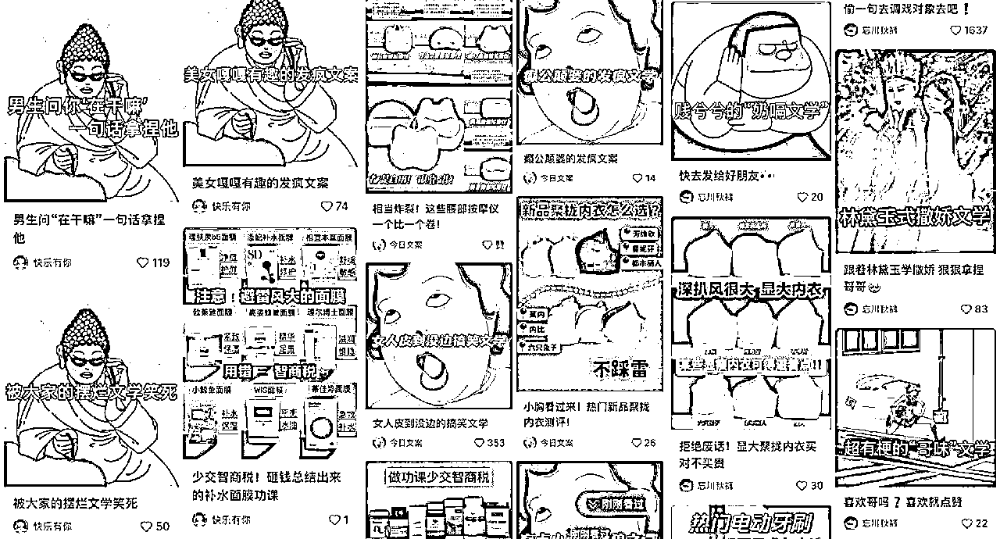
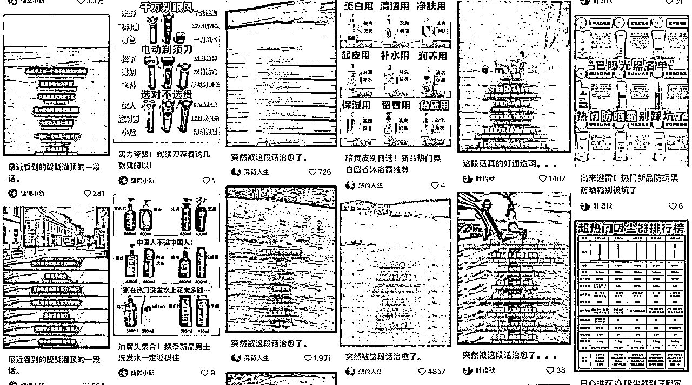
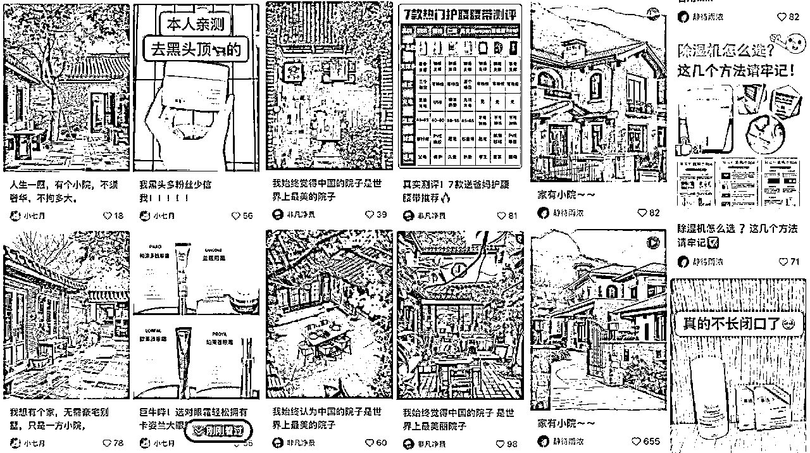

# 做长久接广的小红书广告号（新人不看就亏的保姆级教程）

> 来源：[https://rm1nv0sw1r.feishu.cn/docx/OCeWdCN5Ton483xJGfjcWVv7nHg](https://rm1nv0sw1r.feishu.cn/docx/OCeWdCN5Ton483xJGfjcWVv7nHg)

我从去年9月才开始做小红书广告号，做的比较晚，但现在每个月仍能收到一些广告邀约。

实测这确实是一个可以长期坚持的好项目！

这次【小红书达人变现】航海也印证了这个项目的长期价值。

这篇内容就分享一下我的经验，这不能保你大富大贵，但每个月赚点小钱没什么问题！

一、什么是小红书广告号

整个小红书的内容都是为满1000粉丝开通蒲公英接广服务的。

内容需要满足接广要求：

1、粉丝数超过1000

2、内容的平均阅读量要超过1000（甚至有些广的要求更高）

3、要有爆文

二、你需要准备什么

1、一个手机、一张电话卡、一个小红书账号（必须一机一卡一号）

2、满18岁的实名信息（账号1000粉以上要开通蒲公英）

3、每天更新小红书内容的时间

三、为什么这个项目有长期价值

1、个人耗费的时间精力少

找到合适的内容，每天更新内容涨粉就行，几乎不用动脑子

2、广告主会持续投放小博主

小红书的商业化进程加快，很多商家意识到小红书上做广告的价值。

广告主不光投放头部腰部博主，还要海量投放素人博主，笔记铺量。

3、每年都有广告投放爆发期

这个项目也有周期，在购物节前（双11）、节日（新年）需要投放的广告主会特别多

在平时会比较少

四、项目的明显限制

1、依赖广告主

如果没有大量广告主做投放，账号几乎没有其他变现模式

2、平台账号竞争

如果平台中做这类内容的账号过于多，那就只能内卷价格，返点更多或者降低单价

现在每篇广的单价在150/篇，有时候广告主会砍到120，或者要20%的返点。

3、单号收入有上限

接广多，就会废号，蒲公英平台有接广等级，优秀到普通之后很难再有广告邀约。

广告主看笔记数据进行投放，数据不好的也接不到广。

大量的广告主资源也很重要，如果每天能接到一个广，单号的月收入也是很可观的。

五、如何选择内容赛道

1、能出爆款

2、能带来涨粉

3、内容能迅速产出，节省时间

4、数据能维持稳定

5、有广告主进行投放

六、简单上手的接广赛道

下面分享几个简单好上手的接广赛道，抛砖引玉，期待链接更多大佬

（1）表情包文案

一张有趣的表情包+标题

（2）动漫人物语录

有趣的动漫、人物图片+人间清醒的句子

（3）治愈文案

治愈的文字+舒服的配图

（4）Ai治愈图片视频

ai图片或者图片变成动态视频

（5）动漫剪辑

热门的动漫片段

（6）娱乐剪辑

也就是营销号

还有很多好上手好涨粉的赛道，刷一段时间的对标后就能找到更多能接广的账号类型。

七、接广流程

开通蒲公英，进行实名。

在合作广场会有招募，看到合适的【直发笔记】类型就可以尝试报名。

后台也会推一些有意向的合作邀约，需要及时加v进行合作。

加V后主动跟广告主报备账号主页链接

与广告主/PR协商过程

一般是广告主问：今天/明天有没有档期图文直发

然后确认一下自己的档期，让广告主蒲公英平台下单

到自己的账号进行确认

等待广告主发笔记内容，然后在自己的账号进行发布

平台审核、广告主审核后，就可以发布了

八、MCN机构

当你满1000粉丝时，会有一些MCN机构的私信，有些机构的资源还不错，加入后会给你推一些广告，但之后几乎就不会再推了！有一些加了的博主也陆续退出了。

如果个人能接触到广告主，那就不要加MCN，MCN收广告总额10%～20%的提点，提现也要经过他们进行打款。

九、对于项目的思考

1、这个项目的重点在于保持内容数据的稳定性，保证自己的蒲公英平台等级是优秀，能有更多广告邀约。

2、广告主资源很重要，每个月账号的接广数量决定了你能赚多少，如果一直接不到广，更新只是在为平台打工。

3、可以做矩阵号来放大项目，最好能直接对接广告主，一次投放一批自己的账号。