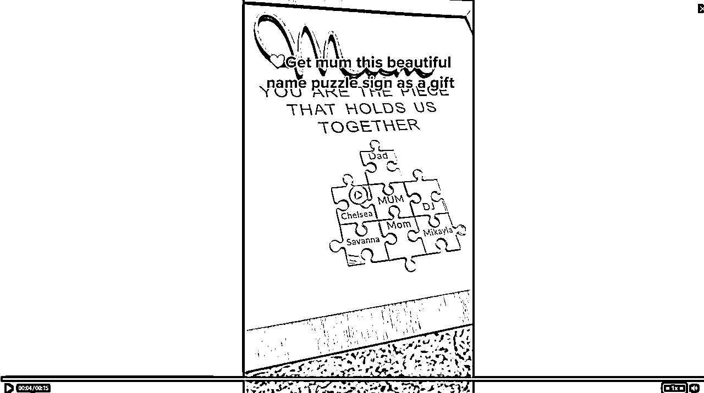
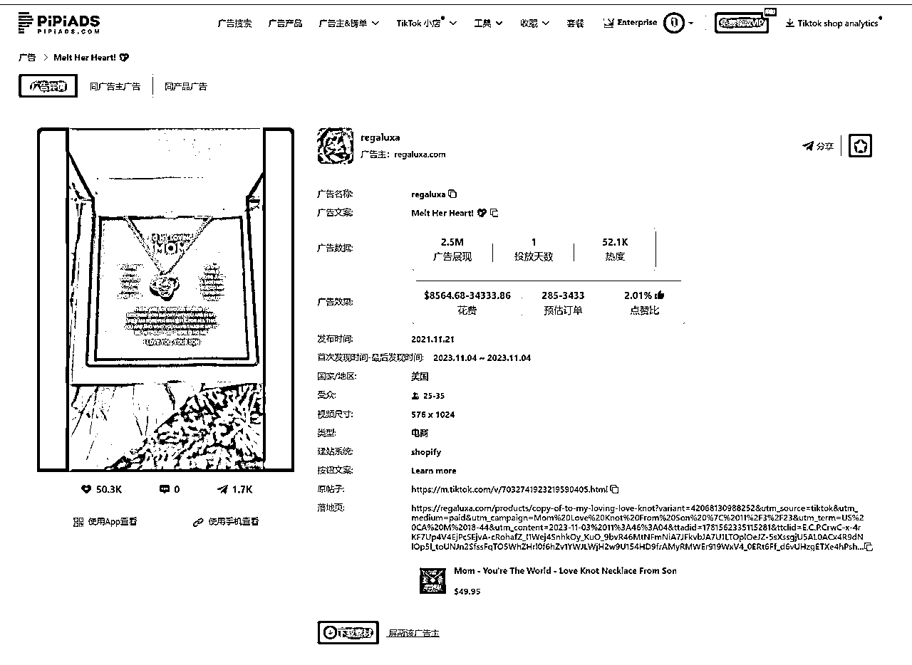

# 算法层面解析优质Tik Tok广告推送逻辑

> 来源：[https://za6kyadmdr.feishu.cn/docx/PSstdNSd5oezwjxdzCvcLJFmnBc](https://za6kyadmdr.feishu.cn/docx/PSstdNSd5oezwjxdzCvcLJFmnBc)

最近皮皮跟一个算法大佬讨论了Tik Tok广告的算法逻辑，从中获取到一些有价值的信息，现在给大家分享，如何通过算法层面上去让自己的内容更符合Tik Tok的算法机制

后续如果对该内容感兴趣，请点赞收藏，转发，这样我知道大家是否感兴趣后持续输出。

### TikTok广告的算法逻辑

1.  视频内容分析与标签打标：TikTok使用机器学习模型来分析上传的视频内容，包括视频中的图像、声音、文本（如标题和描述）等元素。基于这些分析，算法为视频自动打上各种标签，这些标签反映了视频的内容、主题、情感等属性。

1.  用户行为分析：分析用户的行为，包括观看的视频、互动（如点赞、评论、分享）的视频以及搜索历史等。这些数据帮助了解用户的兴趣和偏好。

1.  内容推荐：结合视频标签和用户行为数据，TikTok的推荐算法会尝试将最相关的内容推送给用户。这意味着如果一个用户经常观看和互动的视频带有特定的标签，那么算法会倾向于向这个用户推荐带有相似标签的视频。

1.  持续优化：TikTok的算法不断地通过新的用户反馈（如观看时长、互动等）来优化推荐结果，旨在提升用户的参与度和满意度。

TikTok的算法通过分析用户的互动行为（如观看时长、点赞、评论等）来识别用户兴趣，算法还考虑用户关注的账号类型、搜索行为、以及与特定话题或音效的互动来推荐内容。此外，算法利用视频内容的视觉效果、音频、文字、标题和标签进行深度分析。为增加更多的可行性，TikTok会推送多样化的内容，并在设备兼容性、用户位置等方面进行优化，以提供个性化且广泛的内容推荐。

当我们获取这些信息，我接下来会用几个案例告诉大家，为什么有些看起来很简单的广告素材能被打爆，人群推的比较准的 优质的广告素材到底是怎么制作的。

## 系统会随机抽帧 然后视频截图打标签

打完标签 系统会根据这些标签推送人群

所以素材就要尽量做到 视频标签的准确性 不要有太多干扰标签

以这个品的素材举例

素材投放4.2M展现，按美区通用cpm5美金来计算，单这条广告组就消耗2万美金的广告费

素材如下：

广告视频总共15秒

开头前两秒

视频关键词打上母亲节的标签，机器会识别到母亲节标签

视频前两秒从左到右运镜产品（处于视频中心位置）

第三秒切镜头，（处于视频中心位置）

第四秒切镜头

第六秒切镜头：加入文案，名字拼图 送给妈妈 礼物（关键词）

第八秒切镜头：

持续到第十一秒，视频继续打上母亲节标签

第12-15秒 出现几张拍摄后的产品图片

大家看到这里，可以发现，整个广告素材，简短又干净

视频标签：母亲节，礼物，名字拼图

文案标签：母亲节，礼物，名字拼图

机器不管怎么去给你打任何一个场景

去截任何一张视频图片，都是围绕这几个标签。

后续再去推流，就会比那些杂场景更加精准，这也是为什么看起来这么简单，它的广告效果又很好

如果你标签太多，就会识别不出来

这也是一般建议，广告素材不宜太长的原因

其实广告视频长到50秒一分钟的案例也不是没有

继续给大家看这个近几年特别爆的大案例

不同的盒子+首饰

50秒的镜头，从头到尾就一个场景，从打开到关上，除了开头的引导词，什么都没有说。

机器识别该类型标签

我截图第四秒

第四十秒

我不管怎么截，都是首饰的标签。

然而我的视频内容并没有任何关键词，只有首饰+礼物

这样机器去探索人群的时候，会尝试什么人群都给你推送，受众范围会更大。

当然也是这个品本身就受众广泛。

再看它的广告文案，也同样没有关联任何标签

这也是在标签之前还不完善的情况，它能打到大结果的原因。

这也是为什么，广告文案和前三秒有找人群的作用

## 用户行为-关键词

平台会将对应的广告，穿插到用户搜索的关键词里面

举个例子，我要搜索母亲节定制拼图

平台会给我推荐对应的商品（小店）

平台会给我推送相应的广告

同时大家搜索的频率上去后，平台会自动给你推送对应的广告

小技巧：大家使用皮皮的时候，想查看它的广告主详情，直接复制它的根域名去进行搜索

皮皮广告放入根域名：

这样就可以查看和跟踪

建联：17684058749