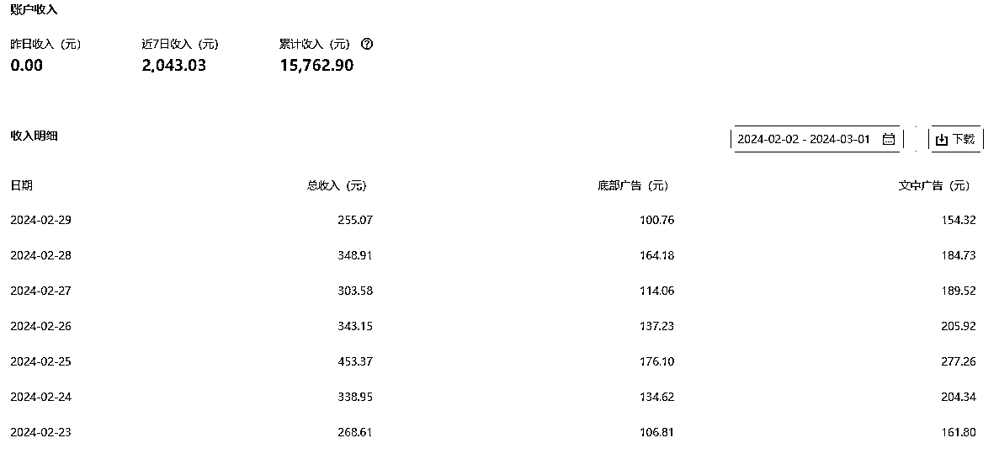

# 我加入生财2年，从一个什么都不懂的小白到也能帮助身边的人拿到一点成绩，并在生财赚到了10倍门票

> 来源：[https://jvzsmrqje5.feishu.cn/docx/PoZBdk0KCodNQcxcfSzcHzDGnLd](https://jvzsmrqje5.feishu.cn/docx/PoZBdk0KCodNQcxcfSzcHzDGnLd)

先说下，本文没有任何引流嫌疑，就是复盘一下自己的成长！

大家好，我是koalabear，受雪姨邀请复盘一下自己作为加入生财后的成长变化。生财里比我厉害的人很多，我一直都不太想输出东西的原因是，觉得看大佬们的文章就够了，他们的经验肯定比我好比我专业。先说说我自己，我是一名程序员，性格内向，不太爱表达，在加入生财之前我只做过，跟着雪姨撸货的项目，偶尔赚个零花钱，对互联网上的项目玩法一概不知。

2022年4月份初被雪姨拉着进入生财，进来后就里面被各种项目的精华帖迷的眼花缭乱，每天搜索自己感兴趣的帖子，看各种各样的赚钱方式，但是不知道自己能做什么项目。更不知道怎么利用生财这个宝藏工具库。对航海也是没啥概念。我个人也是做项目比较佛系，执行力一般，如果没人按着我的头做，我就按自己的节奏做的很慢。

### 第一个项目-shopee跨境电商

6月份是我第一次参加航海，当时雪姨发给我说让我结合自己的职业经验和兴趣可以选择shopee跨境电商或者google插件开发，出于好奇我就参加了shopee，在shopee开店是需要个体工商户的执照的，还要三个月的别的平台店铺流水，我完全没做过，在这里卡了很久，航海开始的时候，问了群友说可以去淘宝200多块钱搞定这些，然后我就花了200过了几天顺利拿到了执照，在shopee开了台湾站点，还买了一个一键采集的软件，每天从pdd采集商品上传到shopee，采集的时候也没有怎么选品，当时航海手册自己也没怎么看，坚持做了1个月没有一个人来咨询我，就放弃了。

这个项目让我对电商运营有了一些基本的认识，后来我反思，做跨境，要么自己有选品和店铺运营的能力，然后自己找货源，要么自己是供应商，在虾皮开店，我一个小白两个都不沾，赚不到钱是大概率事件。期间我看了大量生财里面跨境电商的精华帖，觉得光凭我自己是很难做起来，有了这次经历让我知道我的短板，电商不是我目前能做的东西，后面生财的短视频带货航海，小红书店铺航海，我都没有参与。

### 第二个项目-短剧cps

这个项目是在23年初的时候有好几圈友发这个项目的实操帖子，说是正在风口，然后我就加了思蒙，进入了思蒙的短剧陪跑训练营，思蒙设置了21天押金打卡制度，还有一个短剧实操的sop手册，和生财航海差不多，我自己看着手册就能完全学会，思蒙还给我们直播讲解剪辑去重的一些技巧，也会让做的好的群友分享经验给我们打气，大家天天在群里晒收入，赚钱的氛围非常好，自己每天都有干劲，通过这个项目赚了三千多，赚回了门票钱。后面短剧越来越卷，自己就没有在做了。

在这个项目学到了很多东西，了解了抖音运营的一些逻辑，赛马机制，学会了用剪映剪辑，知道了去重的很多方法，学会了找爆款视频，分析拆解爆款视频，知道了短剧这个项目从发行方，平台，代理，自己扮演的是什么角色，知道了cps这种模式，感觉一切都能cps，好像互联网上这些项目想要放大做都可以通过cps这种方式，红包封面cps，手游cps，考研考公资料代理等等。

做项目时候的心态问题：新手做项目如果没有正反馈的话往往很难坚持下去，第一天发视频，第二天第三天就想有流水，而做抖音，是需要持续不断地发视频，复盘优化，坚持1个月才有可能出一个爆款，只要出了爆款，就能赚几千甚至几万。创业和打工不同，不是干一天活儿就有一天工资。创业每天都会遇到各种未知的问题。谁能解决这些问题，谁就能赚到钱。

### 第三个项目-公众号爆文

这个项目是在去年9月份参加的爆文航海，我之前是完全没写作经验的，之所以参加这个项目是因为chatGPT的出现，估计有很多没有写作经验的人都是和我想的一样，让AI写文章，撸流量主的收益。我当时也是这么想的，直让AI洗稿爆款的文章，我的运气还不错，在参加航海期间，有一篇文章爆了18W浏览，赚了3800+，于是我就发了航海好事，我不知道小程序流量主还有公众号水印，没有打码暴露了公众号，后来发的文章就被举报掉原创了，之后我再发文，账号就再也没有起来过。

现在自己复盘，当时应该及时改掉公众号名字，却没有做，更重要的是洗稿这条路是行不通的。只要账号起来就会被同行看到，这个时候文章要是洗稿，说不定谁就举报了，而且爆款文章，大家都洗，同质化也很严重。长期这样洗稿，账号即使爆过后面也会慢慢的没流量。爆文这个项目起号周期很长，如果一个账号更了30多天还没入池，就应该注销从来，虽然教练也说过，但是自己还是有点侥幸心理，我在这上面浪费了很长时间。

重新再来：去年12月份的时候我下定决心换赛道，学习写作方面的一些知识，手动分析拆解爆款文章，下功夫调试提示词，不再是简单的发一篇文章洗稿，我可以用A文章的故事背景，B文章的故事结构，C文章的人物性格，组合起来就是一个全新的故事（这里只是简单的说一个写提示词的思路，实际一个稳定的提示词要调试很久）。然后我注册了一个新的公众号，在连续发到第21天的时候终于出了第一篇10W+，之后我就一天发3篇每天都有持续不断的爆文出来，连带着我之前那20天发的文章也都有了流量。过了大概一星期流量就慢慢的趋于稳定了，现在没有爆文的情况下日均四五万左右浏览，虽然现在的流量主收益大不如以前了，但是还能搞。晒一下2个月来小小的成果：

### 自己也能开始给身边的朋友一些建议

不知道什么时候我有了个习惯，就是每次生财新的航海开始我都会把所有的航海手册全部看一遍，看看更新了哪些东西，虽然有些项目我没做过，但是可以了解到这个项目整个的操作流程。以后自己万一有需要就能快速上手。看的多了也能给身边的朋友们做项目的一些建议。

几个月前身边有一个妈宝朋友，问我有没有什么赚钱的项目，我就详细的问了一下他的情况，自己有哪些技能和资源，他就说他哥哥是做钢笔的，卖了很多年，有稳定的货源，我就建议他来做小红书店铺，我把生财小红薯店铺的航海手册看了看，给他整理了一份sop文档，告诉她如何开店，如何找对标，用哪些分析工具，视频要怎么做，没想到他第一个月就有4000多的流水，第二个月更是达到了1.3W！他现在小红书只有400粉丝！

### 一些感悟

我觉得加入生财以来最大的改变就是自己赚钱认识的提升 ，以前看到一个项目，自己是完全没有赚钱的概念的，也不知道公域私域这些，现在看到一个项目就会去分析他是赚的什么钱。比如公众号流量主，赚的是平台的钱，平台的钱是广告主给的。为了能写出爆文，那就要去研究平台的算法规则，还要研究写作技巧，还要懂一点人性，给读者输出情绪价值。现在自己觉得这些都是做项目很基本的东西，但是以前是完全没有这个意识的。

还有就是从打工人心态到创业者心态的转变，要接受失败，接受项目的不确定性，事实上不确定性才是真实的世界，有时候全力以赴做项目最后依然会赚不到什么钱！但是这次做项目的经验会让我们在下一次做项目的时候少走弯路。比如我在做shopee的时候注册的执照，在做公众号的时候我就可以直接用。现在我还看到有人问怎么注册执照！

当做过足够多的项目后，就会感觉有些东西都是相通的，无论是做爆文，做短视频，做小红书，无非都是找爆款，分析拆解爆款，发视频/文章，复盘，遇到问题，解决问题，在做了大量的练习后就会培养出来自己的网感能力。也能一眼分辨出来哪些项目靠不靠谱，就好像程序写多了之后，在看到某个功能模块就能大概知道需要写多少个API接口，参数如何设计。

很感谢生财让我成长，现在生财对我来说就是一个很牛的项目资料库，在互联网上看到一个项目，想要了解玩法，在生财里就能找到，不仅有实操手册，还能链接到这个领域专业的人。有什么新的玩法，生财里总是会有人第一时间发布，我也越来越离不开生财。总结一下自己做的这些项目加起来大概有2.5W的收益算是赚了10倍门票吧，最后感谢雪姨带我进入生财！