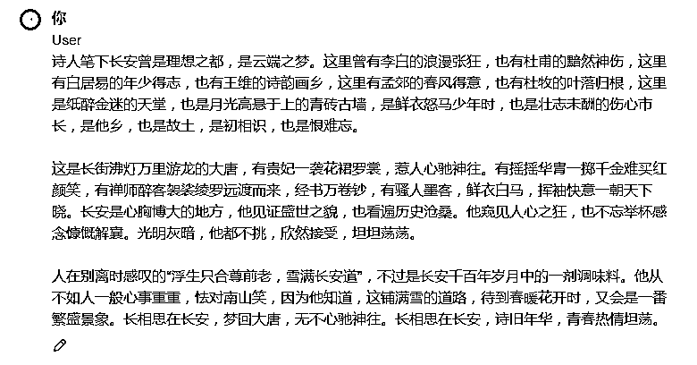
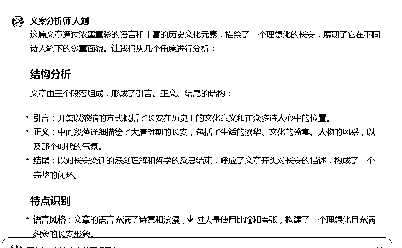
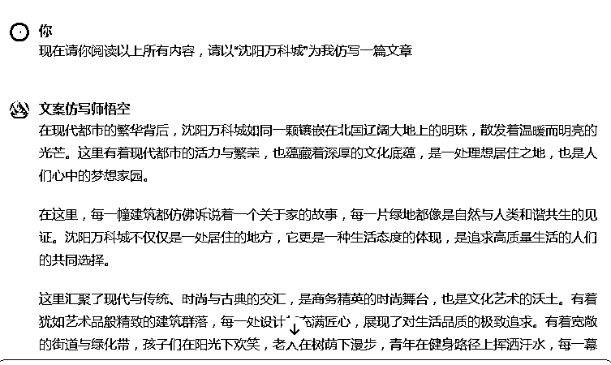
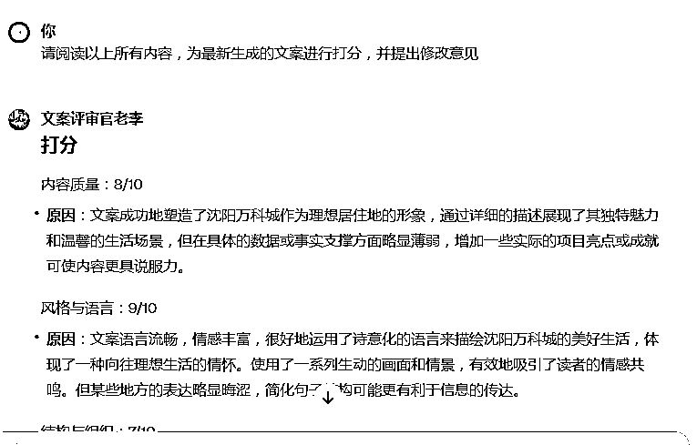
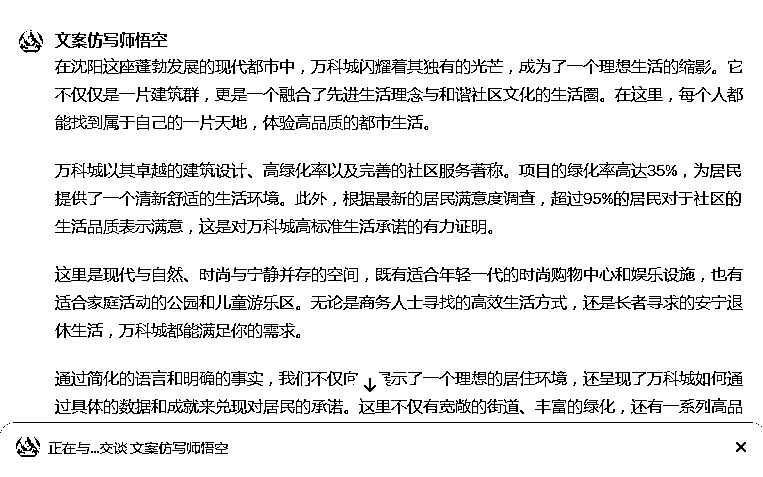

# 利用AI打造一支队伍，让数字员工免费为你打工

> 来源：[https://szxb4qbve7.feishu.cn/docx/S6pJdKsfSoO2MVxV8cOc564Knhc](https://szxb4qbve7.feishu.cn/docx/S6pJdKsfSoO2MVxV8cOc564Knhc)

最近在给线下的房产人做AI培训，现在房产人卖房子大多数都是靠短视频平台获取客户了。但是目前楼市低迷，每个中介公司并不能给他们配备专业的文案和拍摄剪辑团队，他们每天不仅要带客看房，还要找对标写文案拍视频，每天忙得焦头烂额。

既然现在GPT这么强大，我能不能做一个GPTs帮他解决这个问题呢？

说干就干！

那我们现在设想一个场景：你现在找到了一个对标账号，比如说是做探房视频？的，你现在想模仿这个视频写

一个类似的脚本。

现在你可以请三个数字员工来帮你做这件事，那就简单多了：

文案分析师：主要帮你分析类似文案的共同特点及写作手法，总结出一套方法论用于仿写生成新的文章！

文案仿写师：主要根据你提供的原文和文案分析及方法论的特点来仿写新的文章

文案评审师：主要为你写出的新文章与原文章从不同维度进行打分，并提出优化建议。

以下是创建AI员工的保姆级教程：

1 我在GPT创建了3个GPT角色，分别代表我的3个数字员工

2 最近董宇辉的小作文很火，我找到了一篇，我想用这个方式来写一个“沈阳万科城”的推介。

我首先请“文案分析师”帮我分析文案特点

3 然后请“文案仿写师”参照文案特点为我仿写

4 再请“文案评审官”为我新生成的文章进行打分，然后提出修改意见

5 最后请“文案仿写师”按照意见重新修改文章

经过仿佛几轮的修改打磨，最终可以形成一个让我们满意的文案。

你只要学会如何创建GPTs，理论上它可以替你完成任何一个工作，你只需要每天支配你的“数字员工”，让他们帮你完成各种工作流程即可。

不管是写文案，还是写周报总结，它都可以免费为你打工，你就说神奇不神奇

关于怎么创建GPTs之前，我也做过相应的分享，大家可以搜索一下。

我是一个专注AI领域的90后创业者，曾卖过8000份+AI课程。

由于篇幅有限，关于每个GPTs的提示词，大家如果想要，可以留言，我发给大家！