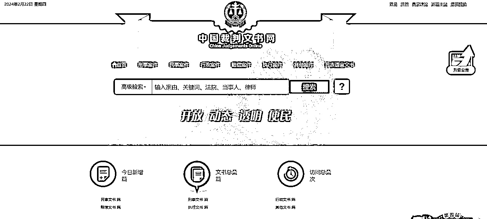
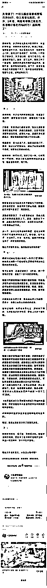
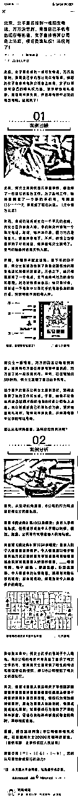
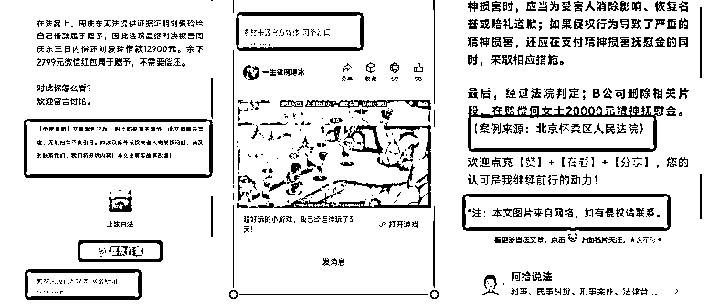
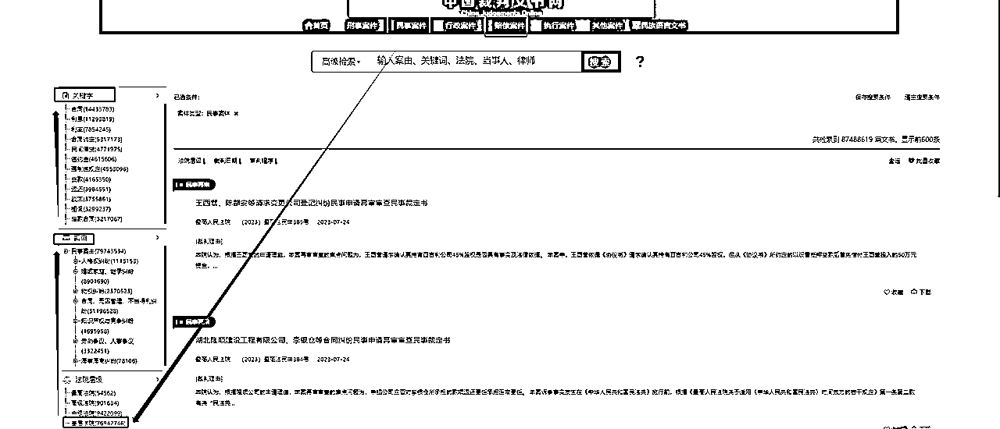

# 公众号律例文，可能是最后一个让你轻松赚钱的分类？

> 来源：[https://k170ac9yh31.feishu.cn/docx/SAj3dpFd7oPIfax8Gucc9TRBnxc](https://k170ac9yh31.feishu.cn/docx/SAj3dpFd7oPIfax8Gucc9TRBnxc)

# 一、项目说明

我是张波，一个只想正规做公众号的人，但是感觉律例文章这一巨大的商机，大家赚不到钱，或者说过一段时间这个赛道就没了，今天就把律例的玩法给大家写出来吧。

很多人错过了名人名言（鸡汤文）和情感赛道，说现在公众号变现太难了，我想说的是你有找对方法，如果方法对的话的话——律例公众号比名人名言或者情感文章还简单。如果按照这篇文章你还赚不到钱，可以考虑换项目了。

这篇文章至少价值10w，能够GDP贡献至少几百万，O(∩_∩)O哈哈~。

# 二、对标库

上面是几个对标账号，感觉还不错，自己也可以继续找几个对标，最好是选择最近注册的账号。

# 三、爆文库

以上是我选择的一写爆文，用来做详细的讲解，根据自己的实际需要，去找一找对标。

# 四、素材库

这里不需要建立素材库，要做的就是会用中国裁判文书网（https://wenshu.court.gov.cn/），登录上去自己也要有账号。

# 五、法律常识（关键）

只需要学会一个法律常识的关键词——同案同判。

同案同判原则是指在法律适用过程中，对于具有相同或类似事实、证据和法律关系的案件，无论涉及的被告人身份、地位、审判地点、审判人员如何，都应得到大致相同或相当的裁判结果。

这一原则体现了法律面前人人平等的宪法原则，要求法院在审理案件时，以事实为根据，以法律为准绳，坚持法律适用的一致性，确保裁判结果的公正性和合理性。同案同判原则不仅是现代法治社会的一项基本要求，也是司法公正的重要体现。

很多人想批量做律例文，又不懂得这个关键的名词，找到一篇爆款的文章，在中国裁判文书网（https://wenshu.court.gov.cn/），找到类似的案件，进行修改和调整，把一些差不多的事情喂给gpt就可以得出一篇类似的高质量的文章，就算你是借鉴了别人的，别人无法投诉你抄袭，例如他找的是上海的你就找一个北京的。

# 六、正文写作

## 1、标题

*   北京，女子莫名接到一堆陌生电话，万万没想到，竟是自己手机号出现在电影里，女子直接将其公司告上法庭，侵犯我隐私权！法院判了！

*   冤不冤？新疆，男子11万元的新车在小区被盗，将物业告上法庭，物业：你都没交物业费，凭什么找我们赔！法院判了！

*   太荒谬了！一幼儿园违建被城管局罚款84万，幼儿园服从处罚。不料，5年后，城管局撤销之前处罚，按违建价值处罚1600万！法院判了！

一看上面的标题，也就是类似以前写情感的七要素，看一下就可以了，找到那些别人关心的事情，总结出自己的特点。

## 2、结构

文章结构：引言+案情回顾+案例分析+普法/启示

引言：根据类似的案例，写一写基本都差不多，有些地方不要一样，例如涉案金额。

案情回顾：根据裁判文书网的描述，丰富成这部分内容，基本可以按照相似文章，或者情感文章的写法。

案例分析：基本就是写一写这个判决文书上的法律依据然后带一些主人公的，进行描述一下。

普法/启示：写一写判决，以及一些正能量的话。

## 3、底部

写一写来源，选择素材来源于官网，最好下面加一个免责声明。

# 七、AI技巧

不需要太大的AI提示词技巧，直接丢给一段进行仿写就可以了，只需要找到相关的内容。

备注：涉案的金额，地区等不要搞错了。

# 八、裁片文书网技巧

1、选择民事或者赔偿

2、法院层级选择——基层法院

备注：日常生活中发生民事纠纷，一般向基层人民法院（县/区人民法院）起诉。重大涉外案件、本辖区有有重大影响的案件等由中级人民法院管辖。县级人民法院审判的第一审案件，如果当事人不服，或者同级人民检察院认为，第一审的判决或裁定确有错误，就可以向中级人民法院上诉或抗诉。中级人民法院则对该案进行第二次审理，作出的判决或裁定，就是终审的判决或裁定，对终审的判决和裁定，不准上诉或者按二审程序提出抗诉。

3、案由——自己发挥

4、关键——自己发挥

找到一篇想借鉴的文章，直接把几个关键词放到搜索框，中然后选择基层法院就可以了。

# 九、批量操作

自己可以借助工具批量的采集文章的标题，然后总结出关键词放到中国裁判文书网中，批量的进行素材生成，这里就不做细讲了。

# 十、总结

1、律例文章不知道能够持续多久，估计2-3个月的问题不大。

2、如果你自己错过律例文章，往后就没有这么容易的分类了。

3、我是一个矛盾的人，自己不想洗稿，还写出来洗稿的方法。