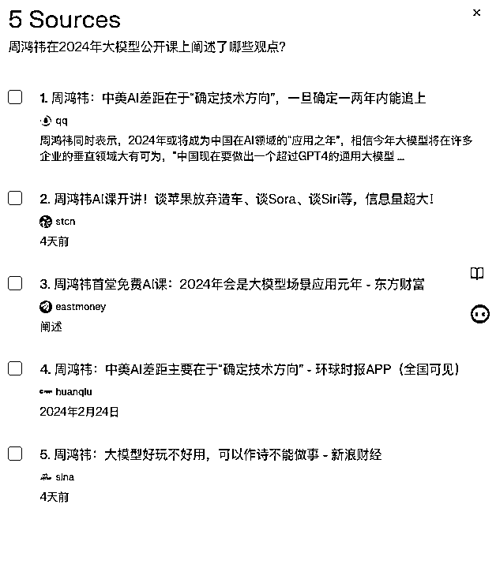
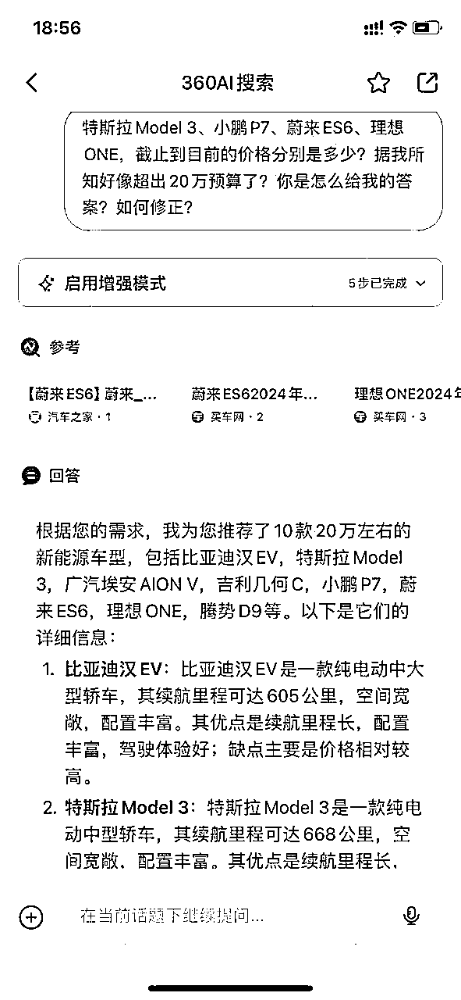
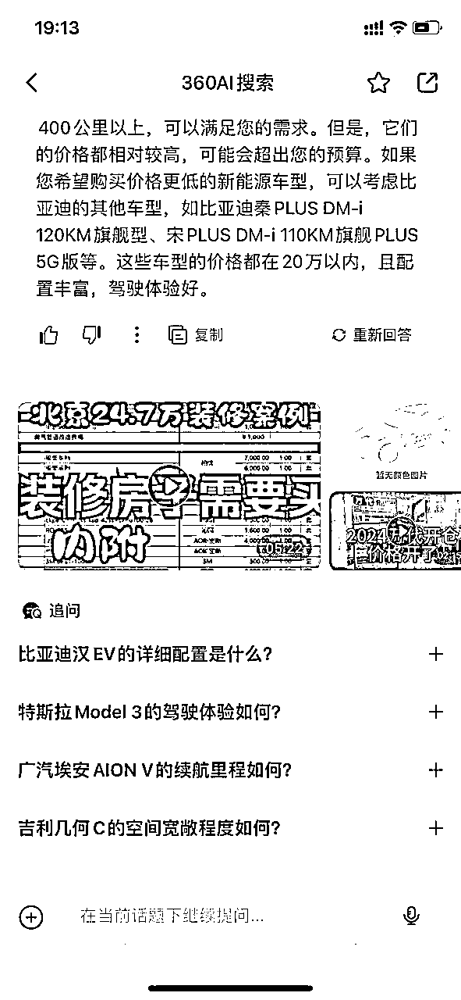

# 9000字深度解析 | AI如何重构搜索？会颠覆谷歌&百度吗？

> 来源：[https://vliajwma3m.feishu.cn/docx/SP0Nd9bKaoxYbQxTqdhcHsb2nne](https://vliajwma3m.feishu.cn/docx/SP0Nd9bKaoxYbQxTqdhcHsb2nne)

春节刚刚结束，2月29日，周鸿祎发布了360 AI搜索和360 AI浏览器，自从去年3月份，chatgpt爆火以来，他一直都是AI的布道者，不停地为AI摇旗呐喊。很多观点也是让创业者耳目一新。

其实早在去年，大家一直讨论，chatgpt会成为新的入口级应用，取代谷歌吗？

本篇文章试图回答以下5个问题，如果你对AI、搜索、互联网创业感兴趣，

那么这篇文章你一定不要错过！相信绝对不会让你失望的。

一、为什么互联网大厂高度重视“搜索”？

二、AI搜索VS传统搜索，有什么区别？

三、360 AI搜索&天工AI搜索，谁会是中国的perplexity.AI ？

四、国内4家AI搜索，哪家更胜一筹？

五、 AI搜索目前有哪些挑战？会取代谷歌&百度吗？

六、关于@大厂转型人强哥

# 一、为什么互联网大厂高度重视“搜索”？

大厂之所以高度重视“搜索”，无外乎这4个原因，

1.  商业机会：搜索是互联网入口之一，通过搜索引擎可以吸引大量用户流量，为企业带来商业机会和广告收入。

目前谷歌和百度，分别是全世界和中国最大的搜索广告公司。

2019年年中的内部CEO面对面会上，字节跳动创始人张一鸣说：“如果没有搜索场景的拓展和优质内容，今日头条的增长空间可能只剩下4000万DAU。”押注搜索、实现更精准的信息分发和营销也成为公司的必行战略。

1.  技术创新：AI技术在搜索领域的应用代表了技术创新的前沿，对于大厂来说是提升竞争力和引领行业发展的重要途径。

搜索，核心解决的是人和信息的匹配效率的问题，“信息流动的效率比信息本身更重要。”

张一鸣也是从这个角度颠覆百度搜索，打造了“今日头条”。再从“图文推荐到短视频推荐”，打造了抖音。

每一次信息匹配效率的提升，背后都是一个巨头的诞生。

从“人找信息”到“信息找人”，早期的字节跳动，核心技术人员则多来自“百度系”。

2014年7月，百度最早的员工之一、网页搜索部技术副总监杨震原加入了今日头条。他奠定了头条的技术基础，并设计了爬虫工具“bytespider”。

同年，今日头条挖来了百度社区的主要设计者洪定坤担任技术总监，以及百度的网页搜索部首席架构师陈雨强。这两位帮助头条搭建了机器学习系统和广告投放与评估体系。

1.  用户留存：优质的搜索体验可以提升用户满意度和留存率，对于大厂来说是维护用户基础和增加用户黏性的重要手段。

这个典型案例就是小红书，“遇事不决小红书”，而且都是素人笔记，很具有真实性、互动性。

比如你搜索五一去哪旅游比较好玩，小红书就会有很多素人的推荐，包含地点、价格、行程安排、自己的真实感受，就好比你的朋友面对面给你说。目前我的很多爆款笔记，80%都是搜索带来的。

1.  数据积累：通过搜索场景积累大量用户数据和行为信息，有助于企业进行精准营销、产品优化和商业决策。

这个就更好理解了，你搜索了健身、减肥、食谱、跑步、运动手表等关键词，系统都会基于你的搜索，定向给你推荐匹配的内容。这个在微信搜一搜、视频号、小红书、抖音都比较普遍。

# 二、AI搜索VS传统搜索，有什么区别？

这里的AI搜索，国外以perplexity.AI为代表，国内以360 AI搜索、天工AI搜索、豆包AI、文心一言。

严格意义上后两者更像是对话式大模型，搜索只是其中的一个分支。

传统搜索，是以谷歌、百度为代表的关键词搜索。

## 2.1 AI搜索和传统搜索完全不是一个物种：答案引擎VS搜索引擎

本质上是AI搜索直接给出答案，并且给出来源，方便你查看，确保真实性。

传统搜索需要你找出答案。这个里面还包含了大量的广告，而且你会陷入无休止的寻找之中。到最后已经忘记哪个网页是对你有帮助的了。

美国AI搜索独角兽Perplexity.ai展示页面

美国AI搜索独角兽Perplexity.ai展示页面

百度页面👆🏻

## 2.2 AI搜索，让你像聊天一样搜索

AI搜索，如果你想追问，可以继续追问。

而AI搜索，是输入长句后，AI直接给出答案，并在页面底部给出可能的追问问题，如果还有你想追问的问题，直接顺着在底部的输入框输入即可。

继续输入提问后，AI会基于前文继续往下给出答案，在输入框上面，是一整个顺序的答案：

美国AI搜索独角兽Perplexity.ai展示页面

你注意到没有？AI搜索的优势在于：它是可以聊天的！

AI搜索是一次直给答案，所以如果你对答案有不满，或者是还需要追问的时候，此时视角已经到了页面底部，可以非常顺手的继续在输入框内提问。

对话类产品很有意思的点就在于，你在继续下一次对话前，是会把上文看完的。

它就好比你在跟一个有记忆能力的学霸聊天，他们可以反复多次就一个话题深入探讨。

但传统搜索的目标是，尽可能让用户在搜索结果给出的链接内点击，所以输入框放在顶部，把下面的区域全部留给了搜索结果的呈现。

输入框就像是标题，当你重新输入需求时，就会给出新的结果，新的搜索结果和之前是没有关联的。

它就好比你在跟没有任何记忆能力的人聊天，这一次回答不满意，不得不推倒重来。（感谢AI产品公众号“super黄的念想”给到的灵感）

## 2.3 AI搜索结合了chatgpt+谷歌百度的优势

当 ChatGPT 刚推出时，它凭借出色的自然语言理解能力和生成丰富回答的能力，曾一度让人们认为生成式 AI 可能会取代传统搜索引擎。

然而，随着用户体验中的幻觉现象、无法联网和知识更新滞后等问题逐渐显现，人们开始回归现实，转向由大型模型增强的搜索引擎，例如 Perplexity 和 Bing Chat。

这些「回答引擎」利用 RAG（Retrieval Augmented Generation）技术，对搜索引擎的结果进行处理，以减少误导信息并提高信息的及时性。

除了 Perplexity 和 Bing Chat（目前已经改名为copilt），其他一些曾企图挑战 Google 搜索引擎霸主地位的平台，如 You.com 和 Neeva，也转向了 AI 增强的答案生成模式。

与传统搜索引擎相比，回答引擎主要在以下几个方面进行了优化： 理解用户问题的能力、总结搜索结果的能力、保留搜索结果索引的能力，以及扩展用户问题的能力。

这些优化旨在降低用户使用门槛，节省用户在不同网页上搜索和浏览的时间，确保搜索结果的可靠性，同时为用户提供深入挖掘问题的能力。

按照 Perplexity AI 联合创始人兼 CEO Aravind Srinivas 的解释：

Perplexity 基本上是将传统搜索索引与大型语言模型的推理能力和文本转换能力结合起来的产物。

所以每次你输入一个查询到 Perplexity 时，我们会理解你的查询，重新构建它，然后将其发送到一个非常传统的搜索引擎和多个搜索索引，这些索引不是我们自己的，而是外部的。

从这些索引中提取出相关的链接，有时甚至有上百个链接。

然后我们将简洁回答用户查询的任务交给大型语言模型。

我们要求它阅读所有这些链接，并从每个链接中提取出相关段落，用这些段落来以学术或记者的写作风格回答用户的查询。

也就是说，确保你的答案每部分都有支持性的引用、支持性的链接。这些都来自于我们的背景。

## 2.4 AI搜索更能理解用户的复杂问题

由于chatgpt的介入，Perplexity不仅能够回答简单问题，还能理解用户一些比较复杂的问题，

“作为文科生，如何入局AIGC？如何抓住AI人工智能这波红利机会？有哪些切入点？请尽量举一些例子。也可以从目前市场上的招聘数据（如，包括但不限于，猎聘、脉脉、boss直聘、前程无忧、拉勾等）来分析文科生的破局？”进行提问时，Perplexity也能进行回答。

我上一篇深度文章，Perplexity也是给了我很大的帮助。

关于复杂问题的回答，接下来我也会以“买车”为例进行测试。

好了，在本章结尾开个脑洞！

为什么百度、谷歌没有直接上来就做AI搜索？而是直接开发了通用大模型文心一言、谷歌Gemini 。

我猜测，很大原因在于，现阶段的AI搜索会屏蔽掉广告，会影响基本盘（广告业务）。

# 三、360 AI搜索&天工AI搜索，谁会是中国的perplexity.AI ？

在AI搜索的赛道，Perplexity 是绝对的明星。

公司创始人Aravind Srinivas来自OpenAI，2022 年 8 月创立了 Perplexity。2023年10月，公司完成了新一轮融资，估值达到 5 亿美元，而这家公司目前只有38个人。

根据SimilarWeb流量数据，Perplexity在12月访问量达到4500万次。

两年前的2022年12月，Perplexity.ai上线，当时的流量是220万次。

而在中国，和Perplexity.ai最像的就是360 AI搜索和天工AI搜索。

古老的搜索行业，其实搅动着整个互联网江湖。

2012年，周鸿祎曾和百度来了一场“3B大战”。当时不满足于只做安全的周鸿祎把业务触手伸向了搜索引擎，推出了360搜索。

随后百度控告360，最终法院判决360败诉，要求360停止不正当竞争行为、连续15日在首页道歉声明、赔偿百度损失45万元。

不过，尽管360败诉，但也使百度的搜索老大地位受到威胁，导致搜索引擎市场呈现“百花齐放”局面。

网易、搜狐、新浪都曾靠搜索稳固自己的门户地位，雅虎、谷歌们汹汹而来，却又遗憾折戟，唯有百度仍旧坚挺。

据Statcounter最新数据，截至2023年12月，中国搜索引擎市场份额排名前第一毫无疑问仍然是百度，占比66.52%，第二是bing，占比13.32%，360搜索（好搜）占比6.43%，拿到了第三的位置，高于第四名搜狗的5.01%。

就我个人而言，我一直关注周鸿祎的动向，也看到了他作为老一辈企业家，真枪实战拼搏出来的，在面对新一波AI浪潮时，很多观点给了我很大启发。

而且我也很赞同他说的“不端、不装、有点二”，《超越好奇》里面也记录了他对搜索的执念。

与百度在市场上过招，也让我仔细思考和观察着百度的业务模式。这让我模模糊糊地意识到搜索的力量。Google很早就在中国推出了中文公众服务，百度晚于Google一年在中国推出中文搜索服务，但是百度的搜索模式在2003年逐渐发展起来了，这是非常明显的。我之前无视搜索，这时已经醒悟了。我决心追赶。

对抗百度，成了2003年3721的一个重要目标。我召集团队对3721和百度的技术做了评估。

我发现，3721在流量和渠道上有绝对优势，但是在搜索技术上明显技不如人。这时我才意识到，我痛失了一个优秀的搜索人才，就是后来去百度工作的俞军。

我也意识到我当初轻视搜索是多么短视的行为，而我最终要为这种短视买单。俞军是我从上海挖过来的一个员工，当时他对搜索有无限热情，每天在公司工作十几小时。他一直对我说，他来3721的目的就是把搜索做出来。

我亲眼看到了这个人的激情，也相信他对技术有天分。但当时我的注意力分不到搜索上。另外，当时公司已经开始盈利，我们的重点是在渠道上挣钱。我那时就是一意孤行。

我日常一直在使用谷歌搜索、perplexity.ai，尤其是后者，当我发现国内有这样两个团队也在做类似的事情，我非常兴奋，也非常期待，看怎么基于中国的国情，做出新一代AI搜索。

星星之火，可以燎原。

探索，终究是好的。

你可以感受到两者是非常像的。

perplexity.ai

360 AI搜索

天工AI搜索

# 四、国内4家AI搜索，哪家更胜一筹？

以买车为例，“我想买一辆新能源车，预算20万，用于日常代步通勤，出去玩（单程400公里左右），要求空间尽量大些，续航里程不要太短，请给我推荐10款车型吧，并且说下他们的优缺点。”

为什么使用这个案例？

因为这个案例，限制因素较多、非单一需求，更能考验AI搜索场景下的准确性和时效性。

对比360 AI搜索、天工AI搜索、豆包AI、文心一言VS百度搜索。

假设满分都是10分，我尝试打下分数（应用商店都可以自行下载）。

## 4.1、答案来源方面：

目前来看，360 AI搜索7分，它有增强模式，可以提炼出搜索关键词，明确给出了答案来源，全网多数网页（太平洋汽车网、B站、西瓜视频、知乎、搜狐、凤凰汽车）。

这个我非常喜欢。你能够直接点进去详细查看。展现不如豆包AI丰富，缺少标题（不完整）+媒体来源。有的是视频大图展示，直接可以跳转链接。

之前我一直都在用微软bing的这个功能，可惜不给力呀，老是不稳定，老是挂，只好放弃了。

天工AI搜索，4分，会有copilot功能（满足精准关键词，不过每天只能用4次），不过搜索来源只有8条结果，而且更多为百度、搜狐、知乎、网易等文章，给到的内容并不是很丰富。消息源更多的是标题+媒体来源，文章形式，无视频，额外多了一个音频功能。

关于消息源，豆包AI，9分，也有这个还是非常不错的，我也经常用，不过引用的数据来源更多是头条和抖音、西瓜视频的内容。这也可以理解。展现来源和方式也会更丰富，包含标题+摘要+媒体名称+图片（若有）。

文心一言，6分，没有给到答案来源，这个体验一般。因为你如果不给，第一，我无法验证你的准确些。第二，我无法延展阅读。

百度搜索，3分，依然是传统的搜索逻辑，你在一堆链接中寻找合适的，而且有很多旧新闻，比如2021年的，这样比较麻烦。基本就pass了。下面不再参与对比了，缺乏可比性。这已经是上一个时代的产物了。

360 AI搜索👆🏻

天工AI搜索

天工AI搜索

天工AI搜索只能搜索到8条结果，结果非常少

字节跳动的豆包AI👆🏻👆🏻

文心一言👆🏻

百度搜索，无法给出答案+信息滞后【很多都是2021年的文章，缺乏时效性，不具有参考性】👆🏻

## 4.2、回答质量方面：

360 AI搜索一般，6分，因为已经明确规定是20万预算了，但是它给到的答案，第一，并没有标出汽车的价格。第二，即便给出了答案，也出错了。

我再次追问的时候，也是胡说八道，驴唇不对马嘴。它已经完全无视我的需求了。

天工AI搜索很一般，5分，不如360 AI搜索，我已经规定了要给我10款车型，最基本都没有达到。我再次追问质疑“我明明要求的是10款车型，你怎么给我推荐的只有4款呢”，仍然没有给出我想要的答案，和上次答案基本没啥区别。

豆包AI的回答很准确，8分，并且以图表的形式把车型列出来了。

文心一言的回答，也还行，7分，不过表现形式是文字集合，相对于豆包AI，差了些。而且理想one的价格没有抓取到。

360 AI搜索的追问，回答质量一般👆🏻

天工AI搜索，明确要求给10种车型，它还是给到了4种。

豆包AI的回答基本准确👆🏻

文心一言的回答，而且提问是以左右滑动来设定，这样不太好，会提升用户获取信息成本，因为必须每个滑完以后，才知道哪个是需要继续追问的👆🏻

## 4.3、追问问题质量

360AI搜索和豆包AI，8分，各有侧重，不好评价哪个更好，哪个更坏，因为每个人需求不同。前者侧重单个车型的追问，后者侧重整体需求的追问。如：除了上述车型外，还有哪些推荐？

天工AI搜索，6分，追问的问题一般，而且很多事废话。如：“我明明要求的是10款车型，你怎么给我推荐的只有4款呢”，已经提过的问题，再次出现在了追问问题里面。

文心一言6分，追问很不稳定，第一次提问的时候，还要追问，而且提问是以左右滑动来设定，这样不太好，会提升用户获取信息成本，因为必须每个滑完以后，才知道哪个是需要继续追问的👆🏻

另外，我第二次用一模一样问题提问时，追问就没有了。感觉很奇怪。

360 AI搜索👆🏻

天工AI搜索👆🏻

豆包AI👆🏻

文心一言

## 4.4、调用API方面

以“未来5天新疆的天气情况如何？”为例

360 AI搜索 8分，调用了天气API，给到的是最及时的消息。

天工AI搜索，4分，完全不及格，给到的都是过去的新闻，缺乏时效性。而且给的非常模糊，不够具体，全是废话。

豆包AI ，8分，调用了天气API，给到的是最及时的消息。

文心一言，6分。给到的不够具体，而且没有信息来源，缺乏真实性。

百度搜索，9分，很清晰明了，一目了然。

360 AI搜索👆🏻

天工AI搜索👆🏻

豆包AI👆🏻

文心一言👆🏻

百度搜索👆🏻

# 五、 AI搜索目前有哪些挑战？会取代谷歌&百度吗？

目前来看360 AI搜索和天工AI搜索，对标的是Perplexity ，两者在本质上遇到的问题和挑战是类似的。故不再做单独的赘述。只不过因为国情的不同，略有差异。

## 5.1准确性和及时性

搜索的第一性原理是准确、及时。

谁能把握住这个，谁就能够牢牢地抓住用户。

目前来看，AI搜索，无论是Perplexity 还是360 AI搜索和天工AI搜索，在某些复杂场景上还是不准确地，甚至是答非所问。

这背后一方面是大模型的调优能力，目前的国内大模型与GPT3.5、GPT4.0还有多大差距？

一方面是抓取信息源的能力，即优质内容的供给能力。

张一鸣与李彦宏都曾不约而同地指出：搜索的关键争夺在于找到优质的内容，否则搜索将是无根之水。而优质内容，对头百双方来说，都是稀缺品。

当前国内各个大厂的搜索信息源是互相屏蔽的，比如公众号链接、视频号链接、小红书笔记链接，都有非常强大的反抓取能力，如果在搜索时，无法抓到这些数据。结果也会差强人意。

当然，这个也是全世界都会遇到的问题。

Perplexity 最初能抓取Twitter的数据，后来就被人家切断了。

那么势必需要建立自己的内容生态，参考此前的百家号、头条号、企鹅号逻辑。

那么，在准确性方面，Perplexity是怎么处理的呢？（这里涉及技术层面，不关心技术的，可以跳过）

它做了两件事情：减轻幻觉和内容溯源。

为了减少幻觉现象，Perplexity引入了RAG技术（检索增强生成），RAG的作用好比是给模型提供一本教科书，让它根据特定的问题去查找信息，通过关联外部知识来提高答案的准确性，有效减少了语言模型中出现的虚假信息，使得生成的回答更准确可信。

与此同时，Perplexity还对生成的每一句话都附有引用链接，在保证可靠性的同时便于用户溯源或深入研究。

不仅如此，Perplexity还对召回和排序环节的算法做了创新，保证内容的有用性及引用的精确程度。

其中，“召回”指根据搜索指令从数据库中获取尽可能多的正确结果，“排序”指根据用户搜索内容的相关性对召回结果进行排序，决定了搜索引擎的精确程度和性能上限。

这也让Perplexity成为当下综合性能最好的AI搜索引擎。

在2023年4月的论文中，斯坦福的研究人员对YouChat、Perplexity.AI、NeevaAI及BingChat四个生成式搜索引擎进行了人工评估。

结果显示，Perplexity.ai生成内容有用性的评分为4.56分，排名第二；引文召回率和精确度为68.7，排名第一；在泛搜索引擎类的体验中，综合能力位于最前列。

除了在信息准确、可靠上，Perplexity在响应速度上也花了很多功夫。

比如，Perplexity通过自研推理堆栈，让其内容生成速度快于GPT类通用模型。

在模型侧，公司对GPT-3.5进行微调，在降低成本的同时进一步提升响应速度。

Perplexity的成功，也给了AI大模型产品向创业者一个启示：比起模型能力，产品本身单点的价值创造和体验的优化，是一个更为重要的事情。

在这里，我开个脑洞，未来的AI搜索能否像今日头条、抖音一样实现个性化推荐呢？

从“人找信息”变为“信息找人”，而且都是优质信息的找人。

## 5.2 用户迁移成本

产品价值=用户新体验-旧体验-迁移成本。

当下的AI搜索是否真的能够做到10倍好？能够让用户有“哇塞”的那一刻，然后口耳相传？

我自己是非常愿意尝试新鲜事物的，而且容忍度是非常高的。所以对于AI搜索前景是看好的。

但我这样的人，毕竟是少数。更多的是像三四线城市的同学一样，是否能够给他们惊喜的时刻？

一旦他们在某个点上用的不爽，马上就抛弃你了。

谷歌和百度在消费、地图、游戏娱乐上积累了大量的数据，这让当下的AI搜索在生活和购物等更高频的场景上，没有任何的优势，很难实现场景的泛化，很难实现高频带低频，美团的增长就是典型。

举个例子，想象一下你几乎每天都要吃饭，而且偶尔会懒得出门，就会通过美团点外卖。这个过程中，你开始习惯了打开美团这个app，觉得它挺方便的。

然后有一天，你突然需要预订一个酒店。虽然你不经常预订酒店，但因为你已经习惯了使用美团点外卖，自然而然地，你就想到了通过美团来预订酒店。

这样，美团就通过外卖这个高频次使用的服务（也就是我们几乎每天都可能用到的），让用户建立起使用习惯，进而在用户需要时，引导他们去尝试那些低频次使用的服务（比如偶尔才会用到的酒店预订）。

这种方式不仅增加了用户对平台的依赖度，还让平台能够覆盖用户更多的生活需求。

目前更多的是在知识问答领域，这个场景是非常小众、低频。

试想，普通人一年能买几次车呢？旅游几次呢？

## 5.2产品增长飞轮

广告模型下的搜索引擎，天然是有良好的数据飞轮的：用户的浏览和点击行为，反应了用户的偏好，同时反馈到排序系统和广告竞价系统，使搜索引擎的效果更佳。

举个例子，

2014年，张一鸣曾经解释今日头条是怎样形成增长飞轮，形成一个系统的？

“自我演化的系统应该是这样一个系统，在开放部署完成之后，并不能一下子提供很好的服务。这个系统必须在用户的使用过程中，不断地去理解用户的输入，用户的每次使用，不仅是使用这个信息服务，并且是教育这个系统。让这个系统越来越有智慧，系统会随着这个过程自发地成长。”

今日头条的“一”是信息流网络，使其单点破局的点是推荐算法，他的推荐算法把创作、分发、互动整合在一起，然后形成迭代反馈，实现进化。

这样的数据飞轮在当下的问答引擎中还未出现：Chat的形式并不方便用户直接去做偏好反馈，用户也不会有额外的时间去专门为答案做编辑或修改，Like/Dislike 类标签的比例也只有 10% 用户给出。

问答引擎需要一个好的产品形态，来让用户使用的同时自然地给反馈，才能让产品在 Google和百度面前有竞争力。

## 5.3商业增长飞轮

目前，Perplexity的变现方式主要有两个：会员订阅和API调用，但尚未形成规模化收入。

虽然收入没起来，但支出却一点都不少。

作为创业公司，Perplexity 的重心在于打磨产品和召回系统，而不是自建模型+搜索技术栈。

后者现在用的是 OAI和Google/Bing 的 api，但这样做成本偏高，且定价权掌握在别人手里，Bing 已经将其 search api 的价格上调了 10 倍。

根据中金测算，目前Perplexity调用Bing搜索引擎及GPT-4的单个问题成本约为0.03美元，年成本约为6000万美元，这还不包括后续Perplexity自研模型所产生的成本。

作为一款知识生产力向的产品，Perplexity 目前以 20 美元的订阅制进行商业化，但这个商业模型对于问答引擎这样高 inference 成本的产品是不可持续的，尤其所挑战的搜索引擎有一套极其成熟的商业化模型，能使用户、商家、创作者同时受益。

接下来 Perplexity 必须要在商业化方面发力：如何帮助开发者和企业优化其搜索体验？如何将广告无缝地衔接入 AIGC 和 UGC？

如果没有长期新的商业模式出现，Perplexity 当前的形态更可能成为 Gen AI 时代的新 Quora + Wikipedia；

如果探索出了 LLM native 的商业模式，Perplexity 具备挑战传统搜索的潜力。

因为Google 和百度商业模型除了给用户提供高质量的搜索引擎外，还有两个非常重要的轮子。

其一是广告主营销，只有实现了满足广告主的商业化系统，才能有良好的现金流使用户免费地用上高质量的搜索系统；

第二是创作者激励，内容发布者能够通过在互联网上发布高质量内容，得到平台和广告主的激励，是其源源不断发布内容的动力。

尽管 AI 看似减少了创作端需求，但还是需要用户去创作高质量的内容交给 AI 来学习和召回。

英文版👆🏻

中文版👆🏻

历史经验表明，搜索市场一直是个典型的赢者通吃的领域。

尽管许多用户对百度有着不少批评，但这并未影响到百度在中国搜索引擎市场中占据超过70%的份额。

但是，新兴技术往往通过颠覆旧有技术的方式实现替代。旧有玩家的固守可能成为他们更新迭代的最大障碍。

今日头条就使用智能推荐技术，颠覆了传统媒体和传统新闻客户端。

以搜索为例，AI搜索通过直接提供关键信息的交互方式，与谷歌、百度现在基于竞价排名的商业模式形成了天然的对立。

对于他们来说，如何在维持现有商业模式和拥抱新技术间做出选择，无疑是一个巨大的挑战。

而对于Perplexity、360 AI搜索、天工AI搜索而言，这恐怕是一次逆天改命的机会。

还是毛委员说的好啊，“牢骚太盛防肠断，风物长宜放眼量”！

# 六、关于@大厂转型人强哥

大厂转型人强哥（公号可找到我，欢迎来聊），选择力新职业教育，帮助职场人0经验转行，负责内容与增长、产品运营、用户运营。ex腾讯、字节。

关注AIGC机会+AI大模型和应用团队，重点研究“文科生如何抓住AI红利？”，欢迎优秀团队加V交流，期待有合作机会。

你有什么疑问的，可以直接写在评论区哈👇🏻

感觉写的不错，给我点个赞吧哈哈哈，我不能懒惰了，要好好梳理一下哈哈，给你贡献出更多干货文章！！

此前优质文章：

【重点看】

最后特别感谢公众号“super黄的念想”，让我了解到了这么多有趣的产品，极大提升了我的效率。

特别感谢公众号“深思 SenseAI”、公众号“海外独角兽”，公众号“Founder Park” 、公众号“读懂财经”、公众号“混沌学园”、公众号“中国企业家杂志”给我的启发，感谢你们孜孜不倦地生产优质的内容，打开了我的眼界！