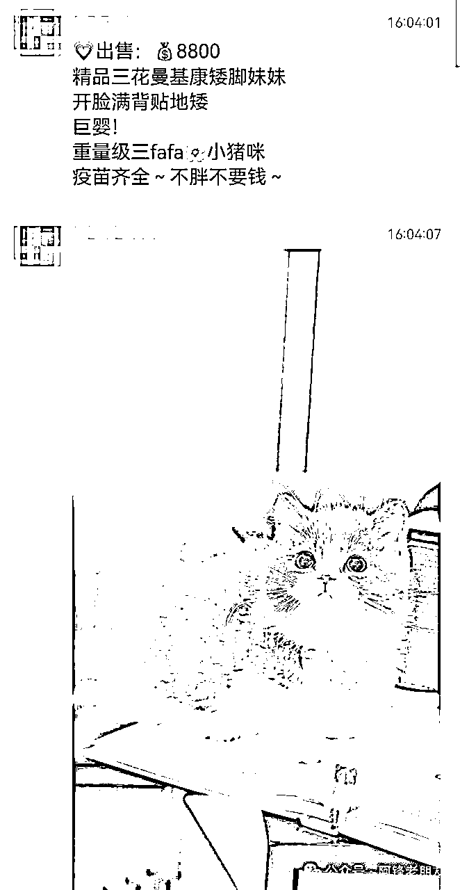
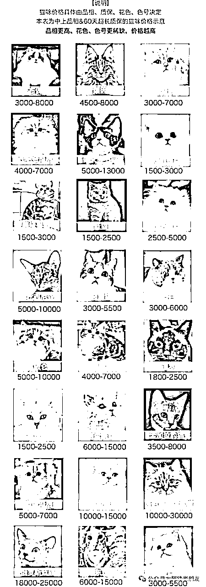
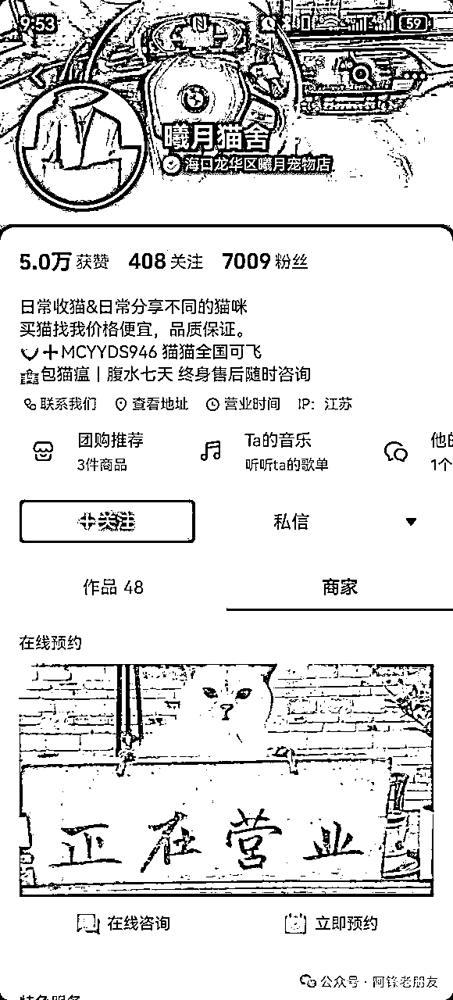
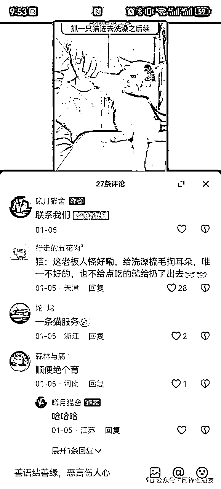
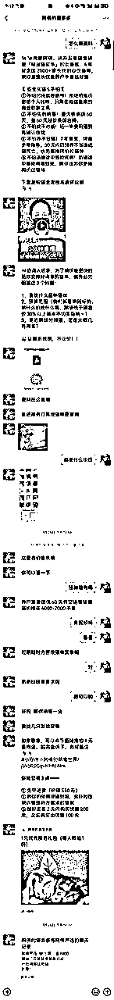

# 小猫活体抖音打粉，每单利润 5000+，一个月轻松收入破 70000+ （生财）

> 来源：[https://su6efgs0z3.feishu.cn/docx/TEcYdMEqVopFuTx7RYxcIYs6nmh](https://su6efgs0z3.feishu.cn/docx/TEcYdMEqVopFuTx7RYxcIYs6nmh)

前几天特地驱车去南沙找生财圈友杰哥，交流了一下突然又打开了格局，没想到高客单价活体猫猫的打法竟然如此简单。

还没试过每单利润 5000 以上的，活体门槛相对一般人也很高，一旦跑起来，真的一个人收入破 10 万问题不大。十一月底开始做，到现在一个月出个16单左右，跑第二个月就单人单月利润破7万了。

这么暴利？

举个例子，比如一只矮脚猫如图，已经卖到了 8800。

实际上货源那边成本只要 1300 左右，其中的利润就都是自己的，当然了运输过程中可能会有死的，这些都算损耗，纯利润 6000+是没问题的。

怎么做的？

接下来从抖音打粉玩法到后端转化，一点点剥离出来给大家讲清晰，毕竟大家都听说活体利润非常高，却很难触碰到这门生意。

从以下几个方面来展开：

1.宠物猫的分类和市场。

2.怎么解决供应链问题。

3.抖音上怎么去打粉。

4.线上怎么转化和发货。

5.售后和注意事项。

正文正式开始：

1.宠物猫的分类和市场。

这个市场太大了，特别是这两年宠物猫受欢迎的程度已经远大于宠物狗了，既然如此，我们就得去知道一下猫的大致分类。

还得知道一个事实，千金难买心头好，所以一旦客户有喜欢的猫猫了，基本上价格再高也可能会毫不犹豫就买了。

真的会有人花大几千买个猫吗？

那肯定会的，别的不说，单纯养只猫的成本远远比买猫的成本高的多，猫住个院花大几千，生个病也大几千。

甚至平时自己吃啥也会给猫吃啥，大几十一斤的肉也会毫不犹豫，所以别小看养猫的人群，绝对的高消费。

建议做高客单价的吗？

小工作室或者单人操作的话，是建议做高客单价，没那么多麻烦，永远记住一句话：钱多事少，钱少事多。

高客单价的客户相对来说反而好服务，不会挑挑拣拣，杰哥提到过一个案例就可以说明了：有个客户刚买了猫，没到一个月就生病了，给他换不愿意非得要治疗，协议写明了只换不治。

结果呢？

客户自己花了八千多去治疗，也没多说什么，让客户换非不换，就只要那一只，最后只能跟客户如实说成本这一块，给客户退了 3000。

实际上肯定要赚的嘛，退了 3000 还有一千多利润，只能跟客户说对半赚，客户也没有多说什么，比较好说话。

这行到底多暴利？

前面放的一张图标注有价格，定位做高端的话，平均成交价在 8000 左右，拿货成本在 1500 左右，运输费用和损耗等，纯利润在 5000 往上。

这就是这行的暴利所在，基本上都是做一件代发，不囤货也不自己养猫，不然很容易亏本，直接代发就行。

2.怎么解决供应链问题。

一开始供应链这一块都是先加同行，比如广州线下这边的，然后一家家去谈，价格有没有优势先不管，跑通小闭关比较重要。

抖音和小红书上面搜索很容易找到，加个 30-50 个同行，就可以初步解决货源问题了，如果同行都找不到，可以直接回家睡觉躺板板了，不适合做项目。

怎么找到优势的供应链呢？

两个方式：

1.宠物猫的养殖基地最大的在沈阳，大多数都在东北那边，如果有资源或者关系的，去跑一趟，能解决你的问题。

2.广州每年至少会有 2 次猫展，到时候会有大量的优势商家，全部加一遍，基本上就可以解决你的问题，大多数时候可以谈成一件代发。

自己不囤吗？

建议是不囤，当然了，有实力的话可以囤一批，这样也方便做转化，如果自己实在喜欢猫猫的话可以这么做。

也算是一遍做自己喜欢的事一遍赚钱，都不耽误，切记不要太理想化。

3.抖音上怎么去打粉。

这是重点，流量是一切的根源，由于涉及到投流，就只提一种人人可做的方式，自己懂信息流的自行去跑，目前这块成本不高，信息流在 60 左右。

抖音怎么打粉？

先提最简单的打粉模式，投豆荚，直接投主页流量即可，但记住，一定要投达人相似。

即找到 20-50 个在抖音上卖猫猫用品的博主，粉丝量 10 万以上的，专门投他们的粉丝。

为啥这么做？

一开始就定位为高端的，所以人群要找准，直接投很容易导致来的人群都嫌弃贵，但是已经有猫的人，总想要一个更好看更可爱的。

要知道，养猫的可是会上瘾的，所以投这种人群，如若还想要养一只的话，七八千甚至一万多一只，也不算太难成交了。

这种逻辑吗？

确实，只有这种逻辑才能一开始就找到接受高客单价的人群，也只有买过猫猫的才愿意支付万把块去买一只喜欢的猫猫。

一开始也不相信，知道看完数据以后才明白，这才是小众赛道切入的方式，投流成本大致在 50 左右，豆荚的投流成本不会很稳定，多跑一跑就可以控制成本了。

跑什么素材？

非常简单，给个对标：

引流到微信也很简单，开通蓝 v 以后有个私信组建，开通一下就行，效果如图

素材就发各式各样的猫猫，评论区引导一下说怎么买等等，然后就可以去投流了。

大致算一下，基本上当天出单可以平掉投流成本，后续利润还是非常可观的。

4.线上怎么转化和发货。

这一块还是聊一聊，正常来说要是我，直接丢一句：找同行去，同行是最好的老师，没加够 100 个同行都不相信你把转化话术优化到极致了。

怎么转化效果最好？

看下图，目前看到转化最好的一个同行，看完聊天记录一切都懂了。

这里面已经包含了领资料的倒流方式，还有背书，价格，确定需求和买猫日期，测试付费意愿等等，看完就知道成交率不会太低。

还不懂？

自己加去呗，话不能说太直白，细心点，就知道怎么找到这个人了。

怎么发货？

直接一件代发就行，一般发货还包括活体空运费用大致在 160 左右，加上叫货拉拉去机场取猫配送，加起来大致 300 左右。

提一句：最好的培育季节是春秋季，夏天容易死，冬天太冷繁衍率低，整体来看一年四季也都可以做，不过会有淡旺季而已。

5.售后和注意事项。

售后一般有两种情况：

1.猫猫死了。

配送途中就出现这个问题，只能当损耗，重新换一只，一般十个里面才有可能有一个出现这种情况，直接换就行，没必要太黑心，毕竟自己账号还得持续投流。

2.猫猫病了。

一般这个都会给 60 天协议期，这期间如果生病了，只承诺给换，而不是承诺治疗，这个非常重要，否则亏了都不知道咋回事。

很简单，成本 1500 一只，换一个才一千多，治疗动不动就万把块，肯定选一千多的，换一只也不亏。

出现纠纷怎么办？

弄个协议，发货之前付 50% 左右，收到货以后再付尾款，协议里面把一切可能都写进去。

具体协议内容，直接百度搜索一下，找出来改一改就可以了，如果要具体的，直接去找同行假装买一只，会提前给你发协议的。

就这么简单？

每个业务其实回顾来看都很简单，知道跟做到是两码事，赚钱就是干干干。

最后做个说明，我所看到的和听到的，跟事实不一定准确，此分享纯粹是推演与尽可能还原，要想跑通项目并盈利还得真实去干，谢谢！

感谢生财提供的平台，感谢圈友提供的帮助，有做同类赛道的可以多碰撞交流。