# 单月营收破20w，AI代写深度复盘，内附多个变现方法

> 来源：[https://cxqeimz77vr.feishu.cn/docx/THUxdSPu9oYbxvxq0P4cszDwn05](https://cxqeimz77vr.feishu.cn/docx/THUxdSPu9oYbxvxq0P4cszDwn05)

各位生财圈友大家好，我是饭饭。

目前在电商赛道和AI代写赛道探索，

目前通过AI代写赛道带领团队营收破百万，

23年刚加入生财的时候我还在卖手机壳，在加入生财还不足1年的时间里，拿到了龙珠成为了生财的航海家，很荣幸能够在生财一直破圈。

目前取得两个自我突破的成绩、

1.上月通过AI这条赛道的实现单月营收突破了20w，

2.顺势发售了一个AI代写的小报童，取得了3天订阅突破2200人，一周订阅破2900人的成绩。

做了6年实体店老板后成功负债转型线上，从最初的拼多多开店卖手机壳再到拥抱开写作店铺大力拥抱AI，组建强大靠谱的后端写作团队，陪伴了上千人在AI代写上赚到属于自己的一桶金。一路上分享不止，学习不停，很幸运我分享的内容都能被你们喜爱并使用，这篇帖子是一条深度复盘，目的是让新手看了少走弯路，老手看了恍然大悟。

希望大家龙年生财，大家见帖欢喜！

# 一、全新认识AI代写：

代写就是很古老很传统的行业，经久不衰的巨大市场。回忆一下，在人类科技发展的长河中，每一次技术革新都如同璀璨星辰照亮前行之路。从工业革命的蒸汽机到信息时代的互联网，每一次颠覆性的创新都孕育出无数崭新的财富机遇。AI的出现更是解放了双手，降低了文字行业的门槛，因为AI就是一个万能的文字助力，文章千门百类，AI无一不通。AI不仅仅可以代写提效，我们更多的是用AI来代写变现。在AI代写领域，可以涵盖非常多的写作类型。不同客户和市场需求。

这里分享几个数据，或许会让你对AI代写有一个新的认识。

如果你觉得AI代写不赚钱，那你就错了，上个月我们创造了单月营收破20w，曾经不少人看不上的代写行业，AI的出现抢手到很多人高攀不起，饭饭直播分享时观看人次高达2288人次。

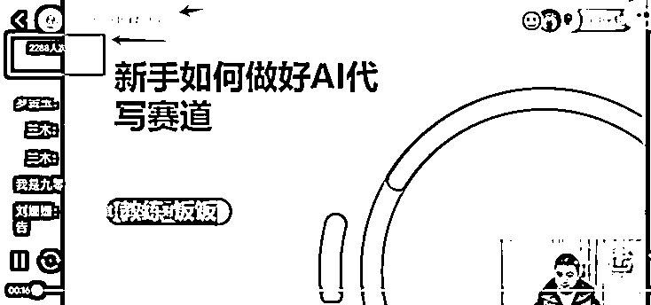

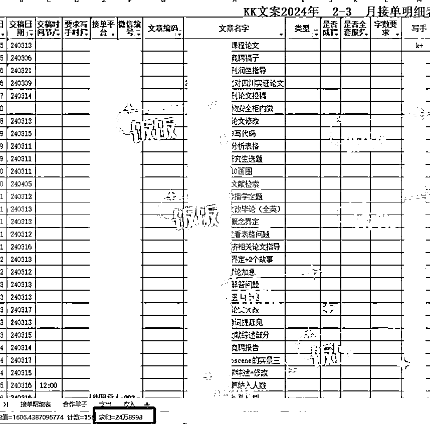

但是如果你觉得这么多人下场，会不会竞争太大赚不到钱？

那我接下来的分享就会告诉你，AI 市场太大，生财圈友人人有份。

由于在之前我也分享过一篇《通过开写作店铺年入50w的项目拆解》而且星球一些优秀的圈友也总结了非常不错的内容分享，闲鱼、小红书、拼多多、BOSS直聘等优质平台都涉及到。为了避免冷饭热炒，今天的分享我会重点从实操思维以及淘宝平台来做重点分享，我也写了一份关于《AI代写变现单月狂揽20w》的方法论，需要的可以微信： F49091备注圈友领取。

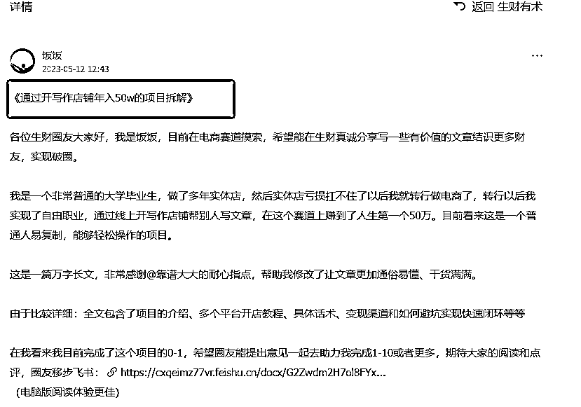

# 二、AI代写如何差异化竞争

踏入AI代写行业以后我们要思考3个问题。

（1）我们可以写什么？

（2）写什么比较赚钱？

（3）我们的客户在哪里？

这些都是比较基础的问题。

没接触过这个行业的不知道到底要写哪些东西可以赚钱，接触到这个行业的可能不知道我们的客户在哪里，这里我详细举例、看完必定可以实现精准突破，AI变现！

## 1.我们可以写什么？

在AI代写领域，可以涵盖非常多的写作类型，不同的客户有市场需求。在我们实操的过程中会遇见一些常见的代写类型，包括但不限于如下：

（1）为学生、企业人员或者老师群体写演讲稿、新闻稿、读后感、征文发言稿、报告总结等：

（2）在学生用户中常见的情书、道歉信、感谢信、节日祝福、诗歌、作业等等。

（3）在小红书闲鱼上经常接到的广告策划、宣传软文、短视频文案、笔记文案等：

（4）在BOSS直聘和小红书上会经常接到的一些详情页文案、剧本、脚本、影视解说等

这些都是比较小的营收点，利润更高的又有学术类的，例如：论文、文献综述、开题报告、研究报告，以及商业类的回忆录、公文、会议纪要、思想报告、商业业计划书等：

这样看下来其实能AI代写的范围太多了，我刚刚说的这些都仅仅是一个大方向，如果你想要AI代写赚到钱，仅仅知道这些远远不够，真正的高手就是在做到后面的细分赛道，看我接下来的分享。

## 2.写什么比较赚钱？

执行力压倒一切，只有经历了实操后你才会发现，做AI代写必须要差异化竞争，理解这10大思路，方能赚钱。

我属于比较闷头实干的这么一个性格，基本上遇见客户下单一种类型的单子我就会辐射展开，展开以后我才发现，

根本不缺单子。

### 思路1.

例如研究报告又包含了：实验报告、课题研究报告、科研项目报告等等，随便打开任何平台，这些细分领域的其中一个关键词，都可以看见大需求，大利润、那我继续细分。

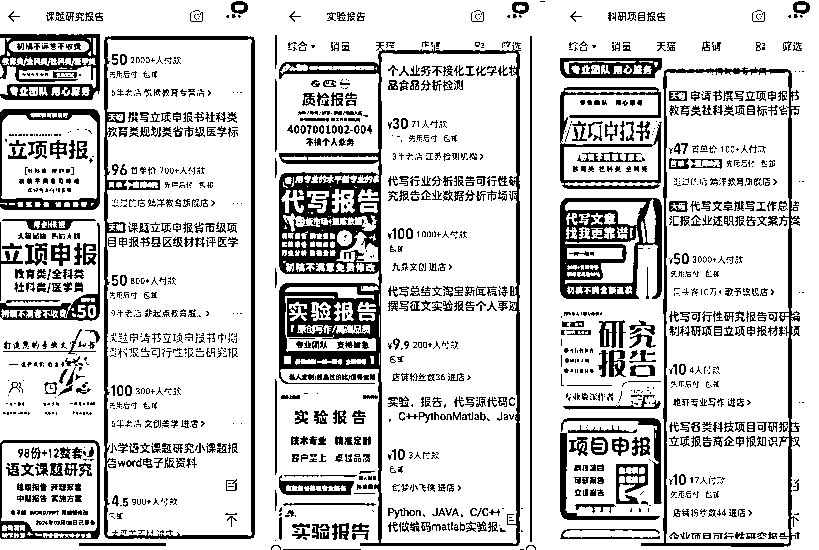

### 思路2.

例如商业计划书又分为了融资、路演、立项、参赛、创业、可行性研究报告等等，打开任何平台搜索，都是巨大需求，这些不够，继续看我细分下去。

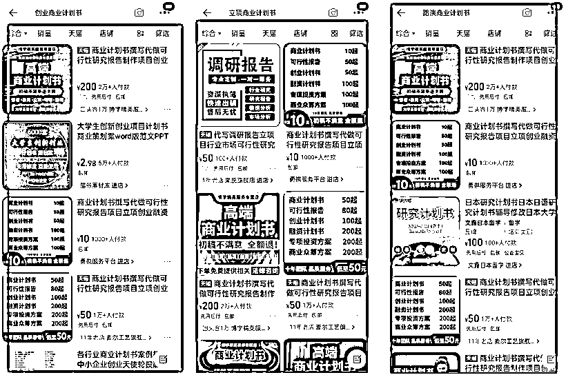

### 思路3.

例如论文，如果按学历又分为了本科、硕士、博士、函授本科、专科等等（只做思路分享，为了不影响阅读，以下思路我不放截图）

### 思路4.

例如论文如果按学科细分又包含了人文、社科、理工、医学等，那如果继续细分，随便选择一个专业，继续细分下去。

### 思路5.

例如教育类论文、又包含了教育学论文、心理学论文、教育技术论文、教育管理论文、教育政策论文、教育评估与测量论文等等不同领域。

### 思路6.

例如商科论文又包含了市场营销、企业管理、金融与财务、会计、经济学、供应链管理、创业与创新管理、组织行为学等等。

### 思路7.

例如医学论文医学、生物医学、公共卫生、药学、护理学、生物学、生物工程学、医学影像学等等。

### 思路8.

例如法学领域又涉及到了法理学、民法学、刑法学、行政法学、宪法学、环境法学、劳动法学、知识产权法等等领域等等

### 思路9.

例如IT与计算机科学论文包含了计算机科学与工程、软件工程、信息技术、数据科学与数据分析、人工智能与机器学习、嵌入式系统与物联网、网络安全与信息安全等等

### 思路10.

例如人文类论文需求包含了艺术史与美术理论、音乐学与音乐史、戏剧与表演艺术、文化人类学、哲学与伦理学、历史学与历史研究、社会学与社会文化研究、艺术设计与视觉艺术等等。

当然，以上仅仅是我在实操中总结出的AI代写领域的一部分需求，所以大家听下来我的分享，你们还觉得能写的东西少吗？

其实能写的东西太多了，真正需要的是你高效获取流量的能力，解决单量的能力！

## 3.我们的客户在哪里？

有文字需求的平台就有我们的市场，互联网上是流量洼地，这里我把接单类型分为了几种。

一级市场被动接单

对于擅长运营的圈友来说，建议去那些可以接到一手单的平台，客户咨询成单，就能够获得更大的利润，就目前我们开店的时候能够随时接到一手单的平台有淘宝、拼多多、闲鱼、小红书、抖音、和视频号、校园贴吧和各地校园表白墙等，这些内容基本上都在我们的航海手册里面了。

二级市场主动接单

主动找单找合作，稳定的去接机构或者文案公司旗下的单子也是不错的，这类的平台也不少，例如天猫店、拼多多店、百度、抖音、BOSS直聘、智联招聘等平台，所有的操作思路都是一样的，去平台应聘，接他们的单子。

## 4.我的营收主要构成

在过去的这个月中感受到了前所未有的忙碌，业务激增，出现人手不够的情况，当时还在生财星球的资源对接处来寻求了合作，也顺利和一些优秀的圈友建立合作关系，其实代写是复购非常强的一个业务，我上月主要营收依托与几个大的板块。

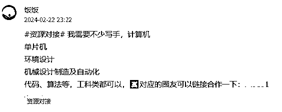

（1）接了一些研究生的综述、期刊，这部分客单价非常高，这个月接到了近17单研究生的辅导和期刊，营收占比最高，也是一大营收。

（2）接了本科的实证辅导以及一些开题报告，二三月完全的开题报告爆发期，这个占比达到了也很多。

（3）接到了不少的课题报告，科研项目、期刊审稿意见回复，预计在接下来的三月会是课题报告的高爆发期间。

（4）接到了不少的创业计划书和可行性研究报告。

（5）接了不少spss数据分析、遗传算法等工科单子。

以及一些小稿件演讲稿、散文、教学设计和部分述职报告等等，在上月也有部分星球的大佬给我送来上万的研究生大单子，奈何我的后端资源不匹配，也就放弃了。

当然，处理这些单量我一个人是忙不过来的，我目前属于全职扎根在做电商这个板块，我自己比较擅长运营做流量和销售谈单子，我还有一个线下合伙人在负责团队管理、安排稿件，处理售后，AI代写这条赛道如果想继续放大去做的话一定要搭建一个属于自己的工作室，哪怕工作室很小，也要分工合作，一个人的精力太有限，而且天花板极低。

# 三、初阶玩法：借助淘宝，日入100+

即使淘宝受到各大电商平台的冲击，在某些购物体量上面被很大程度的削减，但是对于写作类目来说，淘宝依旧稳占鳌头。那我们用淘宝了每天稳定收入100以上是很方便的，这是我们刚接触的代写业务的时候就采用的方法，目前我身边有不少朋友在实操，在我的小报童专栏交流里他们的见效依旧是立竿见影。

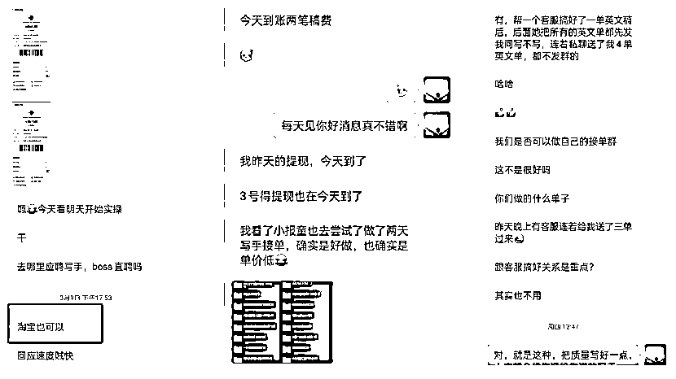

## 1.实操理解

这个玩法是比较适合小白练手，如果你只是想做点副业，没有时间运营或者也不愿意花过多的时间去运营的，那就比较适合你，刚踏入AI代写的时候就用这个玩法，减少踩坑。整个玩法的操作思路就是去淘宝平台上找到靠谱的店家，然后在他们的接单群里面去接单。

操作路径就分为了：找店家>应聘>进接单群>抢单接稿>写稿>按意见改稿>结稿费

那如何去找到靠谱关键的店家，如何不被店家跑路才是关键问题，请看接下来实操步骤。

## 2.实操步骤

### 第1步

打开淘宝直接搜索“文章写作”“文章代笔”“商业计划书”“演讲稿”“读后感”等等的关键词，然后根据平台推荐出的店铺去咨询。咨询的时候记住两大方法提高效率。

（1）带有“天猫”标识的挨个询问，大部分天猫店铺都是有写手需求。

（2）销量排名靠前的挨个问，根据销量来筛选。

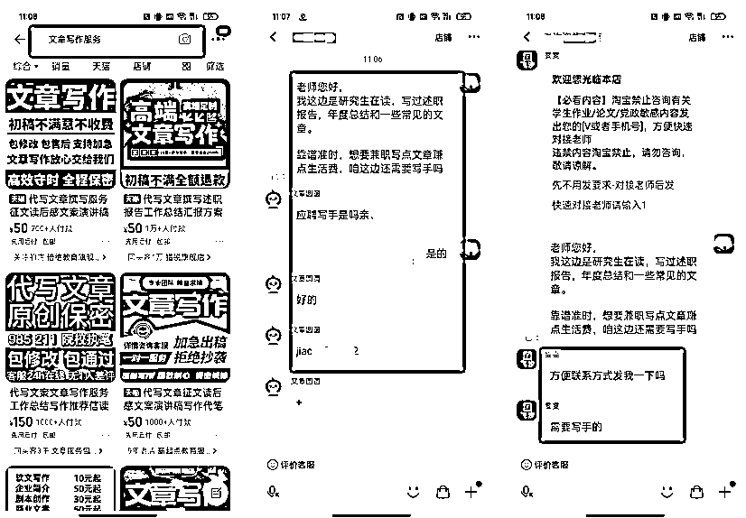

### 第2步

添加客服给出的微信，或者把你的微信留给店家添加以后，在微信沟通。提前准备好自我介绍，方便高效沟通节省你和甲方的时间，也是增大合作可能性的技巧，这里我提供两个案例模板。

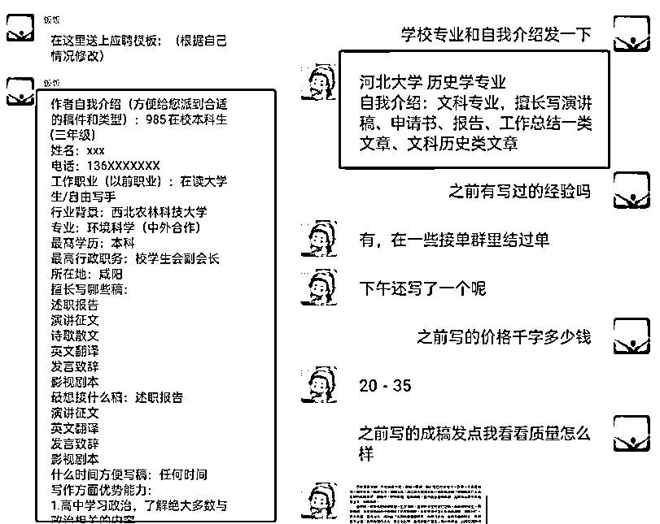

### 第3步

进入他们的派单群，有些是企业微信群、有些是QQ群派单的，作用都是一样的，群里面接单接单就可以。

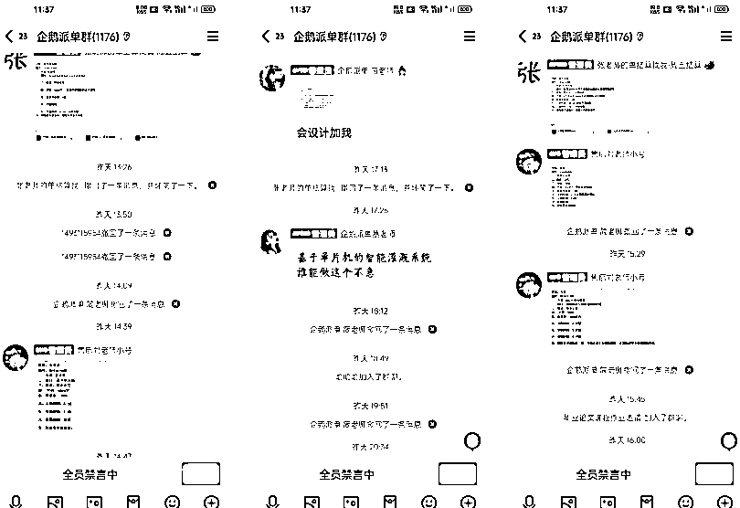

## 3.注意事项

学会筛选单子，记住几个原则：

（1）单价过低的不接，例如千字10元以内。

（2）急单不接，很多急单都容易出现问题。

（3）参考资料过多的不接，例如发了很多的参考文献、视频或者音频。

（4）设计类，做实物的不接，例如仿真、单片机等等后面容易遇到问题。

# 四、中阶玩法：淘宝社区，零成本打法

如果你觉得在淘宝接单价格太低，自己开店又没时间运营，那这套打法就适配你了，花点时间做好淘宝社区截流，霸占评论区，让商家给你打工。或许你不知道，淘宝店铺的评论区也是流量洼地，精准客户咨询，而且淘宝流量的风险远远低于小红书、抖音、闲鱼等等平台，因为在淘宝店的评论区是很自由的，很多店铺根本不知道如何去设置禁止非店铺用户来评论，这也就是极大的机会，如图实操分享：

## 第1步：

设置淘宝逛逛资料，如图所示，进入淘宝，点击我的淘宝、选择视频、选择发布、设置关键信息。

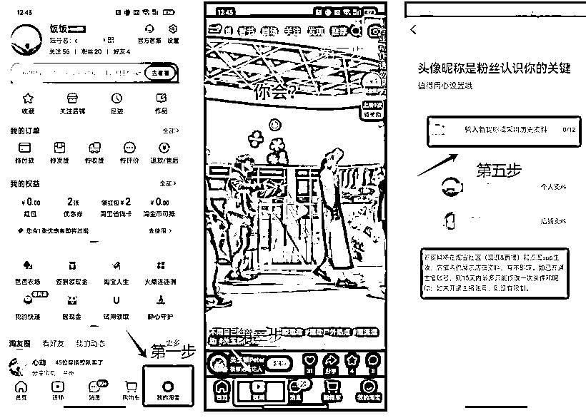

## 第2步

查找目标留言的商家，筛选出评论区活跃、评价多，商家问一问较多的店铺，然后疯狂留言。

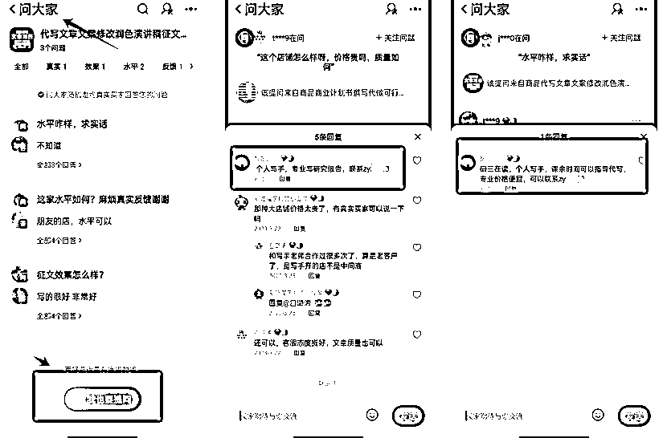

如果设置好社区个人资料以后还可以直接发布作品视频，然后通过留言引导查看主页，添加到微信转化，如图就是非常好的案例。

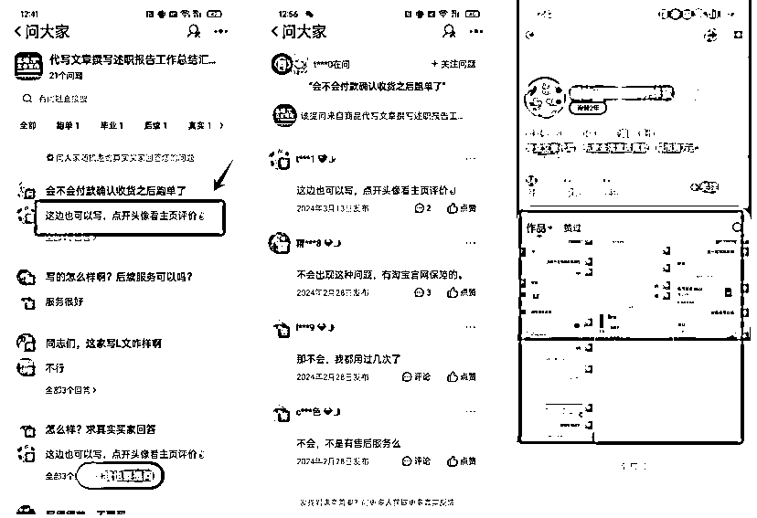

当然，这个方法一直没有对外分享，我分享出来以后大家抓紧用起来，能抓住红利的时间是很短暂的，勇立潮头才能荷包鼓鼓！

# 五、高阶玩法：淘宝开店，无限可能

淘宝经久不衰，天猫店铺的投入成本较高，文章写作店铺的投入最起码10w起步，但是C店是门槛极低的，1000元的保证金，通过淘宝月入5位数应该是属于很正常的，这种淘宝店主我身边就有很多个，而且经常交流的做的还不错，我们自己的淘宝店收益虽然比不上其他平台的，但依旧大有可为！

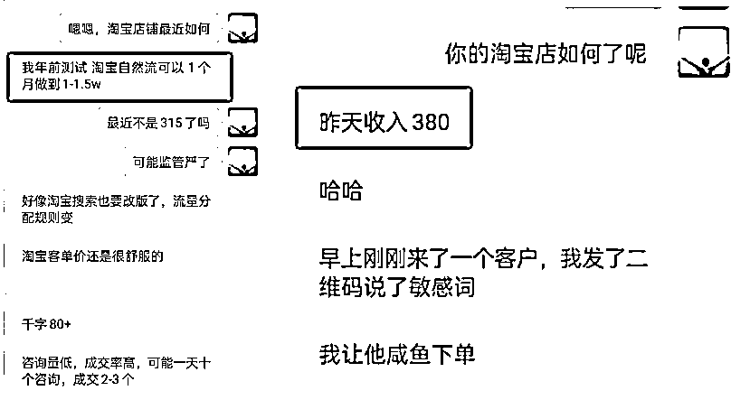

店铺客源不断：

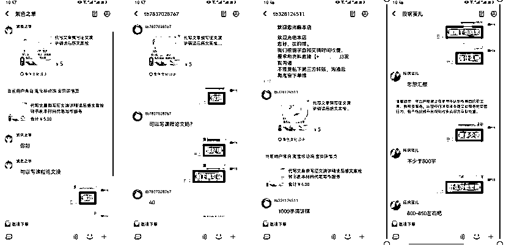

## 开店步骤：

### 1.官网注册

访问淘宝官方网站（www.taobao.com）并点击“免费注册”按钮，进入注册页面。

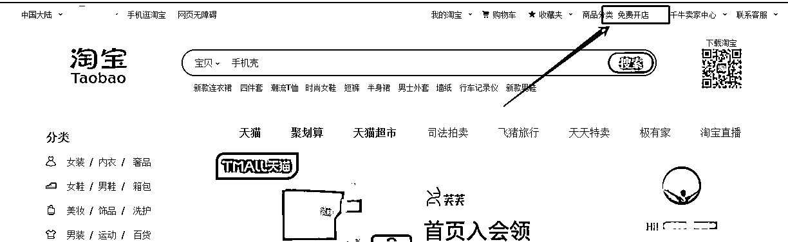

### 2.选择注册类型

选择要注册的账户类型，包括个人账户和企业账户。如果您是个人开店，则选择个人账户；如果你是以公司或个体工商户的名义开店，则选择企业账户。【建议个人店】

### 3.完善注册信息

填写注册信息，包括手机号码、登录密码、验证码等。如果你已经有淘宝账号，则可以直接使用现有的账号登录。

### 4.账号认证

进行实名认证，提交真实姓名和身份证号码等信息，并上传身份证照片，设置支付宝账户，绑定银行卡等支付方式，确保可以顺利收到交易款项。

### 5.设置店铺信息

创建店铺，选择店铺类型、填写店铺名称、店铺简介、并上传店铺LOGO。

### 6.设置店铺运营规则

包括商品发货方式、物流配送方式、售后服务等。然后提交注册信息并等待审核，审核通过后即可开始在淘宝上销售商品。

### 7.发布写作产品

开始发布产品，写作类目，不要把类目填错导致商品流量少、注意标题可以参照我发的这个

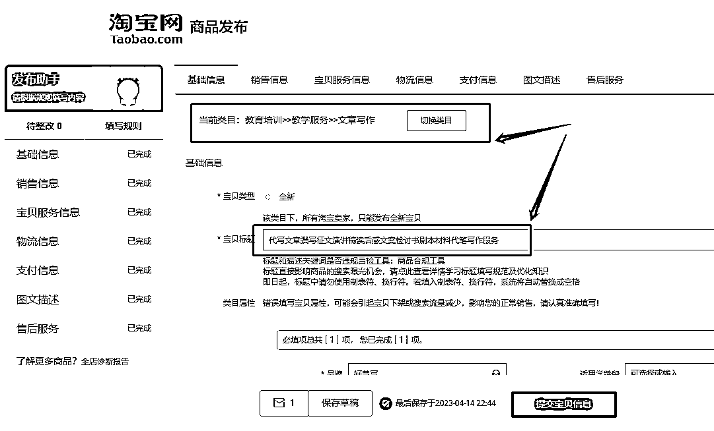

以上就是关于在淘宝上开店的注册详细步骤。

目前市场上的各种接单平台非常多，但是选择了最适合自己的，那一定是AI代写大有可为！

# 六、AI代写实操案例

## 1.常用AI工具

正所谓“工欲善其事，必先利其器”，AI代写的工具太多了，给大家推荐一些常用的。

目前使用下来操作体验还不错的AI工具，对于AI代写来说，主打一个免费就能满足使用，

①ChatGPT：https://chat.openai.com

②Claude：https://www.anthropic.com/index/claude-now-in-slack

③new bing：https://www.microsoft.com/zh-cn/edge/download/insider

④百度·文心一言：https://yiyan.baidu.com/welcome（注册秒通过）

⑤讯飞星火大模型：https://xinghuo.xfyun.cn（注册申请第二天通过）

⑥通义千问（阿里）：http://qianwen.aliyun.com/

⑦智谱清言：https://chatglm.cn/

⑧讯飞星火（科大讯飞）：https://xinghuo.xfyun.cn/

⑨KIMIChat：https://kimi.moonshot.cn/

⑩AI导航(更多推荐)：https://wz.aidaohang.com.cn/

根据自身情况和使用场景选择，国产大模型也是不错的使用体验，我们使用的时候也是使用的KIMI和智谱清言比较多。

在之前我们星球的航海手册里面有了很详细关于AI的介绍，新手一定去看AI代写的航海实操手册，这里我直接上实操案例，一些比较常见的如下：

## 2.如何用AI写开题报告？

写论文的都知道，论文之前得先开题，要知道，其实开题报告不查重，完全可以用AI写啊！

虽然网上一搜就可以搜很多模板，但是太多人都不会搜索，用AI辅助效率会更高

提效提质，提开心！

很多人之前费劲巴拉写了半天，还被导师批头一顿！

给大家举一个实操案例：

如图：客户需求是这样的，

文科题目：数字乡村建设对农村产业融合的影响机理与实证检验

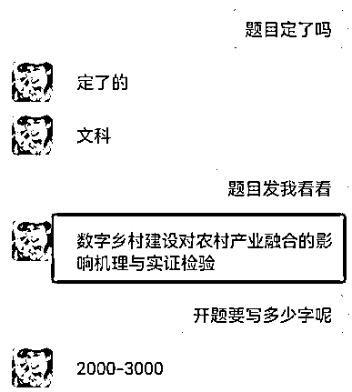

那如何用AI来写开题报告？

第一步：查找相关文献（帖子末尾有多个文献网址）

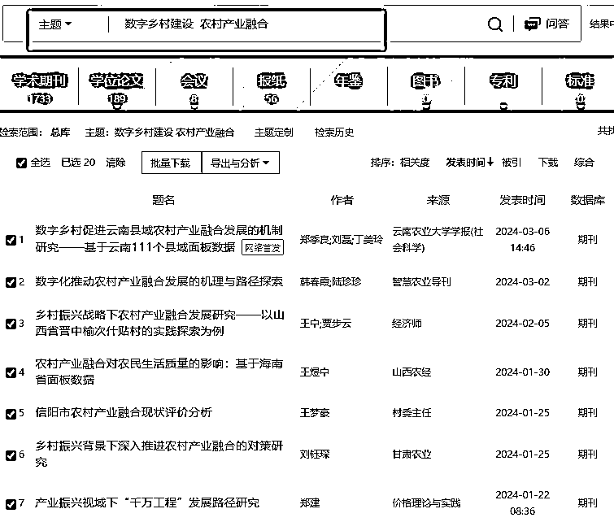

第二步：输入题目并结合文献写作

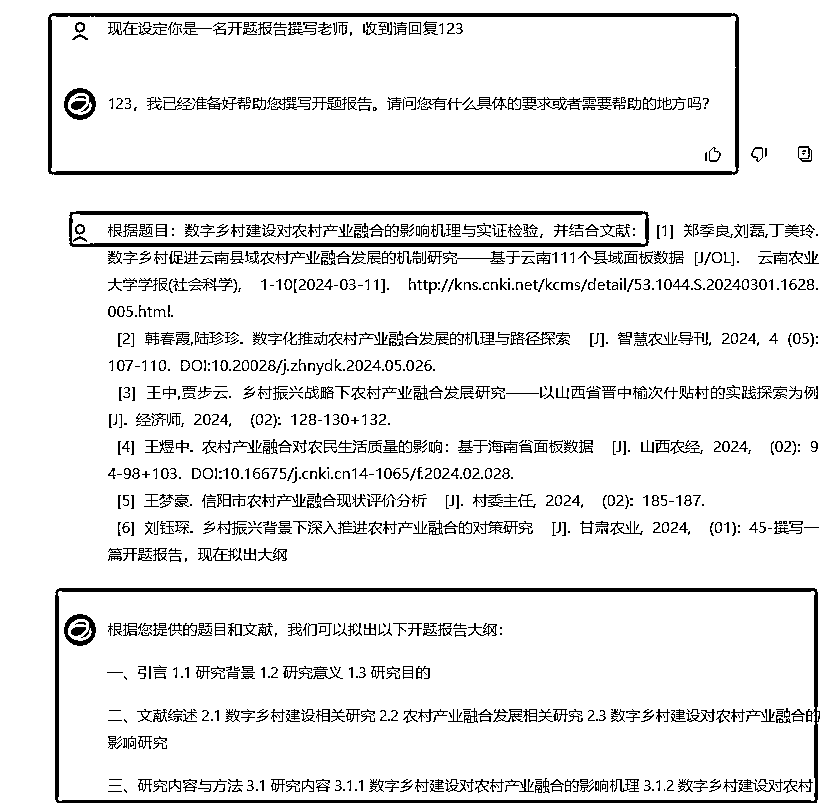

如图，得到文献的初稿，再根据学校的要求模板，进行润色就可以，因为不同学校的模板可能会不一样。

以上实操思路，关于参考文献的查找，如下网址分享：

常用的文献查找的几个网址：

1.中国知网

网址：https://www.cnki.net/。

2.必应学术

网址：https://cn.bing.com/academic。

3.万方数据知识服务平台

网址：https://www.wanfangdata.com.cn/index.html

4.中文科技期刊数据库（维普资讯）

网址：http://qikan.cqvip.com/。

## 3.如何用AI写学术论文

关于学术是非常严谨的话题，借用AI辅助一定要时刻牢记尊重学术的原则，遵守学术规范和道德准则，要正确引用的内容，还要避免抄袭和剽窃，纸上得来终觉浅，绝知此事要躬行！

这里我们只做AI提效普及意义，那如何用AI来写一篇学术论文？

这里我们以常见的本科汉语言专业为例：

如图，这是客户需求

本科：

专业:汉语言文学

论文题目:王安忆长恨歌人物形象探析论文

正文字数需求:8千

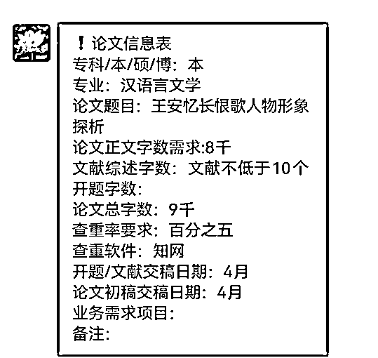

掌握了论文的基本信息以后，就可以使用AI工具，这里我以国产大模型（智谱清言）为例：

第一步：根据关键词提前在文献网站找到相对应的文献，并导出，如图

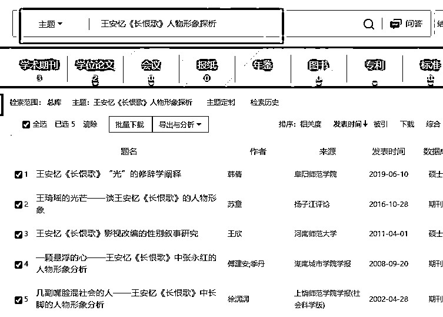

第二步：设定角色，把论文的基本信息结合参考文献，投喂给AI工具，先写出大纲：

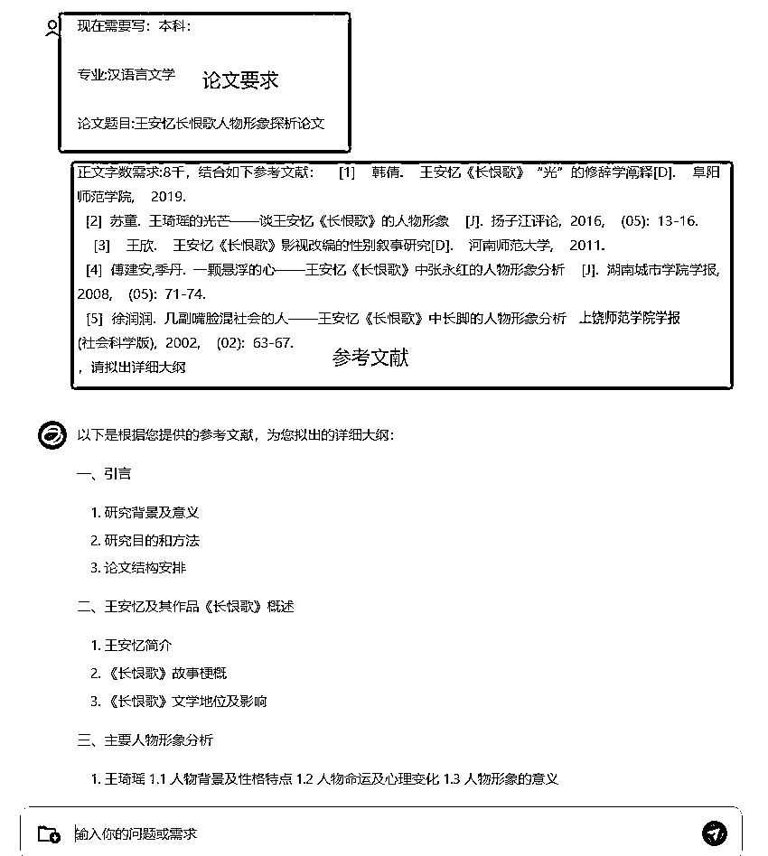

第三步：根据大纲，按顺序写作

如图，就可以得到AI输出的基础文本并且得到的文本质量还不错，如果比较满意，便可以直接使用，如果需要继续优化，便可以继续给指令优化。

篇幅有限，省略后面类似的步骤，

.........

写论文的思路就是重复以上的步骤，把大纲完成后进行人工润色，就得到不错的论文初稿，当然，最后需要根据学校文件要求，进行合理的修改。

以前几个月完成不了的论文，AI工具用的好的话用不了多久就完成了。

当然，在学术论文领域范畴是非常广的，不同学历、不同专业、不同学校、不同要求，都是不一样的需求，我们要掌握的就是用AI来辅助论文写作，提供自己写作的质量与效率。

这里我提供一个指令思路，可以当做模板：

1.主题和目标设定：

指令：请以“[论文主题]”为题，撰写一篇关于“[研究问题或领域]”的论文。

指令：本次写作的主要目标是探讨/分析/评价“[具体的研究目标]”。

2.范围和重点：

指令：请重点关注“[需要重点分析的理论、事件、人物等]”。

指令：论文应涵盖“[相关概念、历史背景、理论框架等]”。

3.论文结构安排：

指令：引言部分应包括研究背景、研究意义、研究目的和研究方法。

指令：正文部分应包括“[各个章节的主题]”，例如文献综述、理论分析、案例研究、数据讨论等。

指令：结论部分应总结研究发现，并讨论其对现有研究和实践领域的贡献。

4.写作风格和引用要求：

指令：请采用“[学术或正式的写作风格]”。

指令：所有引用的数据、观点和文献资料必须准确无误，并按照“[指定的引用格式]”（如APA、MLA等）进行引用。

5.字数和格式要求：

指令：论文总字数应为“[要求的字数]”左右。

指令：论文应包括标题、摘要、关键词、引言、正文、结论、参考文献等部分。

一整套完整的操作思路下来，可以说用AI能解决论文80%的难题。

会了这个，

## 4.如何用AI写一篇调研报告？

调研报告也是市场的一大需求，市场调研就是了解市场:看市场规模多大、发展前景怎样、竞争对手有哪些、该如何开拓市场、用户对你们产品的使用情况等。市场调研对营销管理非常重要。通过市场调研，了解用户对产品的满意程度、外部竞争对手、了解市场环境变化，为决策提供依据。

大需求，大痛点！

那如何用AI写一篇调研报告？

就目前我们的写作店铺会遇见客户下单，要求帮忙写调研报告？

案例如图：

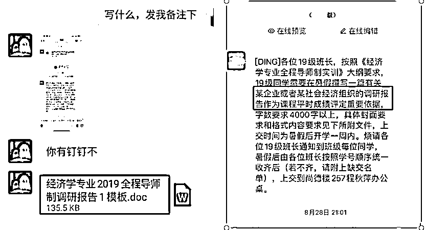

如何用AI写一篇调研报告？

举例：把要求投喂给AI工具，得到初步反馈。

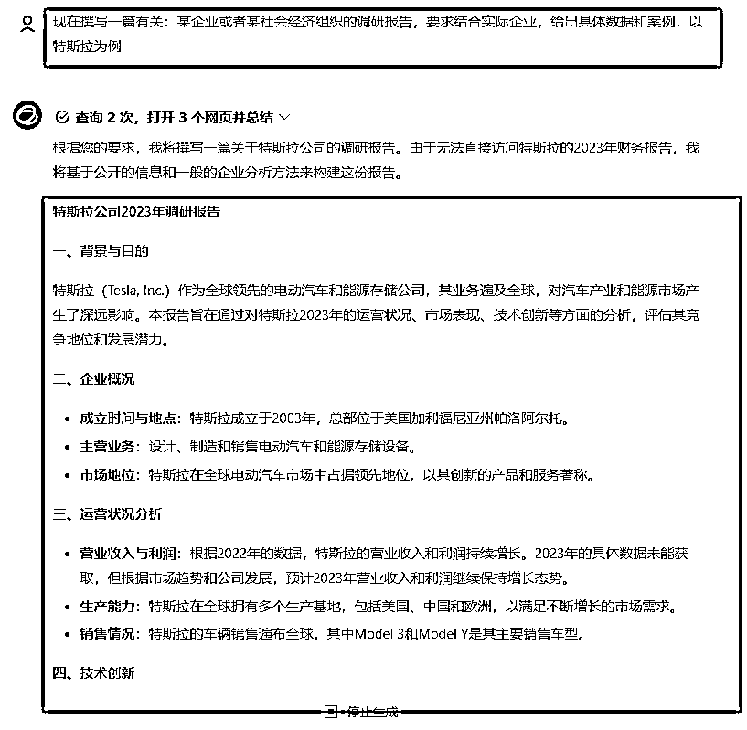

继续输入指令，细化要求：

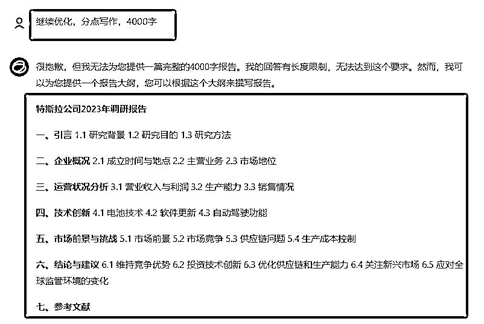

根据调研报告的大纲，继续写作

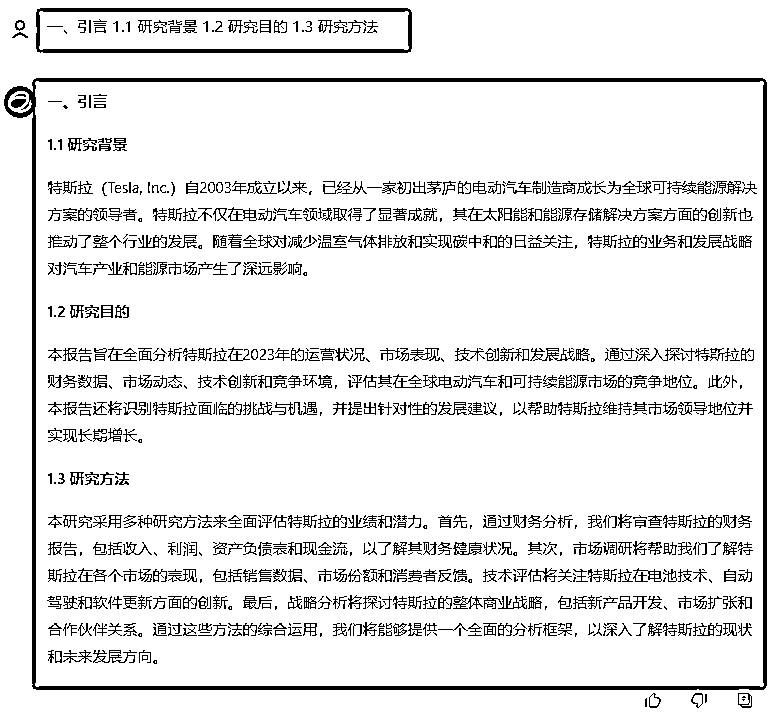

重复步骤，然后根据客户的细节需求，具体的再细化调整就可以，代写类就是不同的需求对应不同的指令，掌握这个思路就能完成一篇基础的调研报告。

# 七、写在最后

AI的出现不仅打开了普通人通向财富的新窗口，更是在无形中推动着大众对新技术的认知与应用。在未来AI代写会持续精进，而这个改变意味着你我都有机会在这场科技变革中勇立潮头，既然AI代写能够让小白很快的拿到正反馈，吃到时代红利，那就行动起来，躬身入局拿结果！

祝大家豁达、通透、AI王炸工具在手，生财团队资源扶持在后，躬身入局，早日财务自由！

我是饭饭，如果分享有用，记得星球贴下点赞留言交流。