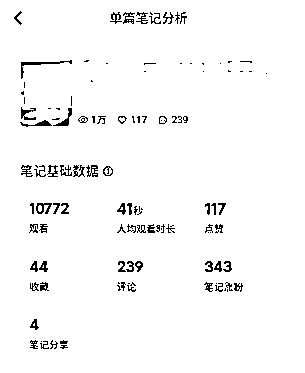

# 考研调剂，学会追热点小白也能起飞

> 来源：[https://mf312aayjy.feishu.cn/docx/TXg2d9HzroAbubxK7H4cI9eYnQd](https://mf312aayjy.feishu.cn/docx/TXg2d9HzroAbubxK7H4cI9eYnQd)

# 一、实战成绩

一人两个号（认证号，普通号）在小红书两篇笔记十天左右引流900+考研同学，变现3w+，不是个人能力有多强，是站在热点风口，小白也能起飞。（两个普通销售微信卖低客单产品，一个老师助理微信承接高客单产品转化）

（左图普通号，右图认证号）

# 二、关于考研

查看一些历史数据结合平常身边的情况不难发现，考研已经成为越来越多大学生选择的一个方向。根据教育部公布的数据来看。21-23年高校毕业生人数分为909万、1076万、1158万，而这三年考研的人数为377万、457万和474万，后者约为前者的41.6%左右。而2024年考研报名人数虽然有所回落，较上一年也仅仅减少36万人，为438万。也就是简单理解：国内大学里，将近一半的同学都选择考研。 众所周知，考研也并不是一个简单就能通过的考试，所以也就意味着不能顺利录取的同学，都得进入调剂阶段。看下图可了解大概考研的时间流程：

（3.12号国家线已经公布，所以目前考研调剂进入了调剂时，也就是需求最旺盛的时候。需求多旺盛呢，要不调剂成功上岸，要不失败二战或者放弃考研，因此同学们对于调剂的产品需求是很迫切的）

# 三、关于产品

由于考研时间跨度很大，每个环节都有各式各样的服务产品，主动联系下各大机构或者大佬推荐一般都能接触到不少产品。了解好产品口碑，产品内容，交付方式和佣金比例觉得合适就可以合作，个人建议选择考研产品还是得看大机构，看背书口碑，不要因为佣金高而选，毕竟是影响同学前途的一次考试。

# 四、关于调剂产品

因为初试阶段各大机构竞争很激烈，不是深耕这个赛道的朋友比较难介入。为什么选择调剂阶段介入呢，除了上述说得考研本来也是一个“千军过独木桥”的考试，每年的录取率不会太高，就证明很多同学迫切希望能通过调剂上岸，最重要一点是：假如你是学生A，你报了某机构的初试班，经过大半年机构陪伴式的学习，结果考试成绩不理想，你还会把最后调剂的希望寄托给原来的机构吗？（懂得都懂）所以就给到机会咱们这种游击队选手给他们提供调剂产品服务的机会。

# 五、关于笔记

很多大佬分享过，当日常刷视频笔记的时候发现异常情况，评论比点赞收藏多的一定要好好拆解，要不就是互动性聊天的笔记，要不就是强需求的笔记。既然是强需求，那就代表可以撸起袖子加油干了。

笔记制作非常简单，封面一张实拍图加一个标题即可发布。如果认为这是偶然事件，再看看两个同行的笔记，都是一张图简单粗暴加标题发布，一天时间评论数量非常客观就能证明这不是偶然，这是当前流量热门期。

# 六、关于钩子

万物皆可虚拟，虚拟都需要钩子，关于钩子很多大佬有专门的课程，我这里就不班门弄斧了。简单说下小红书平台笔记需要更多评论和关注才能突破更大的流量池，因此钩子的设置直接往这里埋，不仅能促进客户的咨询也能提高笔记的权重获取更多的推荐流量。

# 七、关于引流

认证号：如果是认证使用聚光获得私信豁免的账号，引流直接私信发微信就行（考研调剂聚光投不出去，可以选择随便投一篇笔记获得豁免权然后发微信引流即可）

普通号：引流方法很多，切记不要一种方法频繁使用即可，多切换使用。个人喜欢引导进群，群名称，置顶公告，小号群里发言三种方式去引流

# 八、关于微信营销

根据对接的产品设定固定话术，再根据每天的转化情况调整话术细节，我只对接了三款产品：调剂报告，一对一调剂指导，调剂保进复试，所以基本话术和宣传图片都是固定。客户加了微信按流程过一遍就行，基本讲清楚你的产品是什么，有什么作用，价格多少就有成交。微信营销的课题也很大，个人比较着重于朋友圈和群发助手两个功能。朋友圈展示成交截图和同学的好评反馈，群发助手隔天制造下紧张焦虑和提醒下时间进度，因为调剂是倒计时式进行的。

# 九、写在最后

目前考研调剂刚公布国家线不久，紧接着是一志愿复试线公布，能成功通过一志愿复试线的同学就顺利上岸，剩下的除了总分和分科成绩在国家线以下的同学不能参与调剂，其余的都得面临调剂阶段。4月8号系统开放，大概持续到4月底结束，因此今年考研调剂还有将近一个半月的时间去实操。

积累调剂同学资源还有一个用处就是，最终没能调剂成功的同学可能需要二战，参加25考研。如果有产品资源的可以顺便承接销售25考研的初试产品了。

感谢各位的观看，祝各位老板，大佬项目顺利，日进斗金