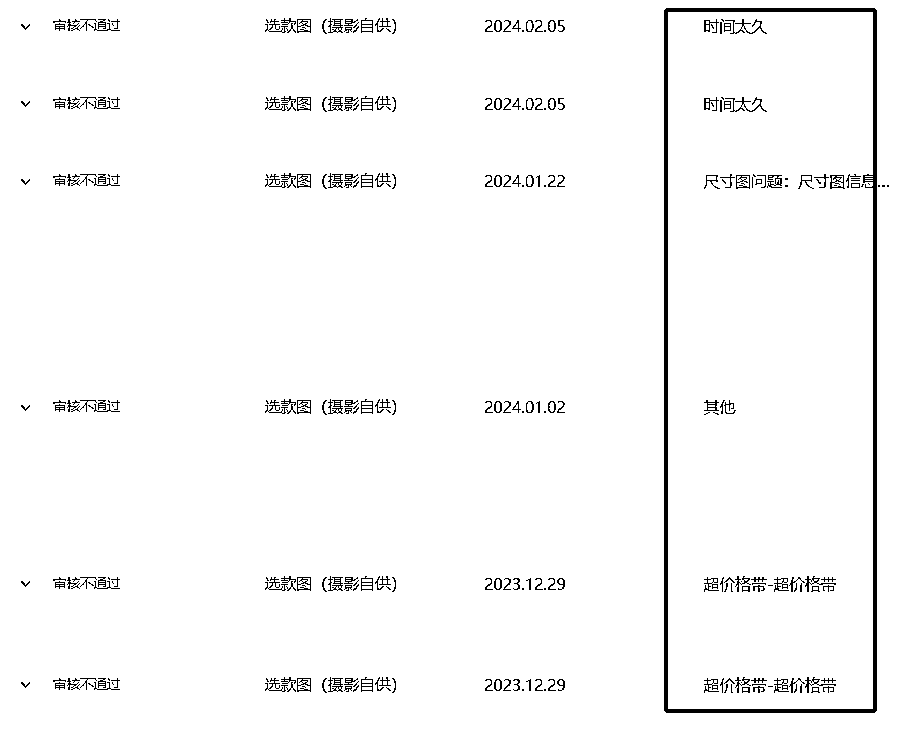

# Tiktok全托管的真相，“没用心”做两个月却达到月入过万

> 来源：[https://lpt8zt3scl.feishu.cn/docx/Tvsxdt6gSoobVvxP6FwcCLB0nwd](https://lpt8zt3scl.feishu.cn/docx/Tvsxdt6gSoobVvxP6FwcCLB0nwd)

哈喽 生财圈友们大家好，我是进击的大郑，自我介绍一下，95年创业路上不停歇，一直深耕在电商领域。毕业后来深圳做过亚马逊，速卖通，跨境电商平台有些知名度的都有开过店，做的不温不火，竞争日益激烈，后来折返国内做抖音电商，实现了第一桶金的成绩。第一次发自己的分享贴，如有纰漏请多多包涵。

Tiktok全托管已经出来好几个月了，在生财里面也有不少圈友提到过，到目前为止还没有一篇较为详细的介绍，作为测试项目之一，目前为止实操tiktok全托管已经2个月了，给大家讲讲tk全托管实操情况让大家有一个更具象点的感受。

凡是关注tiktok的圈友们也都有所了解，美区本土店刚刚经历了封店潮，面对巨量的消费市场tiktok美区面临极大的产品空缺，然而单靠美国正规本土店又远远无法满足支撑，所以此时的tiktok全托管率先补齐了这个空缺，它的优势也很明显，平台托管自带背书，平台前后端优惠补贴，有价格优势，平台整合物流，物流虽达不到亚马逊的运输速度，但也是和发展迅猛的temu不相上下的。

先和大家说一下2个月来的出单情况吧，入驻tk全托管时刚开始也不太确定后续的情况，大家几乎都是处在同一起跑线，所以也是抱着试试水的态度做的，并没有集中精力做，最开始陆续上架了21款产品，后面就再没有上新了，实际审核通过12款，成功上架9款，目前每日稳定出单有3款，日销50单左右，供货价10-30元区间，利润率大概在供货价的40-50%左右，稳定供货不断货的情况可以稳定利润过万的。我个人也比较意外，最终9款链接能有3款产品小爆，可能也得益于我之前的跨境电商的经验，并且这几年也一直在电商领域发展，但我觉得最主要的原因还是因为站在了tiktok电商的风口上。

平台入驻：

这个很简单，之前也有圈友发到了生财里面，大家按照平台的要求正常提交即可。平台目前允许公司营业执照和个体工商户入驻，个人暂时不可以。入驻后平台会邀请你加入飞书商家社群，有什么问题都可以和对应的平台买手沟通处理或者找平台在线客服。

招商入驻网址平台 full-service.tiktokshopglobalselling.com ，填写提交入驻信息

待信息审批通过后，商家即可正式登录全托管卖家中心: https://mmo.fanczs.com)

在全托管卖家中心 https://mmo.fanczs.com/ 提交商标信息(如有)，完成对公认证及税表信息提交商标过审后，即可在全托管卖家中心里开始推款（这里补充一点，目前商标不是强制规定，无品牌也可以正常推款）

基础设置：

进入店铺先把基础设置一遍，

包括收款方式：目前平台支持对公账户，对私账户，连连支付平台绑定，

地址管理：把退货地址和发货地址设置好，

管理资质信息：对公认证，税务信息，商家验证，这些都不难，顺利的话1-2个小时就搞定了。

店铺类目：

平时是分四大主营类目的，建议上架前选择好后期运营的类目，按照平台的要求是一个店铺只可以上一个类目的品，家居日用，3C数码，服饰配饰，美妆个护，四个类目背后有四个独立团队，所以你如果上架家居日用的产品，3C数码团队的官方人员是无法协助处理的，店铺入驻后平台会拉你进对应的官方类目运营团队，有问题可以找到对应的处理人员。当然实际在运营过程中发现，店铺也可以上架其他三个类目的品，只不过要额外对接其他的官方团队，平台也是有意引导商家做垂直店铺精细化运营。

选品：

如果你有跨境电商的经验，此处可以略过，跨境电商的选品有很多种，每一种都是有效的，目前推荐新手小白可以先参考temu上面的爆品和潜力品，因为都是托管平台，目标群体有很大的重合，有很大的参考价值，可以提醒大家的是，因为所有被审核通过的品平台方都是有备案的，可能你选中的品在你之前已经有几十个商家上架了，最早通过的品平台会优先推广，这个坑就被它抢占了，如果你是同款且没有供货价格优势的话，你的产品大概率不会通过，或者通过后也不会拿到很大的流量。所以选品之前建议先下载一个tiktok美区软件，去他的商城里面看看竞手的售卖情况，如果竞品不多，可以继续跟进，如果竞品已经很多了，或者竞品卖的早也卖的不好，那就放弃就好。市场上有出现很多针对tiktok的选品软件了，价格也基本是对标跨境选品老牌公司，虽然很新但并没有性价比，甚至更贵，可能是现在tiktok的火热导致的吧，现实情况目前的选品软件数据真实性做不到十分准确，新手商家酌情考量看自己需不需要，我倒不是很推荐，目前自己手动选品已经足够了，多花点时间在选品上，也可以增强自己的选品经验和品感，选品软件后面精细化运营时可以再补充进去。

下图是官方的选品建议：

上架：

据官方经理说，后台的主体框架是美国那边的同事设计的，和我们国内电商平台商品上架界面不太一样，刚开始用会很别扭，多上架几款适应一下就好了，上架步骤也很简单，只是对商品图片有较为严格的审核，哪怕是产品和实物稍微不一样，或者某个尺寸对不上，产品都会给你打回，所以在上架时一定要把产品图片设计好，不允许出现中文字体，必须上传产品的尺寸图等等，这些要求在上品过程中系统也会给你提示，按照要求做好即可，商家后台现在也更新了卖家学习中心，建议先仔细看一下，产品不通过也不用担心，打回后会告知你具体的原因，按照要求修改好重新上传。

平台有专门的买手部门，如果你的品较早上传且符合平台需求，运营会给你上架，否则即使买手审核通过，运营也不会上架到对应国家的。我有几款新品发货过去快2个月了也没有上架，应该是已经有很多同款在销售，卡在运营这一关了。

这里特别提示一下，平台对于一切带电或者需要连接电源使用的商品，都必须上传对应国家的电器认证资质和电器标签，一般美国是FCC，欧盟是CE，英国是UKCA，这些资质需要联系采购厂家提供，一般有实力的工厂都会提供，当然也可以找人做，国内淘宝做一个认证大概几百块钱，国内测试3-5天也可以出来。

上架后需要审核一般会经历这几个流程：买手，风控，品牌（如有），资质， 类目， 体积， 重量； 最终平台运营来决定是否上架到对应国家，有时会出现这种情况，你的产品上架到美国，但是英国，沙特没有上架，一般这是因为每个国家的政策不一样或者说你的产品只上传了美国的资质，但是英国的资质没有上传导致的。

发货：

新品上架成功后，平台会要求你每个商品的sku至少备货5个数量，这是平台用来测品的最低数量了，我觉得这一点平台挺友好的，考虑到平台也刚开始推广全托管且怕商家有太多顾虑，大家一般都会接受这个数量额度，在这里额外提醒一下，要严格按照平台的发货指南进行发货，不然好不容易发到平台国内仓（目前国内唯一仓库：广州花都区），人家不接收还要原路返回太折腾。基本每个包裹都会包含这几样：sku标签，送货单，物流标签。仔细查阅发货指南按要求操作，这一步就不会出大问题。另外包装上只允许英文和中性包装，不可以出现中文。

后续平台如果返单，说明你的这个品已经测款成功，但是也只能按照平台给到你的返单数量去进行备货，不能超额，如果有紧急情况，可以找对应的买手申请额度，这一点有平台的考虑，我是觉得目前平台在运营端推广也很慎重，单量总体来说比较平稳，不像国内的抖音电商单量会大起大落。

入驻全流程：

大家可以通过这张官方图对全托管模式流程有个大致了解。

运营端：

这个过程其实商家是几乎不用参与的，只需要接单就好了，如果商家想自己联络达人给自己店铺带货增加销量或者清理库存的话，平台是鼓励的而且也提供了给达人寄样的入口，想操作的商家可以联系官方客服协助处理。

最后分享几点我的实操感悟：

1.  最令我惊讶的是做tiktok全托管店铺，正反馈来的很快，有些品上架隔天就会出单，看得出平台对于优秀的产品是大力扶持的，所以如果大家想做这个项目，可以在选品上面多下一些功夫是很值得的。

1.  目前以贸易商的身份进驻全托管要优于工厂身份，这也是我在国内做抖音电商经验感觉，因为现在tiktok全托管属于最早期阶段，平台缺大量优质商品，对价格不是特别敏感，贸易商可以充分发挥他的选品优势，去市场上大量挖掘好的产品提供给平台即可，品类不受限，赚中间的差价，只要行动够快就可以获得丰厚的回报，不会像工厂一样受限于本身的品类和产能，当然也有很多工厂也是以贸易商的角色在做。

1.  平台对于商家端是有很多政策和资金扶持的，包括：你发往广州仓库的国内运费，平台和你共担50%，且物流商与平台的签约运费已经非常便宜；平台对商家备货的时间宽限非常大，商家有足够的时间完成备货，不像国内电商有24小时或者48小时的物流考核，涉及到退货的商品成本和运费，除非是商品本身的质量问题，其他以外的原因，平台来承担；以及全流程暂时无平台佣金、无流量费、无入驻费、无海外物流仓储成本。

1.  其实最开始对tiktok全托管最大的担忧是它的单量稳定性，如果出现像国内抖音一样突然爆单突然衰落，大起大落的模式是很难进行订单预估和库存备货的，非常考验后端供应链的稳定性和配合度，且很容易造成备货滞销的损失（我在亚马逊上吃过亏，心有余悸）。但目前的情况来看，无需过于担心，可能是平台运营有意的控制流量的曝光，目前持续出单的品单量总体比较稳定，没有大起大落的现象发生。（下图是我的两个品近一个月的出单情况，中间空缺是过年工厂休息导致的断货）

5、虽然不需要备货至海外，只发到国内仓就可以，但仍然属于重资产的模式，早期单量少没有压力，后面如果扩大单量，势必要进行大量的备货压货，滞销的风险也会增加（这也是我不太想倾注更多资源进去的原因，目前也在探索轻资产项目）。还有目前托管模式处于早期阶段，平台政策走向仍然需要持续关注，建议圈友们依照现有的产品资源和资金储备视情况决定加入。

tiktok全托管项目总体来说是一个可以赚钱的且正反馈来的很快，赚小钱也可，赚大钱也可，特别适合想做电商行业的圈友，哪怕当副业来做，月入过万也是可以达成的，因为不需要消耗你的运营时间，售后时间，出单后只需要利用空闲的时间采购发货就可以。

好啦 本次的分享就到这里，一点心得希望对看到此篇文章的圈友们能带给你参考或者灵感，如果文中有错误的地方欢迎指正，本身我也有在寻找新的轻资产项目，本人有5年跨境电商经验，2年国内社交电商经验（抖音，视频号，小红书），现在也在做公众号自媒体：进击的大郑，毛遂自荐一下哈欢迎大家关注，如果有合适的项目也很欢迎圈友的推荐，最后感谢大家，祝大家早日暴富，一起生财有术！我是进击的大郑，下次分享再见！

10月份更新：各位圈友，此项目我没有在做，后续的平台政策制度更新需要自己下场后了解，现在的TK全托管竞争程度比起今年2月份不可同日而语，想下场的圈友可以开店自己实操感受一下，此篇的作用主要是开山引路，不做任何推荐。