# 今日春分，品牌想借势出营销海报，如何用ChatGPT实现？

> 来源：[https://balfcirt91j.feishu.cn/docx/UCZmdouvyoCRZAxrMC6cZ8vLntg](https://balfcirt91j.feishu.cn/docx/UCZmdouvyoCRZAxrMC6cZ8vLntg)

今天在刷朋友圈的时候，发现许多品牌都在出各自的春分营销海报。

这才想起来，今天是传统节气，春分。我创业之前，在品牌营销领域钻研多年，也写过不少节日热点海报文案。包括之前在医院的时候，还曾经就节日海报文案出过一个完整的SOP。所以，今天我想借春分这个节气，来说说，品牌到底如何做借势节日的创意。

先来看看这个案例，这是一家牙科连锁的节日营销海报：

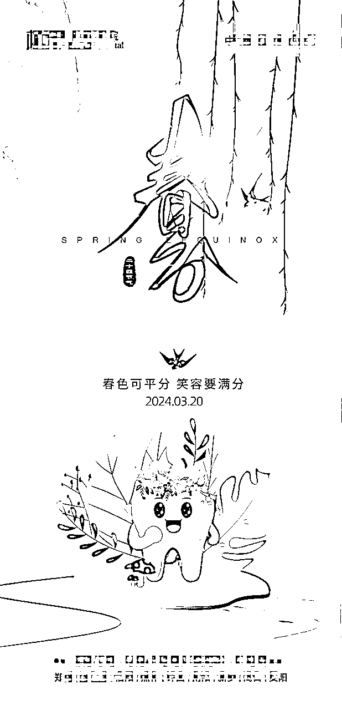

不说它的设计元素是怎样，但是我们来细细品一下这句文案：“春色可平分，笑容要满分”。大家觉得哪里不对劲吗？

# 01 借势营销时，大家常犯的错误

首先，春色可平分，是什么意思？是和春分相关吗？春分是个节气，为什么春分就象征着春色可平分呢？

其次，笑容要满分，这句话一点毛病没有。但是笑容和春分的链接点在哪里？笑容和牙科的关联度在哪里？最后，这篇海报是给谁看的？我找不到可以共情的点。

这时候，品牌方可能会解释道：春分的含义，你难道不知道吗？

来自百度百科：春分的“分”有两个含义，一是“季节平分”，传统以立春到立夏之间为春季，而春分日正处于两个节气之中，正好平分了春季；另一含义是“昼夜平分”，在春分这天，太阳直射赤道，昼夜等长，各为12小时。春分的气候特点是天气温暖、阳光明媚。

笑容怎么和牙齿没有关系了？一笑就会露出牙齿呀！我的这个节日海报文案既呼应了春分节气，又关联了我们牙科品牌，这难道不是一个精妙绝伦的构思吗？

我们医院的产品很多，有种牙、儿科牙齿治疗、牙齿矫正，老少通吃，好不容易蹭一次热点，我肯定要包含所有人群呀。

在这里，我想一一来阐释一下，品牌方在做营销海报时，会有哪些“偏见”。

## 偏见1：我知道的信息，顾客就一定知道

比如春分这个概念，尤其对于现在的年轻人来说，每天只关注工作、游戏、孩子，谁会没事去研究每个节气到底代表着什么含义？

所以，这时候就会出现信息鸿沟，从一开始的角度错了，后面再写什么文案都是错的。

## 偏见2：会拼命想在用户的心智中植入概念

比如笑容就和牙齿有关。但我告诉你，这是枉然。营销不是去创造新概念说服用户，而是借用用户心中已有的概念，去做结合、重组的动作后，再去说服。我举个例子，我之前买过一款产品，叫暖被机。这是个非常小众的产品。

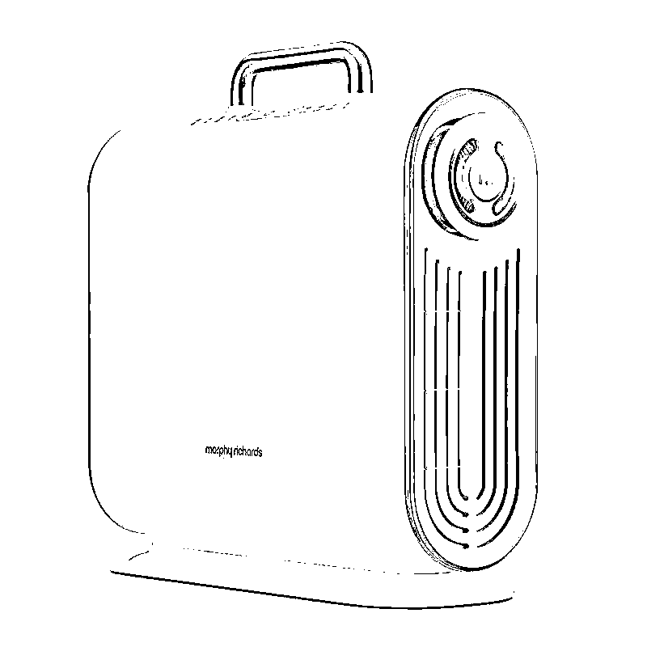

它的原理是通过一根管道，把暖风吹到被子里，让你冬天睡进被窝的时候，会觉得非常温暖。我那会在办公室和同事说这个产品名字的时候，他们还非常纳闷，这是什么东西？当我解释了之后，才略表认同。

因为，从他们的直觉来看，首先暖被，是男朋友/老公去做的事，其次，电热毯不也可以让床温暖吗？还很便宜，为什么要花300多买一个这么鸡肋的东西？这个过程说明一个什么问题？这个品牌它在创造一个新概念，而这个概念，如果需要向大众去解释的话，其实品牌在传播时，就已经受到阻力了。

如果不说是暖被机，而说成是“比男友靠谱的暖床助手”，是不是更加直观易懂？

回到口腔医院的这个案例，我们抛开所有杂念，一说到笑容，大家的第一联想是什么？一定是幸福、开心。

所以这就是用户心智，我们做营销时，要不断自我怀疑+批判+验证，而不是陷入自嗨。

比如我就经常会把我的广告文案给我妈妈看，如果我妈妈都能看懂，那就说明没问题。

## 偏见3：为了吸引更多人的注意，所以我的营销文案面对广义人群，如果泛指一类人群，关注度就下降了。

这是非常致命的错误。营销的本质是说服，然而，你并没有办法用同样的话去说服所有人。必须有针对性人群，否则，你针对所有人群，就相当于你的话都是废话。你浪费了时间和人力，还浪费了公司水电，制作出来了一张垃圾。

而有针对性后，你做文案也相对简单了。不用担心说，我的文案只针对这一类人群，是不是其他用户看到，觉得没有符合他们的产品，就流失了。我和你说恰恰相反，正是他们看到你有针对某类人群的解决方案，他们会好奇，诶，有没有针对我这种情况的解决方案，他反而会来询问。

好了，说了这些误区后，接下来，我们再回到“营销海报”文案的正题。到底，品牌该如何蹭节日热点呢？我们来看一个优秀案例。

# 02 品牌如何正确借势营销

节日：母亲节品牌：XX强效抽油烟机

海报创意：妈妈做了大半辈子的饭，每天在浓烟下，对她身体不好，劳累又伤身。母亲节感恩妈妈，给她置办一套强力的抽油烟机，让她的肺不再被油烟侵蚀。

文案：岁月侵蚀了她的脸庞，别再用油烟吞噬了她的健康。

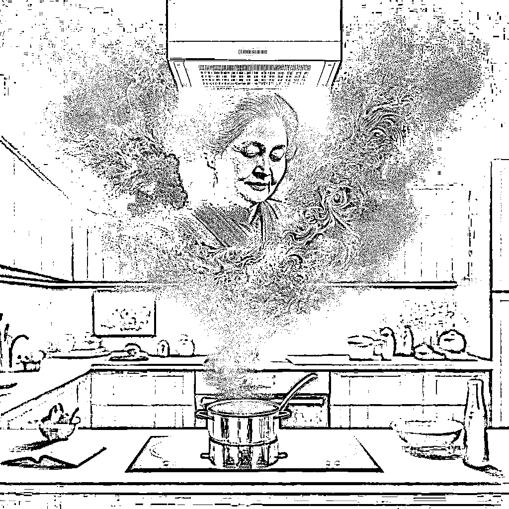

大家发现没有，这样的创意和文案一出来，是不是有所触动？

1.和节日、品牌都强关联起来，觉得很丝滑，不做作；

2.目标对象非常明确，是针对的青年人，想回馈自己的妈妈

3.会产生一种购买的冲动，因为之前忽视了这个问题，非常担心妈妈的健康它具体是怎么关联起来的呢？我来给大家梳理一下逻辑：

## 1.先分析这个节日象征着大众什么美好的心愿。

比如母亲节，大家都是希望自己的妈妈越来越好，越来越健康。

## 2.这个品牌的目标人群是什么人群，分析这个目标人群如何和美好的心愿相关联

比如这个强力的抽油烟机，目标人群基本上是年轻有娃一族的女性，她们做妈妈不久，深知妈妈这个身份的不容易，所以希望自己的妈妈能平安健康

## 3.这个品牌解决目标人群什么问题，解决了这个问题之后，如何帮助目标人群更好地实现心愿

因为孩子还小，所以她们的妈妈会离开老家，来到她们所在的城市，带孩子、做饭，做了大半辈子饭，一直都深受油烟困扰，而这个产品可以做到强力吸油烟，让妈妈不再受侵扰，由此身体也更健康了。

## 4.将节日、品牌能提供的价值、目标人群的心愿三者结合在一起。就能出好的创意和文案。

看到这里，你可能会说，是挺有道理的，可是我工作那么忙，我联想不到那么多，我没有那么多的灵感，该怎么办呢？这不是有ChatGPT吗？一起来看看我的实现步骤。（我用的是ChatGPT4.0）

# 03 用chatGPT做借势营销

我先把春分的含义，喂给了ChatGPT

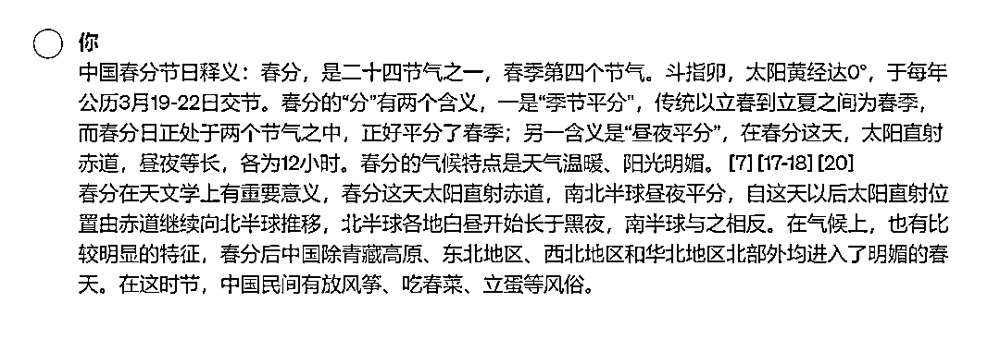

它做了回复、总结。这时候不要管。

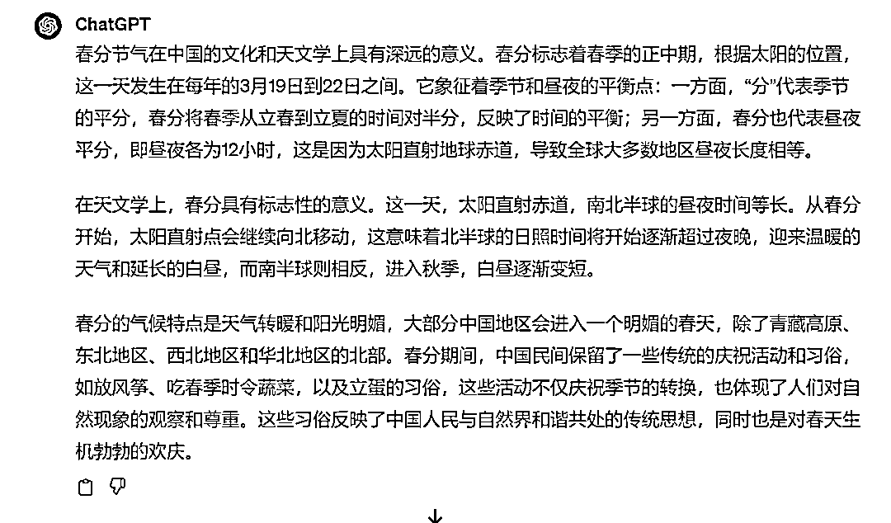

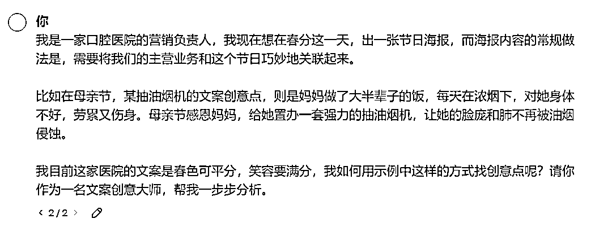

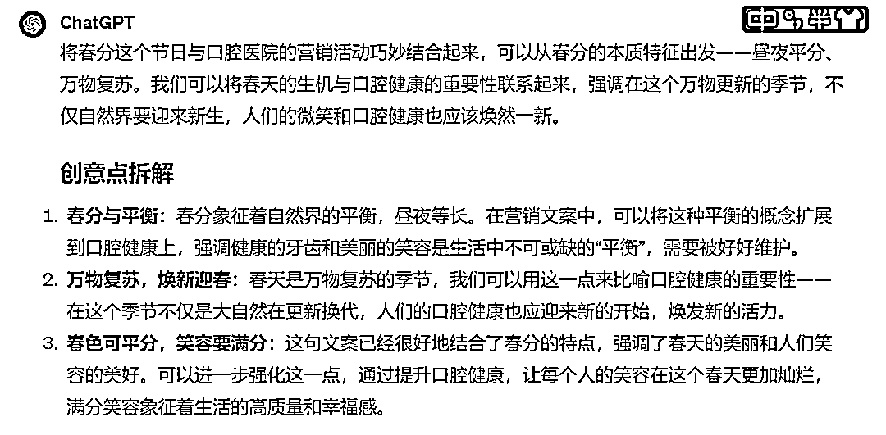

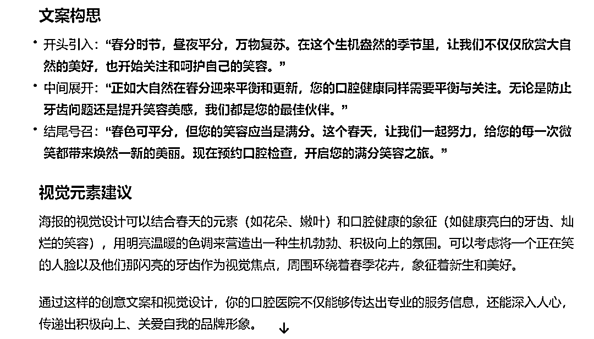

我觉得内容不好，于是提出修正意见：

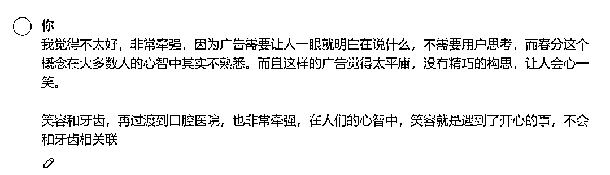

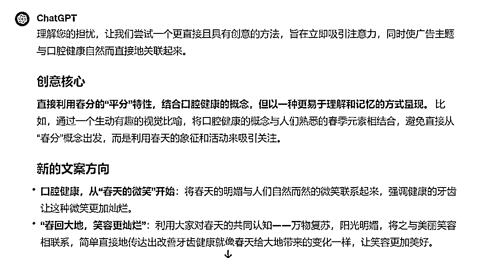

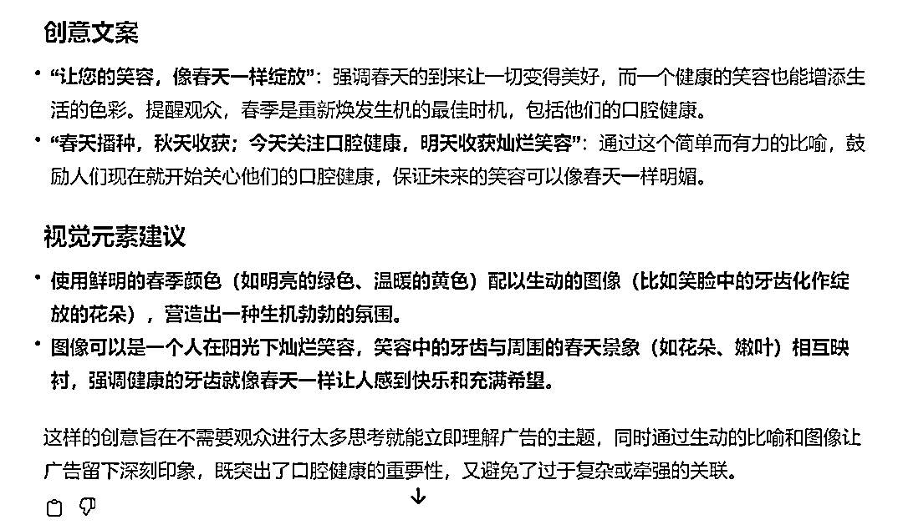

这样的内容是肯定不行的。于是我再把品牌与节日关联的步骤告诉它。让它重新输出。

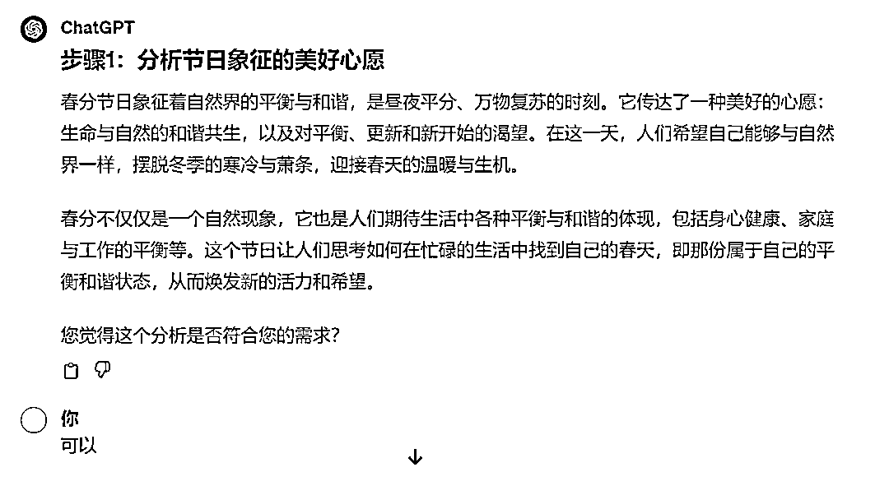

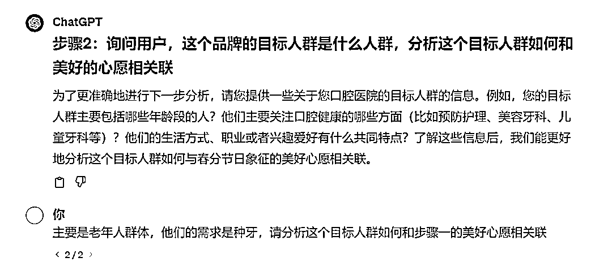

之所以选择老年人群体，是因为我看到这家医院正在做一个种牙节，这可能也说明种牙是他们的特色，而种牙的人群大多是老年人。

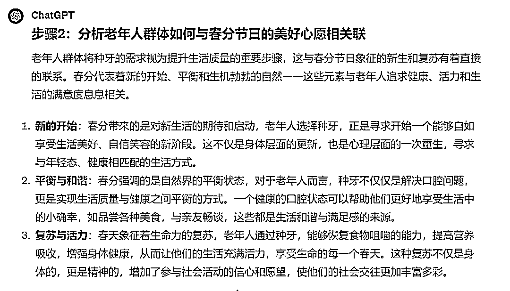

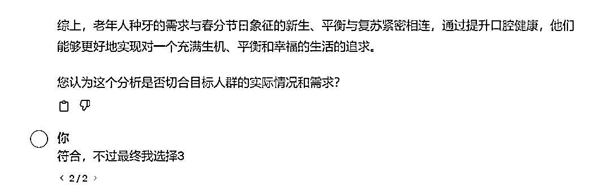

为什么我只选择了3，因为海报就是要聚焦，只说一个点就好。

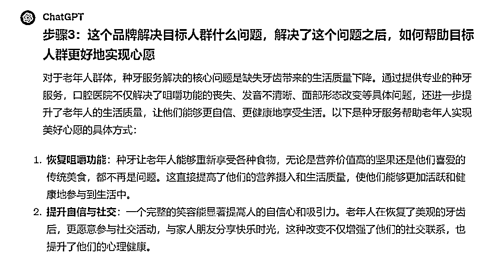

看到chatGPT给的这些诠释，我突然有了灵感，蹦出了一句文案：

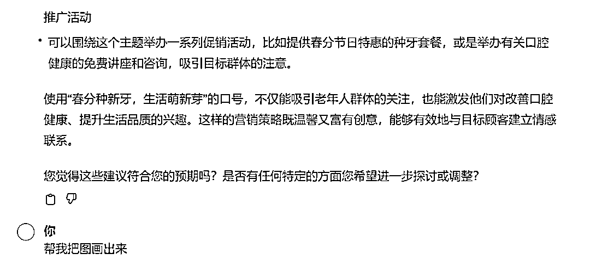

我觉得这个诠释挺到位了，接下来我要求它直接出效果图，给我参考。

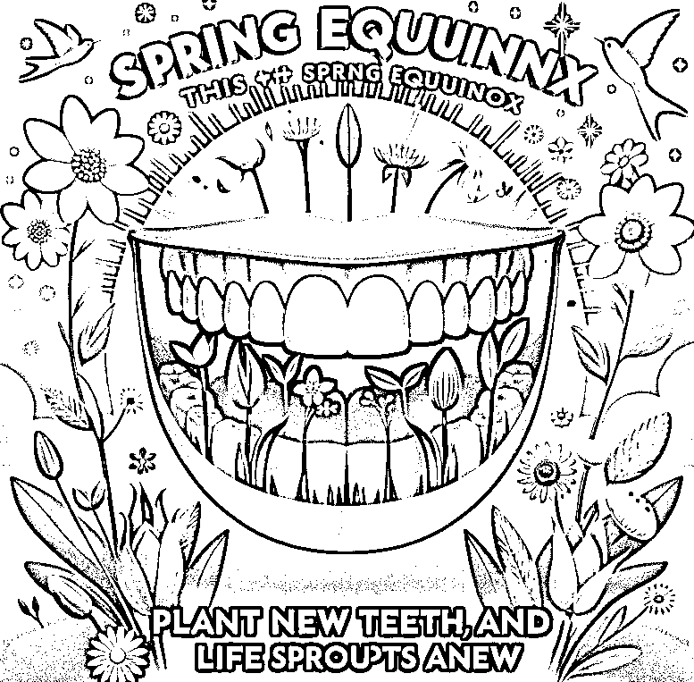

最后出来的这张图，我觉得还是比较吸引眼球的，和文案也非常搭配，接下来就可以交由设计去做进一步美化和创意改进了。

（以上案例已经当事人同意后再发出的）