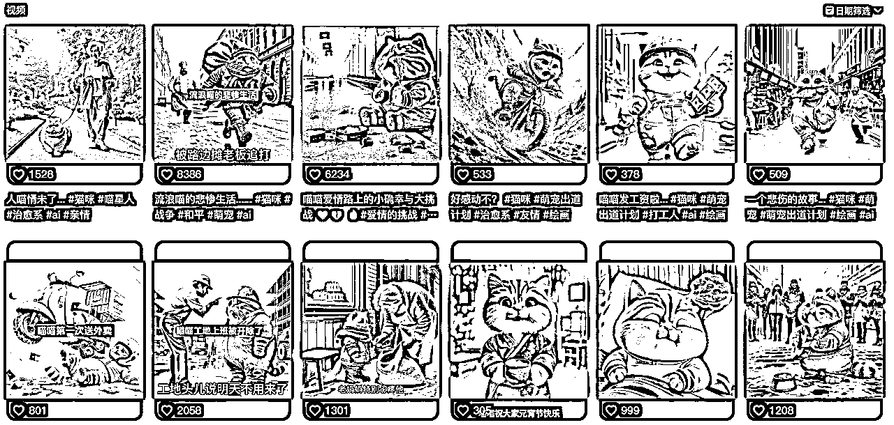

# AI猫咪剧情短视频爆红，如何制作？

> 来源：[https://dik4wr1hyrw.feishu.cn/docx/UKC5dajomoFRSHxkxVecKJsJnyX](https://dik4wr1hyrw.feishu.cn/docx/UKC5dajomoFRSHxkxVecKJsJnyX)

最近AI猫咪剧情短视频爆红，AI猫咪拟人化再配上BGM，抖音视频号小红书都火热的很。

说的再多不如自己上手操作，我们先来看看对标账号的数据如何？

我们先看下抖音的，基本每个视频都在大几百的点赞，甚至还有8000千多的点赞。

我们再来看看小红书的，点赞也是成百上千的，还接广告变现咯~

既然是剧情短视频，肯定是要有剧情，我们提供三个模版供参考。

剧情模版一：

帮我写一个猫咪怀孕的故事，剧情包含：猫爸爸摸着猫妈妈的肚子-猫爸爸开着车从猫妈妈去医院-猫妈妈在病床上-猫妈妈在手术室痛苦的表情-猫妈妈成功生出小猫-一家三口出院，生成分镜图，超级逼真的风格，猫咪表情和动作拟人化

剧情模版二：

帮我写一个可爱猫咪去超市偷鱼的小故事，剧情包含：貓咪在超市张望-偷鱼-冲出超市-被警车追捕-被铐上手铐-入狱留下眼泪-生成分镜图，超级逼真的风格，猫咪表情和动作拟人化，夸张，猫咪角色具有一致性

剧情模版三：

帮我写一个猫咪社畜上班的故事，剧情包含起床刷牙-出门吃煎饼果子-挤地铁-坐在工位-一個人吃饭-夜晚疲惫的下班，生成分镜图，超级逼真的风格，猫咪表情和动作拟人化

## ChatGPT生成剧情分镜图

有了剧情模版肯定就用ChatGPT生成吧！如果用4.0版可以直接生成每一幕剧情和图片，如果用3.5可以生成每一幕剧情，图片则需要利用其他AI绘画工具。

我直接用的ChatGPT，生成剧情+分镜图直接出。我用的剧情模板三，可以看到图片都显示在一起，这肯定是不行的。

我又让ChatGPT分开画，但是还是有问题，猫咪的一致性有差别，继续沟通，继续画。

为了防止再出错，我就投喂张参考图，并且让猫咪一致，这次画的就OK啦！

用ChatGPT4.0的效果应该是最好的，有问题可以及时提出，及时修改，会节省很多时间。

当然有些小伙伴没有开通ChatGPT4.0，也可以用ChatGPT3.5,先生成剧情，再根据每部分剧情来选择AI绘画工具作图。

每一幕剧情生成之后，我们用AI绘画工具画图，如果用的国外工具可以翻译成英文。

其实我把国内外的AI绘画工具都尝试下了，也尝试下图生图，效果还是不佳，当然有条件的可以用Midjourney试试。

## 获取对标短视频音频

我们找到对标短视频，然后下载短视频，导入到剪映下拉至轨道，右键点击分离音频即可获取音乐。

## 用剧情分镜图制作短视频

素材，音频我们都有了，现在可以制作短视频咯~我们把剧情分镜图导入抖音并拉入轨道。

我们看到图片比音频时间要长，我们缩短每个图片的播放时间，保持与音频时间一致。

现在修改视频比例为9:16，这是短视频的基本比例。

全部操作完成后，预览视频，没有问题就可以直接导出咯~

大家发现没有没有，其实这类AI猫咪的视频都是一样的，我们就可以把刚才做的视频作为模板，下次直接打开模板更换图片即可。

## 如何获利？

继续思考，我们做短视频肯定是为了获利的，那么这类的该如何获利呢？

第一，卖教程，带学徒

第二，带货，销售猫咪周边产品等

第三，视频分成等等。