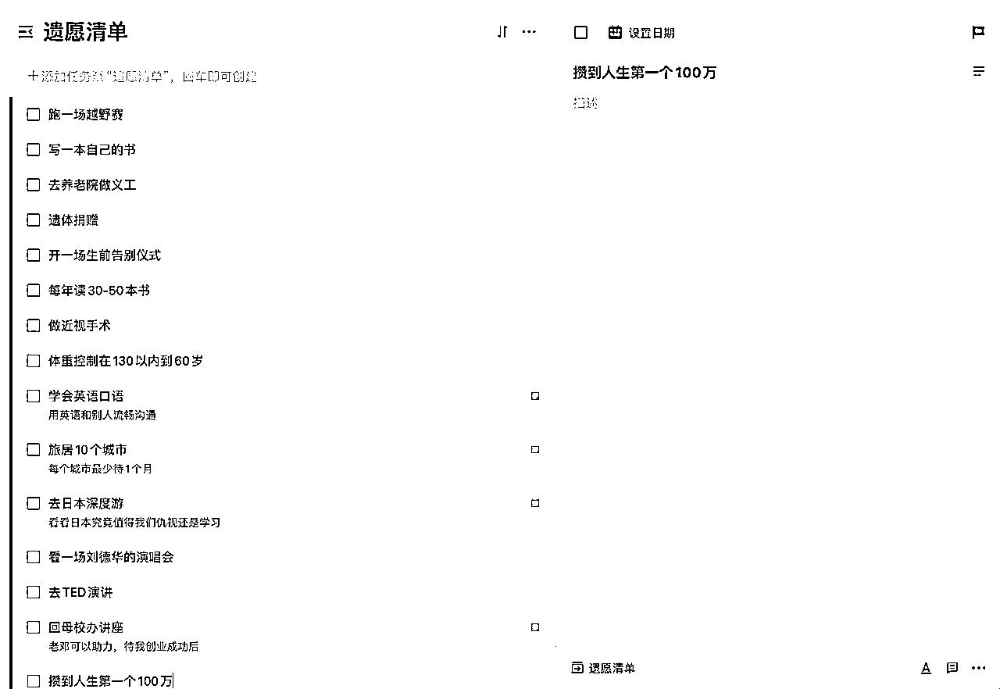

# 6.1 如何用AI辅助小白3个月完成人生首马？

> 来源：[https://fl2dhgx3i3.feishu.cn/docx/UQvcdjFOIo4zK8xQQiYcmK7sndy](https://fl2dhgx3i3.feishu.cn/docx/UQvcdjFOIo4zK8xQQiYcmK7sndy)

AI健康管家不仅是健身爱好者的私人教练，更是医疗辅助系统的革命性力量；它用数据驱动和个性化方案取代经验主义，将专业级的健康规划从精英阶层民主化到普通人手中，让每个人都能像职业运动员一样，拥有全方位的身体管理团队，从日常锻炼到疾病预防，实现自我健康的精准掌控。

# 一 为什么要跑马拉松

当一个人知道为什么而活的时候，他就可以忍受任何事情。

我在2017年得肿瘤后，经历过生死，术后恢复中，我在一本书里看到Flag狂人戈达德的故事。

在1939年，正值第二次世界大战，所有人都在战争的阴影里，一个叫约翰·戈达德的15岁小男孩，在家中的餐桌上，立下了人生中的127个Flag。

更狠的是，他还把这一长串人生清单，寄给了当时美国著名的《生活》杂志，向所有人公开了去世前希望完成的事情。

他当年的人生目标，每个看起来都很难实现。

去世界第一长河尼罗河探险，在埃塞俄比亚等地研究当地原始文化，攀登世界海拔最高峰珠穆朗玛峰，乘坐潜水艇潜入海底，学吹笛子和拉小提琴，驾驶飞机并在航空母舰上起降以及阅读《大不列颠百科全书》等等。

不可思议的是，在戈达德70岁时，已经完成了当年写下的109个目标。

他的一生过得非常充实—环球航行4次，拥有了各种奇特人生体验：养猎豹、制造望远镜、作曲、当大学老师.甚至包括参演《人猿泰山》。

从此以后，我把他列为我的人生偶像。

2019年30岁这年，立下了一生的使命：活出100种人生，每一个也都不简单：八块腹肌、买车买房、出书等等。

这几年，我从不羡慕身边的朋友们，年入千万的，我知道背后对人的身心的极大消耗。

几次大病后，我的人生观是，人活着不是用来攒钱，然后余生用钱来找医院续命，人生是拿来体验的，只活一次，我要一年就活出一种人生。

对人要有敬畏心，把自己变成礼物，再出现在对方面前；对事要有敬畏心，准备好了再出发。

这几年，虽然坎坎坷坷，但不断实现一个个人生目标：八块腹肌、买车买房、月入10万、跑马拉松等等。

马拉松是一项极限运动，难度不是半程马拉松的2倍，而是N倍。

截止到2023年，中国能跑马拉松的不过22.6万人，1万个人里1个人多一点，万里挑一，很多人跑马拉松是挑战自我，但我不是。

我是一个非常不自律的人，我要以比赛的外部机制，倒逼我去跑步和调整生活方式，降低肿瘤再再再次复发的概率。

去年2月份开始，深入接触AI后，我就想以自己作为普通人的身份，做一个生活小实验，看看AI Agent（也就是AI助手或AI员工）的能力边界。

想传播AI，先用AI改变自己，把自己活成成功案例，这是我一直以来为人处事的价值观。

我身边有做跑步教练的朋友，我问了下他们，他们为学员提供的服务主要包括：

1.  训练计划制定：根据学员的体能基础、跑步经验和目标，定制个人化的训练计划。

1.  技术指导：指导正确的跑步姿势、步态和呼吸技巧，以提高效率和减少受伤风险。

1.  动力和心理支持：帮助学员设定合理的目标，提供动力支持，应对训练过程中的心理挑战。

1.  营养建议：提供针对训练强度的饮食和营养建议，帮助学员优化体能恢复和提升表现。

1.  伤害预防和康复指导：教授预防运动伤害的方法，提供受伤后的康复建议。

1.  赛事准备和策略：针对目标赛事，提供赛前准备、比赛策略和心理调节的建议。

我决定不找人类的跑步教练，在GPT上开发了一个AI跑步教练的GPTs。

2月份开始跑步，陆陆续续跑了4场半程马拉松，感受自己在肿瘤手术这几年来的体能水平，身体没太大异样。

然后我在2023年11月底，在ChatGPT辅助下，大胆启动了马拉松赛前的3个月12周密集训练期，为人生首马做准备。

# 二 训练计划

## 1 训练计划

跑步教练给学员提供的非常高频的服务，就是根据学员的个性化情况和目标，设计训练计划、预测成绩。

这也是我用AI跑步教练非常多的一个服务，精确到每周每一天。

元指令的CHAT模型=角色+背景+目标+行动

指令其实非常简单，就是我开创的CHAT模型，你输入你的年龄+性别+跑量情况+目标+大概训练周期。

它会分为4个阶段，热身阶段+强化阶段+模拟阶段+赛前阶段，来帮你科学设计课表。

从11月29日开始，到3月15日，这3个多月的时间，我都是不折不扣的执行GPT给我的课表。

特别是2月跑量过200，太难了，因为我要打败惰性，打败春节美食，打败人情往来，打败严寒等等。

想做，自然会找方法，不想，到处都是理由。

我想这也是跑步带给我的坚韧，为了目标，遇佛杀佛所向披靡。

## 2 训练反馈

在我完成课表后，热情表扬我，在我遇到困难的时候，给我疯狂打鸡血。

比如春节期间的训练，我跟GPT哭诉：春节期间，大家都在大吃大喝，我还要跑步训练，为3月份的马拉松备赛，好痛苦啊，坚持不下去了，天气又超级冷。

它给我的回复，给我带来了满满的动力。

# 三 赛前准备

这是我的人生首马，赛前怎么做，需要准备什么，我是一个纯小白，虽然跑过几场半马，但半马就是溜溜腿，不用补给，我都可以。

依然找的是AI跑步教练。

## 1 .最后一周的训练

*   减量训练：这个阶段不是提高体能的时候了，而是让身体恢复和储存能量的时候。保持轻松跑步，减少总跑量到平时的50%-60%。

*   保持活动：进行几次短距离（3-5公里）、低强度的跑步，保持身体的活跃状态，同时避免任何高强度或长距离的训练。

*   拉伸和放松：进行适量的拉伸和放松运动，如瑜伽或轻松的散步，帮助肌肉恢复。

*   睡眠充足：确保获得充分的睡眠，促进身体恢复，同时增强免疫系统，避免比赛前生病。

## 2.比赛前准备

*   检查装备：提前准备好比赛当天需要的所有装备，包括跑鞋、跑衣、号码布、芯片、防磨膏、能量胶等。

*   熟悉赛道：如果可能，提前了解赛道的情况，如起终点位置、补给站位置、厕所位置等。如果赛道有虚拟版或地图，提前研究一下。

*   补给策略：确定好你的补给计划，包括比赛中何时补充水分、电解质和能量胶。如果比赛提供的补给品与你训练时用的不同，确保你的身体能够适应。

*   饮食调整：在比赛前一周，逐渐增加碳水化合物的摄入，以确保肌肉和肝脏的糖原储备充足。避免比赛前一天晚上吃太油腻或不熟悉的食物，减少胃肠不适的风险。

*   天气预报：关注比赛当天的天气预报，根据天气调整装备和衣物。如果预报有雨，准备好防水装备，如果天气炎热，选择透气性好的跑衣。

*   心态调整：保持积极乐观的心态，避免过分紧张。记住，你已经准备了很久，信任你的训练。

# 四 赛中策略

## 1.配速安排

为了在全马中达到3小时30分钟的目标，你需要保持每公里的配速大约在4分58秒左右。

建议比赛初期略微保守一点，以留有余力应对后半程。

*   起跑阶段：比赛开始的前5公里，尝试保持略高于目标配速的速度，比如每公里5分05秒，以避免起跑过快而消耗过多体力。

*   比赛中段：在5公里到30公里段，逐渐调整到目标配速（每公里4分58秒），并尽量保持这个速度。注意身体感受，保持均匀呼吸和放松的姿态。

*   比赛后段：最后12公里，根据身体状况，逐步加速。如果感觉良好，可以尝试提高配速到每公里4分50秒左右，为最终冲刺留出空间。

## 2 .补给策略

*   水和电解质：在比赛中，每5公里至少补充一次水和电解质饮料。避免等到口渴时才喝水，那时身体已经开始脱水了。

*   能量补给：携带易于消化的能量胶或小块能量棒。建议每45分钟至1小时补充一次，以保持能量水平。

*   实战练习：在训练中模拟比赛日的补给计划，确保比赛当天身体能够适应。

## 3.跑崩后的心态调整

*   接受并前进：如果遇到跑崩，首先要接受这是马拉松比赛中常见的情况。保持积极的心态，调整呼吸，缓慢跑步或快走，让身体逐渐恢复。

*   重新评估目标：根据当前的身体状况，重新设定一个实际的比赛目标。可能是调整配速，或是简单地完成比赛。

*   专注于过程：将注意力集中在当前的步伐、呼吸和周围环境上，而不是剩余的距离。一步接一步，专注于每一次跑步的感觉。

最后，记得马拉松是一场对身体和意志的挑战。在比赛中，保持正面的心态，相信自己的训练和准备。比赛中难免会遇到挑战，但每一次的经历都将使你成长。预祝你首次全马比赛取得优异的成绩！

# 五 赛后恢复

比赛结束后，我回头看AI对我的全马成绩预测，还是非常精准的，我的首马成绩是3小时40分。

很多人在完成首马后，都会有不同程度的伤疼，比如脚底起血泡，比如肌肉酸疼，比如抽筋等等。

我是肌肉酸疼和抽筋，在根据GPT对我的赛后恢复建议：休息+冰敷+腿部抬高+盲人按摩+扶他林，我在3天后就差不多恢复了正常跑步。

当然食补也很重要，我也参考了它的建议。

那么赛后多久可以恢复跑步呢？我依然用的是GPT。

# 六 首马后的感受

我TM有病才来跑这个马拉松吧，这是我在2024年3月17日的宁海马拉松，首马32公里处，心里的第一个声音，速度开始从4分配掉到6分左右。

肚子开始不舒服，想拉屎，下半身全部开始抽筋，可是周围只有围观的加油群众，没有移动厕所。

每跑一步，都很艰难，别说1公里了。

我心里有无数个声音告诉我，放弃吧，改慢走吧，别跑，看你这个熊样儿。

我不甘心，我是一个轻言放弃的人吗？我回去告诉女儿，说爸爸遇到困难就不行了吗，终点老婆等着，我就走给她看吗。

我不知道我是怎么一直坚持下去的，小腿抽筋，膝盖抽筋，大腿抽筋，屎随时要拉到裤子里。

我想到徐霞客，他作为富二代为什么要自虐，去徒步爬山，记录中国的山河大川。

我看到这些，路旁为我们加油的人，特别是孩子们，老爷子们，下雨天，他们为什么要为你我这样的陌生人摇旗呐喊。

在赛场上，我看到小柏爸爸，他说他从2015年开始，连续10年，推着他得了脑瘫的15岁儿子跑了68场马拉松，带他看世界。

我每跑一步都告诉自己，我一定可以。

过拱门后，我直接瘫在地上，被工作人员搀扶着出来的，来不及按表，来不及听身边人的欢呼，来不及看清帮助我的工作人员的脸，对赛后的美食补给，更没有任何任何的兴趣。

走向领取完赛奖牌，那一刻，那短短的几十米，我眼泪忍不住一直流，我不好意思让人看到一个中年男人的矫情，用手掩面。

那一刻我知道我跑马拉松和坚持的原因了，因为六伟，你不愿意过平淡无奇的一生，你骨子里热辣滚烫。

这一场马拉松跑的歇斯底里死去活来，也让我对人生有了新的感悟。

跑一场马拉松，仿佛过了一生，任凭有多少人同行，你始终只能依靠自己。

第一个十公里，在比赛气氛的带动下，如活泼的少年，朝气蓬勃奋力向前；

第二个十公里，体力仍有富余但体能输出已趋于稳定，就如同意气风发的青年，仍跃跃欲试；

第三个十公里，步频步幅已不再轻快，但仍努力坚持，恰似压力最大的中年，看到的全是自己当前的人生阶段，被生活盘剥却不屈不挠；

第四个十公里，就是大家熟知的35公里“撞墙”那段，太多跑友在这里慢下或停下了脚步，包括我自己首马的这天，“步履蹒跚”步入老年，虽然我还未经历过老年；

最后的2公里，是一步蹭一步的拐到终点的，是真的跑不动了，仿佛弥留之际的那段日子，走到了人生尽头。

# 七 AI 跑步教练的能力边界

到今天，用AI跑步教练，已经用了快4个月。

昨天和杨一老师聊天，她说，对AI已经没有什么感觉了，我说是的，AI已经变成我们这些人生活中的一部分了，不可或缺的一部分，变成像水、电、互联网、手机这样的基础设施，如水之于鱼。

我这一周，在准备这篇文章的时候，在想AI取代的只是跑步教练这一个职业吗，不是，它取代的是整个打工者的生态位，所有人都会被它取代，只是时间问题。

然后世界又分为两级，用AI的人，一个人或几个人的小团队，人效过千万过亿，Midjourey和Kimi就是活生生的例子，而不用AI的人，全部被驱赶到服务业中去。

3个月的整个备赛期里，你会跟我一起发现，人类跑步教练能做的，AI跑步教练全部能做。

再回顾下跑步教练们为学员提供的服务主要包括：

1.  训练计划制定：根据学员的体能基础、跑步经验和目标，定制个人化的训练计划。

1.  技术指导：指导正确的跑步姿势、步态和呼吸技巧，以提高效率和减少受伤风险。

1.  动力和心理支持：帮助学员设定合理的目标，提供动力支持，应对训练过程中的心理挑战。

1.  营养建议：提供针对训练强度的饮食和营养建议，帮助学员优化体能恢复和提升表现。

1.  伤害预防和康复指导：教授预防运动伤害的方法，提供受伤后的康复建议。

1.  赛事准备和策略：针对目标赛事，提供赛前准备、比赛策略和心理调节的建议。

唯一AI不能做的，就是面对面的温情，和同伴的相互鼓励，而这些在机器人推出后，进一步覆盖。

AI时代，才刚刚开始，我开玩笑说，一套指令就可以干掉一个职业，其实真不是夸张。

我们很幸运，生在这样一个美好的时代，通过AI做成之前一件件做不到的事儿，过更有意思或有意义的人生。