# 如何生成AI虚拟网红？我来教你一个完全免费方法

> 来源：[https://dik4wr1hyrw.feishu.cn/docx/URH7dkZbFo0Jxnxx0tGc6Wj7nkd](https://dik4wr1hyrw.feishu.cn/docx/URH7dkZbFo0Jxnxx0tGc6Wj7nkd)

AI虚拟网红我想大家都听说过，连宝马都找了虚拟网红Lil Miquela代言，可谓是红红火火呀！那么AI虚拟网红怎么制作呢？让我们一探究竟。

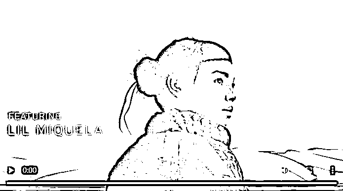

其实做AI虚拟网红有很多种方式，今天说的Fooocus AI绘图工具，是ControlNet的作者开源出来的，基于最先进的SDXL模型，使用起来也比Stable Diffusion更简单。

## Fooocus如何下载？

Fooocus下载地址：https://github.com/lllyasviel/Fooocus

我也给大家准备了百度网盘下载地址：https://pan.baidu.com/s/1yLt95sO9R_LtNsNZsqrkZQ?pwd=2z6c

提取码：2z6c

打开Github下载地址，下拉至Download区域，根据自己电脑的操作系统下载，我用的是Windows，所以点击Click here to download下载，整个安装包在1.8G左右。

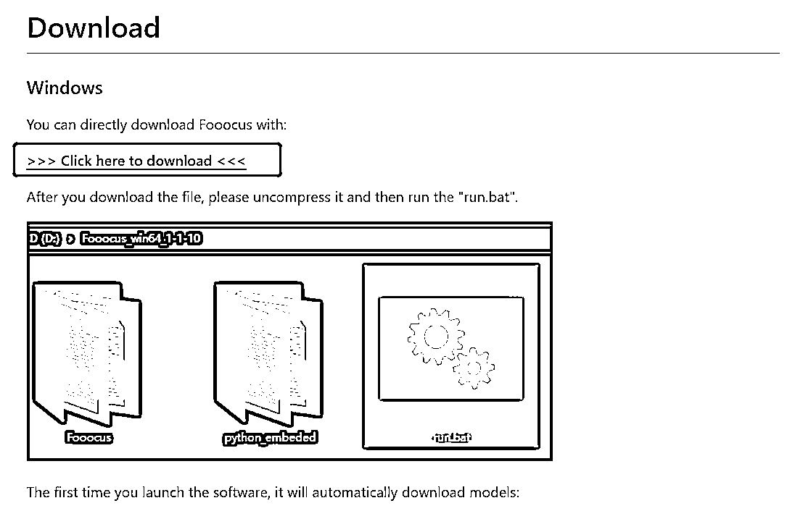

## Fooocus如何安装？

Fooocus安装包下载成功后进行解压，我们双击run.bat运行。

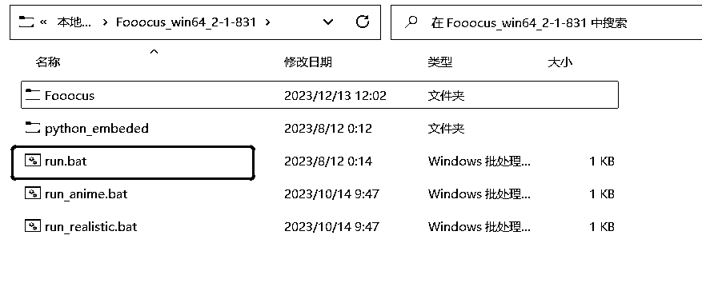

运行后会自动弹出运行框，此时会自动下载模型，因为访问的是huggingface下载，大概6G左右，所以最好科学上网进行下载。

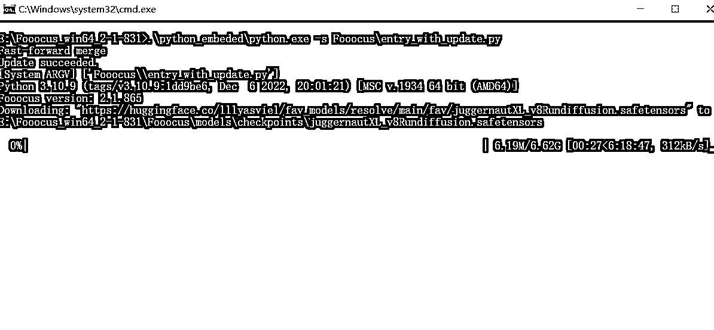

当模型全部下载完成后，会在默认浏览器自动弹出AI绘画界面，至此整个安装就已经全部完成。

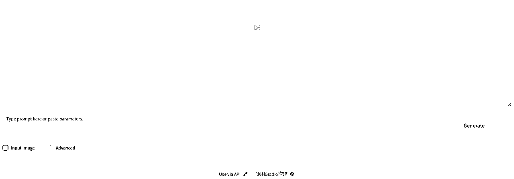

## Fooocus在Colab安装方法

很多小伙伴肯定在想，我电脑配置不行，没关系，我们可以免费部署在Colab上运行。

下拉到Colab专区，点击Open in Colab

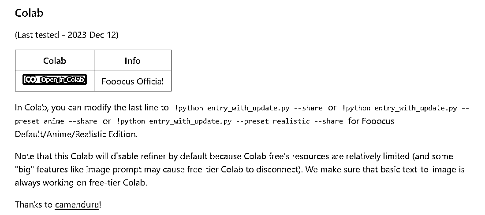

直接会有设定好的运行代码，点击小黑圈运行自动安装。

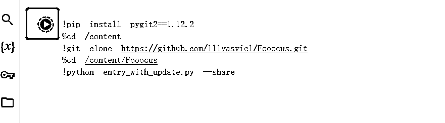

最后出现访问网址说明已经安装成功，点击网址进入绘画。

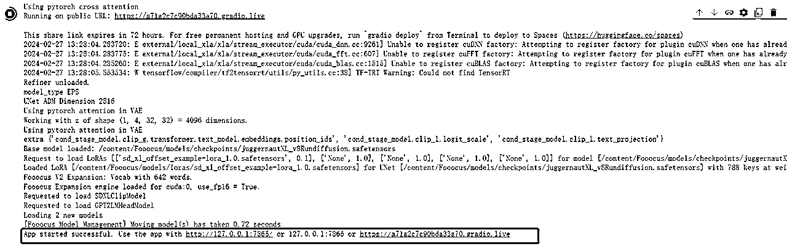

## Fooocus基本功能讲解

我们可以看到Fooocus的界面非常简单，现在我们就对所有功能进行逐一讲解。

这里是AI绘画的关键词填写区。

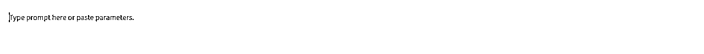

Input Image是对图片二次修改和对图片高清放大区。

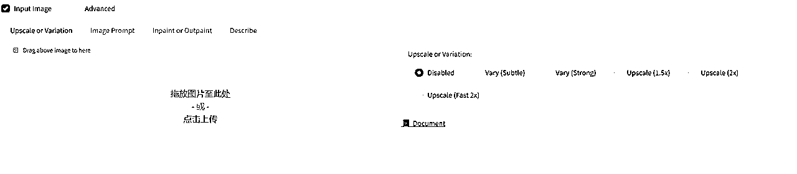

Advanced是对AI绘画基本功能的设置，我们来逐一讲解。

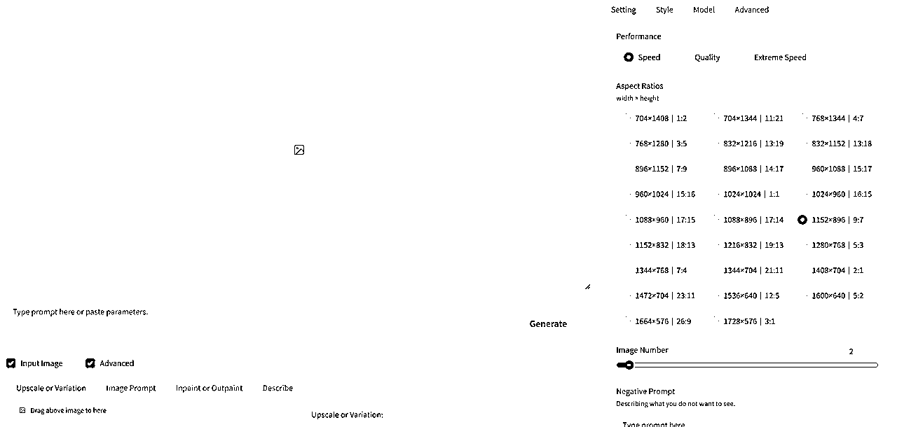

Setting界面Performance区依次是速度优先（Speed），质量优先（Quality），极速优先（Extreme Speed），Aspect Ratios区是选择图片的比例，Image Number区是选择每次绘画的数量，如果电脑配置低就一张张画，Negative Prompt区则是否定关键词。

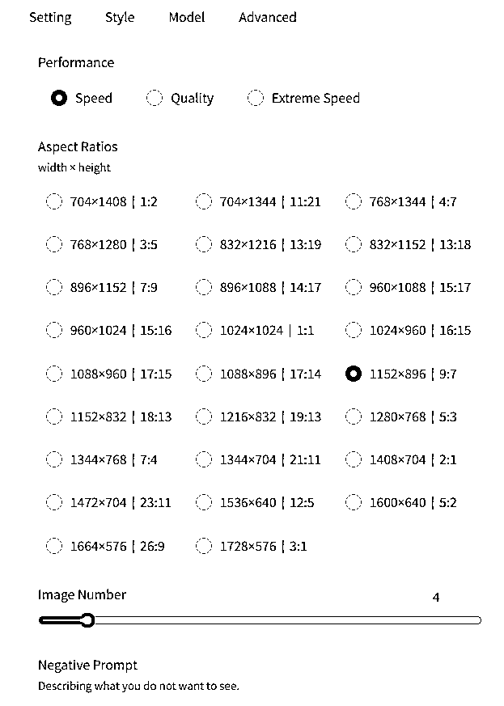

Style界面是选择绘画风格，大概有200多种风格，每种风格也有演示图，作者真的是非常的贴心。

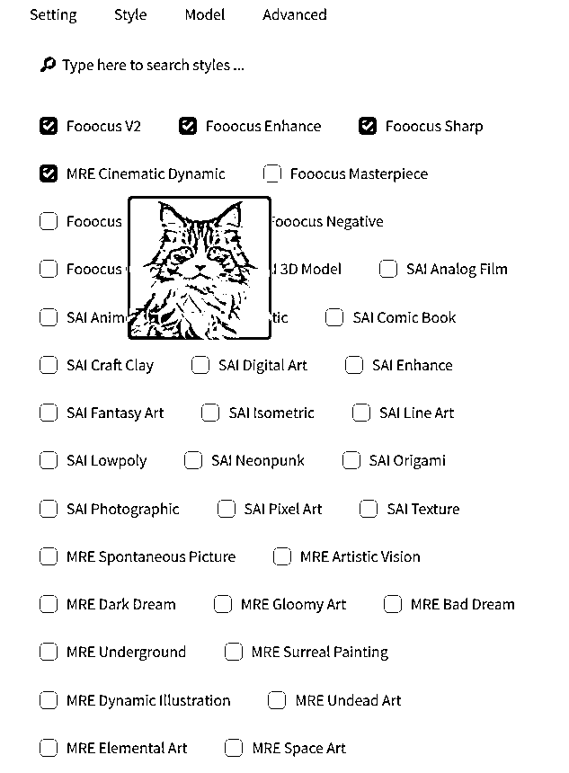

Model界面是选择模型以及Lora，我们可以这样比喻，大模型是一个房子，而Lora就是装修风格。一般新手用默认的大模型和权重即可。

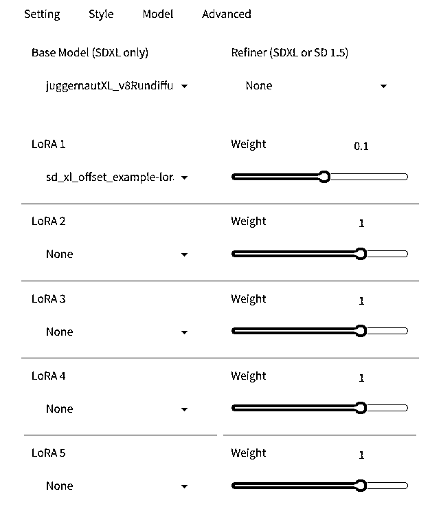

Advanced界面是更加先进的设置，第一个是图片质量和多样性之间做权衡，一般数值在5-7左右，第二个是图片的锐化程度，如果是生成建筑性的或者有纹理的图片，数值可以调大。

至此Fooocus的整体功能讲解完毕。

## 如何完成AI虚拟网红的生成？

我们现在开始AI虚拟网红的生成，填写关键词，否定关键词，风格选择Fooocus V2，Fooocus Enhance，Fooocus Sharp，MRE Cinematic Dynamic，Fooocus Masterpiece，其它默认即可。

否定关键词（这也是我从网上找的，有更好的也可以用自己的）

nsfw, paintings, cartoon, anime, sketches, worst quality, low quality, normal quality,

lowres, watermark, monochrome, grayscale, ugly, blurry, Tan skin, dark skin, black skin,

skin spots, skin blemishes, age spot, glans, disabled, distorted, bad anatomy, morbid,malformation, amputation, bad proportions, twinsmissing body, fused body, extra head, poorly drawn face, bad eyes, deformed eye,unclear eyes, cross-eyed, long neck, malformed limbs, extra limbs, extra arms,missing arms, bad tongue, strange fingers, mutated hands, missing hands,poorly drawn hands, extra hands, fused hands, connected hand, bad hands,

wrong fingers, missing fingers, extra fingers, 4 fingers, 3 fingers,deformed hands, extra legs, bad legs, many legs,more than two legs, bad feet, wrong feet, extra feets

其它的信息不做变动，用默认的即可，如果对Stable Diffusion熟悉的可以研究一波。

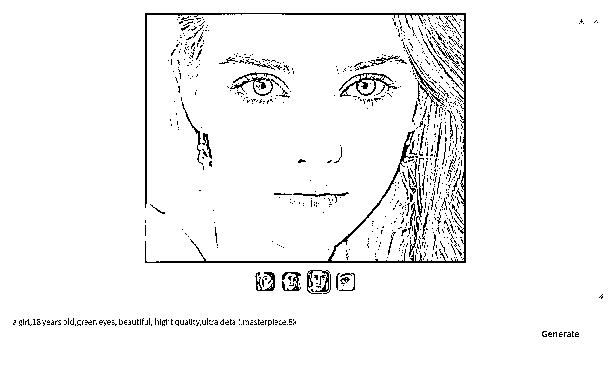

AI虚拟网红，不可能只有一张照片，我们可以用Fooocus来生成脸部不变，不同姿势的照片。

第一波图片生成成功，选择一个最满意的，拖动至下方的Image Prompt，点击Advanced，选择FaceSwap换脸功能，继续生成图片。

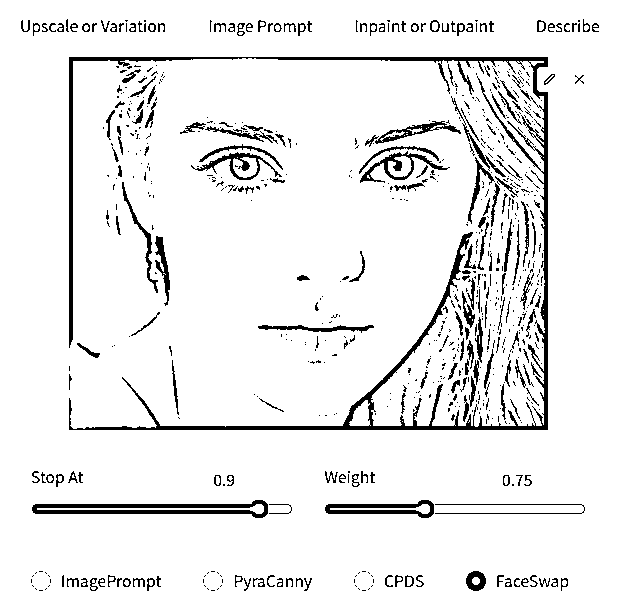

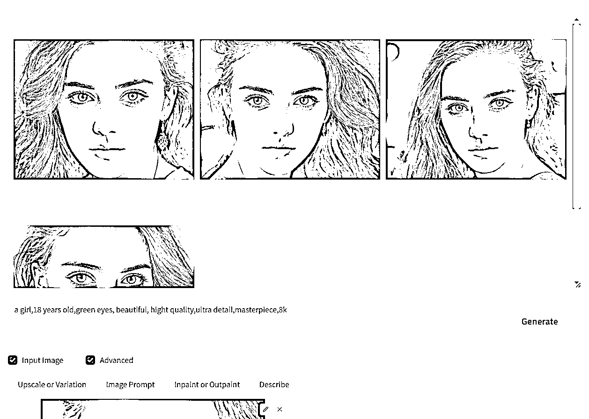

多张照片已经生成，但是这还不够，换姿势生成也是阔以的，我们网上随便找张姿势图片，上传到Image Prompt，点击Advanced，选择PyraCanny保留轮廓功能，然后在关键词内添加smile，再次生成图片。

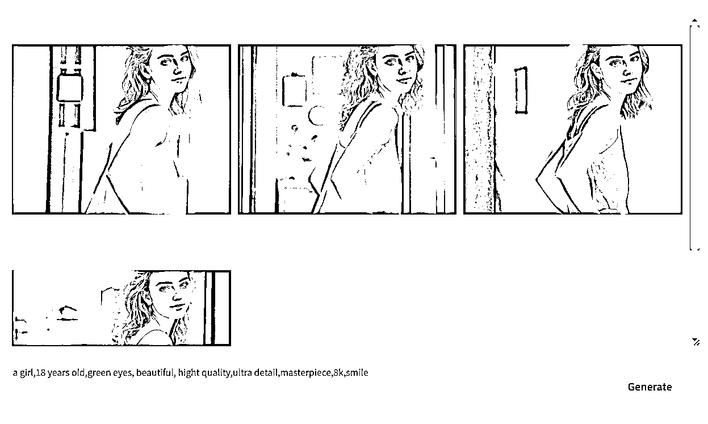

换姿势也并不是每张图片都可以用的，可以多次生成直到有合格的图片。

AI虚拟美女换姿势搞定，我们再来换换背景，在关键词内添加背景关键词。

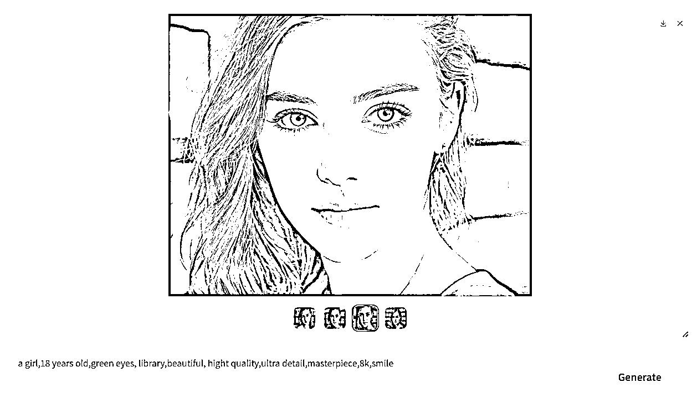

搞定，如果不是一步步生成，真的不敢想象是AI生成的。

好咯，整个AI虚拟网红生成就全部完成，生成的照片是存放在\Fooocus\outputs目录下。

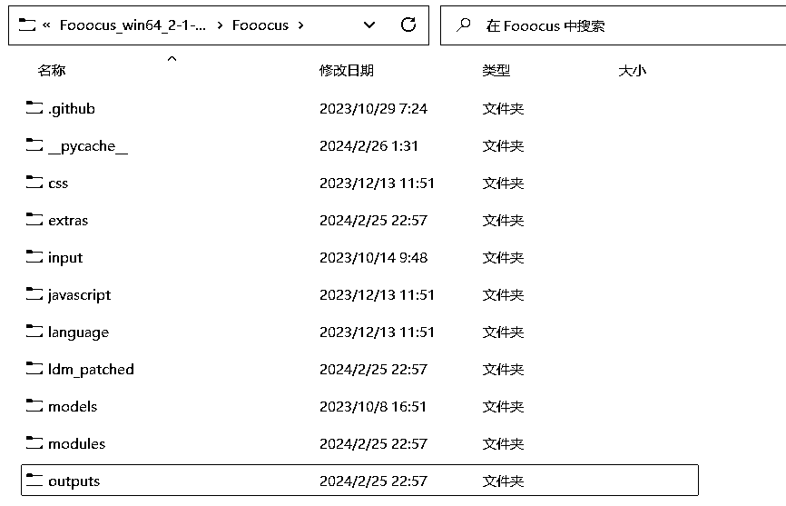

也有几个小问题需要注意，第一次生成都是需要下载模型，Lora等，可能时间会长点，当然也根据网速，电脑配置来看的，如果用的Colab可能会存在生成失败，不用担心，重新运行重新生成即可。