# 数字人进阶：用Sora的视频开口说话！

> 来源：[https://vow6kdbiak.feishu.cn/docx/V5RQdya7ZoawKhxkAlfctX5Gnch](https://vow6kdbiak.feishu.cn/docx/V5RQdya7ZoawKhxkAlfctX5Gnch)

用Sora的视频结合数字人做了一条新视频！

文档包括：

联动的想法诞生、素材选择、找到替代heygen的低价网站、文案设计、音色选择全操作流程！

如果大家有想法和点子，咱们评论区接着聊！

# 呈现效果

高清版：

# 联动想法：

联动创新就好像是“魔术的秘密”，当别人解密后觉得“呵，不过如此”“啊，这么简单”，但是要让Sora和数字人结合到一起，对我来说，是新的尝试和突破！

市场上数字人对口型的账号早就遍地、数字人带货也是白日化的趋势！但是数字人的使用场景非常大，比如跨境电商的结合人物出镜、鬼畜整活儿视频，都是很不错的融合方案。

要把Sora和数字人结合，让Sora根据你的文案生成视频好像就被阻断了；

一个是没想到、另一个可能没太多创意让这个视频出圈。当时和我老公想到这个点子的半夜，我俩兴奋地睡不着，早上一趴起来，早餐没顾上吃，先把半夜的想法实现了！

# 实现过程：

## Sora素材选择：

在他们公开的视频中找适合的素材：

https://www.youtube.com/watch?v=HK6y8DAPN_0&t=435s（OpenAI官方油管链接）

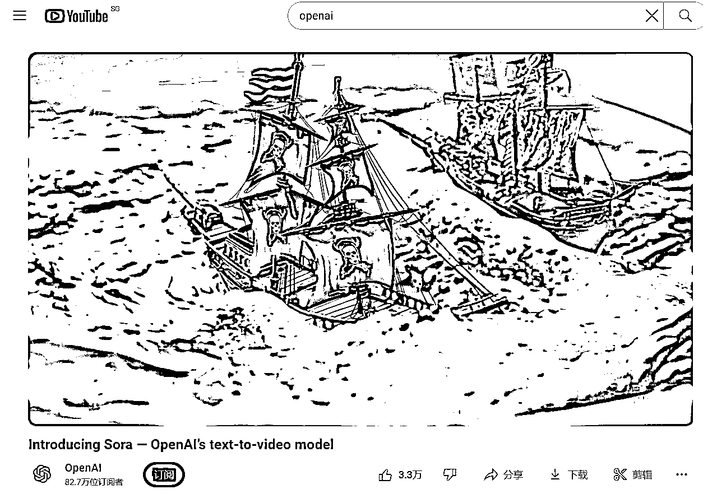

在简介能看到每个视频的时间轴，可直接寻找素材：

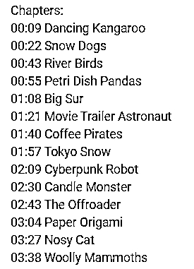

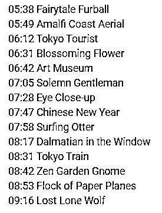

Sora出人脸的素材并不多

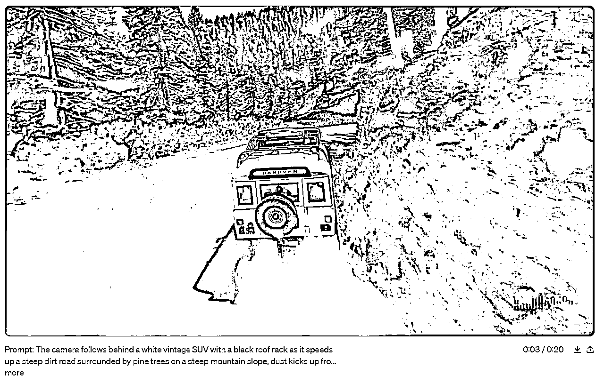

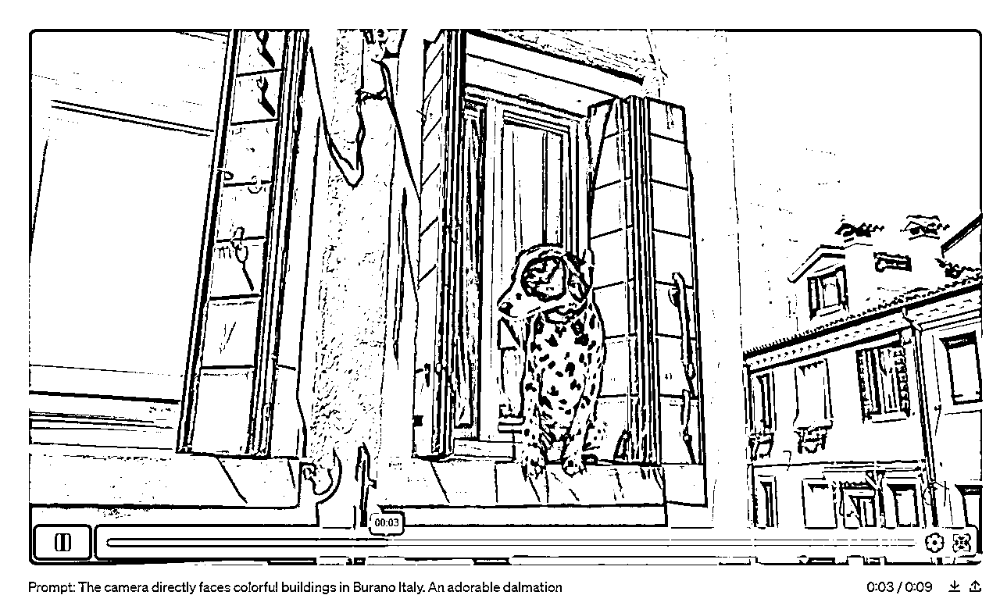

### 东京夜色：

东京这个素材很好，但是人物脸部占比太少，做了一个效果图，嘴巴痕迹太明显放弃

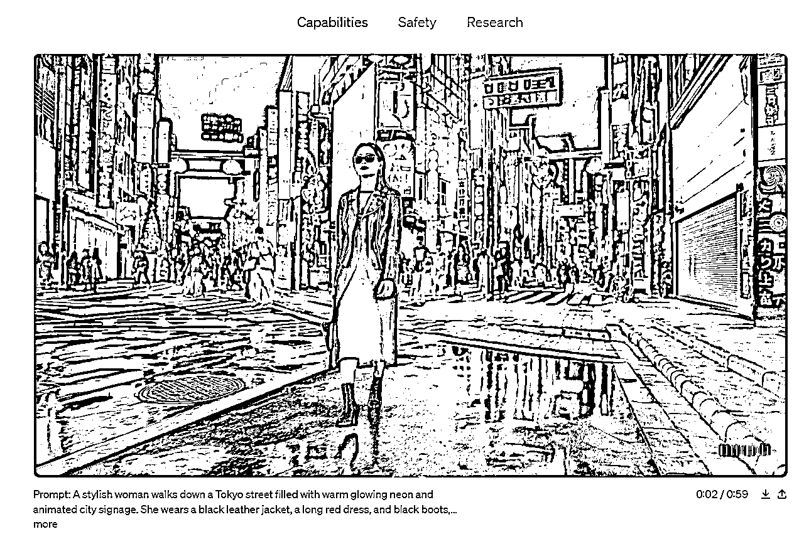

### 云端读书：

这个素材同样出圈，但是人物是侧面展示，不选

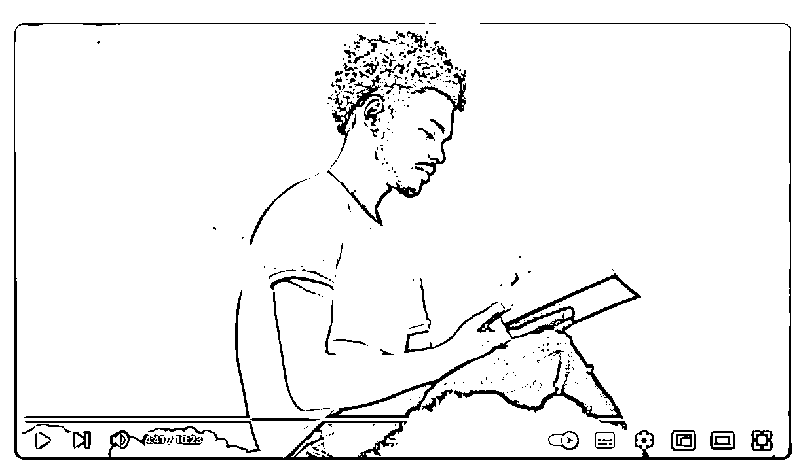

### 老者绅士：

人物没有正面，动作、眼神过于单一

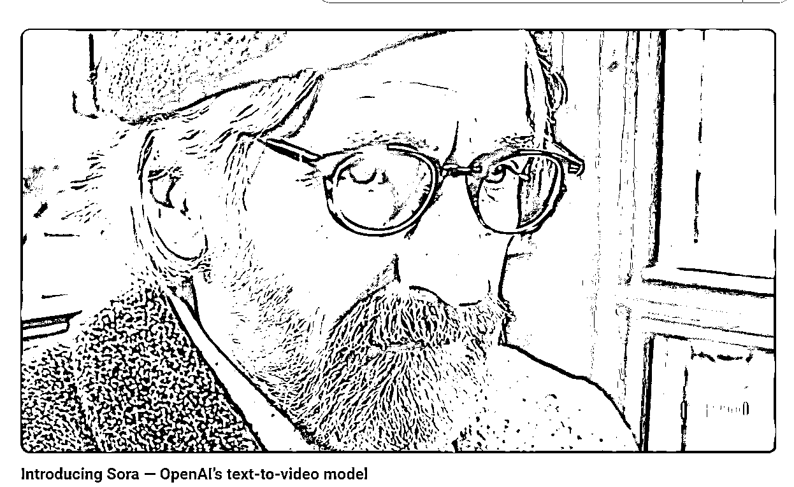

## 柳暗花明的开始！

在油管没看到官方发的适合素材有点小失望，但是奥特曼当时集合了一些网友的提示词出了些视频并没有在官方账号里！所以找到下面这个网址，是Sora的提示词和视频，以单列表方式实现

https://soravideos.media/

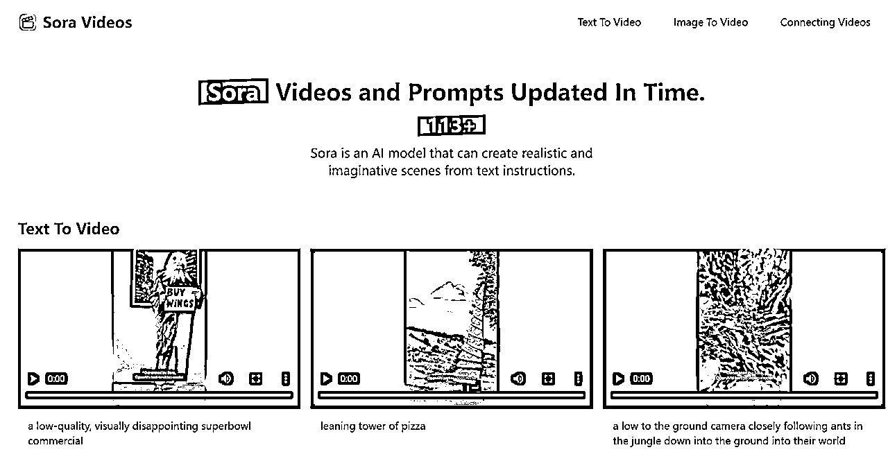

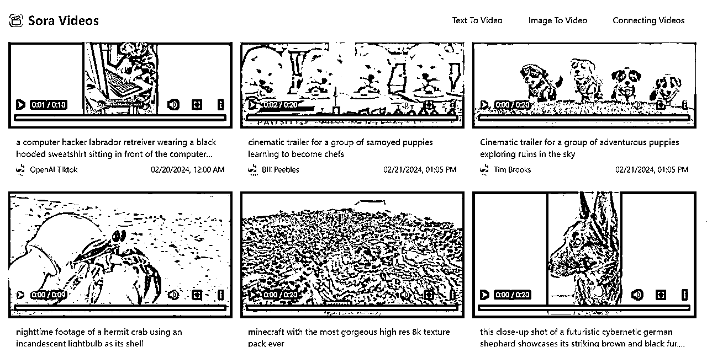

### 找到素材

在网站看到很多素材都不符合，想着是否人物+动作+表情生成有难度，所以Sora没做？正当划网页的时候看到下面的这个视频！瞬间清醒！这不就是我心心念念想要的素材吗？

人物+正脸+表情+不夸张的动作！这个就是我的素材了！

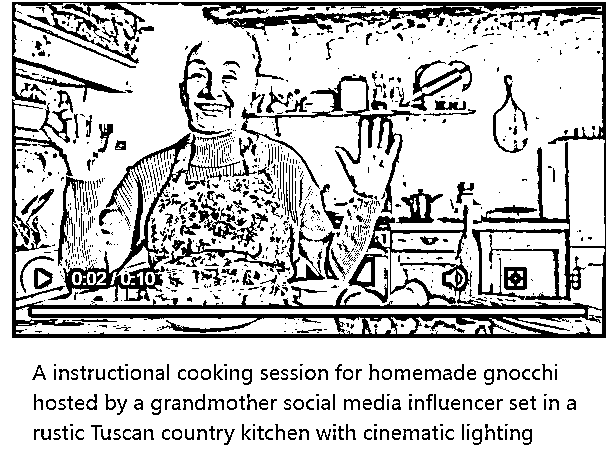

# 制作Sora的数字人：

## 前言须知：

之前市场上熟知的heygen不能用了（需要人像识别）、硅基（价格高）、小冰（价格高）

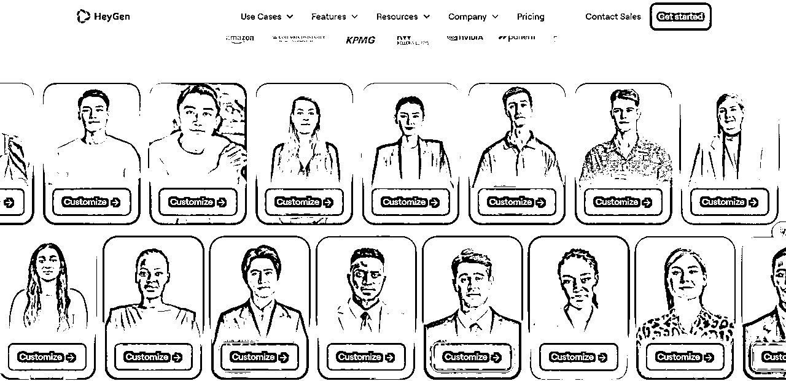

所以我们需要的是一个价格合适、不需要人物验证的新网站！用价格高的网站实现未知的结果还是太奢侈

作为前程序员的我老公，就开始搜寻网站之旅，此处省略网站在制作接入等一千字，网站开始内测！

还没完全开放，需要手机号码报备，截图整个版面（露出了HiFly），暂时不放网址了（担心网站承载不了，而且还在内测中）公开的时候会再更新！

主要是方法和想法重要！

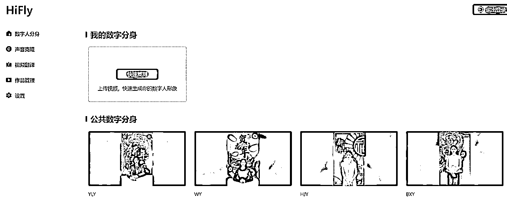

## 原视频要求：

我们找到素材完全符合！直接开干！

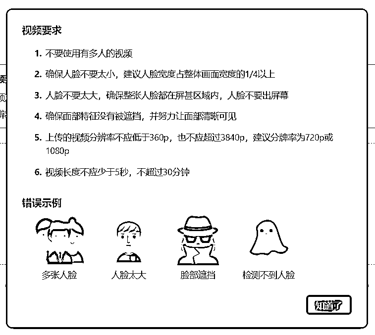

## 音色选择：

素材的文案相当重要，说什么？用什么音色？时长多少？都需要考虑！

用我自己的？不行，只有粉丝知道这是我声音！

找女性的声音？不行，没有反差，没有幽默感，很多人都不知道这个是Sora素材，也不知道数字人！

用男性的？可行，有反差，至少路人走过也会看两眼！用哪个男性？什么声音比较有代表性？

想到十年如新的《甄嬛传》，四郎的声音有特色、普遍认可度高、不是正中下怀？嘿嘿！心中窃喜！

## 文案选择：

声音确定用“四郎”的，但是要说点什么？如何撑满10s中的素材？

太短，视频作用不突出；太长，如果没有内容支撑，直接跳出！

第一句确定“嬛嬛”，先把声音和人物属性亮出来；在结合素材是人物拿着勺子由无到有，是类似魔术的过程，敲定人物能否给嬛嬛变个魔术的想法？所以文案确定为：”嬛嬛，我给你变个魔术吧，我手里没有勺子，勺子出现了“

到这里时间是7s，剩下的3s如何支撑，如果只到这里，又有点意犹未尽的感觉！

所以索性再加入一条爆款视频的经典语录“我能不能睡你们中间”，于是，文案完成！整整10s，完成视频！

最终高清版本的成片效果：