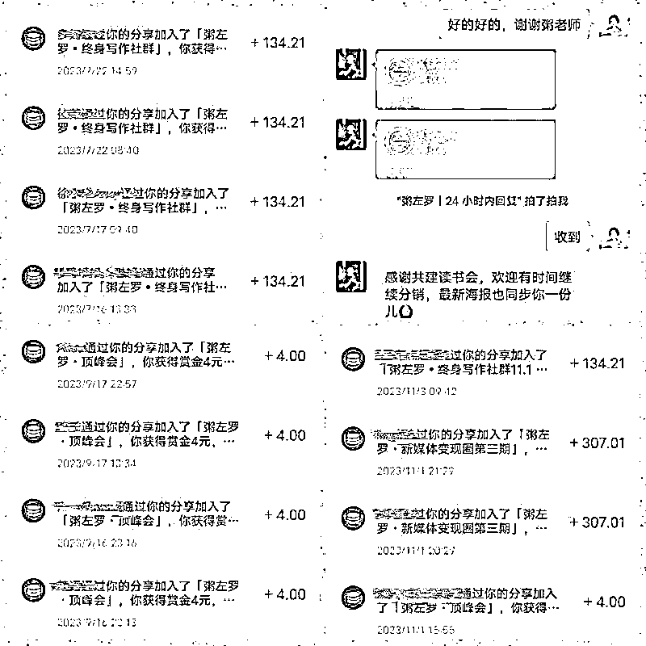
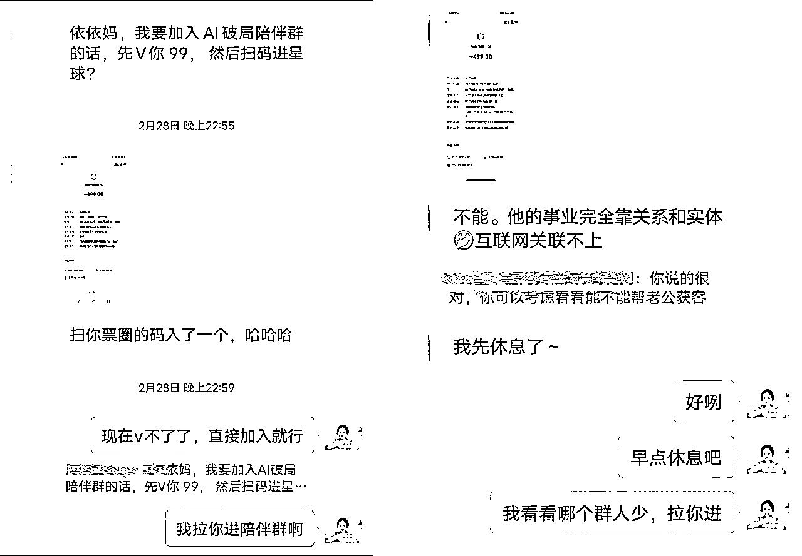
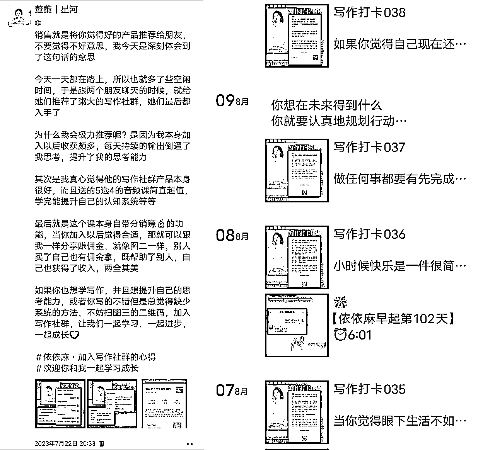

# 自媒体小白每分销必出单，我是如何做到的？

> 来源：[https://t49loc6gg0.feishu.cn/docx/VNNadvD3yoHqkYxEh99c0XkZn7f](https://t49loc6gg0.feishu.cn/docx/VNNadvD3yoHqkYxEh99c0XkZn7f)

生财有术的家人们好呀，见贴欢喜，我是生财圈友董董依依妈，前两天刚从粥老师那边领了读书会的两单分佣奖金，说实话我也没想到自己能卖出去。

我回想了下自己好像从去年7月份认识粥老师进入知识付费圈子，基本分销产品都有出单。

23年7月份我加入了粥老师的年度写作社群，那是我第一次下载知识星球，摸索怎么使用星球，没想到竟开启了日更写作之路。通过每天在朋友圈发自己的日更写作练习，分销了粥老师的写作社群13份左右。

23年8月底，我了解到粥老师的顶峰会可以盲订，第一时间找粥老师盲订了，9月10号正式发售的时候，我邀请了4个小伙伴加入，后面11月份的时候又邀请了一位小伙伴加入，总计分销粥老师顶峰会5份。

今年破局拉新，是我第一次参与大型的拉新活动，作为谱白灰战队的核心成员之一，我也拉了4个人。

以上是我分销产品的一些成绩，虽然跟大佬们比起来不值一提。但是对于我这个刚进入自媒体的小白来说，还是很满意的。

所以我就复盘了下，为什么能每分销必出单呢？主要是我突破了以下两点：营销的心态和营销的渠道。

# 一、突破营销的心态卡点

## 要熟悉产品

无论卖什么产品，一定要是自己先认可这个产品，觉得这个产品好，这样卖的时候才能底气足，不会担心后续的交付问题。

就像有人问我生财这个社群怎么样的时候，我都会告诉对方，生财是一个谈钱不伤感情的社群，在这里能学到很多搞钱的项目和搞钱的认知，因为我认同和熟悉这款产品。所以能很自信的向别人介绍。

靠谱老师说没有体验过产品的人直接去推荐产品，这样是不真诚的，只有自己先加入或者使用这款产品，才能有真实的用户证言。

## 我们要敢于去卖

当我们觉得一款产品好的时候，就会从心里在跟别人介绍的时候，少了那种别扭的感觉。也会觉得给对方推荐是帮助别人，而不是为了赚分销的💰。

其次我是从这些产品里受益了，我通过粥老师的写作社群，将自己的写作从短板变成了一个拿得出手的技能。我通过生财打开了搞钱的思维，见识到了很多搞钱项目，知道自己适合哪种赚钱方式。

人的成长有3种途径，一种是从书本上学习，一种是向身边的人学习，最后一种尤其重要：从自己身上学习。

所以我觉得产品好是重要的，另一方面一定是你从中受益，有所成长，或者赚到钱了，才能更有底气卖，也更有说服力。

销售的核心：你要选好标的，你自己就是最好的亲身亲历者。就是我们以后再去卖课或者推荐别人产品时，这个产品一定要是好的有口碑的。最好是你自己受益的，那样你卖的时候也会更有信心。

其次销售的本质并不是营销，而是交换，给客户提供价值，当他们有需求，而我们也有产品能解决他们的需求，那成单就是一件水到渠成的事情。

当我们的销售心态转变时，敢于去推销，就可以从以下几个渠道铺产品啦。

# 二、善用触达用户的渠道

## 敢于发圈

朋友圈是我们最容易和潜在客户以及目标人群触达的窗口和媒介。在这里你可以畅所欲言地表达自己的价值观。生活和美好。

很多人发朋友圈都有卡点，不敢卖。怕发圈被亲戚朋友，被同事看到，然后就不敢发了。另一方面也是觉得自己发了也不会有人买，所以直接就不发了。

其实这个想法是错误的。我们要敢于展示自己，只有让大家看到你通过这个产品受益，有变化了，才能吸引到别人加入你。

朋友圈营销本质是将自己的价值观、认知、生活和态度反复触达给用户，打造好朋友圈就是打造了自动收钱的体系，通过朋友圈传达自己的产品，表达自己的边界感更有利于转化。

所以一定要每天发，要一直蹦哒，做自媒体是剩者为王，人们不在乎你1-2的营业，更在乎你是365天都在营业，所以要坚持持续不断的发朋友圈。而且要有布局，这样别人加你好友之后会通过朋友圈知道你是做什么行业的。

就像我去年加入写作社群的时候，我就是去日更，每天在星球更新了之后，晚上就发到朋友圈打卡，有好些小伙伴就问我每天是从哪里打卡的，加入的是什么写作社群？是什么交付方式？通过朋友圈的吸引，卖出了9份。

我记得有天打卡的内容是说：那个时候正好还差1个就能免费得一个变现圈的名额。于是个小伙伴看到我发的朋友圈以后直接私聊我，从我这里买了写作社群，我也成功分销了10份。

因为我太想参与粥老师的变现圈了，但当时已经过半了，加入不合适，所以我就想着多卖写作社群，这样就能免费参加2024年的变现圈了。可是没想到8月底顶峰会出来了，直接让我可以免费参加10年的变现圈。

当我们敢于迈出去向朋友圈的人展示自己，向宇宙下订单相信自己能出单，就真的会有人因为喜欢你，信任你而下单。

## 敢于私聊

我们很多时候不敢私聊，怕被拒绝；更不知道如何去跟对方开始，不敢跟对方谈钱，总觉得收钱有不配得感。

我之前也不敢私聊怕打扰到对方，可是当粥老师顶峰会出来的时候，我觉得这个价格不跟朋友私聊推荐太可惜了。

毕竟不到1万就能跟粥老师绑定10年，还有啥比这性价比还要高？跟一个年入千万的老师学习，我都不敢想未来的自己得有多厉害。

所以当9月10号粥老师开始发售，我就去私聊了几个朋友，给她们推粥老师的直播间，让她们去看粥老师的直播，推荐她们加入。所以通过这次的私聊，我卖出去了4个顶峰会。

对待用户，只有真心，才能换来真心。当我们真诚地去向对方介绍的时候，她是能感受到的。所以如果你们觉得粥老师的产品很适合某个人，那不要害怕，勇敢的去跟对方私聊吧。

告诉她来这里学习能收获的很多，并讲述自己或者其他加入者的变化，就能极大的增加转化的可能。

不过咱们私聊的时候，一定谨记：①从利他角度出发，按需求推荐，②如果被拒绝也没关系。

做销售要有不怕被拒绝的勇气。如果10个人里6-7个人拒绝你了，你就放弃了，那你后续肯定不容易做大。要记得销售是概率性事件，把销售人群扩大就好。这样就算你被其中一些人拒绝也不用怕，因为你的基数足够大。

## 敢于公开发声

沉默者是表达者的红利，退出者是坚持者的红利，做自媒体一定要敢于公开表达。所以如果你想卖产品，一定要敢于去发声。

利用各大公域平台，去做内容，让内容替你跑数据，产生收益，这样你就有自己的生产资料了，这里的生产资料指的就是账号粉丝，商品变现，影响力，长尾流量等。这是一件鼓舞人心的事，也是有增量和杠杆的事。

如果你想推广生财，恰好又擅长写公众号，那就一定要用好公众号这个渠道。去写软文分享自己跟生财结缘的故事，分享自己加入生财后的变化，跑通了什么项目，从中学到了什么等等。

没有人不喜欢看故事，当大家看到你从一开始的普通，到加入以后变得越来越好，而且还赚到钱了，就会想跟你学习赚钱，也会因为信任去从你这加入啦。

以上是我复盘自己分销各个产品出单的心得。一流销售：卖自己；二流销售：卖服务；三流销售：卖产品；四流销售：卖价格。销售的路上没有终点，只有起点。只有不断学习，不断进步，让我们早日从卖价格和产品的阶段，变成销冠卖自己。

最后感谢梁靠谱老师，跟着她不仅学会了很多谈单技巧，一步步向销冠靠近，也是她带我进入生财，开了眼界。让我们一起生财有术。