# 2024澳大利亚Tik Tok电商市场调研报告

> 来源：[https://za6kyadmdr.feishu.cn/docx/XCTZd4Mblo9N6fxsiVOcsPQXnWb](https://za6kyadmdr.feishu.cn/docx/XCTZd4Mblo9N6fxsiVOcsPQXnWb)

澳洲市场半闭环开始内测，给大家一篇详细的调研报告了解信息

根据DIGITAL澳大利亚2024数据报告显示

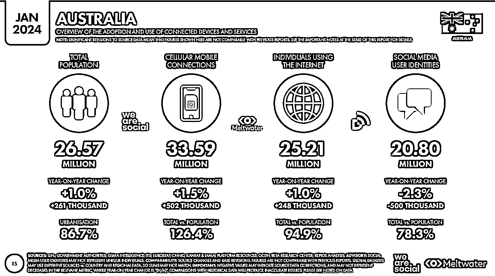

澳大利亚的电子商务消费者越来越多地参与在线购物，这一趋势由便利性、商品种类多样性以及竞争性定价所推动。电商环境得到了强大的数字基础设施、高互联网渗透率以及对安全在线支付方式的强烈偏好的支持。消费者倾向于那些提供无缝购物体验的平台，包括移动兼容性和高效的物流。

根据PiPiADS数据显示

澳大利亚目前有1000万广告受众，处于小幅度增长趋势，该受众体量意味着投放打爆商品，一天的量级是几百-几千单左右。相比大市场量较少，用于补量是一个非常不错的选择。

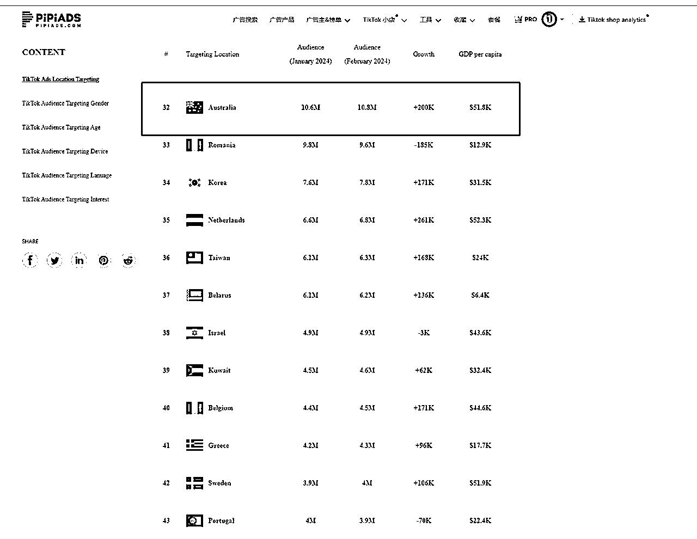

澳大利亚的电子商务市场非常活跃，有几个关键平台主导了这一空间：

*   eBay AU 和 Amazon AU：这些国际巨头在澳大利亚拥有重要地位，提供从各种类别的广泛产品。

*   本地零售巨头：Woolworths、Coles、Apple、JB Hi-Fi 和 Officeworks 是按收入计算的顶尖国内电子商务网站。他们满足了从杂货到电子产品和办公用品等日常需求。

*   专业商店：除此之外，澳大利亚人还从专门的在线商店购物，这些商店服务于时尚、家居与园艺、爱好、健康与美容等特定领域。

eBay是最早进入澳大利亚的国际电子商务平台之一。作为澳大利亚的主要在线购物平台之一，eBay澳洲站吸引了数百万消费者的关注和购买。据统计，超过一半的非食品类网购销售额来自eBay澳洲站，在澳大利亚电子商务市场有巨大影响力和地位。

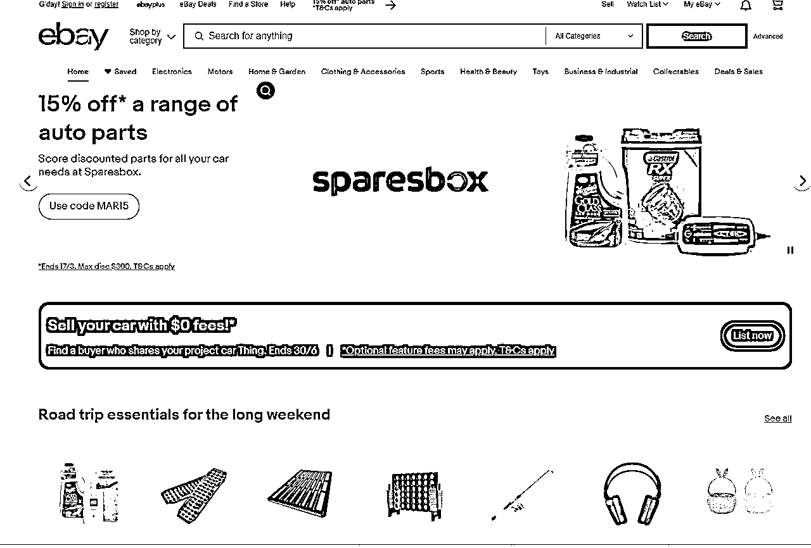

Catch

是澳大利亚本土最受欢迎的线上购物平台之一，被认为是一个拥有广泛产品类别的综合性平台。据官方数据显示，平均每2.1秒就会生成一个订单，日寄出的包裹数量约为1-2万件。

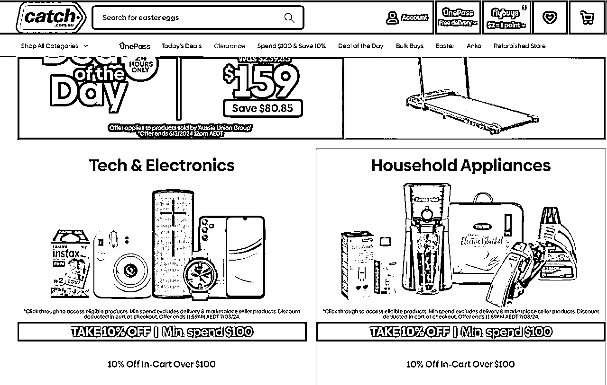

MyDeal

是澳大利亚的一家知名在线购物平台产品范围涵盖了从家具家电到个人护理等多个细分品类

Kogan

Kogan是澳大利亚最著名的电子商务商店之一，提供电子产品、家用电器、健身器材、时装和各种工具等。Kogan成立于2006年，最初是在线上销售电视产品，而后又扩展到其他品类的销售业务。

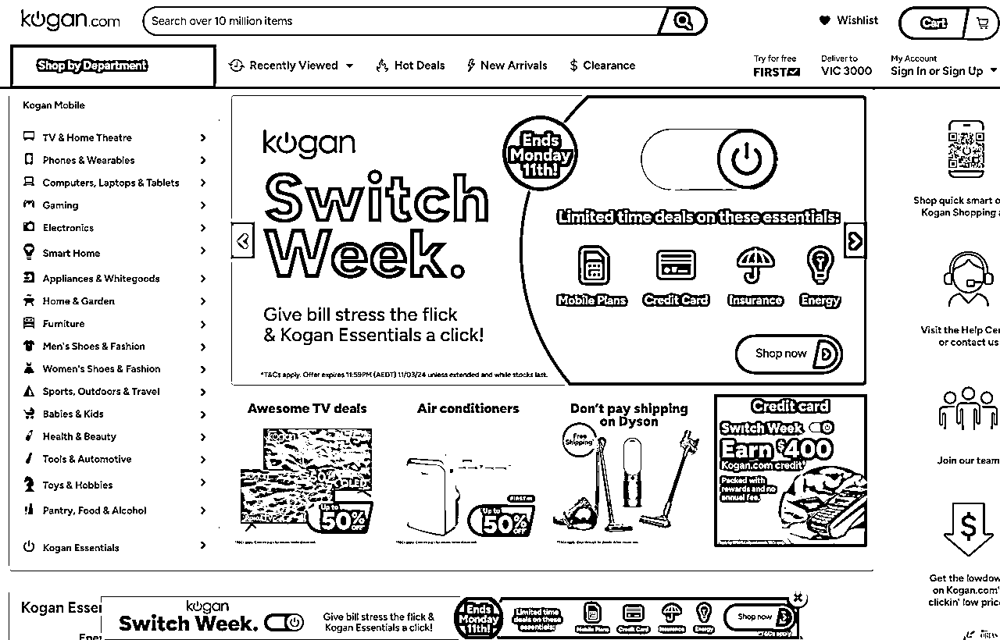

Woolworths全称伍尔沃斯集团有限公司(Woolworths Group)，总部位于澳大利亚，是一家以从事零售为主的企业。

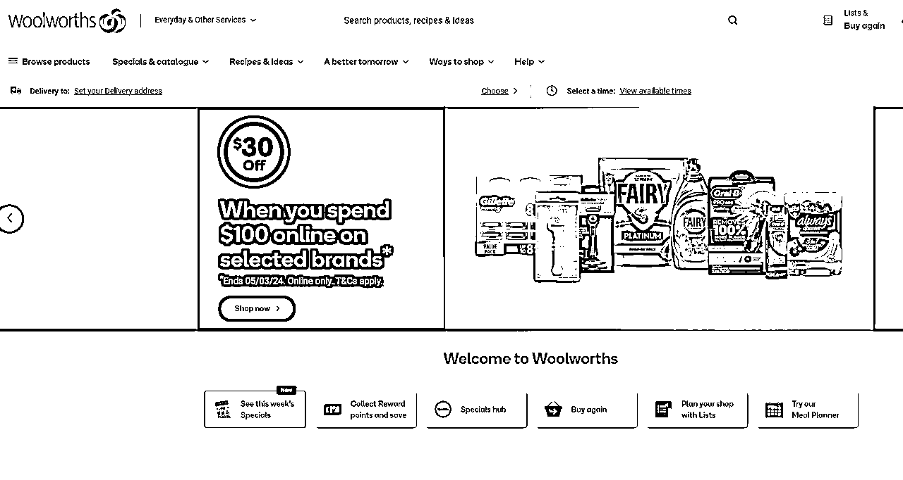

Big W 平民化的日用品商场，主要销售婴儿用品、儿童玩具、家居用品、服装配饰等

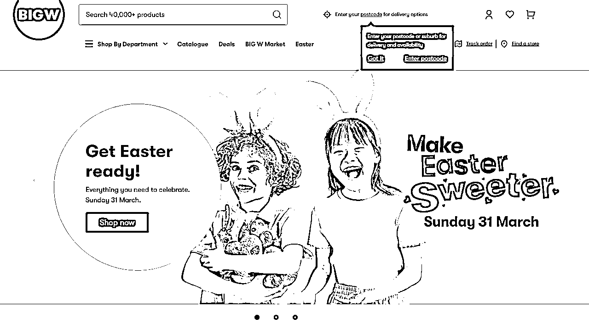

### TikTok在澳大利亚的用户增长和人口统计

在TikTok上，用户表现出通过应用直接购物的兴趣越来越大，这一趋势受到创新营销策略、影响者合作和互动内容的鼓励。 TikTok独特的短视频格式结合了可购物的广告和品牌合作，增强了消费者的参与度和购物意向。

*   用户基础：截至2023年，TikTok报告称澳大利亚每月有850万活跃用户，显示了其在澳大利亚数字受众中的重要渗透。

*   参与度：澳大利亚用户平均每月在平台上花费29小时36分钟，突显了应用的高参与率。

*   人口统计：平台主要吸引年轻人群，大部分用户群落在18-34岁年龄组，这是许多广告商的关键目标。

澳大利亚是一个花销水平和消费水平比较高的国家。人均GDP在全世界基本上是前十根据NAB的数据显示，截至2023年6月的12个月内，澳大利亚人在网络零售领域的支出达到532.9亿澳元，同比减少了5%。在过去一年中，每个月的增长呈现出收缩的趋势，直至5月份（年同比增长4.4%），而6月份的增长几乎保持不变（年同比增长0.1%）

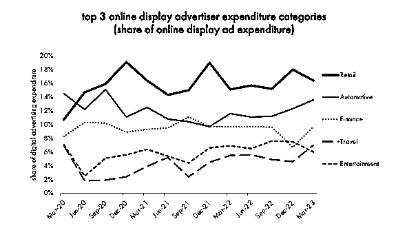

### 电子商务整合和趋势

*   平台整合：TikTok已与Shopify、BigCommerce和Ecwid by Lightspeed合作，为澳大利亚企业提供了无缝的电子商务活动（半闭环内测）

*   营销策略：成功利用TikTok进行电子商务的品牌采取了多样化的策略，包括视频中的产品链接、TikTok LIVE会话和定制广告。

*   消费者行为：#TikTokMadeMeBuyIt等标签展示了平台对消费者购买决策的影响，有41%的澳大利亚TikTok用户报告说受到应用的启发进行了冲动购买。

### 机遇与挑战

*   内容策略：成功的品牌在TikTok上使用了教育内容、影响者合作和用户生成内容的混合，以推动参与和销售。

*   广告覆盖：TikTok广告有潜力覆盖超过18岁的互联网使用人口的近18%，为针对性广告活动提供了重要机遇。

### 竞争格局

*   社交媒体平台：TikTok的独特短视频内容使其与Facebook和Instagram等竞争者区分开来，据估计，在未来几年内，澳大利亚的Facebook用户数量将保持在1700万左右，约占澳大利亚总人口的三分之二。Tik Tok正逐渐争抢更多的市场份额。

*   电子商务平台：TikTok兴趣电商的爆发式发展使其成为传统在线市场的有力竞争者，提供了更互动的购物体验。

### 支付习惯

澳大利亚消费者展现了多样化的支付偏好，特别倾向于现代、数字化的选择：

*   借记卡：最常见的支付方式，占了交易的重要部分。

*   先买后付（BNPL）：Afterpay 等服务越来越受欢迎，允许消费者购买商品并分期付势在年轻购物者中特别突出，并推动了如 Afterpay Day 这样的活动性购物日。

*   数字钱包：PayPal 和其他数字钱包越来越多地用于移动交易，反映了全球向无接触支付的趋势。

*   银行转账：在支付景观中仍然占有一席之地，特别是对于更大的交易。

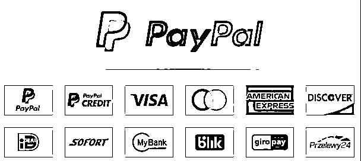

### 购买行为

澳大利亚消费者的购买行为已经发生变化，尤其是受全球大流行的影响：

*   增加的在线购物：人们显著向在线购物转移，有高比例的家庭进行在线购买。

*   活动性购物：由 BNPL 平台和销售活动驱动，澳大利亚人参与活动性购物，这在电子商务活动中看到了销售高峰。

*   生活成本压力：利率上调、通货膨胀和生活成本上升正在影响消费者的支出，这为零售商提供了新的考验。

*   健康和福祉的关注：大流行增加了对健康和福祉产品的兴趣，消费者愿意在这一类别上花费更多。

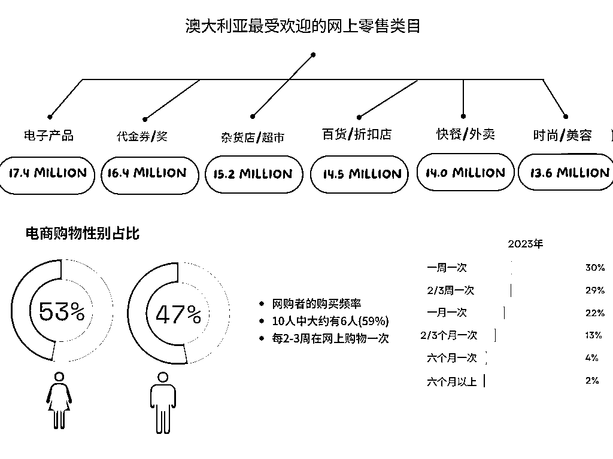

澳大利亚消费者特点

1.  追求生活品质：澳洲消费者注重产品的质感，他们倾向于选择质量较高的产品。

1.  消费习惯良好：澳洲消费者没有像国内那种周末大规模购物的习惯。当地的薪资是每周结算，每周四是发薪日。

1.  消费水平较高：澳洲消费者的客单价相对较高，而且退货率较低。他们习惯于一次购买较多的商品，而不像其他地方那样容易退款或退货。

1.  价格和配送时效性：在网购中，澳洲消费者注重产品价格和配送的时效性。他们倾向于选择价格合理且能够快速送达的产品。

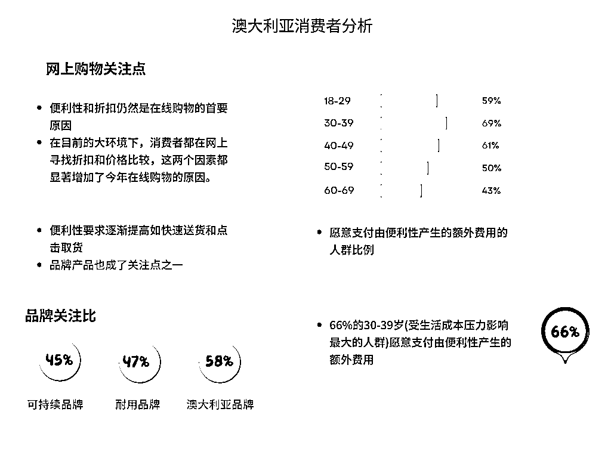

国外市场订阅服务已经很成熟了，订阅服务已经不再局限于传统的杂志、报纸或有线电视。如今，消费者可以订阅几乎任何东西，从音乐、电影到健身、教育服务，甚至是美食、衣物、家居用品等。订阅模式通过用户每周、每月、每个季度或每年支付一定费用，以获取特定服务或产品的使用权。

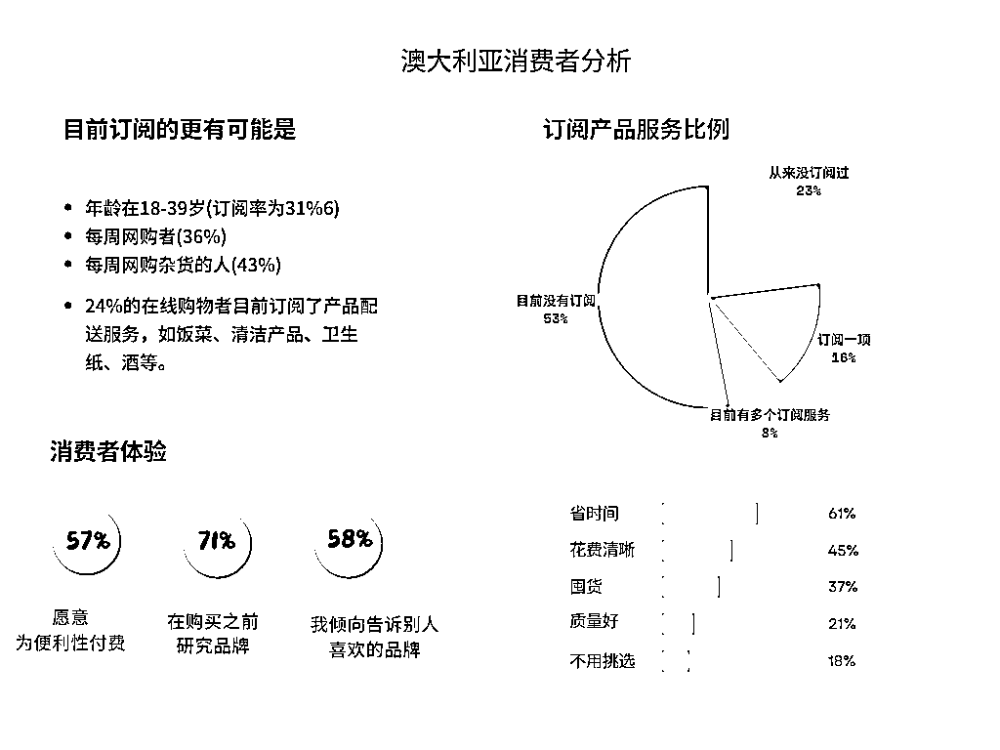

在线品牌研究的主要渠道

年龄在16至64岁的互联网用户在研究品牌时将每个渠道作为主要信息来源的比例

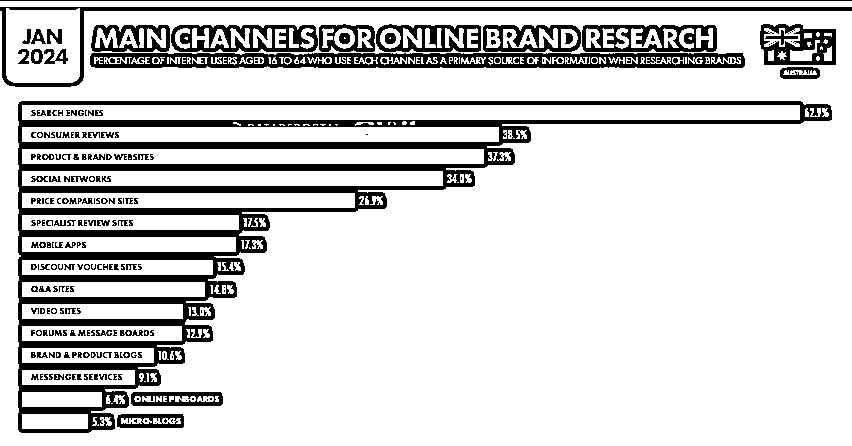

### 中国电商公司的机遇与挑战

机遇：澳大利亚成熟而多样的电子商务生态系统为中国电子商务公司提供了众多机遇，特别是在提供独特产品、竞争定价方面。

挑战：挑战包括在有着成熟的本地和国际玩家的竞争激烈市场中导航，理解并适应当地消费者行为和偏好，以及遵守澳大利亚的消费者保护和电子商务法规。

澳大利亚政府对TikTok的看法主要集中在国家安全和隐私方面的担忧。2023年4月，澳大利亚宣布禁止在所有政府设备上使用TikTok，理由是国家安全担忧。这一决策是在接受情报机构的建议后作出的。这表明澳大利亚政府对于TikTok可能对用户数据的潜在外部影响持谨慎态度

尽管政府层面存在这些担忧，TikTok在澳大利亚依然拥有商业机会。平台在年轻人中极为流行，提供了一种创新的方式来吸引这一难以通过传统媒体渠道接触的人群。TikTok已经在尝试缓解这些安全担忧，包括提出在美国德克萨斯州存储用户数据的计划，以期将其置于中国政府的影响之外。此外，TikTok在澳大利亚的普及表明，该平台为品牌和内容创作者提供了接触广泛受众的机会，尤其是在向年轻消费者市场推广时。

澳大利亚政府对TikTok的担忧主要围绕国家安全和数据隐私问题，但尽管如此，TikTok在商业推广和市场接触方面仍然提供了重要的机会。

澳大利亚的网购行为正经历着一段变革时期，尤其是在疫情高峰期后，消费者的网购支出已经趋于稳定。

预计在线零售会继续稳步增长，但随着生活成本的上升，零售商需要制定相应策略来吸引消费者。大多数网购者在非必需品上的消费更加谨慎，他们更注重自己的开支。利率上调、通货膨胀和生活成本上涨正在影响消费者的支出，这也给零售商带来了新的挑战。

在这种背景下，线上渠道变得尤为重要。几乎所有的澳大利亚网民都会定期访问在线销售网站或应用程序，这成为了他们发现和研究产品、品牌和零售商的主要途径

全渠道体验也变得至关重要。消费者已经将线上和线下的购物体验交织在一起，因此零售商需要在这两个方面都提供出色的服务和体验，以吸引和留住消费者。

澳洲市场上的热销品类涵盖了多个领域：

1.  电子产品：澳洲消费者对手机、平板电脑、数码相机、电子阅读器等电子产品有着持续的需求。在这个领域，苹果、三星、索尼等知名品牌占据了较大的市场份额。

1.  家居园艺：家居园艺产品包括家具、家居装饰品、厨房用品、卫浴用品等。此外，户外家具、烧烤用具、园艺工具等也备受消费者欢迎。

1.  食品与饮料：澳洲消费者对食品与饮料的品质和口感非常注重。他们对有机食品、进口红酒、咖啡豆等产品的需求持续旺盛。

1.  时尚服饰：时尚服饰领域涵盖了国际知名品牌如Zara、H&M、Uniqlo等，以及澳洲本土品牌如Sheike、J.D. Williams等。

1.  美妆个护：美妆个护领域的畅销品牌包括雅诗兰黛、资生堂、露华浓等国际品牌，以及澳洲本土品牌如Hada Labo、Clayton等。

### 战略建议

*   美区有结果的爆品差异化澳大利亚快速测试（时效快）

*   季节差异化，南半球夏季，东半球冬季

*   市场相对较小 做高利润产品 走利润 tiktok独立站投放案例 澳大利亚tiktok投放营销案例一：贴牌牙齿美白 累计投放广告展现：1亿播放 售价：18.83美元

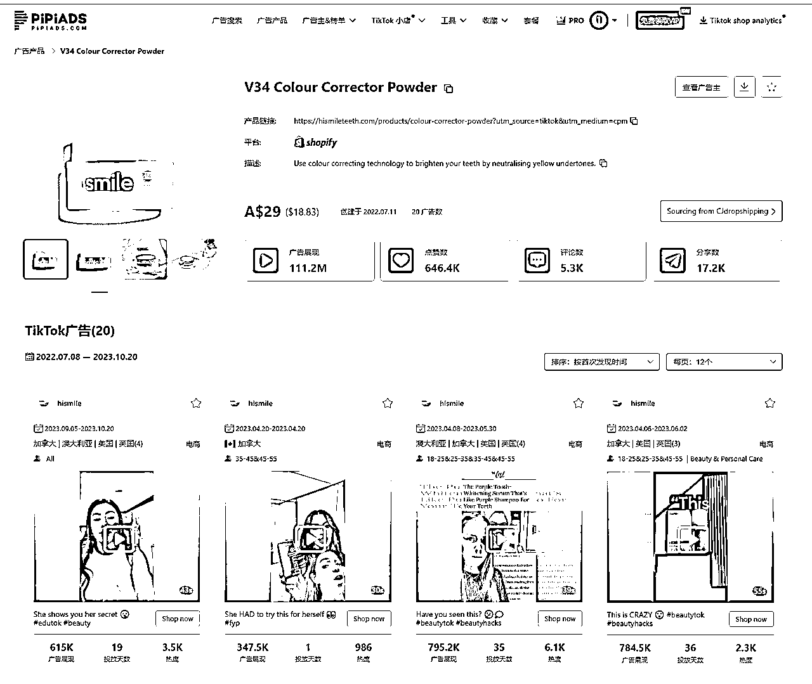

https://www.pipiads.com/zh/product-search/62cd5b3dc5861b70531eea76/

2600万播放广告素材：达人种草+效果展示

澳大利亚tiktok投放营销案例二：脱毛器

累计投放广告展现：9300万播放

售价：84.35美元

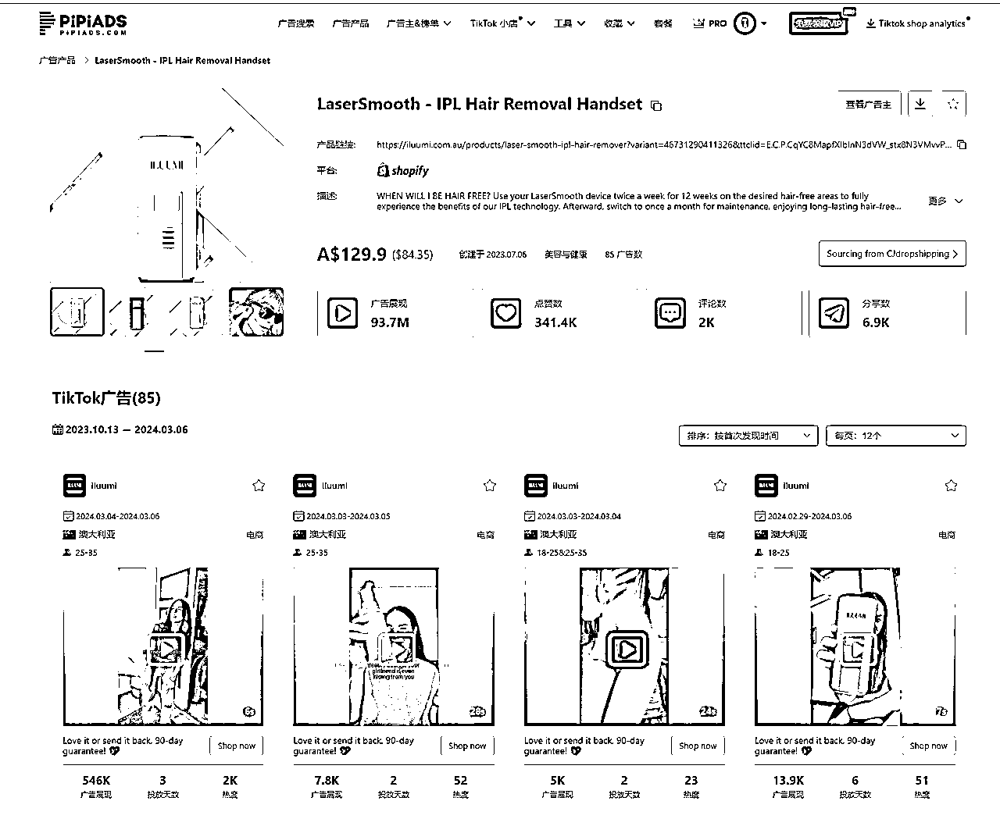

https://www.pipiads.com/zh/product-search/652a5c929b9ebe5125179cf0/

1450万播放广告素材：夸张的前后对比+痛点解决

澳大利亚tiktok投放营销案例三：定制礼品卡牌

累计投放广告展现：4500万播放

售价：29.22美元

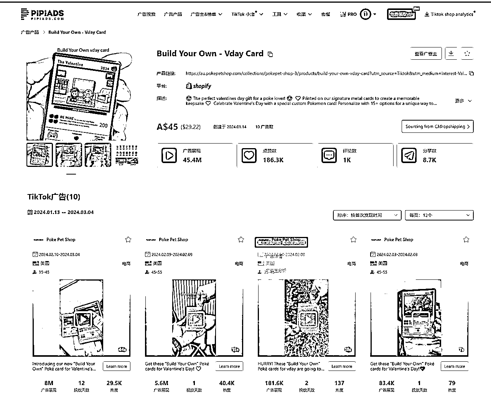

https://www.pipiads.com/zh/product-search/65a9a92093328758adef2432/

1950万播放广告素材：定向人群＋定制路线

结论

澳大利亚地广人稀是南半球经济最发达的国家，电商市场蕴含大量机会，TikTok在澳大利亚的活跃存在为品牌提供了与年轻、高度活跃的用户群体互动的重大机遇。通过战略性地利用平台的电子商务能力和内容趋势，品牌可以与消费者建立有意义的联系并推动电子商务增长。随着数字景观的不断演变，澳大利亚市场有望发展在社交媒体和电子商务革命的前沿。

交流建联：17684058749