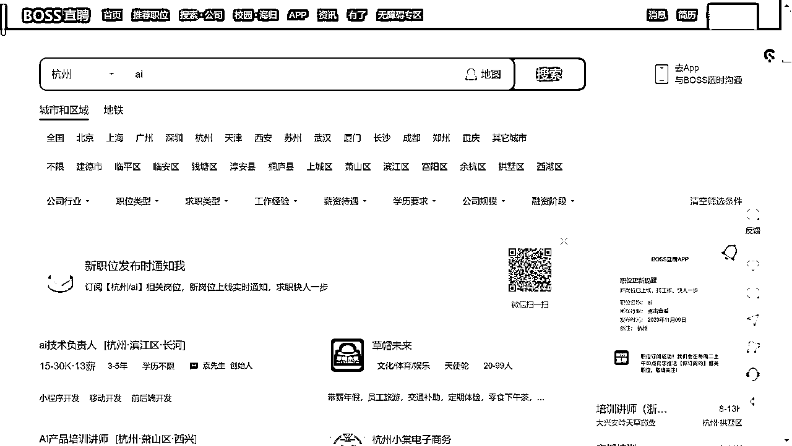
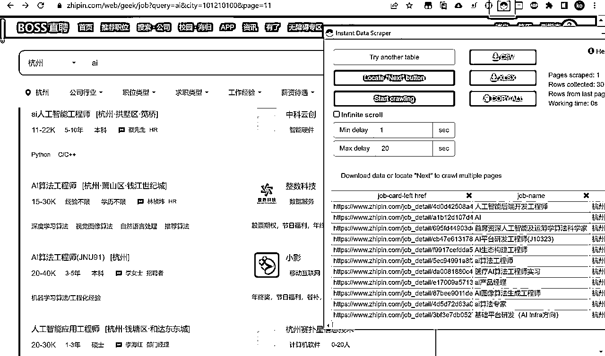
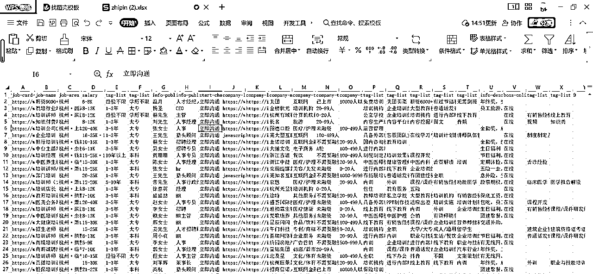
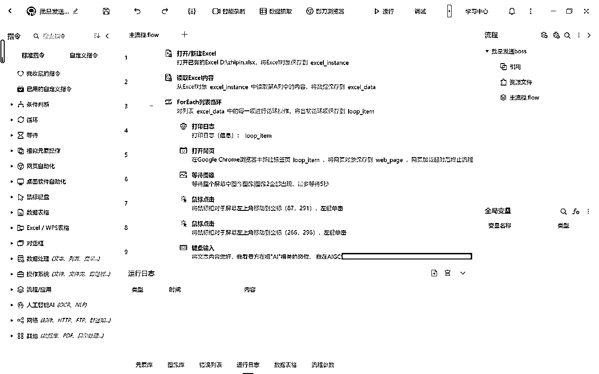
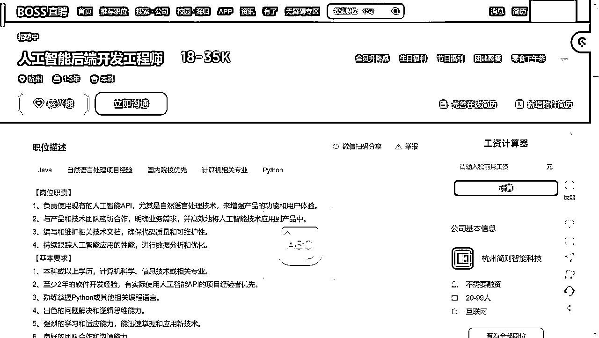
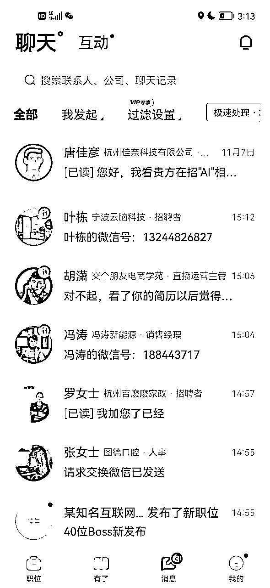
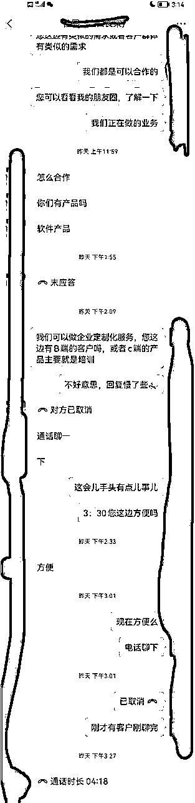
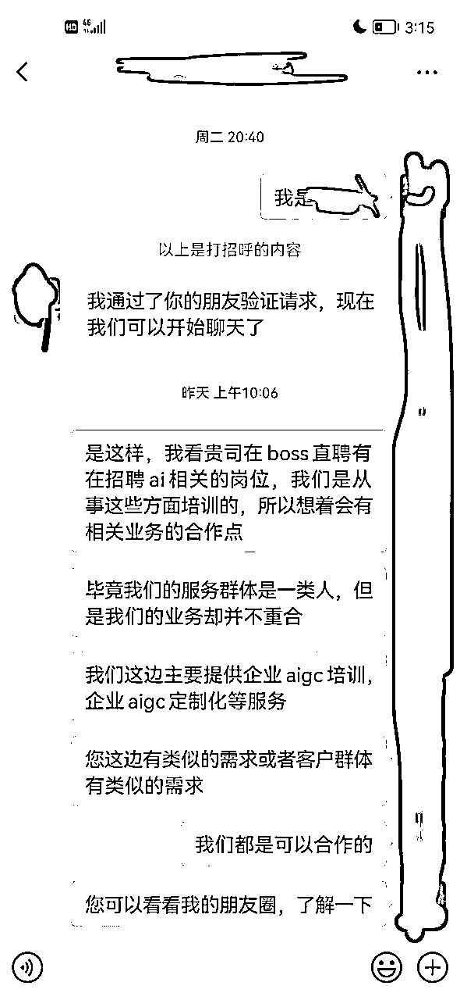

# 如何通过boss直聘日引流20+高客单用户/合作伙伴

> 来源：[https://bc8fd5oefm.feishu.cn/docx/XKnrdfMh3op9nhxKSjJcXNy6nnf](https://bc8fd5oefm.feishu.cn/docx/XKnrdfMh3op9nhxKSjJcXNy6nnf)

### 缘起

大家好，我是亮仔

前公司是做ai方面的，但是当时遇到一些流量方面的问题，

于是我将问题聚焦于：流量在哪儿这个问题上，想到中国目前最大的招聘网站，我不禁，技从心中起，胆从技边生。

初步的想法是，找到可能是自己的合作伙伴的公司/找到自己可能的客户群，挨个进行交流

但是聊了几个发现，效率太慢了

想到作为也算是小半个程序员，不如写一个rpa进行批量操作，那么我们，action

思路是：直接爬取某关键词下的所有招聘用户网页数据，然后挨个私信，经过筛选之后（回复我的）加上微信进行沟通

注意：可以通过限制地区甚至是区（比如我当时挨个爬取了钱塘区，余杭区，西湖区），这样可以保证每次爬取的数据是不同的，避免了重复的打招呼次数

同时会员单日打招呼也有次数限制，大概是在200+次左右

### 一，数据

#### 用户数据从哪儿来

批量操作的第一个问题就是，批量的无非就是我们的意向客户/合伙公司的关键词下的所有用户

所以直接就使用一个关键词搜索，拿到的列表就是我们所需要的用户



这里有个小技巧，如果搜索的结果是比较多的，先从自己的市区开始搜索，比如我是杭州，然后以我的地址为中心逐渐往外扩散

因为就boss的限制来说，10页是一个限制点 (可以通过对链接进行修改获取更多的内容，但是10页推荐以后的，活跃度估计也不太行，就跳过)

每个区域获取10页，一页差不多在30个

#### 数据怎么爬

如下我以ai为例，展示数据的爬取过程，如下为工具instant data sctaper的使用截图，使用这个插件，一秒就可以获取网页上面的表格，而且是免费的，通过加载分页按钮后，直接就获取到了10页的数据，点击xlsx直接导出文件



拿到的数据如下，我们主要使用的是第一列，即我们所需要的聊天的用户列表的详情页链接



### 二，批量交流

思路：

读取文件，获取到所有链接，一个个的进入网页，点击某几个特定坐标点，然后粘贴提前准备好的话术，下一个

#### ①影刀(小白推荐)

影刀的可视化程度比较高，实际操作也很简单

就是逐个访问链接，执行几个固定的点击操作和复制粘贴操作，大致情况如图

点击固定的几个按钮，然后发送固定话术，回复的即是代表有意向，就可以加上微信，进行私聊



点击立即沟通



立即沟通一般有两种情况，

第一种情况，初始的时候直接会弹出一个对话框，可以设置一句默认的问候语

然后我主要就是直接粘贴我的意图，我是干嘛的，我想要兼职/合作，通过这样批量发消息

第二种情况，他会直接发送一个问候语，需要发消息，必须点击继续沟通。这种策略估计是为了减少滥发消息

#### ②python(推荐有代码基础)

我恰好有点儿基础，就直接用python的selenium写了，当然主要代码由gpt所写，我所做的，只是简单的辅助

思路大抵就是读取文件，获取到批量链接，一个个的进入网页，进入之后的页面如下，我们只需要点击感兴趣(作为备忘，防止重复点击)，然后点击立即沟通，发送信息


立即沟通一般有两种情况，

第一种情况，初始的时候直接会弹出一个对话框，可以设置一句默认的问候语

然后我主要就是直接粘贴我的意图，我是干嘛的，我想要兼职/合作，通过这样批量发消息

第二种情况，他会直接发送一个问候语，需要发消息，必须点击继续沟通。这种策略估计是为了减少滥发消息

整体代码在最后面

### 三，总结

整个过程其实是sop化的，批量发话术，统一回复话术，然后加好友之后的统一回复话术。

整个流程下来转化率虽然不高(3%?)，但是能够筛选一轮客户，最终一天大概能引流20个客户/合作伙伴，这是因为一个号有聊天限制，后续有拓展计划的话，计划多开几个号

全程只需要启动批量发话术的程序，等待回复后自动回复，简单的交流，加到微信，话术回复，作为一个备选客户/合作伙伴；后续再通过朋友圈等私域手段进行转化



昨天发了一轮之后，因为初步筛选的都在杭州，甚至有个有合作意向的伙伴直接过来洽谈了一下合作的事儿



但是做私域嘛，尤其是高客单的，大家都知道，要慢慢转化，通过朋友圈这些建立人设，建立信任，以及了解我们的产品，所以只要加到微信，有可能的意向客户，就都是有机会的，至于合作伙伴就更是如此，有些急不可耐的直接就会过来谈合作了（少但是有）。

当然这个项目尤其希望能够给大家拓展思路：如果我缺流量，是否也有机会去中国最大的招聘网站寻找机会，通过网站直接进行倒流

### 四，细节和部分话术

第一，问候语

```
您好，我看贵方在招"xx"相关的岗位，
我在xx方面有蛮多经验的，问下贵方这块是否考虑兼职，或者其他合作形式？
```

第二，简历

这里面主要的细节就是简历，把自己的做什么的（主营业务），有哪些成绩，都写好，加微信好友之前先发一份简历给到对方

第三，加好友后的话术



第四，可以开个会员，即使有频繁，给官方交钱官方也会睁一只眼闭一只眼

第五，尽量避免和客户争论/吵架，测试过，如果对方举报，有一定概率会收获禁言甚至封号（当时我开通了会员，让我答题就放过我了）

### 五，为什么要费这么大劲

其实rpa代替了手工的操作，所以一顿操作下来，我们所需要做的事情其实很少，大部分的时间都是rpa在进行操作

其次就是我们这个行业的高客单有时候获客是比较困难的，其他平台监管力度以及获取难度都比较高，所以boss直聘于我们而言是一个不错的选项

### 六，代码

#### 注意事项

重点：如果要使用如下程序，需要关闭所当前的chrom浏览器

需要使用的话，注意三个方面

一个是环境，必须要有selenium的配置环境，这很令人讨厌，但是如果要使用python写网页rpa，这几乎是一个必选项，所以如果你是一个纯小白，我更建议你用影刀从0到1的搭建一个独属的rpa

一个就是里面的一些参数（最好自己过一遍），比如user_data_dir要换成你自己的google chrom的数据地址（大概率来讲，就是把用户名改成你自己的就行）

一个就是文件地址，我直接把文件放到了项目地址同一级目录下，（也就是python文件的同一目录）

我使用的是本地的chrom账户数据，这样就不用每次启动程序都登录；所以如果要使用如下程序，需要关闭所当前的chrom浏览器

#### 代码详情

```
import time
import pandas as pd
from selenium import webdriver
from selenium.webdriver.common.by import By
from selenium.webdriver.support.ui import WebDriverWait
from selenium.webdriver.support import expected_conditions as EC
from selenium.common.exceptions import TimeoutException, WebDriverException
import pyautogui
import logging

# 设置日志记录
logging.basicConfig(level=logging.INFO, format='%(asctime)s - %(levelname)s - %(message)s')

def wait_and_click(xpath, timeout=10):
    try:
        # 显式等待直到元素可点击
        element = WebDriverWait(driver, timeout).until(
            EC.element_to_be_clickable((By.XPATH, xpath))
        )
        element.click()

    except TimeoutException:
        logging.error(f"元素加载超时：{xpath}")
def load_and_interact_with_website(url):
    try:
        # 设置隐式等待时间，例如设置为10秒
        driver.implicitly_wait(5)
        driver.get(url)
        # WebDriverWait(driver, 10).until(EC.presence_of_element_located((By.TAG_NAME, 'body')))
        # 在这里执行更多交互操作
    except WebDriverException as e:
        logging.error(f"加载网页时出错：{url}，错误信息：{e}")
def setup_chrome_driver():
    user_data_dir = r'--user-data-dir=C:\Users\86180\AppData\Local\Google\Chrome\User Data'
    # profile_directory = r'--profile-directory=C:\Users\86180\AppData\Local\Google\Chrome\User Data\Profile 1'
    chrome_options = webdriver.ChromeOptions()
    chrome_options.add_argument(user_data_dir)
    return webdriver.Chrome(options=chrome_options)

# 脚本的主函数
def main():
    # 加载Excel文件
    df = pd.read_excel('./zhipin_培训_AI.xlsx')
    urls = df.iloc[:, 0].tolist()
    global driver
    driver = setup_chrome_driver()

    for url in urls:
        try:
            if driver.find_element(By.XPATH, '//*[@id="wrap"]/div/div[1]/div/button'):
                time.sleep(10)
        except Exception as e:
            pass

        logging.info(f"正在处理: {url}")
        load_and_interact_with_website(url)
        # 执行具体的点击等操作，这里用pyautogui作为示例
        try:
            # 检查是否存在取消感兴趣的按钮
            # 这里我们查找包含'btn-interest active'类的a标签
            element_1 = WebDriverWait(driver, 10).until(
                EC.element_to_be_clickable((By.XPATH, '//*[@id="main"]/div[1]/div/div/div[1]/div[3]/div[1]/a[1]'))
            )
            if driver.find_elements(by=By.XPATH, value="//a[contains(@class,'btn-interest active')]"):
                logging.info(f"\n页面{url}已显示‘取消感兴趣’，跳过此页面。")
                # 使用pandas删除第一行
                df.drop(df.index[0], inplace=True)
                # 保存文件
                df.to_excel('./zhipin_培训_AI.xlsx', index=False)
                time.sleep(5)
                continue  # 如果找到，则跳过本次循环
            # 移动鼠标到(214, 691)
            pyautogui.moveTo(214, 691)
            time.sleep(3)
            pyautogui.click(214, 691)
            # 点击第一个坐标点的元素
            # element_1.click()
            # 移动鼠标到(569, 696)
            pyautogui.moveTo(569, 696)
            pyautogui.click(569, 696)
            element_2 = driver.find_element(By.XPATH, '//*[@id="main"]/div[1]/div/div/div[1]/div[3]/div[1]/a[2]')
            element_2.click()
            time.sleep(3)
            # 移动鼠标到(1552, 1100)
            pyautogui.moveTo(1552, 1100)
            pyautogui.click(1552, 1100)
            # element_3 = driver.find_element(By.XPATH, '/html/body/div[11]/div[2]/div[3]/div/span[2]')
            # if element_3:
            #     element_3.click()
            time.sleep(3)
            text_to_copy = """您好，我看贵方在招"xx"相关的的岗位，我在xx方面有蛮多经验的，问下贵方这块是否考虑兼职，或者其他合作形式？"""
            # wait = WebDriverWait(driver, 10)
            # 等待输入框元素加载完成
            input_box = WebDriverWait(driver, 10).until(
                EC.presence_of_element_located((By.XPATH, '//*[@id="chat-input"]'))
            )
            # 输入中文内容
            # input_box.send_keys(text_to_copy)
            # 复制内容
            pyperclip.copy(text_to_copy)
            # 粘贴内容
            pyautogui.hotkey('ctrl', 'v')

            # 可以选择通过回车发送消息
            input_box.send_keys(Keys.ENTER)
            time.sleep(5)
    driver.quit()

if __name__ == "__main__":
    main()
```

#### 部分代码解析

1，代码内置了一些反爬措施，以及相当时间的休眠，当程序启动之后，如果过于频繁访问，会导致需要验证，所以休眠时间尽量别修改

2，每执行一次程序，就会删除掉其中一行数据（防止程序中断，我不知道从哪儿开始），所以你如果想要最后保留该文件，可以备份一份