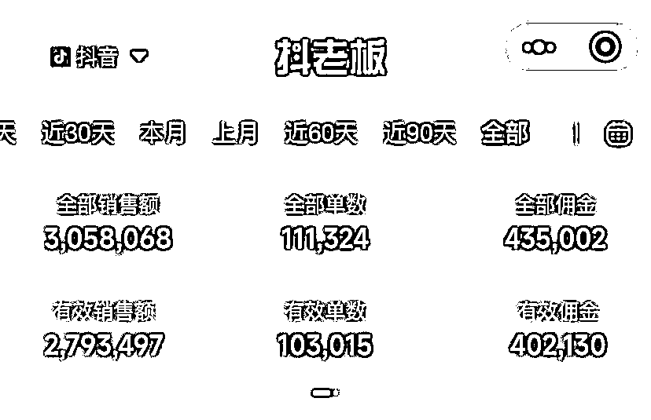

# 家有一娃，赚钱如麻！新手宝妈做抖音，一年橱窗带货11万单历程分享

> 来源：[https://oq06a188yq7.feishu.cn/docx/E5KpdR0WDo0guIx7RjKcFM66njK](https://oq06a188yq7.feishu.cn/docx/E5KpdR0WDo0guIx7RjKcFM66njK)

# 一、自我介绍

大家好，我是书燃，我是23年6月才加入的星球，编号 93967。

之前在星球看了很多大佬的文章，因为这些优质的内容获益颇丰，不管是认知、能量、操作技巧都获得了大大的提升，很感谢遇到生财这么好的平台。

今天写下这篇6000字长文，也是我加入星球后发表的第一篇文章，把我自己的一些经验和坑，分享给大家，希望不管你是已经在做抖音或者正准备做抖音的，都能提供一些帮助。

接下来，我跟大家分享，我是如何在很晚（2023年2月）的时间入局抖音，在母婴赛道做纯短视频带货，一年时间做到橱窗销量11W的。

这个数据还不是最新的，截止目前已经12.7W单了

# 二、都2023年了，为什么还要去做抖音的母婴赛道

在我印象中，每年都会有人“唱衰”抖音不好做了，太卷了，普通人没机会了，你没有资金碰都别碰之类的话题，但是现在我们这个所谓的流媒体时代，信息很多情况下都是狭隘的，比如人家说的不好做，可能是以前他们在抖音随便发发都能赚钱，现在竞争大了，要专注做内容跟选品还有投流了，所以对他们来说，确实没以前容易了。但是这种情况，真的对个人完全没有机会了吗？我觉得不是的。

首先我觉得任何平台、任何赛道，你只要搞清楚自己的核心优势，勤勤恳恳的去耕耘，都会有收获，无非大小的问题。

我为什么要在2023年去做抖音，并且选择了母婴赛道？

1、天下最好赚钱的3类人群，老人、女人和孩子，母婴赛道就占了2个。

2、我作为一个互联网人，我扎进去后的竞争对手是在家的普通宝妈，我觉得自己在某些方面是有优势的，比如做内容、平台规则方面。

3、母婴赛道需要孩子或者自己真人出镜（一般孩子比较多），而机构没那么多娃，每一个视频都得实打实的去实拍，很难流水线生产，少了机构这块，我觉得个人是可以在母婴赛道取得一些成绩的。

4、因为自己有孩子，所以什么时间需要什么品，哪些品是刚需，都有了依据跟参考，对品的理解也会加深，所以操作起来会比较快，并且哪怕没做起来，光是样品，一年也都可以给家里省下大几千块钱。

5、母婴赛道是一个长期的生意，一个客户你可以从怀孕一直卖到他孩子长大成人，不说10年20年，就卖5年时间，都比现在任何事情要靠谱了，生意会随着你孩子年龄的变化而变化。

6、坤哥也说过嘛，家有一娃，赚钱如麻。

# 三、短视频带货的三个阶段

我是2月8号发布的第一个视频，我把整个2023年的抖音带货分为3个阶段：

第一阶段：2月-5月 黑洞期

截止到5月以前，整整3个月时间，橱窗销量没记错的话应该是3000单左右，不仅没赚钱，还倒亏了1万5，这里插一下，前期是我跟我老婆一起弄，具体分工：我负责选品、投流，她负责文案、剪辑（当时我们定的计划就是，如果3个月没做到3000块收入，我老婆就去上班）。

这个阶段是最痛苦、最难熬的阶段，也是我认为99%的人都过不了的坎，所以我觉得他是黑洞期，做抖音的第一件事，就是要穿越黑洞。

你每天辛苦选品、剪辑、发布，一看播放25、137、109，连续3个月没有反馈，这种感觉是很崩溃的，像我们一开始就选择了通过投流带动自然流的方式，然后随心推和千川还在亏钱，如果是一个人自己在家做，我相信大部分人都会放弃，不如安稳找个班上。

这个阶段考验的更多是心态，因为普通人去做抖音带货，不可能一上来就大爆特爆，也不是每天每个人都会有正反馈，但是你只要相信你做的这件事情是对的，不断的优化选品、优化内容、优化投流策略，在正确的方向上不断摸索、学习、试错，就会有光明的一天。

不要相信什么3天起号，7天打好标签，15天出单这种事情，那是人家极度细节的SOP出来后，通过大量的验证才会出现的结果，也可以理解为幸存者偏差，因为信息就是这样，你只会去相信你愿意相信的东西。那你说有这么牛逼的操作和打法吗？肯定有，像航海我也参加过一次，在正确的引导和方法上，加上自己极高的执行力，也会有人达到这样的成绩，但是是每个人都能如此吗？不一定！

第二阶段：5月-11月 爆发期

你能想到每个月都爆单是有多幸福吗？没错，我们爆单了！还是一直在爆的那种！

就在我老婆面试了好几家短视频公司，准备去偷师甚至第二天都决定要去上班的时候，爆单了！

在熬过了最惨的3个月之后，通过不断的优化，终于爆单了！这也更加坚定了我们要持续做下去的决心！

为什么能爆单，并且连续爆单？

1、选品

2、时间节点

3、内容

4、投流

5、商家关系

爆款一：我第一个爆单的视频是沙画，3天出了6000单，但是利润不高，一单1块钱，第一次让我真正体验到了爆单的快感，那天小程序消息发个不停，我差点没通宵守着了...

她能爆的原因有几个点：

1、内容过硬，商家说这是他们沙画这个品里面，收到的最优质的素材，我们自己也觉得这个是拍的最好的素材

2、投流/商家关系：这个商家当时没跑千川，但是给我们建了700多条随心推，700条啊~我理解应该没有这种自动创建的工具（不懂...）当时跟商务沟通，说这个素材大家感觉都很好，也有一些自然流，不如投流试试，然后我们就答应降佣投了，一跑就跑了6000单！因为平时跟商务沟通比较多，所以他们在投流力度上也会更大一些，搞好跟商务的关系，你会有意想不到的收获。

3、时间节点，也是巧，5月9号发布的，因为马上就到61儿童节，不然得话肯定没这么大的量。

爆款二：艾莎公主音乐电动玩具

这期间我去参加了一次玩具展，这个展会我观察到的现象就是：只要是女生的玩具，颜值在线的，展位前面的人都特别多（这个也成为我后期一段时间的选品思路），而艾莎就是结果，这个品是我自己投的千川，ROI：5，最高的时候是7，出了4000-5000单，什么概念呢？就是当时千川消耗1块钱，我们就能赚1块钱，甚至高的时候能赚1块5，但是当时胆子小（我现在想起来都后悔啊）还有一些其他原因.......没敢砸太多进去。

她能爆的原因有几个点：

1、应季，23号开始爆单的，马上61儿童节了，很多家长会给孩子买礼物

2、大IP，应该没有哪个小女生不喜欢艾莎

3、产品好，有音乐，能发光，能旋转，不需要过多介绍卖点，甚至我的视频文案都没有，就是几个在地上转的镜头配上主题曲，简单粗暴！

这里踩了第一个大坑：商家断货了！商家断货了！商家断货了！商家断货了！

最火爆的那款，没货了！刚好又遇到周末，然后我们千川又在跑，后续ROI掉到4，怎么都找不到原因，后面周一商家跟我说没货了，很多人想买买不到，系统就判定你这个视频效率太低，然后慢慢就没有流量了，后续商家补货后，也是稀稀拉拉，ROI也就在3-4之间。所以视频大爆后，一定要跟商家提前沟通好。

后续基本每个月都会爆单，并且都是不同的品，这里我把我的选品思路分享给大家，供大家参考借鉴，因为我家是个女儿，而男女生区别又比较大，所以我更多从女孩子切入。

我的选品思路：

1、颜值（视觉）

颜值即卖点，颜值即正义，我最开始切入的是玩具，因为玩具自带流量，一定要选高颜值的产品，女生的东西，不需要提升专注力跟动手能力，好看就够了！

好看的东西，拍出来的效果都不会很差，所以第一，品一定要好看，像沙画、艾莎、水画本、咕卡、贴纸，这些都很好看。

2、高佣

前期我给自己定了一个标准，30%以下的品不看，因为我自己要投流，佣金太低，千川打不正，很容易亏钱。

3、低退货

低退货，变相降低投产门槛，我的退货整体应该在6%-8%之间，后期到了10%，辛辛苦苦卖几单，结果人家都退了，白瞎了投流的钱，所以对品的质量跟品质，一定要把好关，有些东西虽然便宜好卖，但是退货高也不行。并且退货越低千川越稳定，不然看到大量消耗，最后一算账不赚钱，那就坑了。

4、热门性

季节爆款/节日爆款/热点爆款

一个季节性强的产品，当季节性来的时候，需求就会被激发，比如现在立春了，所有抖音的母婴商家，都在推防晒，比如孩子的面霜，春夏秋冬都不一样。这些跟季节相关的品就会不断起量，做服装的应该很快能感同身受。

反之还有一些四季通品，就一年四季都能卖，这些不是不好，而是因为天天在卖，产品没有规律性的爆量周期，对普通人来说没抓手，并且因为天天卖，很多付费玩家基本都把流量抢完了，你进去根本干不过别人。

还有节日，母婴目前对我来说，最大的节日就是61了，因为享受过他的红利，至于其他的，暂时还没开发出来，像38妇女节、教师节、国庆节都有类似的爆款。

还有一些热点新闻、热点电视剧跟事件发生后，相关产品的出现，这块我关注的比较少，就不过多分享，以免误导大家。

5、新奇特

经常看风向标的应该有印象，去年爆火了很多奇奇怪怪的解压玩具。还有一些黄金扑克什么的，动不动就GMV百万。

抖音的本质目前还是兴趣电商，如果你能唤醒用户的兴趣，引导用户传播的产品，就越容易形成转化。而新奇特的产品刚好符合这样的需求，买回去要不发朋友圈，要不发抖音。这种为平台带来内容和传播的产品，他不火谁火。

6、低价羊毛品

蕉下的防晒衣服，原价299，现在79你买不买？

xx品牌的牙刷，原价9.9一支，现在9.9有10支你买不买？

xxx的磁力片，原价199，现在59你买不买？

这种低价羊毛品，不是每天都有，但是你只要遇到，就赶紧冲，正反馈杠杠的。但是要注意，这里的低价羊毛品，他只是价格低，不是品质低！一定不要卖连自己都过不了的东西。

7、易过审

我很少带儿童保健品，甚至零食都少，因为不是特别了解，这类容易账号被关小黑屋的东西，尽量能不碰就不碰，千川投放有很多要求，你看好这个品，内容都做得好，如果不能通过千川放大，岂不是很难受！

以上就是我自己总结的一些选品思路！

第三阶段：平稳过渡期

经历了之前几个月的爆单，现在账号的经营已经很稳定了，不管是收入还是订单，这里只要保证好内容的更新，保证内容质量，一般都不会太差，只要自己不作死就行！

# 四、新手宝妈/宝爸如何做好抖音？

实战实操，吐血推荐，每一条都是花钱买来的经验！

1、选好你要做的赛道

母婴是个大类，一开始一定要切到细分里面去，等你细分有一定规模了，在扩到全品类，不要局限自己，也不要乱来。

我前期就是玩具起家的，后面不管是服装还是好物、教辅，我都卖，我牙膏视频跑了2000W播放，你敢信我早期是个卖玩具的？

教辅、玩具、辅食、服装等等这些细分领域，根据自己的优势还有娃的特点，找一个足够细分的，切进去，猥琐发育，慢慢变强。

这里补充一个做教辅的思路：降维打击

你娃2年级，你就去卖1年级的东西，你娃1年级，你就去卖幼小衔接的东西，最大的好处就是提升拍摄效率，因为娃都会，所以拍起来也快，你自己孩子二年级，你还去搞2年级的，光配合拍视频这一件事，就能焦头烂额。

2、找好对标

不管你是做什么，都能在抖音找到对标，如果找不到这方面内容，我劝你别做，因为到时候你连一个学习的对象都没有，自己摸索基本不靠谱。抖音里面有很多粉丝不足一万，但是带货销量10W以上的达人，重点他们不是IP玩法，就是最朴实的桌拍！这些人就在我们身边，学习他们，模仿他们，超过他们。如果你实在找不到，我也有自己的对标库，可以来拿！

3、包装好你的账号

这些太多人讲过，基本信息，一定要做好！

4、加500个商务（很多人前期不会做的事情）

先别急着动手，先给我加500个商务，为什么？因为他们会天天发朋友圈，有些品是可以免费拿的，有些品是有投流支持的，你加的多，才有更多的信息。如果500个商家，有100个人同时在发某一类品，那潜力爆款不就出来了吗~并且前期不管是什么品，你都拿回来，就当练手还省了样品钱！

并且你找商家拿品的时候，多问一句：你们测流吗？

不要觉得不好意思，丢人啥的，多嘴问一句会死吗~好多连问都不敢问，怕啥！

我2个微信，商家加起来1000多人（以下是其中一个）

5、工欲善其事必先利其器，给我买灯！！！买支架！！！

别视频拍出来，乌漆嘛黑的，那种灯光那种画质，不是剪映加几个滤镜就是救的了的。还有就是为了省个支架钱，视频拍出来抖的像筛子，你那能出单才怪，能坚持下来才怪，这些东西加起来要不了500块，如果你长期做，信我，早买早享受！

6、抄~直接抄~

有了品，就去找爆单的视频，他怎么拍你怎么拍，1:1模仿，很多人不懂什么叫1:1，我这么说吧，他是45°角的运镜，你就必须45°，46都不行，他往前推3秒，你就只能是3秒，这就叫1:1，新手不要有太多自己的想法，别人怎么做你就怎么做，这种才是像素级！

每一个视频爆单，都是有原因的，如果你不会拆解爆款，那就给我抄！先抄30个视频，培养感觉，一个镜头多拍几遍，你每个细节如果都只有60分，那你的视频出来，那就不可能超过60分。

1:1，像素级复制！抖音就是开卷考试，谁抄的快抄的好，谁就能爆单！

7、做抖音唯一取巧的捷径

商家投流，当你有了足够多的商家信息，就能获取到很多有投流支持的品，给我往死里薅他们！不要有负罪感，那都是资本家的钱！不要给我说找不到投流的，如果有，那就是你商务加的不够多。

当时我跑舒客牙膏，商家给我投1万的千川，我跑5000的GMV，怕啥！人家账户里面都是10W起步，只要你能跑动，你就甩开了99%的人。

当然，商家也不蠢，有些商家有条件，比如你出单了，就投100，或者你销量多少了，就投，反正只要是投流大气的，你就往死里发，天天发。有资本帮你加持，你要做的就是高产似母猪！！！

8、每天给我刷爆款榜单

为什么我能找到爆单的品，除了运气成分以外，就是榜单带来的。

这里就不得不提到，很多人都说的追爆款！

爆款要不要追，当然要！但是不能无脑追！

还是用牙膏视频举例，商家给我投了100多万千川，凭什么你随便发个视频就要给你分一杯羹？所以那些无脑追爆款的，基本都是死翘翘！那怎么追？

每天刷爆款榜单！

前面几个月，24小时榜跟周榜，哪些人发过哪些品，我基本都能背下来，所以有一个新的品出来，我能立马get到并且去跟他抢流量，去把她还没做好的，做的更好，把她做的好的，直接复制过来，这样我才有机会爆单，如果你对榜单不熟悉，每天除了感叹别人又爆单了，没有其他任何好处！

9、要有付费思维

都2024年了，你还想白嫖平台的流量？除非你是天选之子，各方面确实做的好，但是你想弯道超车或者你想正反馈更快，就去投流！

我算了一笔账，你前期每天发2条作品，一个月60条，你拿30条数据好的出来投随心推，每条20块，一个月也才600块，这还是在你一单都不出的情况下，反正在我看来，只要你品跟内容不是太差，亏个300-400顶天了。但是你收获的是什么？反馈！

有了正反馈，你就能更好坚持下来，这也是穿越黑洞最好的方式。也是筛选千川素材的一种方式。

10、执行力拉满，等风来！

在绝对的数量面前，一切运营手段都是花里胡哨的，分享一个之前坤哥说过的账号：悠悠

发布视频2.1万，橱窗销量400W+，一单我算5块钱，你想想这个成绩。你看过他的视频你会发现，没啥特别的巧，就是坚持多发。如果你能在这个过程中不断地优化你的内容跟品，找到几个固定的套路，那就更好了。

以上，就是对想入局的宝爸宝妈们的一些个人建议，仅供参考！我也算是报过很多课了，其实大家讲来讲去都是那些东西，普通人做抖音，做好以上的事情，不可能起不来的。

# 五、2024，我打算怎么做？

IP

要想在抖音赚到更多钱或者长久的赚钱，必须做成IP。

我理解的IP很简单，不一定是意见领袖或者大博主，但一定是你抖音里面熟人，在线下不管是找人帮忙还是办事，第一个想到的就是熟人，那抖音买东西也一定，他一定也会想到熟人。谁才是熟人，就是经常在他面前出现，并且之前有过满意购物体验的人。

所以，2024，争取每个视频都有3-5秒是真人出镜的（娃除外，娃是必须出镜的）

目前橱窗销量接近13W，争取年底能达到30W。

最后，以上都是一些个人真实经历和分享，有说的不对的地方，希望大家多多包涵，也欢迎正在做母婴这块的朋友多多交流，2024，祝大家身体棒棒，钱财多多！