# 2024德国Tik Tok电商市场调研报告

> 来源：[https://za6kyadmdr.feishu.cn/docx/Y3ctdzmSyoBWJYxY5mCcVfKGn5f](https://za6kyadmdr.feishu.cn/docx/Y3ctdzmSyoBWJYxY5mCcVfKGn5f)

近期Tik Tok已启动德国半闭环的入驻招商，目前以邀请制的形式内测

德国是一个电商市场成熟、消费者购物习惯成熟和多样化的国家。

### 市场规模与增长： 截至2023年，德国的总人口约为8300万，是欧洲人口最多的国家之一。根据不同的研究和调查，德国的互联网普及率非常高，超过90%的人口有互联网接入，而在这个数字中，大部分人口都有在线购物的经历和意愿。

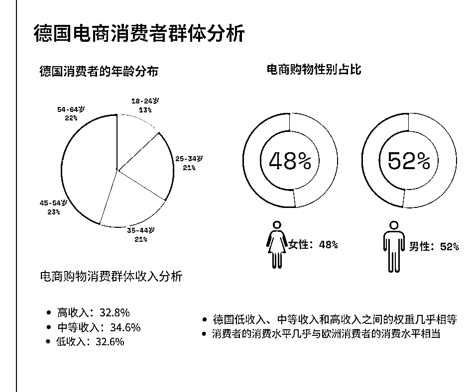

但根据Bevh（德国电子商务协会）的最新评估，2023年全年商品销售总额下降两位数，达11.8%，至797亿欧元，低于上一年的904亿欧元，受大环境影响，整体电子商务趋势放缓，最终趋于稳定状态后逐渐上升

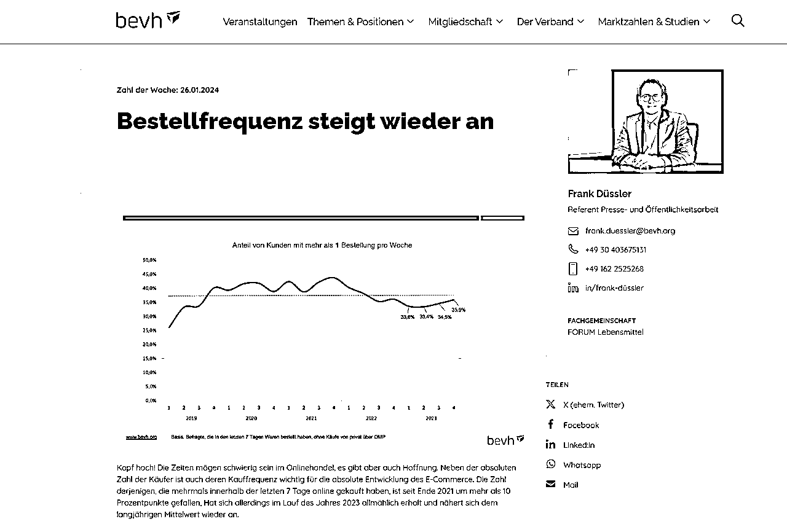

据观察，德国电子商务市场使用移动设备进行订单的情况持续增加（从 2019 年到 2023 年的 33.5% 增加到 45.1%（TikTok使用者大多通过手机、平板）

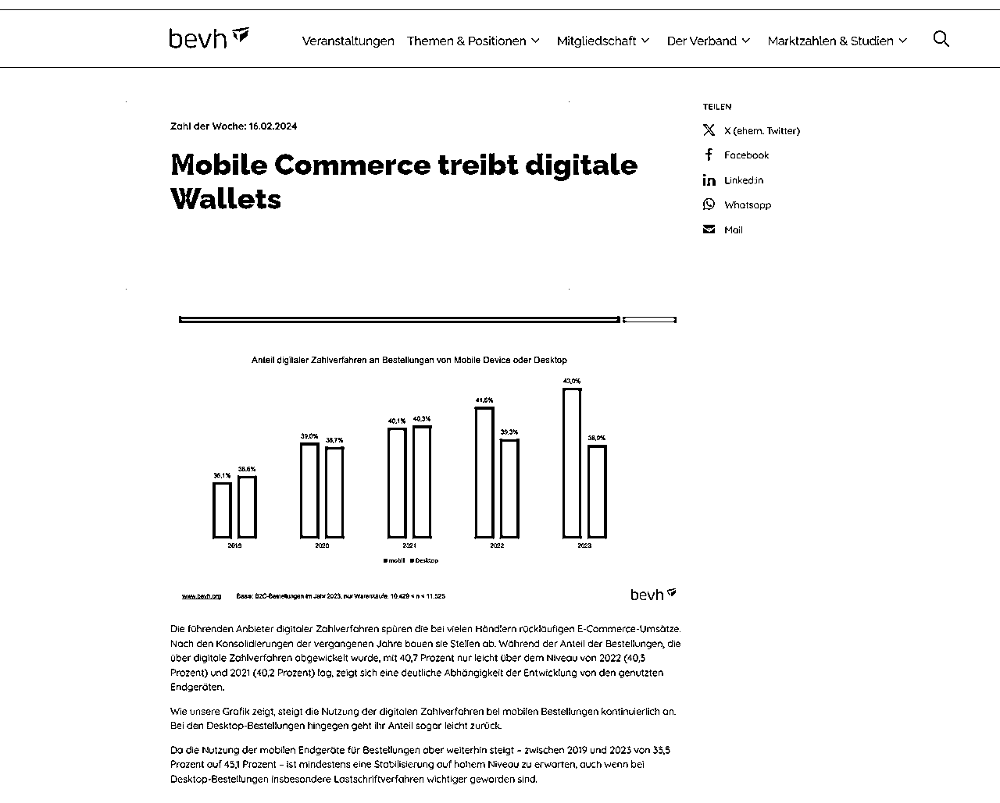

用户渗透率：

根据statista数据统计，TikTok的用户份额占据德国38%的市场氛围，是德国排名前五的社交网络之一

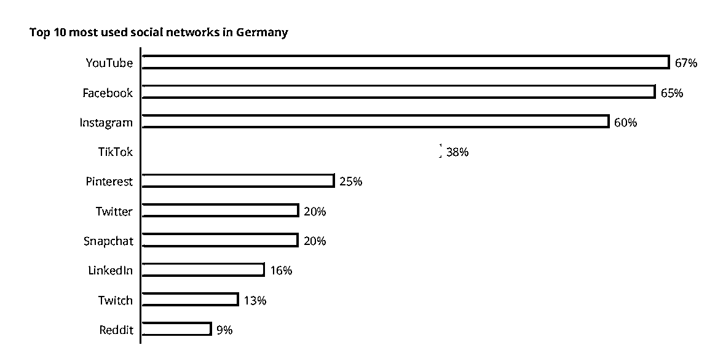

目前tiktok的用户使用时间处于持续上升中

自21年到23年Q4，使用Tik Tok的社交媒体用户份额上升20个点

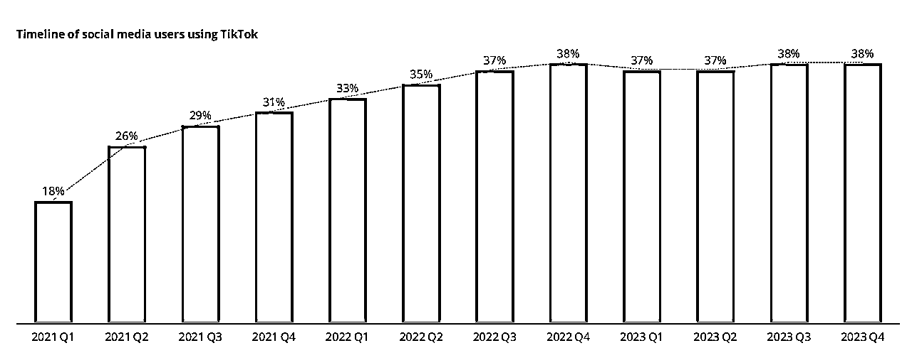

tiktok广告受众情况

根据pipiads数据显示，截止到2024年2月，全球TikTok广告受众排名中，德国受众排名17，有2690万受众，相比上月新增受众120万人，增长迅猛。

### 购物意愿和在线购物行为

*   购物意愿：几乎所有的互联网用户（超过90%）都在某种程度上参与了在线购物。这一比例在欧洲国家中相对较高，显示出德国消费者对于电子商务的高接受度。

*   购物频率：德国消费者的在线购物频率也相当高，许多人表示他们每月至少在线购买一次商品，而有一定比例的用户几乎每周都会进行在线购物。

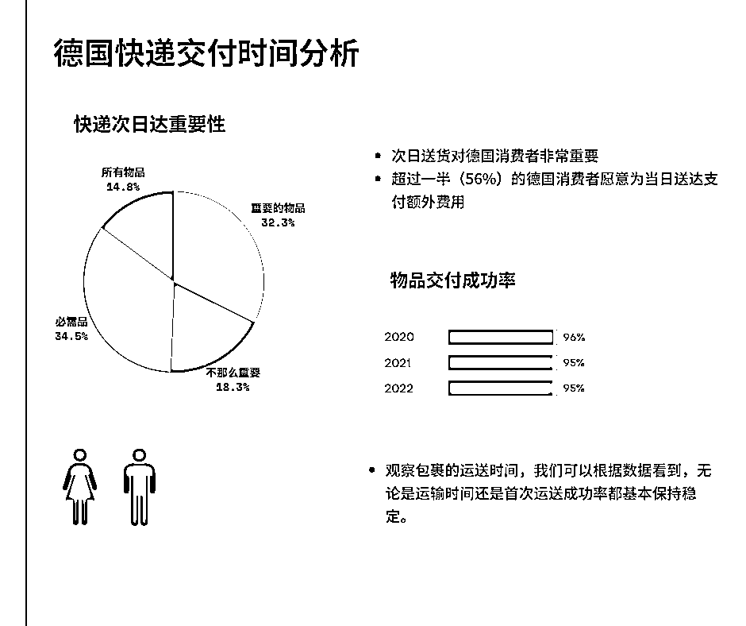

### 主要购物平台

德国的电子商务市场由多个平台组成，其中包括国际知名平台以及本土电商网站。以下是几个主要的在线购物平台：

1.  Amazon.de：作为国际电商巨头，亚马逊在德国市场占有主导地位，提供广泛的产品类别，从电子产品到日常用品都有销售。

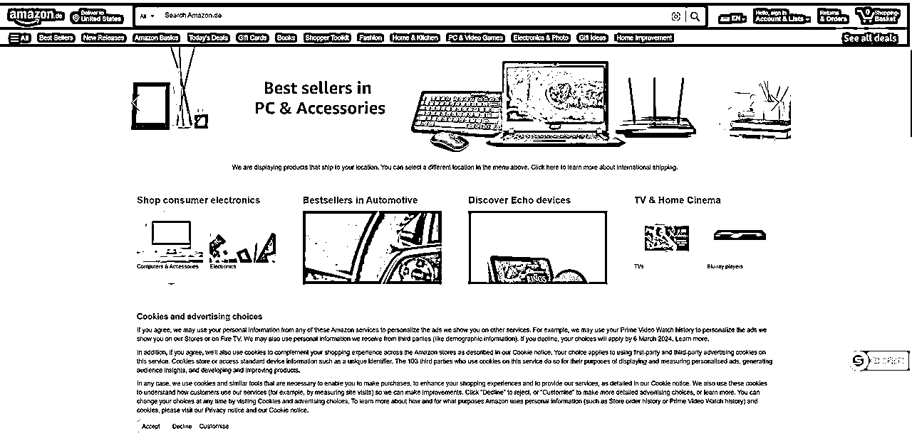

1.  eBay.de：eBay在德国同样非常受欢迎，既是个人卖家和买家的市场，也是企业卖家的平台，涵盖了各种新旧商品。

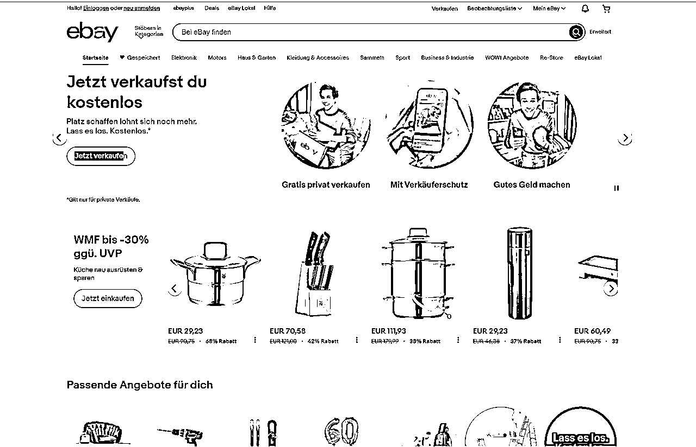

1.  Zalando：专注于时尚和生活方式的在线零售商，提供服装、鞋类和配饰等产品，深受德国消费者的喜爱。

1.  Otto：作为德国本土的大型电商平台，Otto提供家居用品、电子设备、时尚商品等多种类别的产品。

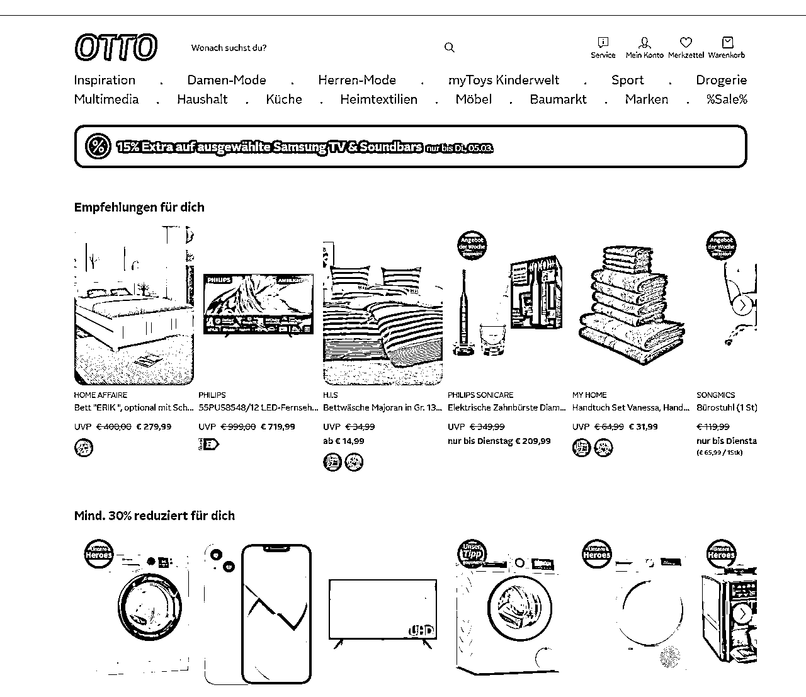

1.  MediaMarkt和Saturn：这两个主要面向电子产品和家电的零售商在线上也有很强的市场表现。

TikTok面临的竞争格局

*   德国的电子商务市场竞争激烈，国内外许多大型和中小型企业都在争夺市场份额。

*   Amazon.de是市场上的主导者，但本土电商平台如Zalando、Otto等也非常受欢迎,这种多样性表明，德国市场竞争激烈，既有利于专业领域平台也有利于广泛市场平台。 Tik Tok的切入是比较容易的， 兴趣电商的带动下，结合中国优质具有性价比的供应链，会推动新的一轮爆发增长

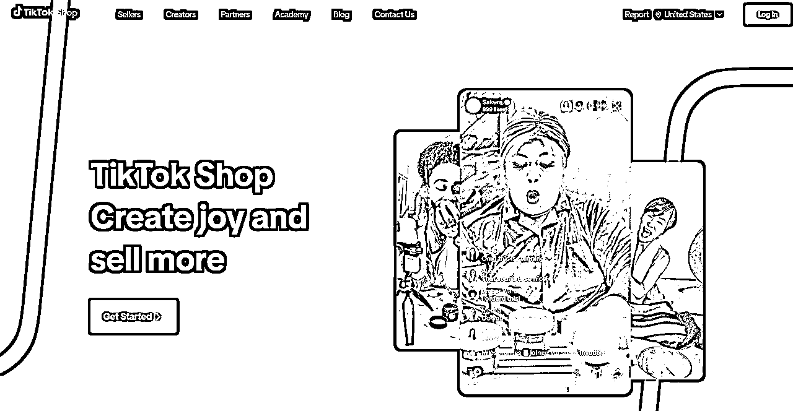

### 德国人的购物习惯

德国消费者在购物时倾向于注重产品的质量和可持续性。他们愿意为高质量和环保的产品支付更高的价格。此外，德国消费者通常比较谨慎，他们在购买之前会进行大量的比较和研究，价格比较网站和客户评价对他们的购买决策有重要影响。社交商务的兴起反映了德国消费者对购物方式的新期待，他们越来越多地利用社交媒体平台发现和购买产品。

#### 可靠性

*   产品质量和耐用性：德国消费者传统上重视产品的质量、性能和耐用性。他们倾向于选择那些被视为可靠和长久耐用的产品，这在汽车、电器和工具等高价值商品中尤其明显。德国制造的产品因其质量和工艺而享誉全球，德国消费者对本地制造产品有较高的信任度。

*   环境和社会责任：近年来，可持续性和社会责任也成为德国消费者决策过程中的重要因素。他们越来越倾向于购买那些环保的、对社会有正面影响的产品，特别是在食品、服装和化妆品等领域。

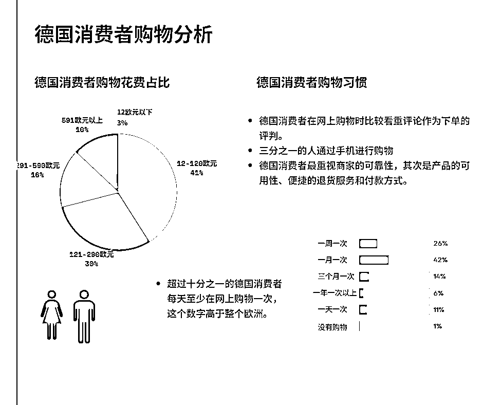

#### 名人背书

*   影响力营销：虽然可靠性是德国消费者考虑的重要因素，但名人背书和社交媒体影响者也在某些产品类别中扮演着越来越重要的角色。年轻消费者尤其容易受到名人和网络红人的影响，这影响了他们对时尚、美容产品和科技商品的购买决策。

*   品牌形象和认同：名人背书有时不仅仅是关于产品本身，更多是关于品牌形象和消费者想要与之关联的生活方式。名人背书的产品或品牌能够吸引那些寻求特定社会地位或生活方式象征的消费者。

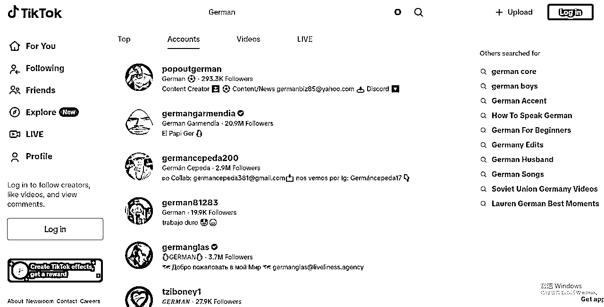

### 文化背景

### 德国文化强调效率、准确性和质量。这些文化特质也体现在消费者的购物行为上。德国人喜欢有序和计划性的购物体验，对产品的细节和技术规格非常关注。此外，德国是一个环保意识非常强的国家，消费者倾向于购买环保和可持续的产品。 语言

德国的官方语言是德语，几乎全国的居民都会使用。德语在德国的使用非常普遍，是教育、政府、媒体和日常生活中的主要语言。根据不同的来源，德国的英语使用率也相当高，是德国最常被使用的第二语言。

据估计，大约有56%到64%的德国人能够以英语进行交流。这一比率在年轻人中尤其高，因为英语是学校教育的重要组成部分，很多学校从小学开始就教授英语。此外，德国的大学中有许多课程是用英语授课的，尤其是在硕士阶段和那些针对国际学生的课程中。

尽管如此，德语仍然是德国社会和文化中最重要的语言，英语主要作为第二语言或国际交流的工具。在商业和科学领域，英语的使用也非常普遍，很多专业人士都能流利使用英语进行国际交流。

总的来说，德国是一个多语言使用的国家，德语占据主导地位，而英语作为一门重要的第二语言，在教育和专业领域中扮演着重要角色。

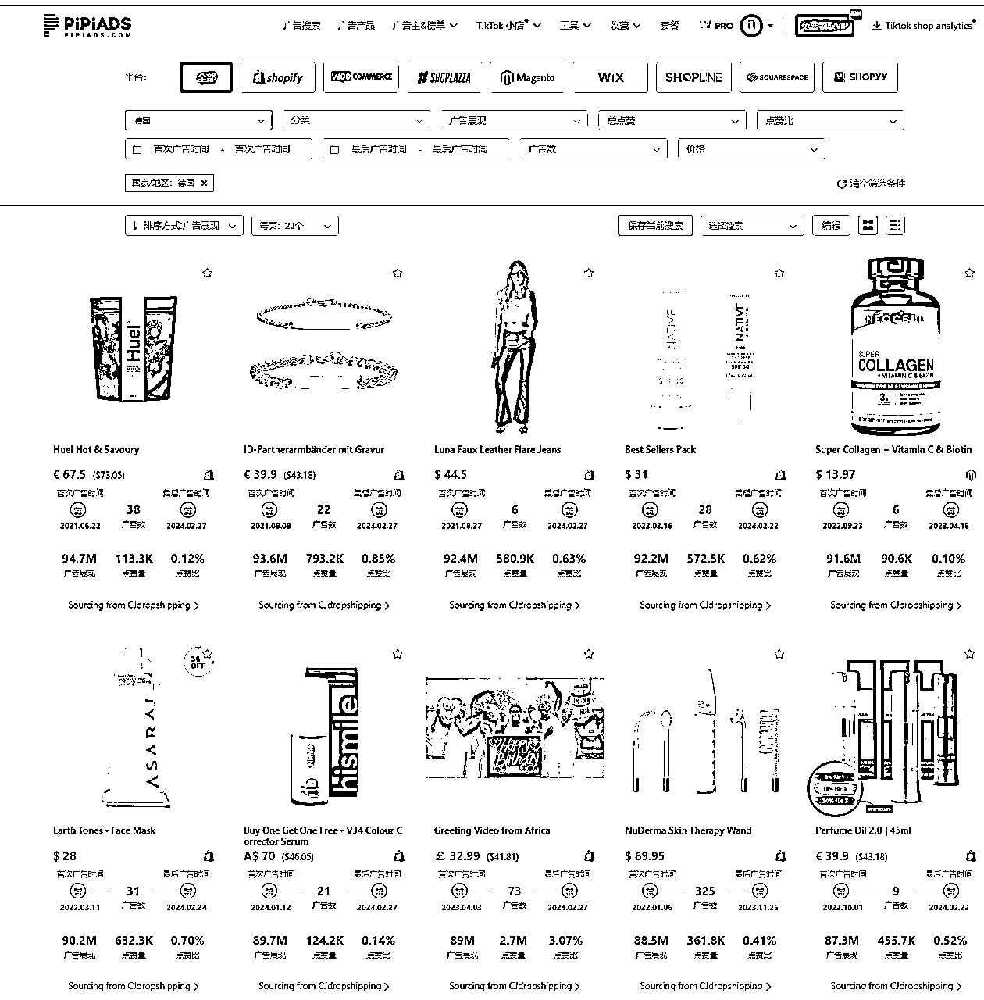

### 消费能力

德国是欧洲最大的经济体，也是世界上最大的经济体之一。德国人均GDP高，消费者具有较高的购买力。尽管如此，德国消费者在购物时仍旧寻求性价比，优惠和促销活动对他们具有吸引力。

### 物流基础设施

德国作为欧洲最大的经济体之一，拥有高度发达和效率极高的物流系统，这对于支撑其庞大的电子商务市场起着至关重要的作用。德国的物流基础设施全面，包括先进的交通网络、物流中心以及高效的尾程配送服务，为电商提供了坚实的后盾。

*   交通网络：德国拥有广泛的高速公路网络（Autobahn），覆盖全国各地，确保货物快速运输。此外，德国的铁路网络也相当发达，为货物运输提供了另一种高效选项。

*   物流中心：德国各地分布着大量的物流中心和仓库，这些设施使用最新技术进行管理，能够高效处理大量的货物流转。重要的物流枢纽如法兰克福、杜塞尔多夫、汉堡和慕尼黑等城市，都配备有先进的物流设施。

*   港口：德国还拥有一些欧洲最大的港口，例如汉堡港，它们不仅服务于德国国内市场，还连接着全球的贸易路线，对于进口商品的分发尤为重要。

### 尾程物流

*   配送服务：德国的尾程配送服务高效且多元化，包括传统快递服务、包裹站点、自动包裹柜（Paketbox）和最近兴起的快递自行车配送等。

快递公司：DHL、DPD、Hermes和UPS等都是在德国提供尾程配送服务的主要快递公司。DHL作为本土企业，尤其在德国市场占有重要地位。

### 支付习惯 在德国电子商务市场中，支付习惯和工具的多样性体现了其成熟和发展的电子商务生态系统。德国消费者在在线购物时倾向于使用多种支付方式，其中包括：

1.  信用卡和借记卡：在德国，信用卡和借记卡是常见的支付方式，尽管它们的使用率可能不如某些其他国家高。Visa和MasterCard是广泛接受的。

1.  直接借记（Direct Debit）：直接借记是德国非常流行的一种支付方式，允许商家直接从消费者的银行账户中扣款。

1.  银行转账：预付款或银行转账在德国也很普遍，尤其是对于大额交易。

1.  PayPal：作为一个国际性的支付平台，PayPal在德国享有高度的普及和信任，提供方便快捷的支付解决方案。

1.  支付后购买（Buy Now, Pay Later）：如Klarna等服务在德国也越来越受欢迎，允许消费者先收货后付款，或者分期付款。

1.  即时银行转账服务：如SOFORT Banking这类服务在德国也非常流行，它们允许消费者使用自己的在线银行凭据进行安全支付，无需预先注册或拥有信用卡。

1.  移动支付：近年来，随着智能手机的普及，移动支付解决方案如Apple Pay和Google Pay等在德国也逐渐增加了接受度。

### tiktok出海玩家面临的挑战和机会

中国企业家寻求进入德国电商市场面临多个挑战，包括克服文化差异、适应当地的法律和监管框架（如数据保护的GDPR）、以及克服语言障碍以便市场渗透。然而，也存在大量机会，特别是利用TikTok等平台进行社交商务，这在德国正处于上升趋势。通过了解当地消费者行为和偏好，如对质量、可持续性的需求和移动电商的增长趋势，中国卖家可以定制他们的产品和服务，以满足德国消费者的需求和期望。

德国的电子商务市场是受增值税（VAT）规则管控的一个重要部分。对于在德国进行电子商务活动的企业来说，了解和遵守当地的VAT规定是非常重要的。

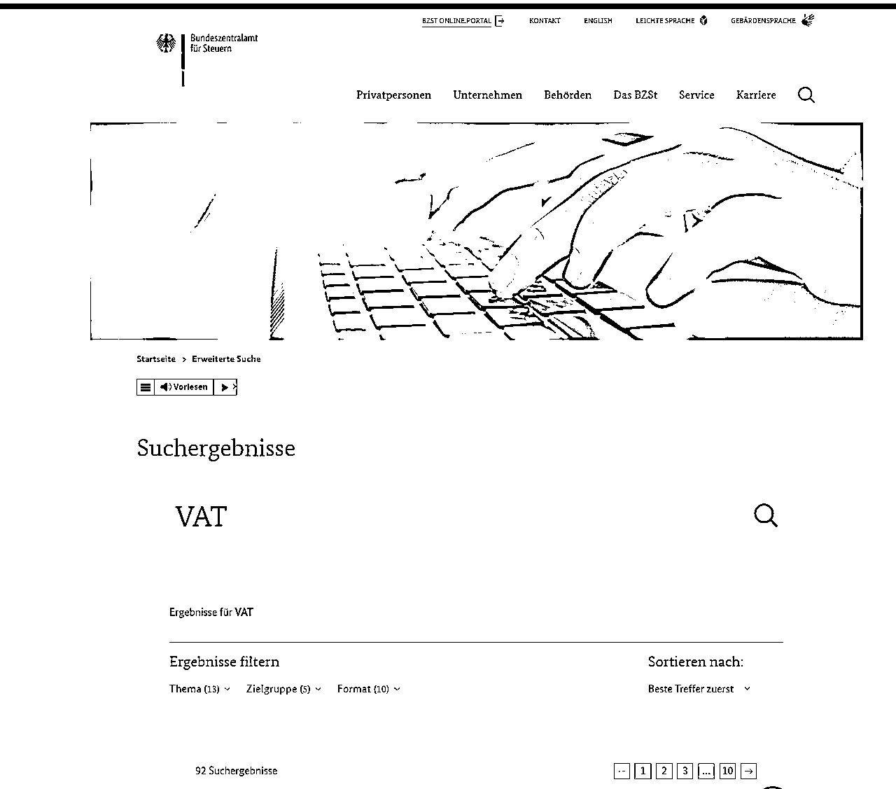

### 德国VAT的基本规定

德国的VAT制度要求在德国销售商品或提供服务的企业，不论其是否在德国设有注册地或营业地，都需缴纳增值税。对于电子商务企业，这包括向德国消费者销售商品或提供电子服务。

### 电子商务的VAT征税阈值

自2021年7月起，欧盟对跨境电子商务进行了重大VAT改革，废除了各成员国的VAT征税阈值，引入了欧盟范围内的统一征税阈值€10,000。这意味着，只有当企业的年度销售额超过€10,000时，才需要在其他欧盟成员国注册并缴纳VAT。这一规则同样适用于德国。

### 德国的One-Stop Shop（OSS）

OSS系统允许企业在一国注册并报告其在所有欧盟成员国的销售，简化了跨境销售的VAT报告和支付流程。通过OSS系统，企业可以减少在每个成员国单独注册和申报VAT的负担。

### VAT报告和支付

德国的VAT报告周期可能是月度、季度或年度，具体取决于企业的VAT应缴总额。通常，如果前一财年的应缴VAT超过€7,500，则需要按月报告。如果低于此金额，则可能按季度报告。在某些情况下，如果应缴VAT不超过€1,000，企业可以选择年度报告。

所有VAT报告都必须通过德国税务局的电子系统（ElsterOnline）提交。支付VAT时，需使用指定的银行账户，并确保在转账备注中正确标明税号和缴税期。

### VAT退款

如果企业支付的输入VAT超过了收取的输出VAT，可以申请退款。德国税务局通常会自动处理这些退款，将款项退还到企业提供的银行账户。

### 物流和履行

高效的物流和履行对电商成功至关重要，尤其是在德国这样的成熟市场。挑战包括管理跨境运输成本、导航复杂的关税制度、以及满足德国消费者对快速可靠交付的高期望。与当地物流提供商合作和利用德国强大的基础设施可以帮助缓解这些挑战，确保从订单到交付的顾客体验的顺畅过程。

### 总结

TikTok及其他社交商务平台为进入德国电商市场提供了前所未有的机会，但成功需要对当地生态系统有细致的理解，从消费者偏好到物流复杂性。对中国企业家而言，这意味着不仅要适应德国市场规范，还要利用他们在产品创新、数字营销和电商运营方面的独特优势，来吸引和参与多样化且成熟的消费者群体。

德国的顶尖电商网站展现了市场的多样性和竞争性，包括Amazon Germany、eBay Germany、Otto和Zalando等，它们提供从电子产品到服装和家庭用品的各种商品【16†source】。德国消费者的在线购物行为包括对质量和可持续性的偏好，移动电商的增长，以及独特的支付偏好，其中PayPal和移动钱包如Google Pay和Apple Pay受到高度欢迎。社交商务的兴起以及使用更广泛的购物设备，如智能电视和智能扬声器，显示了德国电商环境的演变。

出海企业家在德国市场面临的挑战包括文化差异、法律和监管框架的适应，以及语言障碍，但通过了解德国消费者的行为和偏好，这个成熟的市场中蕴含机会。

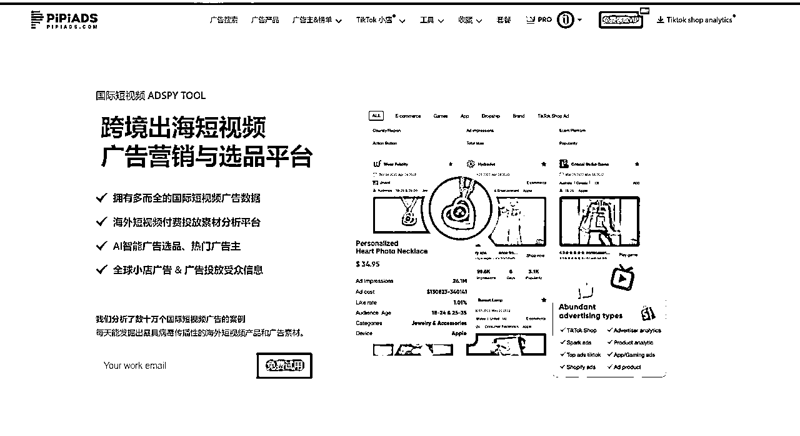

德国是一个电商市场成熟、消费者购物习惯成熟和多样化的国家。为了深入了解德国电商市场，我们需要探讨德国人的购物习惯、文化背景、消费能力以及物流基础设施等方面。

### TikTok的德国电商环境

TikTok在德国的快速增长为品牌提供了一个独特的电商机会。通过“TikTok Shop”等功能，商家可以直接在平台上展示和销售产品，利用短视频和直播吸引和转化潜在顾客。然而，成功利用TikTok进行电商活动需要对当地市场的深入理解，包括用户偏好、消费习惯和最新的电商趋势。

### TikTok与其他社媒渠道的对比

与Instagram、Facebook等传统社交媒体相比，TikTok提供了更高的用户参与度和独特的内容创作工具，这使得品牌能够以更互动和创新的方式与目标受众建立联系。TikTok的算法也优化了内容的可见性，使得即使是新品牌也能快速获得关注和流量。

### TikTok电商与其他平台电商的优劣势

优势：

*   高参与度：TikTok的内容形式和算法鼓励高度的用户互动。

*   年轻受众：TikTok吸引了大量的年轻用户，为品牌提供了接触下一代消费者的机会。

*   创新的营销方式：通过挑战、标签和其他互动元素，品牌可以创造性地推广产品。

劣势：

*   竞争激烈：随着越来越多的品牌进入TikTok，获得用户注意力的难度增加。

*   内容创作挑战：成功的TikTok营销需要高质量和吸引人的内容，这可能需要专业的创意和制作资源。

热销电商产品类目

根据市场趋势和消费者偏好，以下是目前在德国电商平台上的热销产品类目：

*   电子和家用电器：高科技产品和家用电器一直是电商平台的热销品类，尤其是智能手机、笔记本电脑、家庭影音设备等。

*   时尚和服饰：随着消费者越来越多地转向在线购物，时尚和服饰成为电商平台的重要销售类目，包括品牌服饰、运动装备和时尚配饰。

*   家居和园艺：家居装饰、家具、园艺用品等因其在线购物的便利性而成为热门类目。

*   健康和美容产品：健康补充剂、护肤品、化妆品等产品在德国消费者中也非常受欢迎。

### 潜在热销产品类目

考虑到消费者行为的变化和市场趋势，以下几个类目有潜力成为未来的热销产品：

*   可持续和环保产品：随着消费者对环保意识的提高，生态友好和可持续生产的产品可能会见证需求的显著增长。

*   智能家居设备：随着技术的进步和智能家居概念的普及，智能灯泡、智能插座和家庭自动化系统等产品有望成为新的增长点。

*   个性化和定制产品：从个性化礼物到定制服饰，消费者对于能够体现个人风格和偏好的产品需求日益增长。

*   健康和健身装备：由于疫情期间健康意识的提升，家用健身装备和健康监测设备的需求可能会持续增加。

德国电商市场的竞争格局和消费者偏好正在不断变化，对企业而言，理解市场趋势、消费者的购物习惯和文化背景至关重要。对于寻求进入德国市场的中国企业家和品牌来说，深入了解并适应这些趋势将是成功的关键。

*   可持续和环保产品：反映了德国消费者对环保和可持续性的高度重视。企业应考虑如何在其产品和供应链中融入可持续实践。

*   智能家居设备：随着智能家居技术的发展，提供创新和易于使用的智能家居解决方案将满足消费者的需求。

*   个性化和定制产品：展示了消费者对独特和个性化产品的渴望。品牌可以通过提供定制选项来吸引消费者。

*   健康和健身装备：强调了健康和健身在消费者生活中的重要性。特别是在疫情后，家庭健身设备和健康监测工具的需求有所增加。

德国的电商市场提供了广泛的机会，但同时也要求企业对市场有深入的理解和适应。成功不仅在于提供高质量和符合消费者需求的产品，还需要有效利用德国先进的物流和配送网络，以及理解和适应德国特有的消费者文化和购物习惯。通过关注市场趋势和消费者偏好的变化，以及不断创新和优化产品供应，企业可以在德国电商市场中获得成功。

tiktok独立站投放案例

德国TikTok投放营销案例一：刻字手镯套装

累计投放广告展现9360万播放

售价€39.9，拿货成本￥7.6

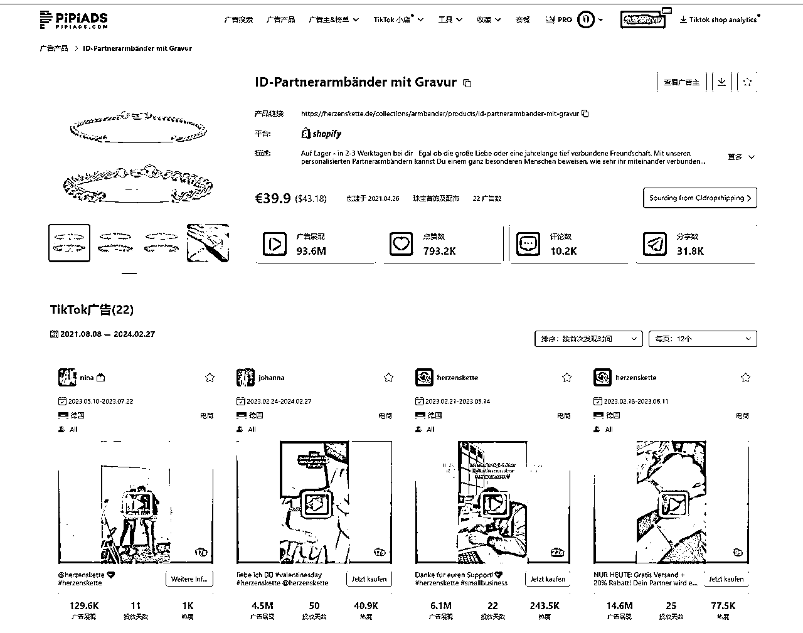

https://www.pipiads.com/product-search/6267d98e3a879868acae17ee/

1460万播放广告素材：网站展示+线下场景展示+情侣人群定向

德国TikTok投放营销案例二：字母手环

累计投放广告展现4520万播放

售价€19.9，拿货成本￥6.9

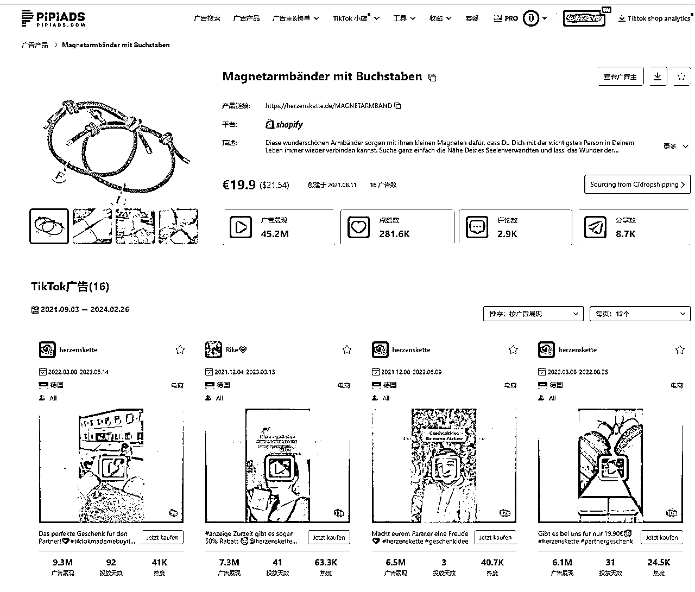

https://www.pipiads.com/zh/product-search/6274f66bd84aa03f9f6f7cb2/

930万播放广告素材同样用了一样的脚本套路：网站展示+线下场景展示+情侣人群定向

德国TikTok投放营销案例三：睫毛套装

累计投放广告展现4320万播放

售价€29.99

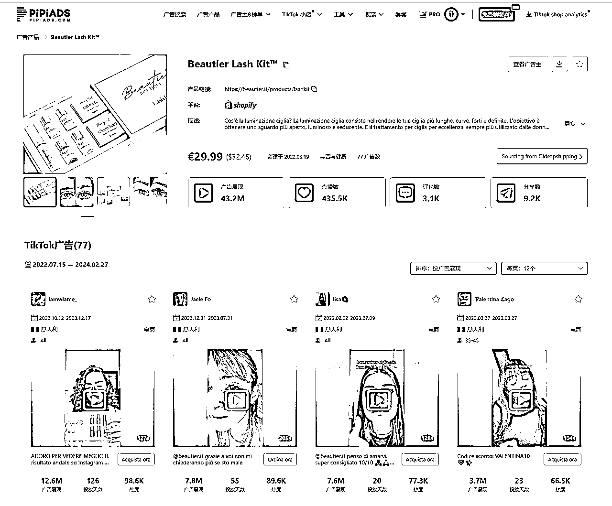

https://www.pipiads.com/zh/product-search/62d99acec5861b70531eff1e/

1260万播放广告素材：真人出镜+讲解+演示效果

德国TikTok投放营销案例四：连帽衫

累计投放广告展现4170万播放

售价€39.95

1688拿货￥32.99

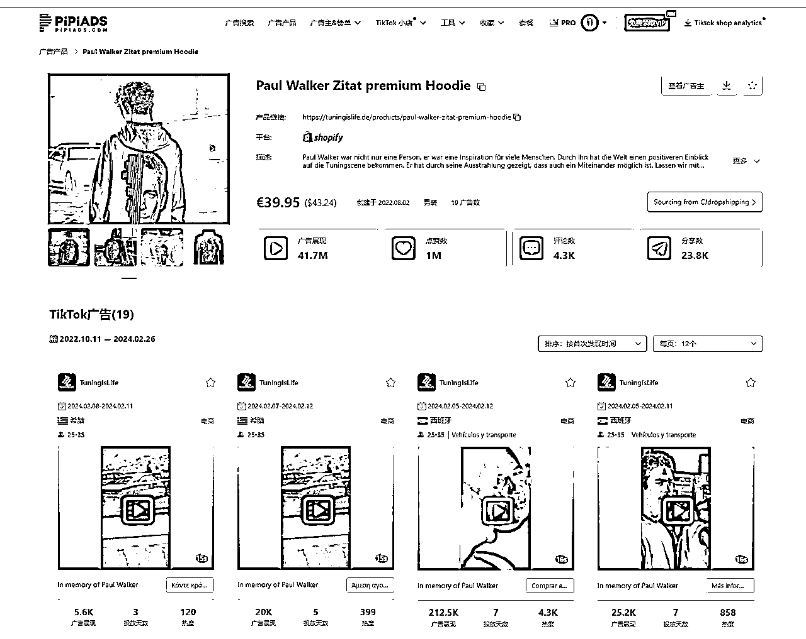

https://www.pipiads.com/zh/product-search/63479bd8b7fc56094fe5aa91/

160万播放广告素材：ip定位+产品图混剪

德国TikTok投放营销案例五：贴身内衣

累计投放广告展现35800万播放

售价€22.99

1688拿货￥3.88

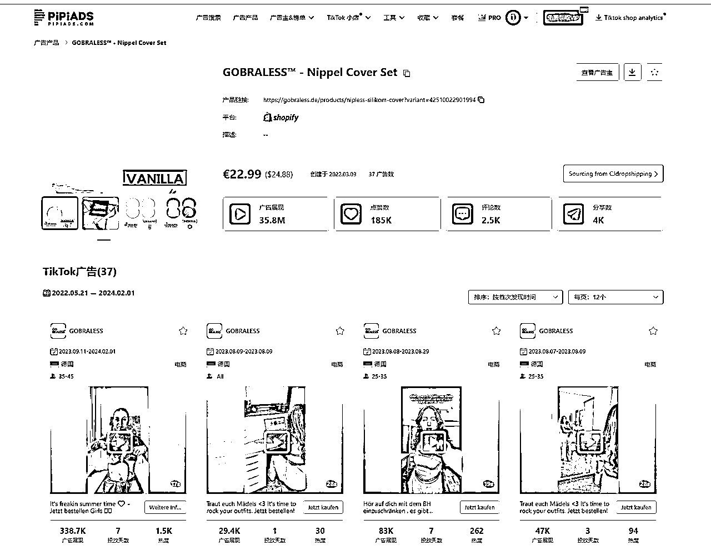

https://www.pipiads.com/zh/product-search/628c254ab663a328e6ebe70c/

620万播放广告素材：产品功能+解决痛点

结论

TikTok为进入德国市场的中国电商提供了前所未提供的机会。这个平台能够连接品牌与年轻、活跃的用户群体，提供了创新的内容创作和营销方式。

两年前到至今的玩法，依旧是走差异化测试

美区爆的品，搬到欧洲发达小国

南半球爆的品，搬到北半球

因为欧洲的人口和体量摆在那里，再加上电商非常成熟

我个人推测后续低价供应链步入欧洲会有一波爆发期。像成熟的电子产品，或其他产品，相对竞争力有待数据反馈

后续更多冲动特别而质量好的产品也可以到德国市场进行测试。

建议大家在进入德国Tik Tok市场前，先通过pipiads获取德国广告主的营销情况和产品类型后，在进行相关规划

建联：17684058749