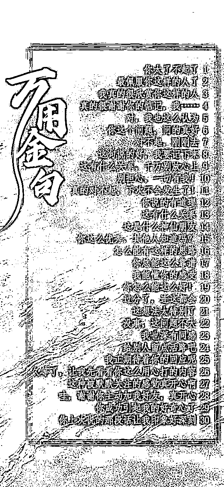
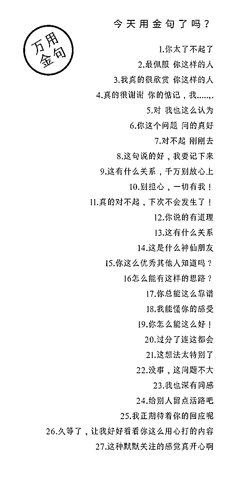
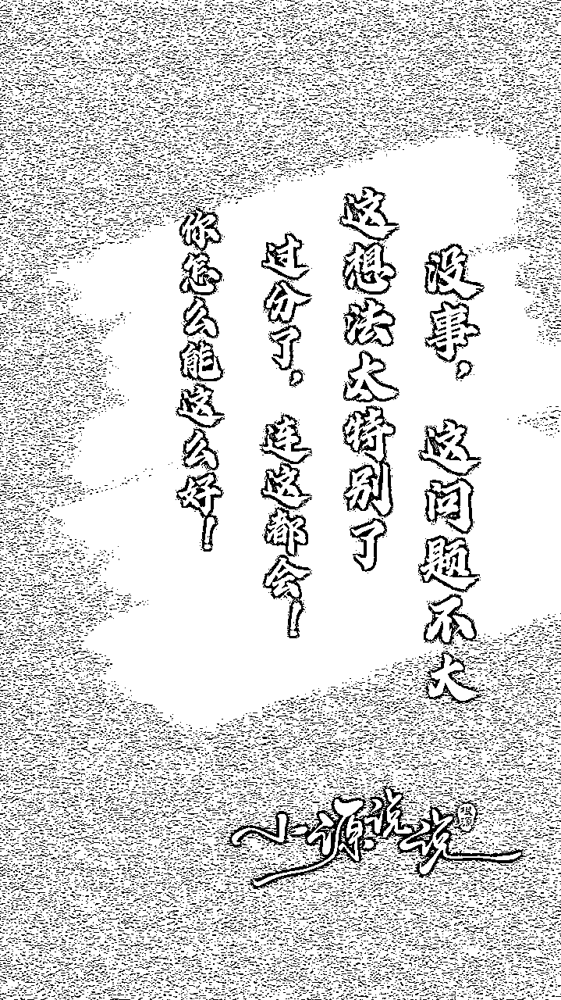
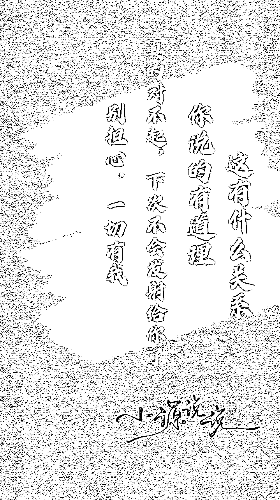
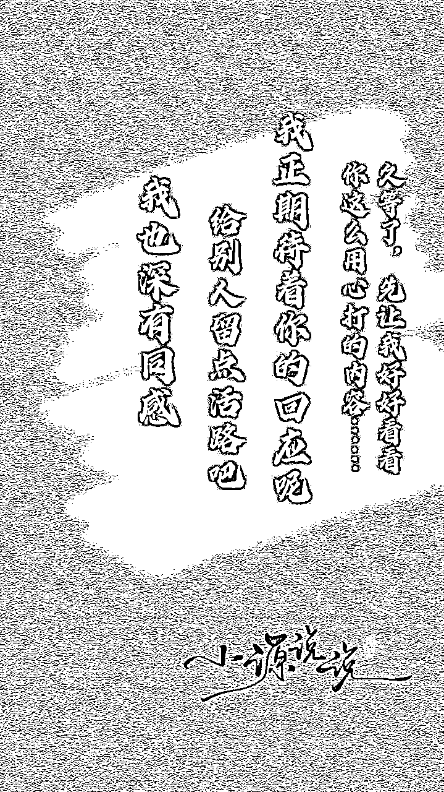
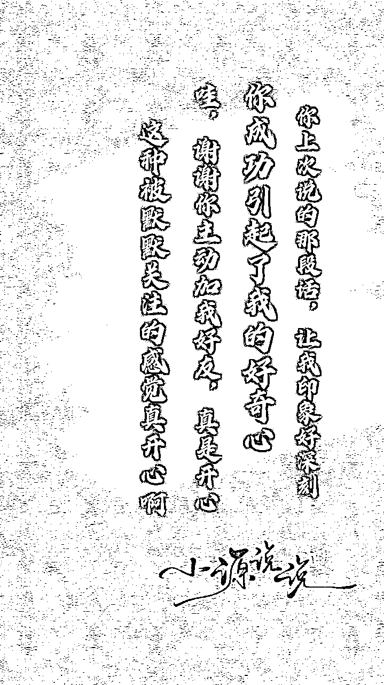
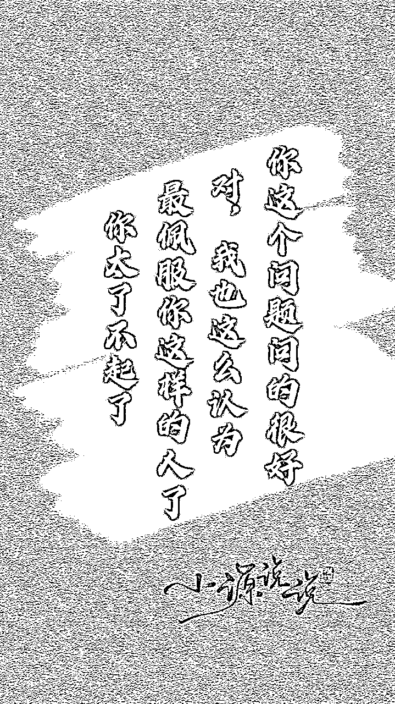
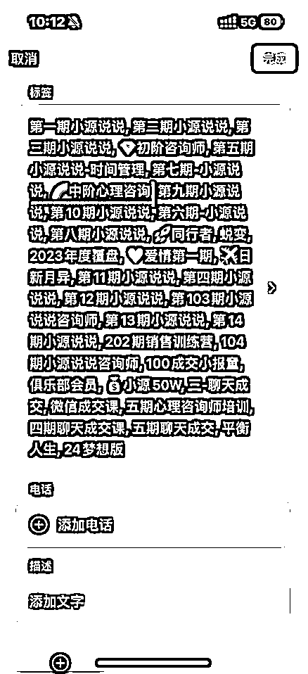
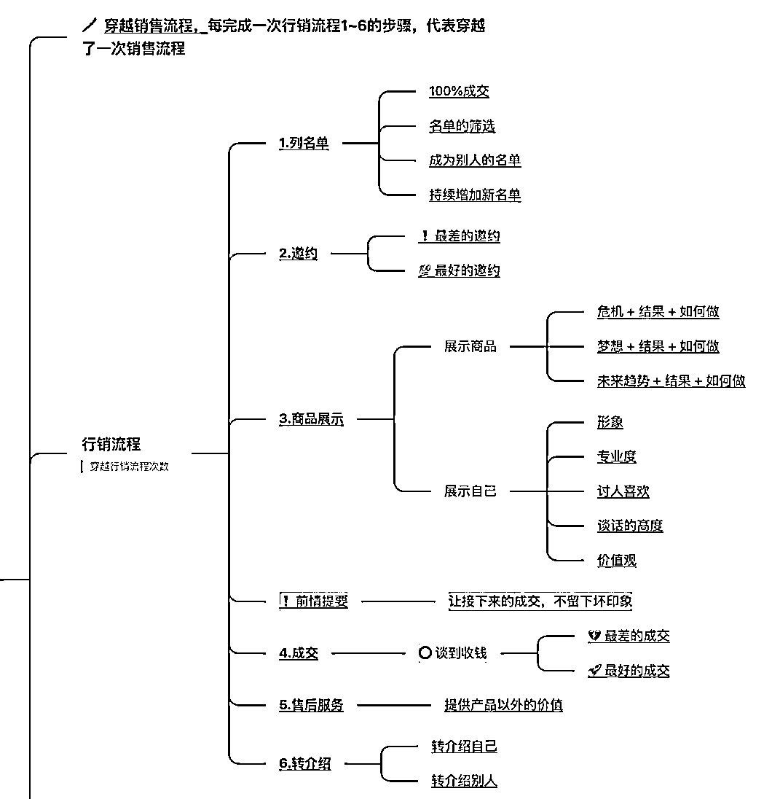
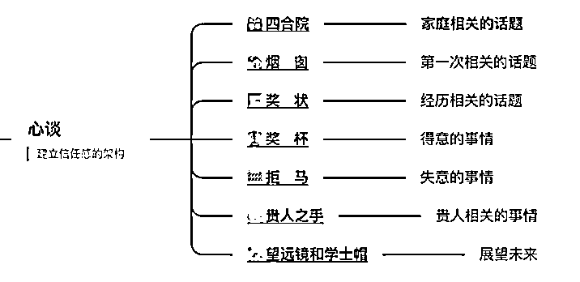

# 作为没有企业背景的个体，如何有步骤性地成交累计300万的高客单产品？

> 来源：[https://oee5lr7gsk.feishu.cn/docx/ZOaJdJTSuoflJfxSVIwc5xpCnNh](https://oee5lr7gsk.feishu.cn/docx/ZOaJdJTSuoflJfxSVIwc5xpCnNh)

全文共：14,093 字

预计阅读时间：13.314 分钟

圈友们好，我是根源

我想成交高单价的产品，应该是所有交付者以及所有销售员最终的梦想，

尤其就个体来说，一个销售员能够一单收个大几万，大几十万，

这个心里面一定会有满满的成就感。

当然，收一个大金额的单子，更可以大大的增加赚钱的效率，

以及优化自己的交付时间。

但是真的要能跟客户收到一笔大钱谈何容易，

尤其在一个没有企业背景，只有个体的情况之下，要收大钱真的不容易。

备注：

文章中定义的高单价是8000元以上的产品。

开头也附上，这两年收高单价的一些成绩。

备注：

我自己的私域，大概在1200人左右，这个成交的数字跟金额，都是在这1200人中转化出来的。

* * *

# 为什么高客单价的产品/服务，客户要选择跟你买？

在过去的时代，要让客户愿意为你支付这么高的金钱，其实有专业就够了。

又或者是刚好你卖的产品符合客户的需求。

那个时候的高单价，其实会比这个时代要来的更好收，

除了需求相对单一之外、资源相对单一，还有一个是，客户身边不会有这么多的业务员。

所以那个阶段的高单价会比现在要来的更容易。

同时还有背景的关系，其实在近几年，多数人赚的钱都慢慢变少。

然后有钱人的圈子又如此的精准，也就是有钱人的圈子都会留在有少数人的手上，

所以要想可以打打入一个高质量圈子，这个事情是非常不容易的。

所以这篇内容可能就不会谈『如何能够让自己获得一个高质量的圈子』，

而是怎么从普通圈子里面，也可以找到

能够愿意为你支付高单价的客户，又或者是学员，又或者是学生。

回到前面说的，过去时代，2w元以上的产品能不能够成交，

我觉得透过

*   靠能力

*   靠专业

*   靠对方是否有需求

我觉得就足够能收到过万的产品。

但是一直到了近两年，我发现要让客户愿意为你支付万元以上的产品，

单纯专业，单纯好的能力，单纯需求，已经不足以让客户愿意为你掏钱。

而是

### 客户在付钱的过程要有一种好的感觉。

也就是要能够收到万元以上的单价，产品除了专业之外，

你还得在销售、经营的过程，让客户的心情是好的。

而不是客户付了这笔钱之后，会非常的犹豫，又或者是内心中会感觉不舒服。

因为要把自己的产品说的很专业，要能够清楚的精准知道客户的需求，这事情并不难。

这是身为一个交付者又或者一个销售员本来就应该具备的能力，也能说是『本分』。

既然这个能力不是这么的困难，也并不难练，

仅仅只有专业、好能力

为什么客户要把这笔钱付到你身上呢？

### 你一定得有额外的能力，是其他业务员所没有的。

### 我也把这个能力称为：『情绪价值』。

我想这个词大多数人都听过，

对于一个单价越高的产品，交付的东西一定得提供越多的情绪价值。

那要怎么为情绪价值做出定义呢？

如果说可以把情绪价值做一个更精准的定义，

就代表这个事情是可以复制的，这事情是可以操作的。

我自己对于情绪价值的定义是这样的：

* * *

## 情绪价值的第一层定义：共情能力

第一个是能站在对方立场思考的能力，也能说共情能力。

什么意思呢？

就是我做任何事情之前，又或者是透过沟通经营客户、朋友时

在打出所有的话以前，我一定会先思考这个话说出去之后。

对方『可能』会有什么样的感受

如果我都清楚的知道这句话说出去，对方会有不好的感受，

我可能就会问自己：

有没有更好的说法、更好的表达方式、更好的顺序

能不能够把我想表达的逻辑做一个转换、调整。

举个例子，

可能今天我和某一个客户介绍完产品，然后我就直接说：

这个产品的金额是2万，

你要怎么付款？

我可能觉得前面的信任感已经做的很不错了，

所以，直接开口要钱应该是可以的。

这其实是一种『误会』

对于『收钱』来说，

不管信任感有多高，一定要谨慎

毕竟，这个举动要让客户从口袋中掏出他辛苦赚的钱

更细心一点的想，如果今天我是客户，可能会有这样的想法：

虽然有不错的信任感，但过去的聊天中，没有特别说到产品价格，只是聊起来感觉还不错。

虽然我也知道这个产品可能是多少钱，但我觉得还需要考虑。

那我们要怎么做，可以让这个举动变得更贴心？

我会在讲价格之前，会多一个询问：

刚刚这么开心的聊下来

我知道你目前有这个需求

这个产品虽然是我特别的邀请你，

但依旧是一个价格不便宜的产品

费用是XX

那我能知道一下

就是如果是这样子的金额

是不是刚好也在你的预算范围之内？

不说这一段话，最终客户依旧有可能付钱，

但是多了这句话，就可以让客户感觉到你，你体贴到他了，

你多让他有一个考虑空间、以及多让他有一个台阶下。

我对于销售有个定义

销售的过程，比起最终是否收到钱

更重要的是

能不能让客户对你有『好印象』。

在举个实际案例：

这是我的某位学生给我发的，发完后问我：老师，为什么客户看到这里后就不回我了？

我说：

你看一下红色框框之前的所有对话

没有任何一段谈到『多少钱、实际的费用』

如果是我，就会再发红框框的价格之前多说一段

很谢谢你愿意考虑这事情，因为我刚刚都没有提到价格

虽然这是我对你的邀请，但也先说一下产品价格

费用是XXX元

同时，也能让你在进行一次考虑

不知道如果是这样的价格，是否也刚好在你的预算范围内

接著，我才会打上图片中红色框框的内容

也就是，这『台阶』给出之后，有可能他最终的决定是不购买，

但是就算不要，他也会对你有很好的深刻印象。

我觉得这是一种共情能力，也是一种『为对方着想』的一种比较通俗的场景。

又或者是这客户我已经经营了好一阵子，

然后也约好了今天要给我付钱，今天要购买一个几万块的产品，

结果一早起床，我看朋友圈的时候发现这个客户的家里出了点状况，

那这个时候我到底要不要去要钱，我到底要不要按照原本的进度跟客户收这个钱？

我认为收还是得收，但是我可能就会在聊天的顺序上做一点转换，

我可能会先关心，就是：

哎，

我今天看到你的朋友圈

然后想知道一下

这个事情我能不能够帮上点忙

因为感觉这个事情这个挺棘手的

在关心日常的过程，

虽然已经知道客户跟我约了今天要付一笔比较高额的费用，

但我可能关心完之后，我不会提收钱这回事，

我也不会提原本已经约好今天要成交，

这个事情我会让客户等事情忙完之后主动跟我说。

我过去有犯过一个错，

就是因为毕竟做业务需要业绩嘛，有业绩才能够有生活费。

那这个月生活费都捉襟见肘，这张单子可以养我三个月，

就我都知道客户今天出状况，但我因为我的生活需要钱。

所以我关心完之后依旧开口跟客户说：

哎，对了

我们今天有这个约好

要去跟你把合约签了

不知道你有没有空？

曾经因为这个举动，让我就这么损失了一个客户。

损失了一个很大单子的客户，是一个过百万单子的客户，

因为那个举动并不体贴。

所以我觉得情绪价值的第一个点就是

### 我能不能够在做任何事情之前多为客户着想一点。

因为当我能够多为客户着想，他的心里就会舒服，

他就会觉得，我们之间并不是这么的利益，以及我们之间并不是只有利益关系，

而是你真的有把我的感觉，把我的需求放在心上，

你真的有把我这个人跟其他那种一般的客户做出一个很大的区隔。

* * *

## 情绪价值的第二层定义：真实性

我对情绪价值的第二个定义叫『真实性』。

什么叫『真实性』呢？

### 就是我跟客户相处的过程中，跟我自己性格的本身有没有相同。

有大多数的客户，之所以最后不会想再被这个销售员服务，是因为他太假了。

跟我聊天的时候是一个样子，但是私底下的他又变成另一个样子。

这个会让他感觉到被欺骗，又或者是你是不是因为只为了收我的钱，

所以你要用另外一种方式讨好我，

又或者是假装用另一种方法，你知道我喜欢这样，所以你就这么做，但这不是真实的你。

就可能这个业务员在服务客户的过程，在追踪客户的过程，

会在辅导感情的时候，或者是聊感情的情况，把自己说的很好，

目的只为了用类似案例，跟客户产生一个共鸣。

结果最后当快成交的时候被客户发现，

怎么原本你跟我说的你自身的感情状态都是假的，都只是骗我的？

所以我觉得真实性是

销售员是否在服务的过程能不能够知行合一。

就是：我说什么我就是一个什么样的人，

我说的跟我表现的、跟我在业务上呈现的状态、跟真实的我

是一个一模一样的人，而不会有太大的反差。

我举个例子，

我以前认识过一个老师，

在读大学的时候，那这个老师是一个教卜卦的，

然后他在当时在那个地方是个非常有名的老师，

然后因为我觉得很厉害。

于是就花了钱跟这个老师学了大概有三个月，

结果有一天我就发现这个老师他在每次下班之后，

就是道馆关闭之后都会去赌博，

从那次开始，我就对这个老师的印象有所改变，

就是怎么你在表面上的样子跟你私下的样子完全不一样。

这老师明明上课都说人不应该赌博，人应该接触好的能量，

人应该学会反省，人应该知道自己的命运之后要学会去改变，破格，

但怎么你自己这么教，但是你却做不到，这时候我心里的感受就不好。

这就是我谈到的第二个真实性，

一个有真实性的交付者，他能够给客户有更好的情绪价值，

因为会让客户不会有一种落差感。

这个落差感发生的太大，就会让客户感觉到被欺骗，

只要客户一有被欺骗的感觉，他的情绪就不好，所以这是第二个我对于真实性的定义。

* * *

## 情绪价值的第三层定义：了解客户

我对于情绪价值的第三种定义叫『了解』。

为什么会这么说？

因为当我能够真的去了解客户，我就能够不只是把他当客户，而是可以把他当成朋友。

同时也能因为对于客户有更多的了解，

我就能够更细致的知道他有什么样的需求，以及他的近况，发生什么样的事情，

以及也能够从他的过去，在聊天的过程，可以给出更多的认同，更多的夸奖。

### 所有的高单价成交，『私交』会变得非常重要。

这边谈到的了解

并不是因为我为了想跟客户收到钱，

所以我不得不去了解他，不得不去刻意的对他有更多的认识。

而是这是一种人与人之间相处的习惯，我能不能够对于每个人有多一点好奇，

而不是只为了我要达成某种目的，我才去做这件事情。

所以这种了解，是针对每一个人，

而不只有针对我想要跟他成交的角色，又或者是对象。

* * *

## 情绪价值的第四层定义：好好说话

我对于情绪价值的第四个定义就是『好好说话』。

我发现好好说话很困难，那我对于好好说话的定义其实就两个，

*   第一个是「学会夸奖」。

*   第二个是「学会认同」。

就像是：

哎，

我发现你的这个文章写的很好

又或者是

你刚刚描述的那个过去的经历

我发现在那个时候

你能够有这样的处理事情的方式

非常的厉害。

如果是我，

可能就不会有像你这么好的处理

又或者是客户在说一些比较有批判性事情的时候，

可能这个事情客户确实是错的，但在最初的回复我可能就是说：

我能懂你的感受

我其实很认同你的处理方法

我觉得这个处理方式，

会比我想到的要来的更好

之所以会把这个定义成情绪价值的第四阶段，

是因为

### 大多数的人要的其实不是「对错」，而是一种「认同感」。

就是你能不能懂我，我其实知道我是错的。

但是你要懂我，你要懂为什么『我都知道是错的，但我依旧这么做』，

这个是种认同感。

就很就很像是夫妻间吵架，有时候当老婆说了一件事情，结果我跟她讲理。

结果一讲理，我老婆就更生气了，

因为她的想法就是，

我现在那么的悲伤，

你不应该先来抱抱我吗？

你怎么会跟我讲理呢？

所以认同感其实是

一种放大「客户或者朋友对于关注的这件事情」的被理解。

这里附上一张，我自己的常用认同加上沟通的金句总览，這些都是我平時聊天过程中，会放在语句的前面、中间、或者是后缀。

因为是一种沟通习惯，所以都是实测过好用的。

（有不同的模版，都一起分享上来）

## 好好说话，就是让认同感发生最好用的方式。

* * *

# 高客单价成交是一个两情相悦的过程

接着高单价产品的成交绝对不是快速能够完成的，一定需要时间，

因为高单价产品的客户，大多都是原本就有著不错的收入状况、也有支付的预算。

但是，你要如何让他愿意把更多的钱付到你身上，这是需要培养的。

因为当进入到更高单价的成交，信任感就变得非常重要，

信任感就一定得让你跟这个客户的交集能够变得更多，

因为交集多，他才可以对你更了解，你也才能对他更了解。

因为这一类的产品（高客单产品）

### 要的已经不单纯只是单方面的认可，而是双方面的认可。

那什么叫单方面的认可？

今天我是个非常专业的人，我的沟通以及销售教的非常非常的好。

然后刚好我的这个能力，客户是有需求，

所以，他觉得只要把钱付给我，应该就能够提升自己的沟通以及销售能力，

因为我也不需要管这个客户是不是我要的人。

反正他需要他找我，我就跟他收钱，这只能属于单方面的认可。

那双向的认可

就是不止这个客户他需要我的能力、需要我会的东西，

同时我也能知道这个客户的价值观，

以及这个客户的感觉、客户的背景、待人处事是我也喜欢的，是跟我的气场比较合的，

这个就叫双向的认可。

### 因为一个高单价的交付，伴随着一定是相对长时间的交付时间，

那既然交付时间长，如果说两个人不和，又或者是双方彼此有一方不认可，

就没有办法让交付的过程可以轻松、有效率，只会越相处越消耗。

所以一个高单价产品的成交一定要透过长时间累积，双向的认可。

就是我必须得了解他，同时我还得做很多的举动，让对方可以更了解我，

这个是可以有助于高单价产品成交那一刻的成功概率。

这边也能说想成交高单价，必定是一个你情我愿，两情相悦的场景，

而不能只有我喜欢你，所以你得跟我在一起，

这是「高单价产品」跟「低单价产品」的一个很大区别。

也就是想成交高单价，绝对不能太急躁，急躁肯定收不到大钱。

也因为这样，大多数的高单价成交，

我大概都会给出三个月到半年时间的追踪，我才会评估这个人到底适不适合让我跟他收钱。

又或者是我跟这个人到底适不适合有这么高价格的相处，

所以我会把时间拉长，这个时间过程中，

同时我也在评估他，同时他也在评估我，

所以我会说，这是一个两情相悦的过程，而不只是单方面的单恋。

* * *

# 如何有步骤性、更有效率地成交高客单产品？

## 成交流程的节奏——行销流程

接着成交高单价产品有一个很大的关键在于节奏，

这个节奏首先谈到的是

你有没有自己的一套，从零到最终他给你付更高单价的流程？

像我自己的处理经营客户节奏就会有六个步骤，

从「列名单」到「邀约」，到「商品展示」，

到「成交」，到「售后服务」，到这个人愿意为我「转介绍」，

这是我自己经营客户的节奏。

### 列名单

列名单其实很容易理解， 这把客户的名单罗列下来

那这里列名单更重要的一个点就是，因为要成交高客单的产品，

那其实列名单的过程也是一个筛选的过程，就是说我到底什么样的客户可能是我可能重点会经营的客户。

从名单写出来的那一刻，就是筛选的开始，有大多数想成交高单价的销售，甚至没有一个属于自己的名单册，这会是个大问题。

互连网的时代，还有另一种更简单的列名单方式，就是微信的打标签。

举个例子，我有个学生的标签是这样的

这个学生是2022年，我的第一堂沟通课就开始报名，131.4元开始向我付费，接著第二期也来、第三期也来、第四期也来、谘询师培训也来。

从100多到900多、再到8000多，因为当时的标签，我能知道这学生对我的认同感是很不错的、信任感也不错。

能连续报名这么多期，一定是相对认同我的价值观，到了图片上我画的红色线条，我就对他发起了终身教练的邀请，当时的终身教练是10万元，一开口他就答应了。

之所以这么顺利，是因为我用了接近半年的时间观察、经营、筛选，同时他也在观察我。

所以，一个好的名单整理，不管是有一本名单册子、又或者是用微信的标签也好，反正一定要有属于自己的名单本。

### 因为，高单价的客户，一定是从大量名单中筛选出来的。

### 邀约

邀约其实分两块

一个线下的邀约，如果你和客户同城，那邀约就是线下能跟客户见上面

另一个是线上的邀约， 线上邀约的定义就是我得在微信上至少跟对方聊上三五句

这三五句可以是日常的闲聊，闲聊的目的就是为了增进彼此的了解。

前面提到过，高单价成交有个关键，就是要跟客户有更好的『私交（私下的交情）』，产生私交最好的方式，你得跟客户有更多的联系机会。

邀约，就是每一次联系的开场，你如何找一个好话题开场、如何透过了解客户开场，一个好的开场，能让聊天效率变得更高。

### 商品展示

商品展示也包括两部分

*   展示商品

*   展示自己

展示商品的过程并不是介绍产品的内容、功能

而是一个挖掘和创造需求的过程

这部分有一个公式：

危机+梦想+未来趋势=结果+如何做

但因为篇幅的原因，这里先不展开聊。

主要是让大家能对整个行销流程的步骤和逻辑，有一个概念

第二块「展示自己」，其实就是一个建立信任的过程

也就是我如何透过跟客户的沟通、相处增加彼此的信任感。

而信任感是成交发生的关键。

（信任感的细节，会放在后面的内容详细谈）

### 成交

成交其实有一个关键，就是一定要谈到收钱

但因为是高客单价的产品

在谈成交之前有几个很关键的点

就是得确认对方的意愿和预算

只要意愿或者预算不对，能成交的几率一定非常低。

谈成交其实有个重点，就是准备进入成交之前，能不能把事前工作做的更完善一点，我也称这个叫做：成交的前情提要。

产品单价越高，成交前的准备就得越完善，开口之前的话术就得越精准跟贴心。

就类似：

前面聊到，你对于教练服务是非常感兴趣的，但我得特别跟你说，教练服务的价格并不便宜、是一个真需要考虑的价格。

如果你觉得可以进一步考虑，也想深入了解，我花个几分钟重新跟你解释一次，你看行不？

这类的话，就是一种『前情提要』，就跟打预防针一样，让客户有一个比较全面的心理准备。

这时候开口，就算当下没有成交，都可以在心理对你有挺不错的印象，接著也因为我曾经说过，他就会放在心理思考。

某一天，当真的有需求，就会主动出现。

### 售后服务

接着售后服务

成交之后，才是服务真正的开始

但售后服务谈的都不是产品服务的交付

因为产品服务的交付，只是交付者的本分

售后服务的关键是我得提供产品以外的价值

就拿我来举例好了

我交付的是课程，我除了会讲课

我同时还是心理咨询师

我还会看八字

我还会做饭

我还会带娃

我会变魔术

我游戏打的也不错

我组局的能力很强

我会开车

……

这些都可以是我经营客户过程中可以提供的价值

高单价产品要提供的价值一定更多、甚至是『多元』。

### 转介绍

接着是转介绍

售后服务做得好转介绍就有机会发生

这里的转介绍

可以是转介绍别人，也可以是转介绍自己。

转介绍自己其实就是复购，也可以是升单。

那其实高客单的成交，也是从低客单价一步步复购来的。

下面附上一个比较完整的路径，也是我自己的销售『节奏』。

* * *

## 产品展示的节奏——多下『心锚』

接着在服务客户的过程，

你会不会刻意的又或者是不经意的让你想成交的客户知道，你有一个这样的高单价交付产品？

也就是要让有这个付费能力的客户知道，

我如果说想得到一个更好的交付，其实是有更高的选择。

我还记得在2022年的时候，我当时我的公众号常常有写到，

一个人如果想快速的成长，就必须要找个教练。

我之所以会这么写的原因，并不是因为我想成交我的教练服务，

而是我自己的成长过程，之所以可以相对的有效率，就是因为有一个教练带着我。

在心理学上这个叫『下心锚』，当然现在是为了拆解这个事情怎么做，

所以，怕看的时候会让别人有误会，我这是不是一种套路，

但这就是一种让对方的心里面会知道我能够有更高金额的选择，

如果说我想要得到更好的服务，如果我想要得到更有效率的解决。

所以平时的你会不会在一些平台上聊到

你的高单价服务产品大概在做些什么，以及你认为什么样子的事情是可以更有价值的？

如果说你平时在对外的文章，又或者是上课的内容里面会聊到，

你就可以让有这一类预算的客户能够把这个事情放在心里。

当他放心上，有一天当他有需求的时候，他就会来问。

所以这其实是一个在成交高单价的过程的一个非常重要的小细节，

如果说平时啥都不说，然后也从来不曾谈过，

有一天你突然跟客户开口说你有一个更高金额的产品，你会让他觉得很尴尬的，他会想说：

哎

我以前就没听你说过什么

你一开口

又要想跟我收个几十万

所以提前在一些内容输出上做一个铺垫，

就有机会让我主动去找意向客户的时候，能够让他有心理准备，不会措手不及，

同时，一个对自己有明确需求的客户，一定会固定从交付者的内容中，找到自己想要的需求。

也可以让那一些对我有意向，同时也有能力支付的客户，

他们会知道，原来我需要的东西，我还能够再找你，

我只要付更多的钱，你就可以再给我提供更好的服务。

所以，这是一个双向都很好的铺垫的方法，我也称之为『下心锚』、或者是『种子』。

* * *

## 经营客户的节奏——聊天流程

那接着，我想谈的另外一种节奏，叫经营客户的节奏。

上一个主题谈的是销售节奏，比较属于『全局』，但这个主题聊到的经营节奏，就是关系处理的细节。

因为现在是微信的时代，大多数的客户经营，可能会有大把时间都在微信上经营，

所以我自己在从「低单价客户」到「高单价客户」转化的过程，

我会有一套自己的微信聊天节奏。

这个聊天的节奏也是我日常跟客户聊天

以及经营客户的节奏

从好友确认、到聊天打招呼以及做筛选和二次经营的逻辑。

# 

聊

天

流

程

1.  好友确认的方式（统一点好友确认）

1.  按申请时间顺序，最早申请的先通过

1.  每10个人一组点确认

1.  一边操作，一边数数（默念也行），数自己操作了几个人，防止遗漏

1.  在同意的过程中，也留意对方的好友申请说明，有没有特别说明来意

1.  好友确认后的打招呼

1.  一般是固定三段

1.  开场打招呼（方式一）：

1.  晚上好啊

1.  很抱歉，下午事情有点多。好友确认现在才点，点慢了，请见谅（对没有立即通过好友申请表示歉意）

1.  很谢谢你加我好友，我是根源

1.  开场打招呼（方式二）：

1.  你好呀

1.  抱歉，因为今天下午事情多，刚刚煮好饭弄完孩子

1.  现在开始回到电脑前，准备晚上工作啦。好友确认点的比较慢，请见谅

1.  谢谢你加我好友，我是根源

1.  点好确认的好友，每10个人一组打招呼

1.  人数多的情况，就会先编辑好一个人的讯息，然后逐条群发给其他人

1.  人数少的情况，就会逐条复制粘贴上

1.  发送的过程中，数数，确保没有重复发和少发

1.  对方的好友申请有特别编辑，就会多回复两句

比如说明来意，

或者有说明从生财、公众号、小红书来的……

1.  打招呼的过程，同时筛选用户

1.  不回复的暂时先放下（不设置消息免打扰）

1.  立刻给到回复的好友

1.  特别说明：接下来会忙/上课，讯息回复比较慢

1.  没有明确需求的好友（设为免打扰）

1.  有明确需求的好友（类似于问课程/有提问）

1.  将好友设为消息免打扰

1.  顶置聊天（作为待办）

1.  重复1~3步，直到把所有好友通过并打完招呼

1.  进一步聊天

1.  如果对方没有明确的需求

1.  如果自己时间比较充裕，可以多聊几句

1.  如果自己时间比较紧，简单聊一两句之后，告诉对方在忙，结束话题

1.  结束之前，留一个小种子，让对方有需要的时候，随时找自己

1.  回答问题

1.  咨询产品

1.  问意愿和迫切程度

1.  问预算

1.  销售问题

1.  客户觉得价格高

1.  将心比心

1.  前情提要，先打预防针，提前说自己产品比较贵

1.  引流

1.  对方输出，小红书、公众号、抖音……

1.  加付费群，在群里多活跃

1.  认真经营每一个人

1.  多夸奖、有礼貌

1.  八字问题(不展开)

1.  对于需要比较详细讲解的，通常会使用微信语音来回复

1.  锻炼自己的思考速度，不提前看问题，在准备回复的时候才看问题

1.  回复讯息的节奏

1.  忙完之后，把未读/顶置的讯息逐个回复、

1.  用夸奖+认同的方式闲聊

1.  打3~4段话，就是停下来等对方回复

1.  闲聊的同时，确认对方的需求和预算（固定话术）

可以问一下

自我提升这件事

对你来说是一件

很急迫的事情吗

以及

如果在这件事需要付费的话

你有没有一个大概的预算

1.  聊天之后的再次筛选

1.  如果对方有需求会顶置，准备二次经营

1.  如果对方没有需求或者回复少，会暂时从顶置中放下来

这样的聊天节奏，发生在我的每一天，以及每一个加我好有的人身上，固定的聊天节奏，可以让经营过的过程更轻松、以及不太会忽略某些原本有高意向的客户。

其实，多数人的通讯录流量，都是『溢』出来的，因为一次性人太多，导致大多明明有需求的客户，就这么被忽略。

让自己有一个更明确的经营节奏，可以让流失客户的机率大大降低（当然还是会出现流失的状况），只要流失机率降低，转化必定会提升。

同时，更细致的经营节奏，也是进入精细化运营的开始，高单价的客户，一定是透过更细致的经营才能从中找出来。

* * *

# 所有高客单价产品成交的核心——信任

所有成交的本质，都一定是信任感足够

其实前面有提到要能够成交高单价，信任感非常的重要。

但是信任感听着是一个挺虚幻的名词，我自己对于信任感其实有两个框架。

是我在定义跟这个人的信任感高还是低的方式。

*   一种叫『对内的信任感』。

*   一种叫『对外的信任感』。

* * *

## 如何让自己更容易被别人信任？

那「对内的信任」也可以理解为

我到底如何去提升自己，让我能够更容易被客户信任

所以这里的“对内”更多谈的是对自己，也就是我如何修自己

对内的信任感，我会有五个步骤

1.  仪表

1.  专业

1.  讨人喜欢的程度

1.  谈话的高度

1.  价值观

* * *

### 第一个：仪表

仪表如果放在线下，就是你的穿著打扮，头发有没有洗、身上有没有怪味道，是否穿得很邋塌，脸有没有洗乾净，衣服有没有皱皱的.......

但如果仪表，放在线上就变成：

*   朋友圈是否天天发

*   文笔好不好

*   照片拍的好看吗

*   小红书粉丝多与否

*   视频号有没有人看

*   公众号阅读多不多

*   排版好不好

*   以及，你的聊天方式会不会让别人觉得不舒服、........。

也就是仪表是一种『对外的展示』。

更简单的就类似，你的微信头像是否好看、特别像我就发现，一进到大女主的群，真的是闪瞎我的眼，你们的头像，一个比一个好看，这姑娘一个比一个漂亮，这完全就是天生的，天赋型选手。

* * *

### 第二个： 专业度

接著就是专业度，当新朋友加入后，问到产品，你是否能，非常流利的跟他介绍，这个流利并不只是丢一个图片就完事。

而是，你能不能清楚的，并且快速的知道客户的需求，然后从课程中的某一个段落，挑出他可能要的需求跟他解释。

因为信任感的这五个步骤，有一个重要的特点，贯穿了五个步骤，这个特点就是：特别

这个特别，在我的课程中有一个名词，这名词是，something different，你能不能跟其他人相比起来，可以『有点不一样』。

就跟我穿牛仔裤，加上白色衬衫、黑色皮鞋，但我拿了一个有量绿色手把的公事包。

又或者一个很花俏的粗框眼镜，又或者我的项鍊非常抢眼，这都是一种something different

专业度也是一样，大多数人的介绍产品就是复制贴上，甩一张海报，或者丢一个链接。

但你能不能跟这些人不太一样，认真的提问后，慢慢介绍，从他的需求切入介绍，让他感觉到，你对他非常的在乎，文字不要复制贴上，重新的一段一段打。

让他感觉到，你是个『真人』在聊天，而不是一个复制黏贴的工具人，也就是，同样都是专业，你能不能有一点不同。

* * *

### 第三个：讨人喜欢的能力

像我上面刚说，就是我平时会做的事情，接著第三点就是：讨人喜欢。

这个其实非常困难，因为討人喜歡是一種習慣，同时也是一种挺高级、挺有难度的能力。

我也能分享，我自己觉得最好用的，三种讨人喜欢方法：

1.  有礼貌 领了红包，一定会出来说一声谢谢，别人帮了忙，会私下跟他一个好回复......

1.  学会赞美 每次聊天之前，会先好好的夸夸对方，就类似： 我发现你的文字使用，非常有深度 跟你聊天太开心了，你肯定是个很贴心的人 太了不起了，你的头像配色怎么能这么与众不同 我刚不小心点开朋友圈，你的生活，也太令我羡慕了 你朋友圈最新的那篇，照片也拍的太好看了！！ 一个懂夸奖的人，总容易讨人喜欢

1.  学会接受好意 当有人给你发红包的时候，请收下，说声谢谢 当有人想送你礼物的时候请收下，说声很谢谢你 当有人说你很棒的时候，收下，说谢谢你的夸奖，很开心！ 当有人夸奖你的时候，收下，说你真有眼光，我一定继续努力

第三点其实很困难，因为东方的教育思维，更多的，是一种批判，就类似：

你明明可以做的更好，为什么这一题又粗心。

这档案难道就不能多注意细节吗，这么多错误，虽然比上次好了一点。

也因为这样的教育方式，导致了大多数东方孩子是没有根本自信的，因为总是怕，做错了会被骂，就变得畏畏缩缩。

一个习惯些受好意的人，肯定会是一个有自信的人。

因为学会接受好意，同时也代表我是一个配得的人，当一个人没有配得感，那肯定没有自信。

这三种方式，也是我自己平时，使用最多的『讨人喜欢』方式。

如果讨人喜欢用的话，你会发现，平时在跟客户聊天的时候，你可以给到对方满满的『情绪价值』。

能不能给情绪价值就是，你是否能成交高单价的关键，我自己也是一個比較擅長，成交高单价的交付者。

我自己的体系中，有一个终身教练的服务，2022年的金额是六万，一直到现在，已经涨价到20万，这两年，我透过上面说的方式，经营已经跟我付过费用的学员中转化，成交了50个人。

也就是，光是这个产品结构，这两年就帮我创造了将近两百万的净利润。

有个很大的原因是，我知道如何通过聊天、经营、沟通给对方创造情绪价值，能把第三点讨人喜欢做的好，你就一定是个知道如何创造情绪价值的人

这个能力极其稀缺，只要你懂，那就必然可以有一席之地。

* * *

### 第四个：谈话的高度

真正想成交高单价产品（过五万以上），就必须得具备地四個以上的『对内信任感』。

谈话的高度是一种『硬实力』，也就是必须要有某些成功经验，这成功经验最好是自己从0到1经历过，才能说出过程中的辛酸、苦楚。

当有这样的经验，就容易跟这些有能力支付更高价格的人，产生共鸣，也能让他出现一种：你能解决我问题，这样的感受。

* * *

### 第五个：价值观

价值观是一种人生的生活方式，跟能力、专业、技术完全没关系。

也可以把价值观理解为，自己是一个什么样的人，以及自己想成为什么样的人。

同时也能说，价值观是一种人生的格言、座右铭，这都是价值观的解释，有正确价值观的人，人生方向会特别清晰、表达会非常有逻辑、也能长时间处在一个很有能量的状态。

举几个我自己对于人生的价值观：

*   面对问题、解决问题

*   固定时间做固定的事

*   学会任何事情都做到丰富交换

*   任何事情的不顺利、一定是自己的问题

*   世上磨练

*   所有事情，最差都能『学到』

*   文字，能带给别人力量

*   认真经营每一段关系

*   ...........

这些都是我自己对于人生的价值观，只要价值观越明确、清晰，就可以在聊天、经营的过程，让对方能更信任你，更想跟著你学点东西。

* * *

## 如何判断我和客户的信任感处于什么阶段？

我还有另一个判断的方法，叫对外的信任感，

这个意思就是我对于客户的了解，我当跟客户了解到什么程度之后，

我才会尝试着去告诉他，我有一个更高单价的产品，同时我还想邀请他，

所以我的对外信任感的判断架构叫心谈

那这心谈总共有七个步骤

1.  四合院

1.  烟囱

1.  奖状

1.  奖杯

1.  拒马

1.  贵人之手

1.  学士帽和望远镜

这是一个信任感逐层递进的夸奖

### 第一个：四合院

四合院泛指的是所有跟家庭相关的主题

那我们一般新认识的朋友

都会从四合院谈起来

因为这也是一个非常的话题切入点

就类似于：

你的口音听起来很特别，

我还是第一次提到这么特别的发音方式

挺好奇你的老家是哪里的？

你真的挺会照顾人的，

对啦，

你是家里的独生子女吗？

看到你的朋友圈发的宝宝的照片，

真的太可爱了，

宝宝现在几个月了呀？

* * *

### 第二个：烟囱

接着烟囱指的是第一次相关的主题

就比如说

第一次谈恋爱

第一次离开老家

第一次找工作

第一次学游泳

第一次当爸爸

……

我最常问

你离开老家后

第一次到的地方是哪里啊?

可能是杭州

可能是四川

可能是深圳

反正，不管是哪一种

你会发现到

这话题太好延伸了

* * *

### 第三个：奖状

再接着「奖杯」谈的是跟经历相关的主题

所有你能想到的人生经历，这里都可以延伸

一样，我举个聊这个主题的例子：

唉，我真的挺佩服你的，

就是一个人这样只身前往，

离乡背井到了杭州

你来这个地方主要想做些什么?

(你来这个地方有没有什么事情是要进行的?)

* * *

### 第四个：奖杯

前面三个像四合院、烟囱、奖状

这些都可以是很好的暖场话题

接下来谈到的『奖杯』，就是得意的事情

也可以理解为人生的成就

当一个人愿意跟你谈他的得意的事情的时候

也代表着他对你的信任感又更进了一步

* * *

### 第五个：拒马

接着是「拒马」，那什么叫拒马呢？拒马就失意的事。

一般只要聊到拒马，对方都会谈到心情很低落，甚至好一点的会谈到哭，

就如果你正式的聊到拒马，就代表说今天你们之间的信任感已经到了一定的境界，

因为你不会有事没事在陌生人面前哭的啊，这个很奇怪的。

一般只要聊到拒马，就可以正式切入到成交的环节了。

因为拒马是一个能不能够真的建立到很核心信任感的关键。

* * *

### 第六个：贵人之手

「贵人之手」谈的是人生遇到的贵人，以及提供协助的人

肯定有人会好奇，为什么谈完拒马之后，下一个是谈贵人吗？

把人弄哭了，得给一颗糖

不能打一巴掌就不管了吧，哈哈哈

因为，人在最失意最失落的时候

那个阶段，带着我们走出失落期的，一定是很重要的人

这东西一定得接着谈

我举个例子，人在失恋的时候，最容易马上接着谈感情

因为那都是一种伤口期

在伤口期，什么人过来拉一把，你都会把手伸过去拉住他

多数人都会说，包含我

那一年，在我最差的时候，碰上了我的老师

贵人，并不是说这辈子只能有一个

而是，每个阶段都有不同形式的贵人出现

甚至

还有可能一年出现好几个，同个时期出现好几个

所以谈贵人是一个很容易产生共鸣话题的点。

有共鸣，信任感就有机会更进一步。

* * *

### 第七个：学士帽和望远镜

这个场景，更精确的说应该是

望远镜里看到一个学生，戴着学士帽

单纯的望远镜，只是一种看见未来

但是学士帽，叫做未来的『量化』

我举个例子：

第一种：未来我想要变得很有钱

第二种：未来我想要有一栋别墅，以及两千万现金

这两个都是谈未来，但就有很明显的不同

深入谈这一块时，我想来点问与答问问各位

你有想过未来吗？最少十年之后的未来

其实，多数应该都想过，但肯定不清晰

甚至连今年要赚多少钱，估计都喊不出来

2012年开始，我一年都会写两次，人生的规划，现在的年纪写到八十岁

一年两次，一直写到了2020年

可以想像一个画面，我第一次写的时候，26岁吧

当时光是想80岁希望变什么样子，整整三小时我没下笔

因为根本想不到，哈哈哈哈

所以当一个人愿意跟你谈未来规划或者梦想的时候

也代表，如果能够完整地走完整个心谈的流程，

你会发现，这也代表着你对一个人的了解程度已经足够深

因为从他的过去、现在，甚至未来，你都能了解到，以及他都愿意跟你聊。

所以这部分也是我谈到的『对外的信任感』的架构

这个架构也是经营客户过程中，检视跟对方信任感，非常好用的方式。

# 总结

如果你跟我一样，也是个知识交付者、或者是个体的交付者，高单价成交是一件长期、并且极其有价值的事情。

需要花点时间、也并不容易、但却是一件长期复利的大好事，想让一个销售越做越轻松，一条路就是高单价、另一条就是转成团队战。

以上，是自己成交高单价产品的思路，希望对于看文章的圈友，能有些启发。

也欢迎圈友一起探讨，住大家生财有术！！

* * *

# 尾声的过去历史介绍

我是根源，同时也是第四期的生财圈友

一个有 2w+ 实战案例的心理咨询师

12年线下销售、团队管理经验。

2022 年开始转型线上，做一些知识付费的项目。

过去曾发表过几篇文章

都能看到这，代表你对文章的喜爱

肯定有一定的程度！

也欢迎阅读过去我写过的历史文章。

2021年的文章（精华x1）

1.  精华《直觉式萨克斯 透过社群成功变现146万》 https://t.zsxq.com/116B1bcYc

1.  《73项被动收入打造》 https://t.zsxq.com/11EHjTH0P

1.  《杭州夜话02场，夜话官复盘》 https://t.zsxq.com/19IkX4UMl

1.  《年入百万，团队从20人到4万人》 https://t.zsxq.com/19JYt77hL

1.  《主题：如何更有效的链接见面会认识的圈友》 https://t.zsxq.com/19VY2LWg4

2022年的文章

1.  《互联网小白，第 1 次做线上产品，7 天赚回 10 倍门票》 https://t.zsxq.com/11ooZZbM7

1.  《把捣乱分子『逆势』转成爱用者的好方式》 https://t.zsxq.com/19lipLhJ5

1.  《 好的内容，是目前依旧没退旧流行的变现方式 》 https://t.zsxq.com/19BLMAYw1

1.  《明白老师的一个启发，让我从100天日耕的过程赚了30W+》 https://t.zsxq.com/19BgNoxfi

2023年的文章（精华x6）

1.  《私域的意义不是管理，而是经营》 https://t.zsxq.com/19WEsfSq1

1.  精华《9年传统行业 1 年时间，从一无所有，到年入 200 万》 https://t.zsxq.com/10nmEr1cA

1.  精华《25个提高微信成交率的小技巧》 https://t.zsxq.com/11AgRW24F

1.  精华《35 个让私域收入翻 3 倍的技巧》 https://t.zsxq.com/11FmV2aqZ

1.  精华《续篇 - 25个提高微信成交率的小技巧（26 - 50）》 https://t.zsxq.com/13yRbmUwo

1.  《 私域话题：涨价之后，如何回复以及留住客户？》 https://t.zsxq.com/11UJk9HxQ

1.  精华《成为自由职业者的20个必备特质 》 https://t.zsxq.com/14XTxhh15

1.  《 36个让私域成交率翻倍的实战指南！ 》 https://t.zsxq.com/17zSrYzvk

1.  精华《产品线有引流体系，如何通过沟通促成升单？》 https://t.zsxq.com/17ocUJEFA

1.  《知识付费赛道，如何透过处理『反对问题』，增加用户粘性和复购率？》 https://t.zsxq.com/181fSc5rv

2024年的文章（精华x1）

1.  精华《第一次尝试「问答群形式」的公域往私域转化，7天变现11万》 https://t.zsxq.com/18gBXlWxE

多亏加入了生财有术

让我少走了很多弯路。

也积累了一些经验、心得

如果圈友有什么需要探讨的

欢迎加我微信「 AF54094 」交流~

▲

也能扫码撩我~