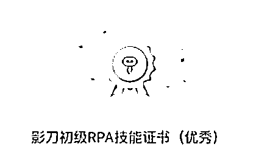

# 公众号爆文：应该怎么努力，才算是走在正确的方向上？

> 原文：[`www.yuque.com/for_lazy/thfiu8/dk0vhpr4bf5go1y7`](https://www.yuque.com/for_lazy/thfiu8/dk0vhpr4bf5go1y7)

## (70 赞)公众号爆文：应该怎么努力，才算是走在正确的方向上？

作者： 小霸王

日期：2024-03-13

1.  **基本情况：**

主业大厂打工仔，副业做过京东达人、论文辅导，累计 10w+收入。目前深耕公众号爆文，入局半年单人单号累计收益 3w+。

这个数据跟很多人比起来不算什么，可很多人日思夜想在做公众号，而我则胜在的**单位收益不错**，10 分钟人工产一篇爆文，单账号折合时薪 1000 元，属于相对轻松能出成果。

1.  **成功公式：**

每个项目在术上，都可以被总结归纳出一套或多套成功的法则来，对于我这种轻松一点干出还可以的成绩，如果公众号如果有成功公式的话，我认为是：

**公众号的成功=热门/细分领域*单号标题&内容*账号数量*自动化*附加服务**

我自己目前还停留在广告流量主获取收益的模式，但如果从 1-n 的放大，矩阵、附加服务和自动化是必不可少的东西。

1.  **核心：**

这篇文章可能会不断的修正更新，而我今天想谈一谈的，是关于方向性的问题，我也掏心掏肺的说说自己的想法，有疑问的欢迎探讨。

我相信，生财有很多的圈友，在初入项目看到一些奇怪的但是火爆的内容时，难免会有一种“这样的内容也能火”的心态，而初学者对于自己很容易有一种“好学生努力写文章”的“幼稚但可爱的行为”，简单来说就是，自己想写好内容，花好几个小时打磨，两小时后发现阅读量为 0，心态炸了。

要不得。

**关注用户关注什么东西，而不是你单方面的想要给用户看什么东西。**

你看不起的，可能是其他人爱看的。

别有什么高大上的思想，别自以为自己很牛逼看不上自己做的内容。

有些人做内容，高大上的做不起来水平不到，低级的东西又不屑于做。在自己不上不下的水平里做一些所谓的打磨内容，搞好几个小时写不出来又没人看，纯属自 high、而不是在给读者解决思想或实际上的问题。

人家可能就是茶余饭后下班路上放松一下，不要拿着自己的视角去妄图教育用户，否则难受的就只有自己。

在明确用户关注的点后，去根据自己的经验和网络的素材、以大白话的形式给到你的想法。

**不重要的东西尽量节省你的精力。**

**什么是不重要的？**

排版、标点以及所谓的细节，都不是你要关注的，这只是锦上添花，压根就不是主要矛盾。

**如果不是沉淀式的长文或真知灼见，内容创作本身超过了半个小时，就是不合格的：**

-首先，你根本没办法起量（当然，IP 文、单纯想发挥真知灼见、或你已经是个大 V 不是纯靠公众号流量主薅羊毛的除外）。

-其次，你无法承担随机成本（你发的文章，可能爆、可能不爆，你要是几个小时花在里面，阅读量 2，你难受不？但如果你每天写 20 篇，每篇 10 分钟的精力，有一些阅读量 2 ，你是不是好受很多？）

**那主要矛盾是什么呢？**

**关注领域和内容上的风向标、某领域内你写的单篇文章的吸引力（标题、内容结构）、你每一篇文章的时间花费、你干这个事情的效率**

关注风向标，关注标题，关注内容的结构化，关注如何写的引人入胜。一切的一切底层都是去体会读者到底爱看什么东西，什么东西的阅读量和点赞量是最高的。

在抓住主要矛盾的前提下，铺量，铺矩阵，利用一切可以自动化的手段、去节省你的时间精力跟成本，从而放大每一个账号的收益。

1.  **关于 10 分钟写一篇：**

来，让我一点点做更新，有人说，10 分钟一篇文章除非纯 AI，不然根本就是我在扯淡，这就像是大家曾经都在说马斯克能把火箭送上太空是个扯淡的话题一模一样，当然我这个破事跟他没得比。

**如果你对某一个领域稍微有点了解，结合这素材里面自带的评论内容，借着口述转文字的方式，1200 字不要说 10 分钟，5 分钟内你就可以干完。**

**只要能过原创，不要纠结完全的从 0-1。不要纠结拿着现成的完成品去洗稿，那很容易不过审；可如果你反其道行之，拿着现有的素材去凑完整品的同时，再加自己的看法呢？**

而且，我一开始也说了，自己曾经做论文辅导，这对信息整合的能力要求简直不要太高，拿到公众号爆文且还是自己熟悉的领域，可以说是很轻松了。

**如果加上排版等凑个 10 分钟，简直是不要太正常的操作。**

排版你自己熟悉的话，**可以事先设置模板，然后采用格式刷的方式刷一下正文**，**我这都还是人工操作的排版**，如果换成 RPA 自动处理，你觉得会不会更快呢？你觉得有没有可能呢？拿一个自己熟悉的东西，你亲自试试看。

1.  **关于成功公式的热门/细分领域**

领域的选择，是在定调。

航海手册的热门赛道领域是公开的信息，大家都知道很火，也可能会有人纠结这些个领域还能不能做的问题。

我们搞项目的，绝大部分人都不是巨头，不会出现我们进场了这个市场就饱和的不像话、或者是 ecpm 会疯狂降低的情况。

虽然，可能某个领域随着人数越来越多会出现不好做的情况，**但是这不应当作为我们这些小虾米不去触碰某些赛道的理由**。

现在我个人做下来，有这样的看法：

①热门的领域受众也多，虽然单价可能存在一些圈友说的降低的情况，但小虾米们完全还是可以入场分一杯羹的。

②对于细分的赛道，我见过有风向标专门就写一个明星的，这种也能够有几千几万的阅读量。大家多关注风向标，碰到了机会赶紧下场分一杯羹

**所以，这也就涉及到为什么非要搞好几个领域好几个号的原因。**

如果初入，建议还是**热门+细分组合**的方式，大家可以选择**热门赛道+自己熟悉的赛道+小众蓝海赛道**的方式，**组成一个 3 号小矩阵**，既能够保证自己走在热点的道路上，也能够留点空间给自己去发现新东西 or 写自己擅长的东西。**当然了，这都是可以自由组合的，比如热门的同时还是自己感兴趣或擅长写的，那就更好了。同时，也兼顾到精力的问题，所以，做这个要做好细水长流、逐渐增强能力壁垒（技术、信息流、运营能力、矩阵）的准备。**

1.  **关于成功公式的****单号标题&内容**

搞了这么久的公众号，每一期的航海我都在，在选定了领域之后，对于单个号的成功，我认为是标题、内容是成功的关键。

而这两者，标题的作用又是＞内容的。

**标题怎么起好的路径：**

①航海手册里面有非常详尽的指导，我觉得也写的超级好，请一定要充分使用手册里面的内容，这里不班门弄斧重复写作。

②而对于航海手册里面没有提到的领域，大家可去次幂数据里面，找到低粉爆文模块，**一个个**去分析人家的标题起法，这里就不建议偷懒用 AI 去分析了，自己做，有感觉，才知道什么是好是坏。这些功夫，是必须要下的。

等完成了对自己所在领域标题的分析，我们就知道了什么样的标题是吸引读者的，后续的事情就是：

①可生成 prompt，交给 AI 来完成之后会文章的产生；

②实在不行，在人工做的情况下，**我们可以用素材里的吐槽或干脆就是原贴内容作为标题**。比如说，

*“我有一儿一女，我把两套拆迁房全给了儿子，后来看到房本上的名字时，我傻眼了”*

这个标题可能是作者自己想的，但如果这个素材如果存在的话，也有可能就是原帖开头的原话，**直接拿来用（或微调，主打一个反差感）**就好。

1.  **内容怎么走：**

**1、变现方向决定内容模式：**

公众号文章本身有几种内容上的变现（航海手册也有介绍，这里只写来帮助大家推导变现模式，继而明确内容要怎么写）：

（1）真知灼见——长文 style，需要长久的经营和积累，这种有粉丝基础的可以单独接广

（2）付费文——适宜故事类连载或大号，需要已经有粉丝基础

但，对于大多数想要做公众号爆文的同学来说，估计走的都不是以上两种道路。那我姑且斗胆猜测是第三种，

**（3）爆文路线，走量，流量生意，快速吸引读者的注意力，快速且尽量持久的挣钱薅羊毛。**

这个路线看下来，对于所谓的非真知灼见式付费文、或者是类似于远山研究所、虎嗅等长文路线的文章，最好是采用大白话的模式。从数据来看，

-读者更加喜欢白话文，不喜欢文绉绉的，你**就像跟人聊天那样写文章，都是可以的**，这也说明了为什么人工写作的情况下，语音转文字行得通；

-**喜欢有转折的，不喜欢平铺直叙的**。自带评论的一些其他平台的帖子，往往含有正反方的意见，这样为我们的写作提供了绝好的转折。

-喜欢一到两句为一段，**不喜欢一段话好多的字**，看起来就不舒服不想看，看不了一点。

**2、这就决定了排版上，做到整洁就好。**

关键句子稍微加粗标红，一到两句为一段，其他的把你的模板设置好，就够了。其他的漂漂亮亮，花超过 5 分钟时间排版，都是不合格的。除非你做的是 IP 运营，走的是图多的类似于时尚类的那种公众号文章，需要一个个插入。

**3、凑不够 1200 字怎么办**

1200 字=两个广告位凑齐=理论上来说更多的钱到手（虽然读者不一定会读完），但是，凑不够两个广告位的文章字数怎么办？

**请善用“文章推荐”“文末声明”**

比如：*声明：此岗位情况仅为某地区真实情况（严禁搬运抄袭，一经发现，侵权必究），该单位的情况可能存在差异，故不保证此岗位介绍为唯一标准。如与你所在城市的单位情况不符，请理性看待！同时欢迎大家投稿，让单位介绍更加全面准确。*

比如：有些公众号你会看到一些文末推荐链接，这些都是可以被计入正文数字的。

**这样做的好处就是，我们可以不写 1200 字的正文主体内容，只需要写够 1000 字甚至是 900 字，就能实际上凑够 1200 字的两个广告位的体量。**

4、如果想做到很多人帖子里说到的疯狂赚钱（几十万、百万）**，自动化生产内容或做成头部大号**，才是内容最终的路径。

很多人没耐心的话，那么就**纯内容本身的变现**而言，矩阵化道路是必须要走的。更多的内容，更多的量。这个就涉及到后面 RPA 及编程的部分了。

如果有耐心的，愿意花个几年的时间打磨，公众号我不太清楚，但是拿小红书来说，粉丝 150 万级别的，一条广告费用是 20 万（博主亲自晒的），所以公众号大概也是同理。

要不然就是花个几年时间努力，做成大号，能有这个效果；如果做不到或没耐心，那就走技术流铺量。

为什么要一直说这个，就是我自己也是走了一段时间，才搞清楚了这个很重要的道理，尽管亦仁大大之前有提过，但纸上得来终觉浅啊。所以作为过来人，也希望大家在进入公众号项目，或者是其它项目之前，要做好这样的心理准备。因为从 0-1 完成闭环之后，你就会发现几十块一天的收入，距离其它帖子动辄赚几万几十万的成果来说，实在是没办法满足自己的胃口。

1.  **关于成功公式的****账号数量**

有一说一，生财的圈友真的很聪明，我也从大家的身上学到了很多的东西。关于账号这个事儿，当很多的小白停在一个号的注册问题的时候，他们已经在四处的收别人的号来代运营了。对于具体的账号怎么开怎么弄的问题，其它的帖子有非常详细的教程，我不再做班门弄斧的操作。

**我来说说账号数量的升级问题，实在是很有意思，相信对于大家是个很好的启发，而这也是放大公众号收益必不可少的操作。**

1、当你有 5 个以内账号的起步阶段：这里就是用自己的身份证或者是用家里人的身份证来注册，并把运营者绑定到自己身上，这个很简单但是也就是小小的个人户而已。难度：⭐️

2、当你有 30 个账号的发展阶段：除了个人账号（自己的和亲戚的），这个时候你需要用到个体户号（请注意，申请海南的个体户，网上操作，秒发执照，具体的方法生财有对应的帖子，找不到的话你再来私信我我把经验放出来），理论上一个个体户可以搞两个账号（第二个一般要收钱，但是有圈友写过如何规避收钱的，我试过，能行），而个体户本身又可以注册好几个。把你自己的和亲朋的都注册好几个个体户，这样理论上能搞到差不多 30 个左右。难度：⭐️⭐️⭐️

3、这个时候，当你和你亲朋的个人号和个体号的羊毛都被薅的差不多的时候，你就需要动用到陌生人的力量，找陌生人收号做代运营是很常见的操作，但是这考验团队或这个人的多账号集成管理能力和文章数量的产文能力。换句话说就是，想帮别人代运营是吧，你需要（1）找到别人收足够多的号（渠道、推文、分成方式）；（2）自己有管理多个账号的集成系统或者是软件等等，否则完全搞不来；（3）有足够的文章（机器也好人工投稿也好）。**如果你能解决以上 3 点问题，我相信已经超越了 99%的人，钱钱正在向你招手。**难度：⭐️⭐️⭐️⭐️⭐️⭐️

4、如果你只知道收号，这个还是有难度的，毕竟系统集成管理是一方面，但是架不住你还是存在需要人工的时候，而且很多人不一定愿意给你自己的号码。这个时候，有人想出了另一种玩法，那就是，我来提供文章给你的号，你来负责排版和发布，收益按照一定比例分成。有些个人还真愿意这么干，这解决了产文过剩、信任度和账号发文管理的问题（是的，有圈友已经能做到一天机器写文几百篇了）难度：⭐️⭐️⭐️⭐️⭐️⭐️

5、也许还有更多的高阶的玩法，比如说文章多平台分发的问题，这个就是后话了。

1.  **关于成功公式的****自动化**

好几个圈友，都做了自动化的 RPA 机器人，用来做对标账号、对标内容的信息要素抓取和公众号文章的自动撰写，最终实现了百来个账号的管理。

我还是坚信，自动化是放大公众号矩阵的不二法宝，这个自动化包括了三个部分：

**自动化=素材管理+自动化写作+文章上传到平台并发布+账号的集成管理。**

自动化流程包括了四个环节：信息素材获取和筛选——文章写作——文章发布——账号集中管理

素材管理使用 RPA 做信息抓取和分析，同时 RPA 也贯穿了整个大的自动化流程（抓取、分析、写作、发布）

自动化写作需要 AI 的帮助，涉及到 API 接口的管理

账号的集中管理，可以借助现成的软件，但是更多的大佬甚至可以自己做一个软件出来。

这个需要技术，如果想要做大的话，RPA 的技术必不可少（自己懂技术，或者团队的人懂技术就最好了），而且建议系统性的学习，否则就只能望着别人的技术默默地感叹自己的无能，只能是给别人交学费。

在无数次的摔跤后，我真的深刻地认识到了“没有技术只能跪着挨打”的血泪教训。于是，花了半个月去学了 RPA，现在成了个中级工程师（当然我还没考中级，初级倒是考完拿证了）

附录：

次幂数据：[`www.cimidata.com/?refcode=7x6pva`](https://www.cimidata.com/?refcode=7x6pva)

***#未完待续***

* * *

评论区：

Rio : 继续啊然后呢
佩龙 Peron : 10 分钟有点扯了，我要不是干过还真信了
故是 : 除非不要质量，但这想要挣了就更难
佩龙 Peron : 除非纯 AI 文，但他又说是人工产出
火龙果 : 还没有点进去看，但 10 分钟人工文章产出，有点夸张了吧
旭宏 : 很真诚的分享，里面有些坑我也踩过，受益很大。码字辛苦了！[玫瑰]期待继续分享[抱拳]

* * *