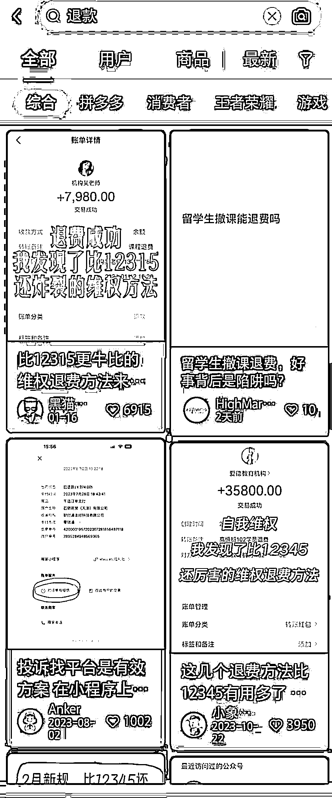
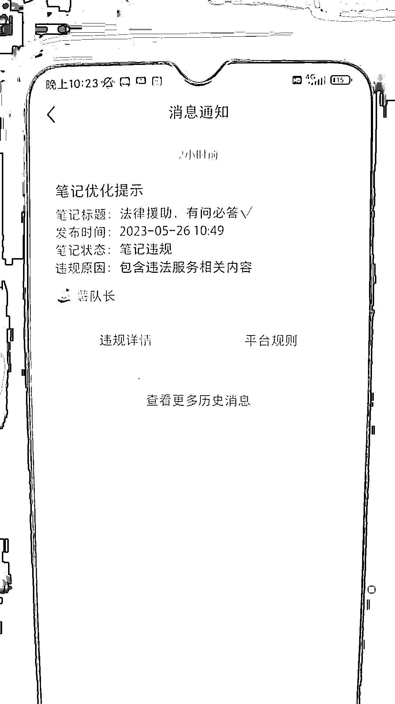

# 小红书维权项目：矩阵变现年入百万，我是怎么操盘的？

> 原文：[`www.yuque.com/for_lazy/thfiu8/zyyvdl94u6y78g3u`](https://www.yuque.com/for_lazy/thfiu8/zyyvdl94u6y78g3u)

## (47 赞)小红书维权项目：矩阵变现年入百万，我是怎么操盘的？

作者： 红豆

日期：2024-03-15

 生财的圈友们，大家好，我是生财新人，红豆。

我非常认同亦仁说的：所有生意都值得在抖音再做一次，而我认为所有的生意也可以在小红书上再做一次。

23 年 5 月，我把维权赛道，迁移到小红书上，通过矩阵引流的方式，把用户带到私域进行成交，近乎一年时间，累计变现超 100w。

附上部分项目收益图：

今天就来和大家分享我的经验心得，希望对大家有帮助，如果你不知道怎么在小红书上获取流量，又或者没有找到自己合适的项目，一定要看完。

# 一、维权项目的优势在哪里？

刚开始，我是在公司做教育赛道的，最高峰期的时候，能日引 2000 人！

但是，因为教育项目有半年淡季，老板让我临危受命，去负责开拓新的维权项目。

我一开始是拒绝的，因为这个赛道，在抖音上已经做得很好的，迁移到小红书，真的能做起来吗？我没有自信。

但是，在老板的鼓励下，我还是决定去尝试，不做不知道，一做，发现了它竟然是蓝海项目，而且，离钱更近！

哪怕是到现在，都不卷，我是 23 年 5 月入局做维权赛道，今年依然有很多新入局者，而我们的优质账号存活十个月依然坚定，还是很香的吃着长尾流量。

而且在变现这一块，真的是又多有快！我做的时候，可以达到单日出粉 300+，对接的销售公司当天结算即可入账，每晚数着钱安然入睡。

更重要的是，维权项目周期长，可以持续做。一年 12 个月没有淡季，不用担心某一个月流量滑铁卢，只要有流量风险思维，随时有待补的账号备上， 根本不用愁流量。

# 二、如何用关键词进行赛道调研

说实话，刚开始入局，我对维权赛道是一点都没有认知，完全小白一个。

但是，我明白怎么用核心关键词，来快速了解这个赛道的人群、需求、选题。

## 1、在小红书搜索栏输入项目核心关键词

围绕以消费类退费维权为主展开，去搜索相关词，例如：退款、退费

“退款”这个**红色字体**是**核心关键词**：有 122 万+篇笔记

下面的**红色+白色字体**的字，例如：“退款+投诉”这个组合就是**长尾词**

“退费”这个**红色**字体是**核心关键词**：有 36 万+篇笔记

下面的**红色+白色字体**的字，“退费+投诉”这个组合就是**长尾词**

## 2、通过核心关键词搜索到的笔记查看话题标签

以退款为例：

随便点进去一篇笔记，在笔记文案的下方找到“#退费”这个话题标签

再点击这个话题标签进去，“退款”这个话题标签有 7758.5 万浏览量

“退费”这个话题标签有 6775.2 万浏览

通过以上查询结果显示“退款”是这个项目最大的一个核心关键词。

## 3、通过以上两种方式的搜索结果查看爆款笔记的选题类目有哪些

关于退款相关的爆款笔记的类目有：教育机构退款、健身房退款、美容院退款、私教课退款、情感机构退款、驾校退款、租房退款、游戏退款等等。

## 4、对消费类维权项目的核心词类型进行分类

**给你们举四个类目的例子：**

**一级类目：**消费类维权

**二级类目：**

教育机构

健身房

美容院

情感机构

**三级类目：**

教育机构这个分支下的三级类目：专升本，考研机构，自考机构，成教机构，留学机构，军队文职培训，ps 培训机构，副业被骗维权，加盟退费等等

健身房这个分支下的三级类目：普拉提，瑜伽馆，游泳课，舞蹈课，私教课，女性塑性课程退款，健美操培训班退费，芭蕾课退费等等

美容院（医美）这个分支下的三级类目：双眼皮，抽脂，整形，牙齿正畸，瘦脸针，植发维权，spa 退费，激光除皱退费，水光针，丰胸等等

情感机构这个分支下的三级类目：情感挽回、感情咨询、分手挽回等等

**以上三个类目蕴含着两个信息：**

第一个信息：类目越细分越垂直，用户画像越精准质量越高，但越难获取；

第二个信息：类目越大越泛，意味着用户画像越不精准质量不高，但好获取。

# 三、账号冷启动之对标表

当你对赛道了解的差不多之后，就要开始去构建对标表了。

很多新人刚入行找对标，怎么都找不到，我问起原因，答案竟然是：他做成这样，我看不上，不值得我对标。

可见，不仅仅是写内容会进入自我感动的情形，竟然也存在以自我为中心、为喜好去找对标的情况。

通过这个点倒推，我就可以看员工找的对标，来判断他看待账号的视角，他的审美，他的思考方式，他的目标，判断他目前处在哪一个阶段，是新人小白阶段，还是渐入佳境，还是颇有见解。

## 1、如何**去找对标账号？**

找对标，我用的是梨云老师教的方法，就是了解你的同行，通过关键词、自然推荐等找到模仿的账号。

这些账号就代表你未来可能达到的一个层次。

①通过核心关键词或长尾词搜索查找；

②通过“法律”两个字搜索后在再点击用户；

③通过自然推荐找对标账号

④每天都找对标进行深度拆解，记住是每天

怎么拆解，我给大家看下我们的拆解表

## 2、素人号全方位对标拆解账号拆解表

## 3、企业号全方位对标账号拆解表

# 四、薅免费流量素人号测试

刚开始，我们用的是素人号，来进行测试，免费流跑的通，那么获客成本就能压到极低。

## 1、打造差异化人设

创建平台上目前没有的人设：例如黑猫警长、白鸽探长、法学生小喵案例收集等等

在找到对标账号后建立我们自己账号人设的时候：注意头像，简介，封面，内容要分开对标，不要和一个对标博主的内容完全一样，特别是头像，名字，一定要有差异化，不然很容易被平台判定同质化进行封号。但是这个也不是绝对，可能在平台风控比较严的时候风险就比较高。

## 2、人设+内容=7 天起号

23 年 5 月那个时候的小红书平台素人号还有很大的红利，给到的基础流量非常高，素人号起号非常快，只是消费类维权这个项目涉及到法律相关敏感词，所以不能做素人号。

**直接上私信截图：**

## 3**、账号死亡宣告玩法失效**

这个玩法没多久，就遇到了素人号信息异常的情况。

素人号权限不够，各种类型的笔记只要发布出去就会收到站内提醒：笔记优化提示、账号违规提示，**这就表示着这个项目在小红书平台上是不能玩素人号的。**

# 五、All IN 企业号躬身入局

既然素人号走不通，那就升级成企业号，此路不通就换一条路。

## 1、23 年 5 月完全放弃素人号 6 月猛起企业号

## 2、分 4 个小组分配账号精细化运营账号执行力拉满

## 3、持续精进迭代并关注销售可转化的选题类目

# 六、免费流矩阵火力全开

在企业号跑通之后，我觉得，是时候可以放大了，直接上！矩！阵！

## 1、每天下沉研究爆款数据根据每个账号的属性每日制定 2-3 个选题

**展示部分账号选题：**

## 2、根据账号流量情况每日复盘每月复盘

**每日复盘：**

**每月复盘：**

## 3、不断细化核心关键词长尾词高高转化词评论钩子

# 七、流量获客的终点是付费投流

免费流矩阵玩的愈演愈烈，却在 8 月份，平台风控，一大批账号被限流封号。

既然对抗平台是零和博弈，为了项目能长久做下去，我们决定拥抱聚光，和平台实现双赢。

和大家分享 2023 年 8 月维权项目小红书聚光投放流程：

1.  **登录小红书聚光官方投放平台**

**[ad.xiaohongshu.com](http://ad.xiaohongshu.com) 可以扫码登录聚光平台**

1.  **进行广告资质认证**

**2.1 一级商务服务，二级选择其他。提交审核就可以**

**2.2 广告审核一般半小时内搞定**

**2.3 需要先充值才能创建计划，最低两千起充**

**三、计划创建**

**充值成功后就是这个页面，点击新建广告**

**1.目前适合我们的有两种方式，产品种草和客资收集，具体选择哪种计划类型根据账号实际情况**

**2.展开时段可以设置笔记投放的具体时间，选择私信开口量**

**3.可以先不限预算，方便笔记跑出去。量起来之后再调整**

**4.需要添加两篇笔记，一篇备用**

**5.可以先设置 20 私信开口，看能不能跑出消耗**

**6.两篇笔记都关掉智能创意，私信组件选择胶囊-立即咨询，点击完成，创建完毕**

**7.信息流创建，第一步一样这里我们跳过，选择信息流广告，选择私信咨询量**

**8.同理**

**9.还是选择两篇笔记，选择高级定向，选择四个符合本行业的兴趣**

**10.年龄把不限点掉，再把年龄全选，受众就会变为合适，私信还是选择 20 的开口**

**11.这步也是一样的，选完点击完成就好**

**四、基本数据**

这里，和大家分享 4 个小 tips：

1.  **前期投放每日消耗要在 100 左右，设置好日预算，这个是卡金额的地方**

2.  **展现，点击，观察数据，切换日期可以切换数据**

3.  **数据跑不出去可以先提高开口价，跑太快降低**

4.  **计划之间没有影响可以创建多个计划同时去跑**

# 八、重振旗鼓排兵布阵搭建 SOP 流程

因为我这个项目，是团队在做，会涉及到管理这一块。

所以，也和大家分享一下，团队做矩阵的 sop 流程，在项目搭建团队矩阵化的操作中，会对你有所帮助。

## **维权运营岗位流程以及 7 天工作安排**

**核心责任**

**1、账号引流**

**2、文章发布**

## **每日工作内容**

**1、数据统计报备**

**（数据报备给下发的统计表**

**咨询量统计时间：晚上 6 点填好下班、第二天早上 10 点前填好**

**加人数：晚上 6 点填好下班**

**2、账号 obs 直播**

**10：30 之前将负责的账号直播推流挂上**

**3、账号后台官方提示导流、笔记违规等立即上报部门群**

**包括私信导流，账号禁言，账号违规，笔记违规**

**4、账号****连续 3 天****更新文章浏览量****不高于 100 立马群里报备****，单篇笔记浏览量****超过 5000****立即群里报备**

**5、账号引流**

**①评论区置顶文案**

**资料引流话术：**

**置顶评论：**

亲爱的宝子们,写上案件类型+ 数额大小就能获得:

《维权退费流程和方法.doc》

《起诉状模板.doc》

《法律合同模板.doc》

[哇 R]还能帮忙审核协议合同，如果遇到难以解决的维权问题，也欢迎咨询~

**维权引流话术：**

**置顶评论：**

如果你也有（教育机构网课、健身房、美容院、情感、游戏）等等~~

取消分期退费问题不知道怎么退，可不可以退，机构不退费，违约金太高，退少这个问题的话，下面留下地区➕金娥，帮你推荐合适的维权方案[微笑 R][微笑 R][微笑 R]

**②评论区其它文案**

评论区维权痛点分析文案/问题（避免让客户产生非常强烈的引流感觉，也能增加客户在评论区主动咨询问题的意愿）

根据文章内容方向，收集这个方向的痛点，主动在评论区以解说的形式进行回答分析

例：

**总结：评论区文案的作用是告诉客户我们能给你什么？你需要做什么？避免评论出现刷屏回复“1”**

1、我们能够给你想要的维权模板文档

2、我们能给你维权方案指导

3、你需要在评论区告诉我们

**让客户增加评论区活跃度，让后来的客户产生共鸣吸引更多的评论，从而为文章加权重分**

**③评论区回复**

**评论区回复引导目的是（引导客户主动私信我们，不占用我们主动私信客户的条数限制）**

评论回复：收到，踢我！（可加不同表情）

注意：尽量避免出现“后台私信我”这种关键词出现，可能会不被显示，一定要用谐音

案例：

**④私信引流**

**话术：**

**初步了解用户情况**

**引导用户给联系方式**

6、**文章发布**

1**、文章发布**

1**.1、标题**

**①模仿同行爆款标题**

标题和封面是占领用户心智的第一步，所以我们用前期收集的爆款标题库根据文章方向适度修改，标题需符合**最少 2 个关键词的布设（增加被检索机率）**

**②标题里面添加表情**

**：标题里面添加表情是为了迎合小红书平台调性**，也能让自己的标题更加醒目，更容易锁定客户的目光

**③标题添加量化指标**

**：标题里面有量化数字更形象更让人有参考依据**，更容易对标目标群体。

2**、文案**

**文案输出原则：**

1.  关键词布设：根据文章方向尽可能的多布设一些相关关键词（增加文章被检索机率）

1.  以分享和讲解的文案形式输出：可收集抖音，B 站相关视频里面的语音讲解，用语音转换文字工具提取保存

1.  文案遵循（痛点引入-场景描述-解决方案）和（干货）来编辑撰写

**3、标签**

标签遵循(基本标签+方向标签)的原则进行布设

**4、发布时间**

根据平台的基本流量时间段和相关细分领域客户作息时间来发布文章

参考：

1、【早上 6:30~7:30】

2、【中午 11:30~12:30】

3、【下午 4:30~6:00】

4、【晚上 7:00~9:00】这是一天中流量最高峰的时刻

5、【晚上 11:00 一凌晨 1:00】超过凌晨一点不发文章

## **风险管理**

风险管理是运营技能中最重要的部分之一，运营的风险管理意识决定了账号的寿命

只有培养好风险管理意识才能让你的账号活得更久

**笔记内容风险**

账号因为图片重复，水印，抄袭或者是文案内含有违禁词等问题提示笔记违规或待优化

在小红书上，很多**词汇都是违禁**的，如果文案中出现了这些违禁词，那么这篇笔记大概率会被平台限流，常见的违禁词有最，第，国家，人民，检查，党，政，发票等，这些词汇只要出现极大概率被限流，所以日常发布文章的时候一定要避免此类违禁词的出现。

**笔记限流有两种情况：**

**后台提示笔记待优化**

**后台没有提示笔记待优化，但单篇笔记 24 小时内观看量没破百**

**解决方法：**

首先检查笔记中是否含有上述提到过的违禁词，也可以自己通过查词网站检查文案中是否有违禁词，删除或更改违禁词后查看笔记情况，如果出现推流则证明恢复正常。出现此类问题需要及时上报。

**账号导流风险**

账号风险分为两种情况

**账号禁言**和**账号导流**

账号禁言：

账号禁言一般是由于在评论区留下违禁词评论，被系统检测后禁言，禁言分为有提示和无提示

有提示的禁言一般来说会告知禁言时间，过了禁言时间就可以正常进行评论

无提示的禁言则需要运营在发完文章留下评论后通过置顶评论的方式判断账号是否禁言，**无论出现哪一种情况都需要立即上报。**

账号导流：

账号导流会直接在后台提示

账号出现导流提示，说明账号最近的引流行为没有规避敏感或者违禁词。

在引流的过程中要避免：

1、任何可能涉及到引流意向的词汇

2、任何形式传播个人联系方式或者账号信息（不留微信，留微博名行不行？也不行。）

3、金融相关词汇

4、在笔记内容中不得诱导用户，比如关注领奖、点赞抽奖等，这是小红书明令禁止的。

账号第一次导流出现后 7 天内禁止回复私信，每天正常一篇文章，不要留钩子

第二次导流 14 天内禁止回复私信，每天一篇文章，不要留钩子

第三次导流基本宣布账号的死刑

如果出现导流情况，一定要立马上报，不要再进行引流和发文行为。

账号限流：

账号限流分为两种

导流常常伴随着限流，一般后台弹出导流提示后，你的账号也随之限流了，处理方法和导流类似

还有一种限流是没有提示的，此类限流必须由运营发现，鉴别方法有几种

1、账号连续三天发布文章小眼睛不过百，一旦出现百分百被限流

2、账号创作中心界面首页推荐消失，遇到这种情况一般一个星期后账号会限流，需要及时报备

3、账号连续一个星期没有文章突破两百小眼睛，这种情况大概率限流

账号一旦出现此问题，必须马上报备并暂停发文引流动作，需要运营即使观察账号情况

小红书违规注意

笔记违规：内容上留下联系方式，非原创，有水印，色情，恐怖，刷阅读，刷点赞， 刷收藏，诱导分享。

账号违规：名字违规，签名广告，导流到其他平台。多个账号 1 个设备，二维码。商品违规：偷拍，炒作，违规，谩骂，低俗，政治，赌博等。

## 新人入职七天安排及培训

新人 1-2 天入职安排

1.阅读以下培训内容，并了解相关需求：

小红书运营养号流量

小红书运营底层逻辑

小红书引流逻辑及流程

小红书运营起号

2.阅读上述文章后，进行账号的发文和引流：

账号发文具体需求

小红书运营发文规定

账号引流要求及话术：

维权通用引流话术

四大类退费回复案例

3-5 天入职安排

在熟悉发文引流且不出现问题后，尝试进行文章的写作

数量可以不多，主要是熟悉流程和方法

写作方法和写作需求：维权内容写作要求

这一阶段可以尝试写一些较为简单的泛文，如电话租房驾校

6-7 天入职安排

熟悉写作流程以及方法后，尝试写精准引流类文章

即教育机构健身房美容院情感机构等精准类目文章

注意事项

除了以上内容，运营每天需要完成《维权运营岗位流程以及 7 天工作安排》中的工作

视七天工作完成情况决定试岗是否通过

## 2024 策划项目工作规划框架

**一、向外看**

**1、拆解同行博主分类：**

同期对标博主、近期对标博主、远期对标博主、终极对标博主；并对这些博主的每一篇笔记进行分析，把所有的笔记的选题进行分类；有哪些是可以为我们所有的选题一一列举出来

**2、拆解同行爆款笔记并对笔记进行分类：**

干货型、热点型、营销型，笔记里突出的爆点有多少个维度：

是选题、标题、是首图、还是图文内容、文案、还是评论；

我们内容部可以启用哪些维度布局在笔记里；

我们美工部可以启用哪些维度布局在笔记里

记录同行所有爆款的时间点 举例子 2023.12.3 开题报告 8.00

**3、详细拆解同行营销型笔记有多少种类型：**

所有的类型列举出来后，并对所有的新号和老号进行营销型笔记布局规划

我们已经使用了哪些类型首图、选题 50 点赞以上 50 点赞以下

我们的笔记未启用的有哪些类型

我们笔记未来布局的时间怎么规划

**二、向内看**

1、每日分析自己账号流量好的笔记原因：

①是长尾流量还是短尾流量；

②是什么类型选题的笔记；

③新的增长点的流量可以维持多久；

④我们其它的账号笔记是否要跟进这个爆款选题，跟进后怎么布局其它的账号；

2、每日分析自己账号流量差的笔记原因：

①笔记质量；

②首图和排版；

③核心词和长尾词布局不够；

④文案；

⑤评论；

⑥选题

**三、向上看**

1、当你使出你的洪荒之力的时候，那么你的账号的流量上限在哪里？

2、预判同行的流量上限在哪里？

3、你和同行之间“流量上限”的差异点在哪里？

4、2023 年我们所有账号的流量平均值是多少：月、年

5、预测 2024 年我们所有账号的流量平均值是多少：月、年

**四、向下看**

每日深度下沉分析自己账号找共性规律：

每日组织一次会议复盘：策划部组织参与者内容部、美工部，生成会议纪要

在分析的账号里找到我们账号共性的问题，也就是说通过单个账号就能判定出我们其它账号的共同问题，这个一定要做！一定要每天做！一定要找到！一定要及时给出解决方案并立马执行落实！执行后继续更进是否改善，未改善后是否会变形产生出新的问题来！

**五、账号冷启动**

一个月内新账号如何快速渡过冷启动，建立自己的护城河？

粉丝量级

点赞收藏数

一周的笔记类型布局

两周的笔记类型布局

一个月的笔记类型布局

热点型笔记爆了之后要不要立马去追精准型笔记

**六、如何管理协调各部门执行落地**

各部门工作输出方式

考核方式和绩效考核

关键结果目标制定

可量化指标

不可量化指标

策划部

内容部

美工部

策划部

内容部

美工部

2024 策划内容美工部工作考核机制

策划部

内容部

美工部

1、定选题

2、定首图和内页排版

3、定笔记类型

4、建立模型模型

1、文章数量

2、文章质量

1、图片数量

2、图片质量

1、平台流量趋势

2、平台和行业热点

爆款写作逻辑

封面审美

每月咨询量

1、文章数量

2、 爆文数量

1、图片数量

2、爆款封面

策划部每日对美工部、内容部、运营部的工作进行抽样检查，并出具一个抽样结果表

**七、项目账号冷启动表格**

# 小结

以上就是消费类维权项目全套实操细节，任何人通过这套实操方法都可快速入局。专业号矩阵玩法也同样适用于任何项目（未来我会持续分享矩阵打法），接下来我会逐步分享我们实操的教育赛道专业号矩阵玩法。

感谢这一路贵人、老师们给我的帮助，感谢@梨云老师的无私指导，感谢@亦仁老师提供的优质圈子。

希望每一个普通人，都能在生财有术里，找到适合自己的项目！

将军赶路不追野兔，我是红豆，我会不断地在流量池里摸爬滚打、跌落、下坠、下沉，不断思考精进，持续分享实操干货，而我的剑只会给到能挥舞它的人。

* * *

评论区：

十巷 : 你真的，这手把手喂饭了[啤酒]
红豆 : 哈哈，无偿分享😃
步言 : 这个赛道在小红书获客稳定[强]
红豆 : 那是妥妥的[呲牙]
jackey : 牛逼
红豆 : [机智]
和光同尘 : 圈友账号冷启动表格能分享一下吗？卡在这里了，冷启动几次都失败了😂
红豆 : 当然可以分享😃

* * *