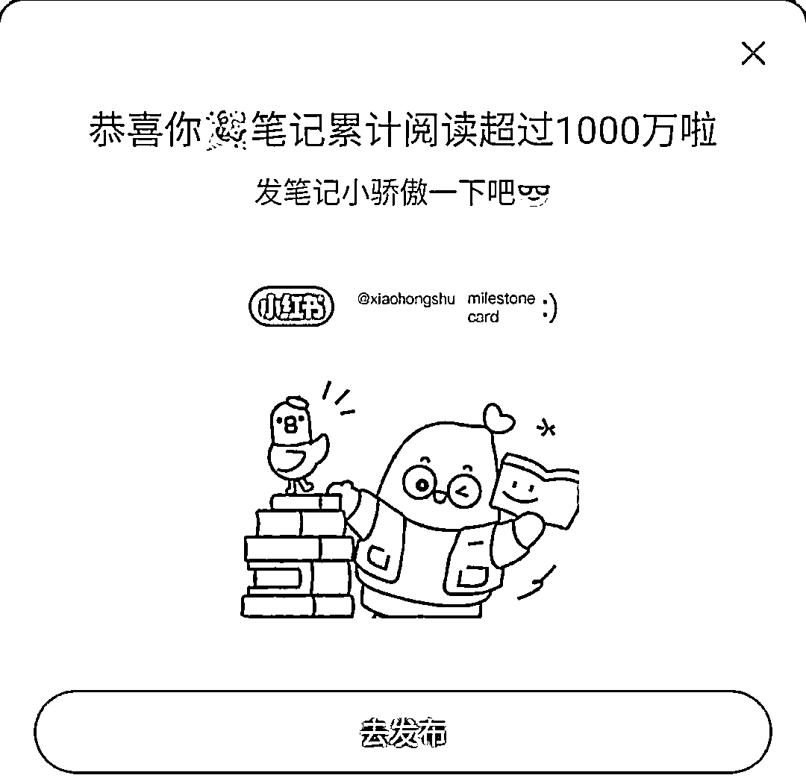

# 做小红书 13 个月，GMV290 万，总结的 10 条经验

> 原文：[`www.yuque.com/for_lazy/thfiu8/zp5d56lxztpq9xxg`](https://www.yuque.com/for_lazy/thfiu8/zp5d56lxztpq9xxg)

## (37 赞)做小红书 13 个月，GMV290 万，总结的 10 条经验

作者： 十七

日期：2024-03-15

**1.做小红书第一个动作是先注册账号去发笔记**

有个账号收到小红书官方发来的 1000 万阅读量喜报，达成这个数据，可以是：

> 选择适合自己的策略就可以，任何策略都可以达成的前提是，去行动，每天去做发笔记这个动作。剩下的就是根据自己发现的问题去学习迭代和优化。
> 
> 
> 
> **2.关于账号流量**
> 
> 常见的问题是：
> 
> 为什么同样的选题内容，你发没量，别人发有量？
> 
> 为什么账号本身流量不错，做着做着流量不好了？
> 
> 不单单看单篇笔记，把小红书账号当成是一个系统去看待，站在这个视角可以思考自己账号的权重和热度高不高
> 
> 比如：新的账号如何快速做出第一个百赞，千赞，甚至万赞
> 
> **如果你去做就会发现：**
> 
> 当你账号有第一个百赞之后，你很快能做出其它百赞笔记；
> 
> 当你的账号有第一个千赞之后，你就能很快做出第二个千赞笔记；
> 
> 当你的账号能做出万赞的笔记时候，这个账号的热度权重是和千赞百赞差别还是挺大的
> 
> 所以，**你的账号是否有爆款，且持续定期有爆款非常重要！**
> 
> **3.关于流量转化**
> 
> 如果转化特别差，要从这几个方面考虑：
> 
> **-人群**
> 
> 是否是万赞的大爆款破圈，吸引来不同人群？
> 
> 是否是寒暑假，学生变多了？
> 
> 账号的人群标签非常重要，可以去后台看下数据
> 
> **-产品**
> 
> 产品领域的周期性，是否有淡季和旺季？
> 
> **-笔记内容本身**
> 
> 反复思考发的这篇笔记是在做泛流量内容引流？还是在做精准流量引流？
> 
> 选题和内容本身，是否真的戳中你想要吸引人群的痛点？
> 
> 是否做出了爆款？（爆款是核心）
> 
> **-平台**
> 
> 是否是平台目前在推荐的爆款模板？
> 
> 是否有用户主动在平台搜索？如果有，你的笔记里是否有关键词布局？用户是否能搜索到你？
> 
> 你的账号是否被平台识别？笔记是否有被收录？
> 
> **-销售**
> 
> 销售和销售之间的差距挺大的，后端的销售团队也会影响转化率
> 
> **4.关于爆款**
> 
> **我理解的爆款有 2 种：**
> 
> 一种是，发完当天就过千赞，或者过万赞
> 
> 一种是，发完当天不爆，但因为搜索长尾流量，慢慢的过千赞
> 
> 如何在小红书获得长尾流量？
> 
> **核心是：做好人群关键词+笔记被平台收录**
> 
> -关键词如何找
> 
> 学会用好小红书平台的搜索框就足够了（我记得之前生财有出过一个视频教程，特别实用，具体可以去看一下）
> 
> -找到关键词之后，笔记细节上也要下功夫，比如：图片/视频里布局关键词、标题里、笔记里、话题里
> 
> **5.关于发笔记**
> 
> 是为了发而发，还是清晰的知道发每一篇笔记的目标？
> 
> 比如，这篇笔记要引流；这篇笔记要带量，增加账号权重；这篇笔记是为了增加互动……
> 
> 总之，要清楚的知道每一篇笔记的作用是什么
> 
> **6.要不要开聚光**
> 
> -现在如果要大流量引流，是每个月都要开聚光花 1000，跟平台合作就是互相共赢
> 
> -如果要放大规模，聚光是放大器，但核心还是爆款，测试过爆款来的量以及精准度远远大于非爆款
> 
> 开始聚光投放之前，最好多篇去做测试，直到把模型跑出来
> 
> 跑出来之后，有时候会无比精准，连着成单；有时候非常不精准（如果有前辈知道这个底层逻辑，期待指点一下）
> 
> **7.关于同行举报**
> 
> 这个我特别有经验，集中出了几个万赞内容后，我观察到赛道的大流量都集中在我这，于是，每天的举报就来了，天天都有，搞得心力交瘁
> 
> > **调整后的策略是：**
> > 
> > 一个是，把做大爆款的能力转化为 10 篇千赞的小爆款
> > 
> > 一个是，开始布局矩阵，把流量均匀的分散到几个号上
> > 
> > 一个是，不要陷入负面情绪出不来，及时调整心态，不抱怨是为了不让自己陷入在负向能量循环里。现在再次遇到举报，及时去申诉
> > 
> > **8.关于不知道发什么了**
> > 
> > 有时候做着做着不知道发什么选题和内容的时候
> > 
> > 一个是，思考当下这个选题流量是否还在火，如果还有流量，就继续用
> > 
> > 一个是，借鉴其它领域的爆款选题
> > 
> > **9.我的经验教训**
> > 
> > 在这个赛道开始持续出单，我以为稳定了，就开始看别的机会，精力分散出去，没有聚焦放大
> > 
> > 当我回过神来，发现所做赛道一天比一天卷，有大量大量的同行进入
> > 
> > 如果跑通从 0～1 之后，精力可以聚焦研究怎么去放大
> > 
> > **10.关于相信**
> > 
> > 做账号，你是否相信自己能做出爆款非常重要
> > 
> > 我做账号 3 个月，一直没有做出来万赞的笔记，当时就有一个想法，我要做出万赞笔记
> > 
> > 有了这个想要和相信我自己能做出来，不到一周我就做出来了万赞笔记
> > 
> > 相信的力量我理解的是，这个想法先在头脑和心里存在了，再去行动，就很容易心想事成
> > 
> > 埋头干了一年，分享一下自己的经验，如果对圈友有帮助，会非常开心。也想多跟生财的前辈们多交流经验，增加自己不同的视角～
> > 
> > * * *
> > 
> > 评论区：
> > 
> > 小居啊 : 你好，关于同行举报这块，我也遇到了，开了一个个人店，没有搞矩阵，感觉还没有特别大流量，但是一天把我所有笔记全部举报了一遍，我现在心力憔悴，请问有没有什么办法，我现在直接停更了
> > 十七 : 1.可以试试笔记里的方法，2.这件事持续做能赚到钱吗？3.遇到举报如果是原创立刻申诉 4.看看被举报的原因，接下来发笔记学会规避，5.也是最重要的，提升心力调整心态，如何面对这件事的时候淡定从容？随着去做你会看开的，加油！
> > 小居啊 : 我的情况比较特殊，是我有个模板是在竞品 A 的基础上做了改进和升级（图文，能看出一点雏形），然后有人（竞品 B）原封不动的抄袭我的图+文字，我就把那个人投诉了，他跑来骂我，我没回，结果也不知道是他们两谁，开始弄我，把我店里所有的笔记，不管有没有和这个模板有关的，全部投诉下架了
> > 小居啊 : 然后我申诉，有一半没过，我感觉应该这个店被盯上了，我发啥都会继续搞我，我现在就停更了
> > 高财生 : 怎么链接学习
> > 
> > 
> > 
> > * * *