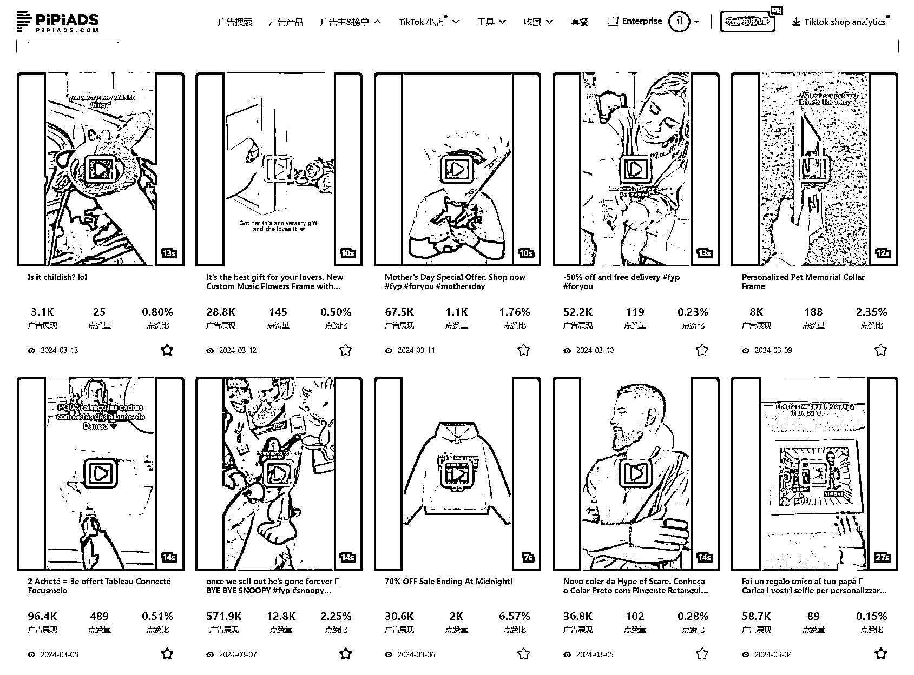

# 算法层面解析 Tik Tok 广告视频推送逻辑

> 原文：[`www.yuque.com/for_lazy/thfiu8/yc08goh340xcxu4z`](https://www.yuque.com/for_lazy/thfiu8/yc08goh340xcxu4z)

## (11 赞)算法层面解析 Tik Tok 广告视频推送逻辑

作者： 阳光杉木

日期：2024-03-14

最近皮皮跟一个算法大佬讨论了 Tik Tok 广告的算法逻辑，从中获取到一些有价值的信息，现在给大家分享，如何通过算法层面上去让自己的内容更符合 Tik Tok 的算法机制

后续如果对该内容感兴趣，请点赞收藏，转发，这样我知道大家是否感兴趣后持续输出。

### TikTok 广告的算法逻辑

1.  视频内容分析与标签打标：TikTok 使用机器学习模型来分析上传的视频内容，包括视频中的图像、声音、文本（如标题和描述）等元素。基于这些分析，算法为视频自动打上各种标签，这些标签反映了视频的内容、主题、情感等属性。

2.  用户行为分析：分析用户的行为，包括观看的视频、互动（如点赞、评论、分享）的视频以及搜索历史等。这些数据帮助了解用户的兴趣和偏好。

3.  内容推荐：结合视频标签和用户行为数据，TikTok 的推荐算法会尝试将最相关的内容推送给用户。这意味着如果一个用户经常观看和互动的视频带有特定的标签，那么算法会倾向于向这个用户推荐带有相似标签的视频。

4.  持续优化：TikTok 的算法不断地通过新的用户反馈（如观看时长、互动等）来优化推荐结果，旨在提升用户的参与度和满意度。

TikTok 的算法通过分析用户的互动行为（如观看时长、点赞、评论等）来识别用户兴趣，算法还考虑用户关注的账号类型、搜索行为、以及与特定话题或音效的互动来推荐内容。此外，算法利用视频内容的视觉效果、音频、文字、标题和标签进行深度分析。为增加更多的可行性，TikTok 会推送多样化的内容，并在设备兼容性、用户位置等方面进行优化，以提供个性化且广泛的内容推荐。

当我们获取这些信息，我接下来会用几个案例告诉大家，为什么有些看起来很简单的广告素材能被打爆，人群推的比较准的 优质的广告素材到底是怎么制作的。

## 系统会随机抽帧 然后视频截图打标签

打完标签 系统会根据这些标签推送人群

所以素材就要尽量做到 视频标签的准确性 不要有太多干扰标签

以这个品的素材举例

素材投放 4.2M 展现，按美区通用 cpm5 美金来计算，单这条广告组就消耗 2 万美金的广告费

素材如下：

有视频内容，详情移步文章

[`za6kyadmdr.feishu.cn/docx/PSstdNSd5oezwjxdzCvcLJFmnBc?from=from_copylink`](https://za6kyadmdr.feishu.cn/docx/PSstdNSd5oezwjxdzCvcLJFmnBc?from=from_copylink)

* * *

评论区：

暂无评论

* * *