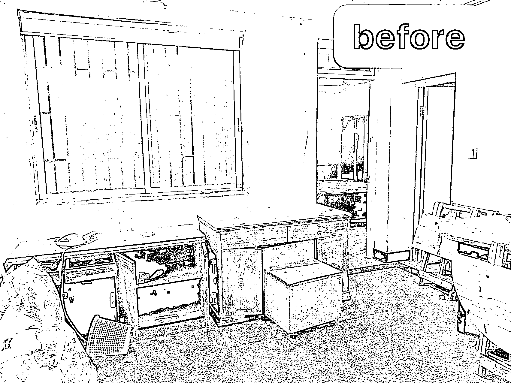
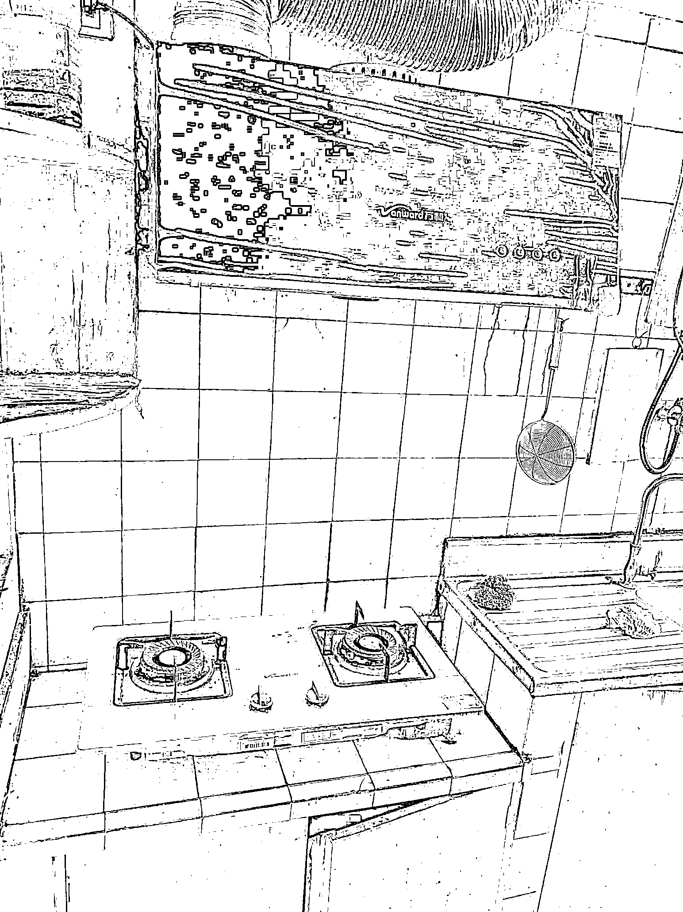
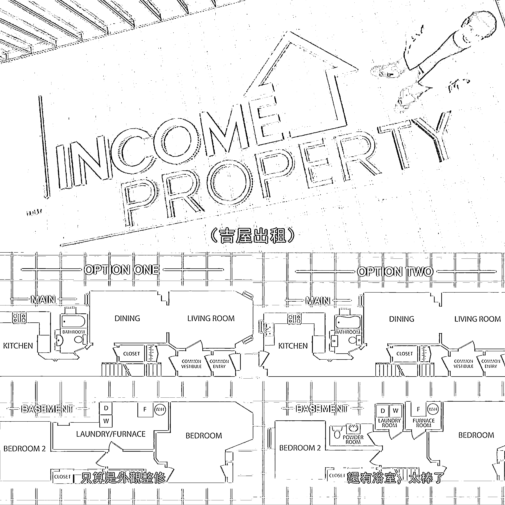
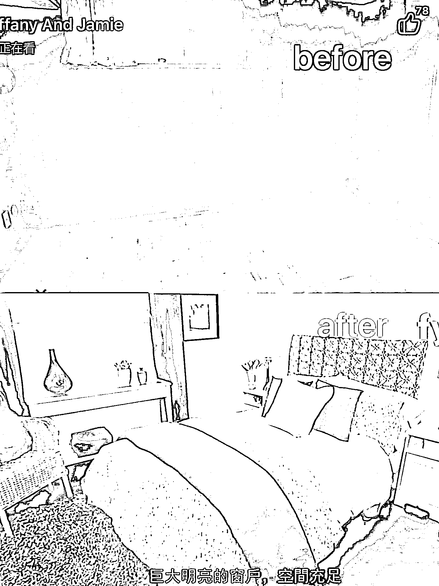
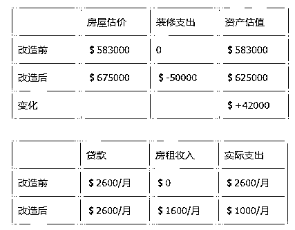
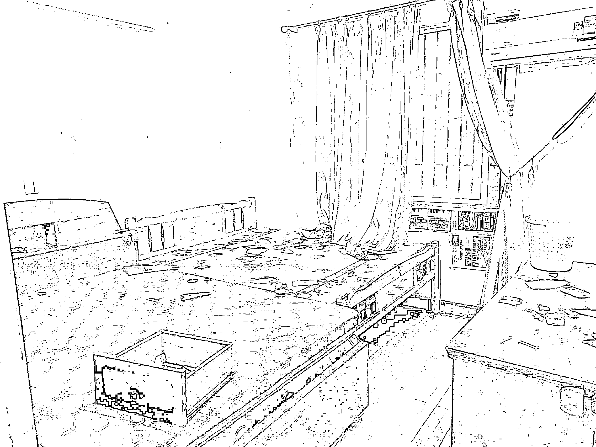
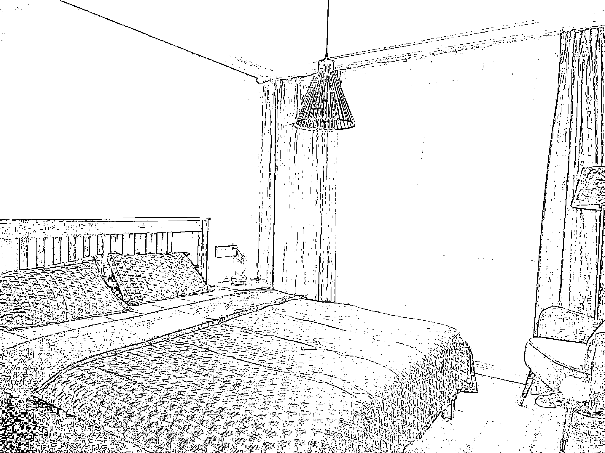
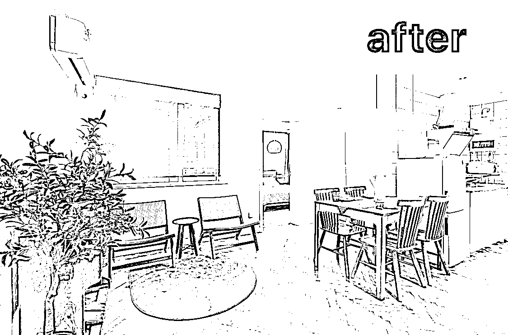
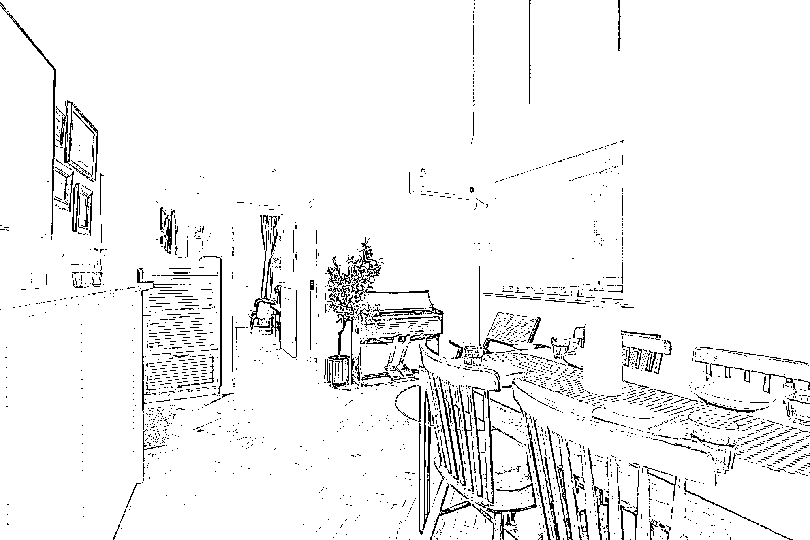

# 《繁花》摄影师 4 倍租金包租 3 年，包租婆实战出租经验分享。

> 原文：[`www.yuque.com/for_lazy/thfiu8/up26i1xe2qczwgv5`](https://www.yuque.com/for_lazy/thfiu8/up26i1xe2qczwgv5)

## (32 赞)《繁花》摄影师 4 倍租金包租 3 年，包租婆实战出租经验分享。

作者： 爱折腾的土豆妈

日期：2024-03-11

上海远郊 90 平的三房老房子，2019 年月租只要 2000，二房东都不肯租。

花 15w 重新砸光重新装修。

翻修后，被《繁花》摄影师看中，每月 8000 拖家带口住了 3 年，完成了一部院线电影，一部《繁花》电视剧。

**口罩期的三年，4 倍房租，盘活了一套房，投资回报率 100%。**

**大家好，我是土豆妈，一个爱折腾房子的幼教**。5 年买卖过 6 套房，装修 3 套。

这篇内容不适合想要做大生意、大投资、高回报的朋友。

**如果你正好面临以下问题，那么土豆妈建议你接着看！**

1.如果你有第二套房，还有每月高额贷款，资金压力重重？

2.如果你想躺赚收房租，却苦于找不到优质稳定租客？

3.如果你有房子闲置空关，也不想割肉亏本卖？

4.如果你家拆迁房租客流动频繁，房租不涨反跌？

一定有朋友内心 OS，想收租起码先要有房嘛？土豆妈接触到很多朋友，大家并不是没有房子，只是没有一二线城市+地段+面积合适的优质房产。个人家庭多少都有一些"非优质固定资产"被闲置、被低估了。

与其重仓砸钱去做，不如先从盘活手上的已有资源开始，试错成本极低，先跑通 0-1，再考虑要不要重资金入局。

本篇内容以《繁花》摄影师包租了三年+的房子作为案例，简单分析一下盘活的过程，供大家参考。

## 一、直面困局

### 1.只租不卖

这套 90 年代的老房子是我妈留下来的，因为有一些历史遗留问题，暂时无法交易买卖， 目前只能出租。

### 2.水电老化

90 年代的老装修，水电线路严重老化，有严重安全隐患，二房东白送都不肯住了，想要继续能居住，必须要重新改造。

### 3.租金低廉

上海远郊，交通不便，人少房多，难找租客，租金低廉。普通长租一个月只有 2000+。

> 今年年后我组了一场线下局，当时就把这个案例抛出来，如果是你，面对这样的房子会如何处理？如何改造？
> 
> 猜想一下，土豆妈当时是如何做到高租金出租的？
> 
> 当时群友们热烈讨论，给出了很多猜测意见：
> 
> 可能是装修风格复古时髦，颜值高……
> 
> 可能是装修硬件配置到位，家电家居齐全……
> 
> 可能是土豆妈有影视基地人脉资源，提前了解客户需求……
> 
> 可能是纯粹运气好……
> 
> ## 二、改造缘起
> 
> 2018 年，面对这套已经烂得不成样子的房子，在我毫无头绪的时候，
> 
> 刷到了一档有名的美国房屋改造节目《吉屋出租》（有兴趣的可以去 B 站搜抢救房贷改造王——吉屋出租）
> 
> 
> 
> 大概的思路就是，设计师设计两套不同的改造方案：计划一是低成本微改，计划二是高成本大改，都可以改善房屋的基础情况。
> 
> 举个例子：某期屋主夫妻选了 PlanB 方案花费 5W 美金改造后的改变：
> 
> 
> 
> 
> 
> 这样改造一下，让一套负资产房源，盘活起来了。
> 
> 1.房屋的资产价值上涨，未来出售更有竞争力，卖出更高的价格。
> 
> 2.房屋的出租价值上涨，租金收入可以覆盖相当大一部分贷款，缓解压力。
> 
> 废寝忘食地追了几乎所有视频，通过这么多房屋的案例，让我瞬间明白，自有房屋的盘活思路——以房养房。
> 
> 不要一味追求低成本改造，或者毛坯出租换低价租金，
> 
> **要让房子产出更大的价值和现金流，有必要进行一些合理的装修和改造美化。**
> 
> ## 三、解决问题
> 
> ### **1.找准定位就等于成功了一半**
> 
> 通过纪录片，总结一下在米国常见的提高出租房价格的思路就是，尽可能的改造出多一间房间。
> 
> 在国内呢，除了多一间房以外，想要高价出去，更重要的是找高预算租客。
> 
> 然而我的破房子，不在核心市中心，在上海远郊，医疗、学区、交通、商业资源等优势，一个都不沾边，唯一还能值得挖潜的优势，可能就是周边有老城区古风貌景点，有影视基地，有大学城，还值得挖掘一下。
> 
> 做了一系列调查之后，发现当时周边 3km 范围内，三星酒店也没有，支持短租的房源也没有，整套出租的大户型除了高价的独栋别墅、联排，三房公寓极少（一般都被二房东收走用于分租了）。
> 
> 所以决定长租改短租，价格对标附近快捷酒店，利用三房优势，定位旅游家庭、朋友聚会、商业拍摄等。
> 
> ### **2.挖掘核心竞争力，降维打击**
> 
> 优势潜力定位找到之后，就要根据定位去改造，既然定位了家庭朋友聚会，以及拍摄出片，那么装修风格就需要有一定匹配的风格和人群需求。
> 
> **硬装到位：品牌家具+互联网家电全配。**
> 
> 
> 
> 
> 
> 用宜家家居+小米全套智能家电+投影仪，吸引年轻消费群体。
> 
> **软装另类：小空间有看点，能出片。**
> 
> 
> 
> 
> 
> 
> 
> 用古董家具+有风格特色的软装搭配，打造容易出片的空间。
> 
> ### 3、短租引流定价灵活
> 
> 房源在途家、美团等民宿平台上架。当时是 airbnb 爱彼迎（目前爱彼迎已经退出国内市场）上架，作为重点平台运营，吸引到的客户比国内平台更优质，付费能力更强。
> 
> 短租平台上架的房源，租期灵活，设定日租、周租、月租不同的价位，吸引不同的客户。
> 
> > 实践证明，装修定位和目标人群定位相匹配上了。
> > 
> > ## 四、合作过程
> > 
> > 再来聊聊，本期重点热播剧《繁花》摄影师这位大客户。
> > 
> > ### 1.摄影师个人需求痛点分析：
> > 
> > 1.  拍摄周期长，拖家带口来小住陪伴，需要有可做饭洗衣的相对舒适地方居住，至少要三个卧室。
> > 
> > 2.  距离影视基地不能太远，要方便停车。
> > 
> > 3.  拍摄时间不确定，需要房东支持按月灵活付款。
> > 
> > 4.  公寓要白天相对安静，需要补觉。
> > 
> > 综合一下客户需求：影视城附近+精装全配可拎包入住+方便停车+白天安静不嘈杂+适合祖孙三代家庭+可灵活租期支付。
> > 
> > ### 2.周边出租房市场分析：
> > 
> > 方圆几公里内，都是远郊地区传统出租房，房源大多都是毛坯、简装，家具家电配置都很低；
> > 
> > 要不就是酒店式公寓，空间狭小做饭不便，人员进出频繁，较为嘈杂。
> > 
> > 要不就是酒店客房，不能做饭洗衣，不适宜长期拖家带口居住。
> > 
> > 要不就是独栋或大平层，中介费高，租期至少一年起签，租金高且不够灵活。
> > 
> > ### 3.谈妥租金顺利出租
> > 
> > 摄影师通过 Airbnb 搜到我家，通过照片视频，以及短租平台初步沟通，初步达成意向，转微信私域沟通细节，前后对接了近两个月。
> > 
> > 沟通中，客户发现周边符合要求的房子，仅此一家。合作水到渠成。
> > 
> > 月租金 8000 不放松，水电煤宽带全包，按月付款，租期可无限续。入住期间提供每月一次保洁服务。
> > 
> > 当时只是谈了月付，时长不确定，可能半年左右。
> > 
> > 最后客户**断断续续入住 3 年，完成一部院线电影+一部热播电视剧《繁花》。**
> > 
> > 直到《繁花》繁花热播之后，我才知道他就是那个获奖摄影师。
> > 
> > ## 五、复盘思考
> > 
> > ### **1.承受不确定性，做好亏钱的打算**
> > 
> > 计划砸 10w 装修改造之前，根本没有想到过，房子会租到 8000 一个月的高价，还会被包租了 3 年多，更不会想到租客会是热播电视剧的摄影师。
> > 
> > 当时想着，如果不投资这笔费用，那么这套房子，就是一个没有任何收益的资产。
> > 
> > 如果利用 10-15W 的装修成本，可以有一定的租金收入，一个月哪怕就 3000，一年 3W6 的收益，那也是极好的，比存银行吃利息要强多了。未来出租、出售，都是可以回本的，只不过是时间问题。
> > 
> > 赚钱项目千千万，抱着一种 100%确定能赚钱，能赚多少钱的心态去执行，大概率是要失望的。
> > 
> > 如果想好了会亏钱，最坏的打算能接受，那么往前冲就对了！
> > 
> > ### **2.不盲目投资，着眼现有资产盘活**
> > 
> > 从这一套房源跑通定位分析、拆旧装修、出租运营的全流程，算是定位+需求歪打正着的成功案例。
> > 
> > 目前的整体经济形势下，大家都比较保守，与其折腾乱七八糟的投资和项目，不如先梳理梳理名下有没有这样的"不良资产"，贷款月月还，负债累累，眼看着价格一路下滑，也舍不得低价割肉，还不如想办法低成本运营一下，提高一下租金现金流收入。
> > 
> > 不管是老破小，还是远大新，更或者是老家的房产，商业用房，挖掘优势，找准定位，走精细化小众路线。
> > 
> > 短期出租，待时机成熟再出售置换，总有一种方法能盘活。
> > 
> > 以此文抛砖引玉，如果你有同样困惑和问题，欢迎大家来互动讨论。
> > 
> > 我是土豆妈，一个爱折腾房子的专业幼教，最后感谢您贡献宝贵的时间阅读全文。
> > 
> > 其他过往内容：
> > 
> > 1.**[新手组局官，如何高效组织一场强互动的线下聚会](https://t.zsxq.com/18hAoNGG4)**
> > 
> > 2.**[5 个月两期航海，一个为爱发电的装修围观群，成功变成商业化社群，我都做了什么？](https://t.zsxq.com/18Tf7fmIG)**
> > 
> > 3.【精华】[运营新手，从 0 到 1 将家居类社群免费向付费转型，并深度变现的经验](https://t.zsxq.com/187YJSAxq)
> > 
> > 4.[【精华】](https://t.zsxq.com/18aZJFUlr)**[体制内从 0-1 突破舒适圈，副业年赚 20W+的心得](https://t.zsxq.com/18aZJFUlr)**
> > 
> > 5.**[职场宝妈 5 年 6 次房屋买卖赚百万的血泪经验](https://t.zsxq.com/18rH7ZwY7)**
> > 
> > * * *
> > 
> > 评论区：
> > 
> > 渊杰 : 土豆妈太厉害啦， 想更近距离接触土豆妈，码叔等牛人吗， 上海的圈友们可以加我微信 lyjgeorge，我把你拉进上海同城群哦，会有更多活动即时通知~
> > 爱折腾的土豆妈 : 感兴趣参加主题线下局，听土豆妈线下分享的朋友可以扣 1，土豆妈找时间再组一次上海同城局！
> > 陈艳-优势践行者 : 向优秀的土豆妈学习，感谢生财上海线下组局，能链接到土豆妈，非常开心😁
> > 梁靠谱 : 太厉害啦！微信多少请问？
> > 爱折腾的土豆妈 : 点开我头像就看到啦！
> > 
> > 
> > 
> > * * *