# 一场活动几十万利润，人人可复制的同城亲子联盟发售

> 原文：[`www.yuque.com/for_lazy/thfiu8/gdrg78nt6gw826dx`](https://www.yuque.com/for_lazy/thfiu8/gdrg78nt6gw826dx)

## (36 赞)一场活动几十万利润，人人可复制的同城亲子联盟发售

作者： 孙策

日期：2024-03-15

适合新手练手，且回报巨大

我们团队一直在做实体流量增长，其实就是用实体的私域帮他们做一次裂变发售，一次性帮他们收款几十万几百万，

目前我们做有三个模式，

今天给大家分享一下 3.0 模式，目前我们自己去年底开始跑，效果还不错，利润也不错

这种一场活动大概是几十万利润（这是我们操盘得到的利润，不是商家得到的利润），逻辑上讲，愿意 bd，全国有 2000 多个县城，近 700 多个市，

这么说吧，看懂价值百万

# 城市数据

先给大家看几个城市的数据，

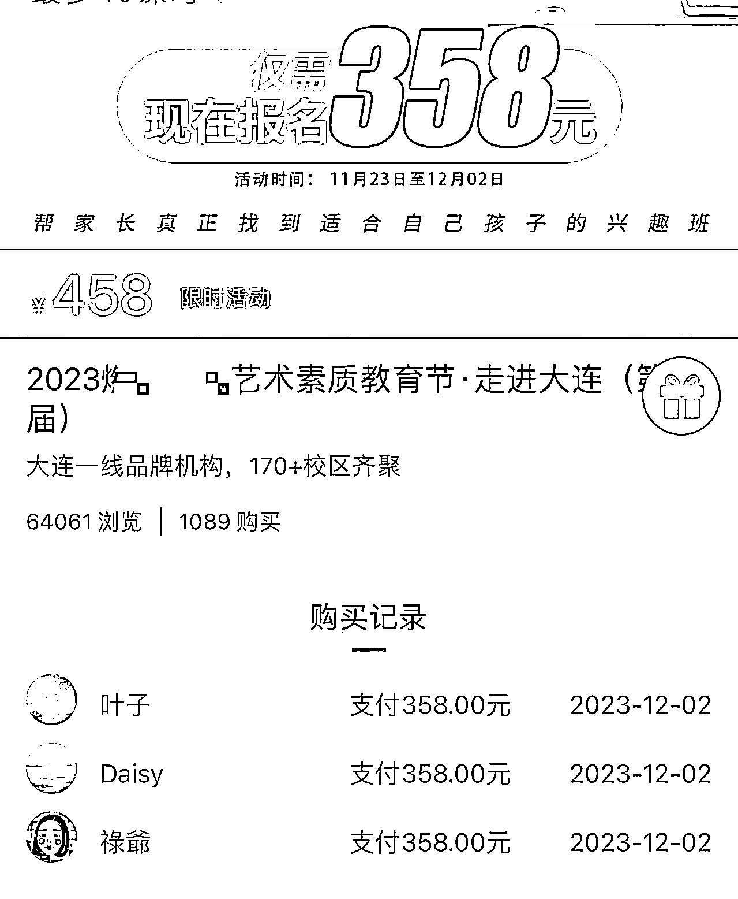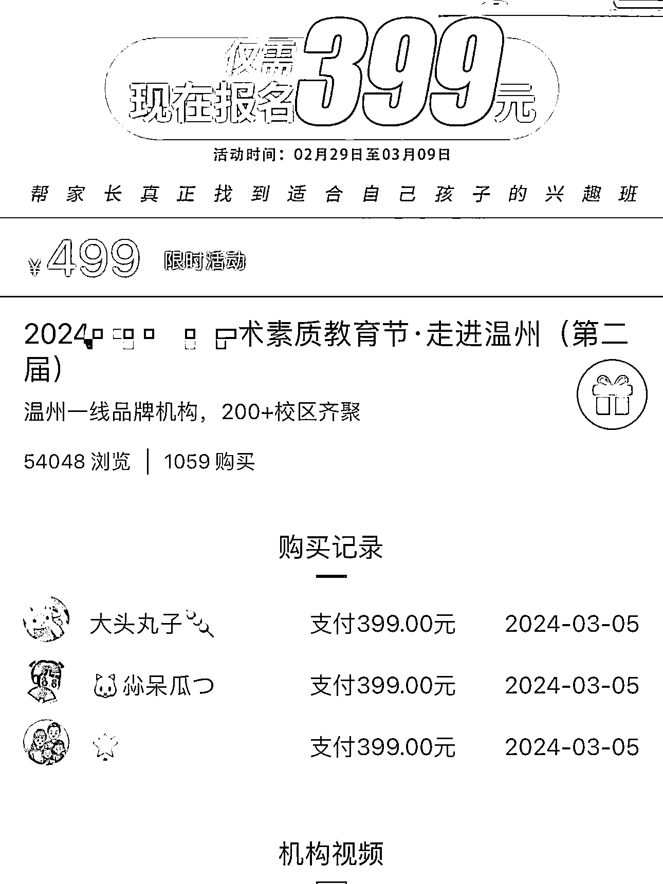

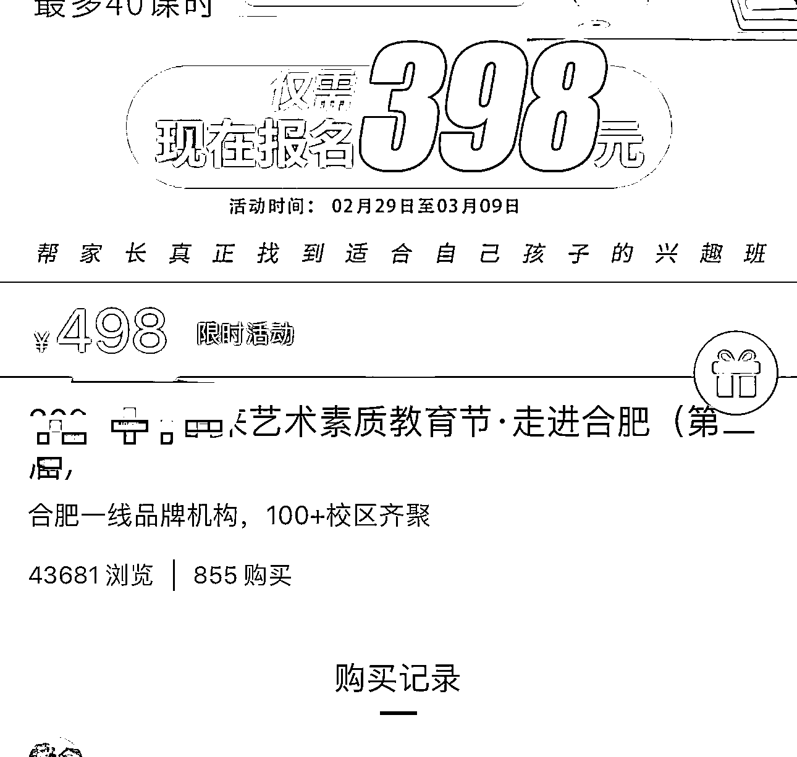

这里面的城市亲子节发售，合肥、大连、温州三个城市，分别 1000 多单，800 多单，398 的客单，大概做了将近 40 万的 gmv，整体的利润的话，大概在 20 万以上，这仅仅是前端的利润，后面还有大量 1 对 1 服务的利润，后面 1 对 1 服务做的 ok 的话，整体能到近百万利润，这里讲的是利润，不是营收，去掉团队开支后的利润，

一个区域一年可以做两次，全国有 1000 多个县城，预估一下最后的体量吧

先讲利润的目的就是，让大家先看见，再相信，重要的是这个业务好复制，人人可以复制，而且可以快速拿到一定的利润，

再讲这个业务之前，我们先论证一下这个业务，然后再讲一下整个业务的细节流程

剧烈的流量渠道变化，实体经营越来越专业化、细分化，需要大量的服务公司针对某个环节对实体店进行一定的提升

### 没有公域流量能力：

实体经营复杂度其实挺高的，绝大多数老板已经忙的焦头烂额，多数老板想从抖音、小红书等公域平台获得流量，

但是 90%以上的老板，没精力、也没能力从公域平台获得流量；

### 流量贵：

自然进店流量很少，有的在 2、3 楼的机会进店流量为 0 了，大量的商家需要在外部进行流量采买，他们一方面会在第三方服务机构来帮他们做流量，一方面会在抖音、小红书等流量采买，流量成本越来越高；

因此，基本每一类实体都有大量的服务公司在帮他们做服务，这里面有服务的机会；

### 流量转化差：

像艺培、瑜伽等这类的商家，都是进行体验一下课程，然后再进行升级高客单，超高客单，这里面就会出现转化率的问题，很多商家缺乏转化的能力，导致流量浪费，

因此，有大量的服务公司，会帮助商家做集中流量进店，然后再搭建整个流程，进行集中的转化收款，这里面也有大量的机会；

### 出生率降低：

出生率降低对于很多行业影响挺大的，生源的减少导致幼儿园、少儿培训等行业直接倒闭了，还有几年的传导期，接下来很多行业会迎来更大的洗牌，

总结一下，实体经营复杂，需要更专业服务团队，来助力他们的提升

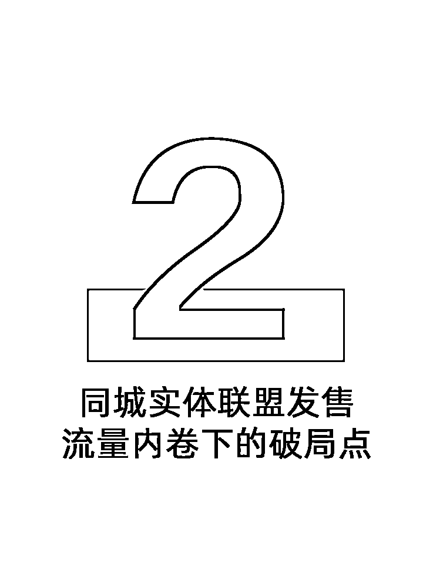

首先讲一下发售，发售就是用一套成熟的私域变现体系，帮助他流量增长、流量变现，快速拿到结果

## ip 发售利弊

先讲发售，目前 ip 发售比较多，很多 ip 一场发售是几百万、上千万，ip 发售的逻辑成立，但是帮助 ip 做发售服务，其实挺难的，有两个核心点

### 获取上：

1、ip 越大越能做出效果，但是获得大 ip 的信任难度极大，销售难度极大；

### 交付上：

1、双方配合度高才可以做出效果，大 ip 时间成本极高，交付难度大；

2、ip 发售本质上是让 ip 势能的变现，对于价值贡献，ip 天然觉得自己价值高，发售操盘手利润低；

## 实体发售优势

### 销售成本低：

实体商家量足够多，大量中小实体老板，我们能做到认知平齐，销售能沟通下来，不像 ip 沟通一样，需要极高的资源匹配，

### 多数沉淀海量私域：

很多实体的成交是在微信体系内完成的，绝大多数实体沉淀了自己的私域，做发售对于私域的要求很高，实体店天然契合，

### 配合度高：

绝大多数实体的老板一旦认可，愿意去干一些脏活、累活，相对来说执行力高，

## 实体联盟发售

发售本质上需要三个点：实体本身的势能、私域流量的数量、成熟验证过的方案；也就是说势能越强、私域流量越多，效果越好，所以对于单个实体来讲，流量、势能都是有限的，

实体联盟就解决了这个问题，同一人群的实体店进行流量共享，这样就可以形成 1+1 大于 2 了，

举个例子：舞蹈机构的客户孩子，但是付钱的是宝妈，本质上宝妈才是舞蹈机构真实的用户，我们就找到宝妈用户的实体店，瑜伽、医美、艺培等共同做活动，进行流量互导，

这样舞蹈机构送出去 30 个客户，会来 120 个客户，

这样机构、客户、我们，三方共赢了，

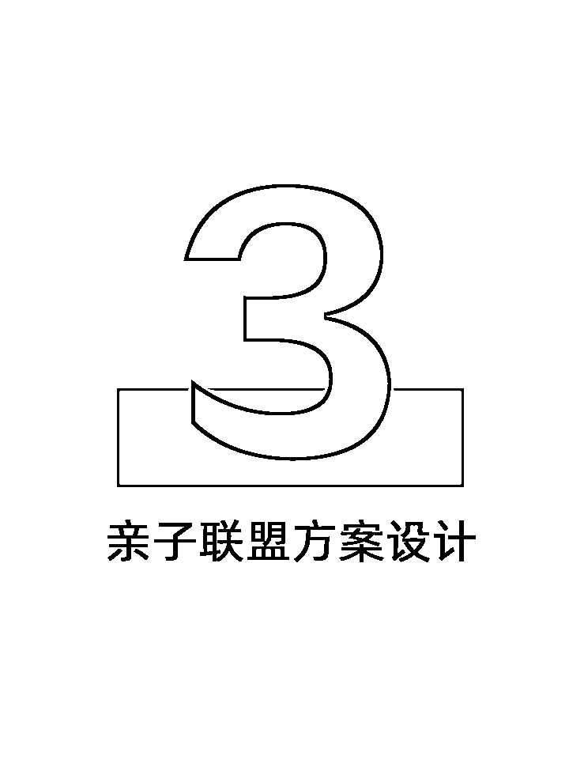

方案的设计要兼顾：流量共享，裂变、分销

因此，我们在方案设计上要满足这些点

## 参与机构：

前面讲过发售活动，要势能高、私域流量足够大，所以要选择足够多的商家参与，我们选择是艺术培训校区，一个三线城市的艺术培训校区大概是 2000 多家，而且艺术培训校区的用户是三公里内的客户，超出 3 公里，同样种类的校区就没有竞争的，正常可以邀请 100-200 家校区参与

## 课程设计-满足流量共享

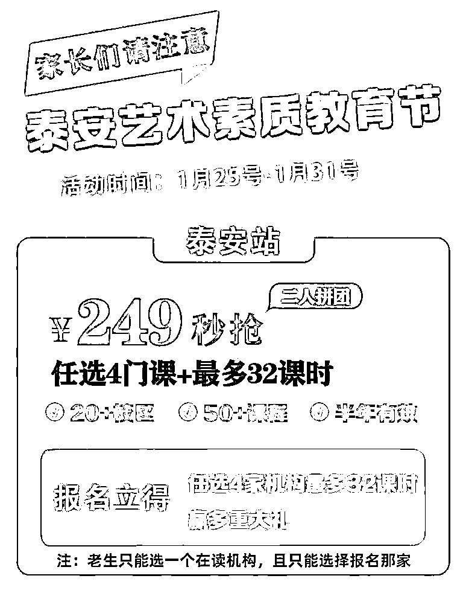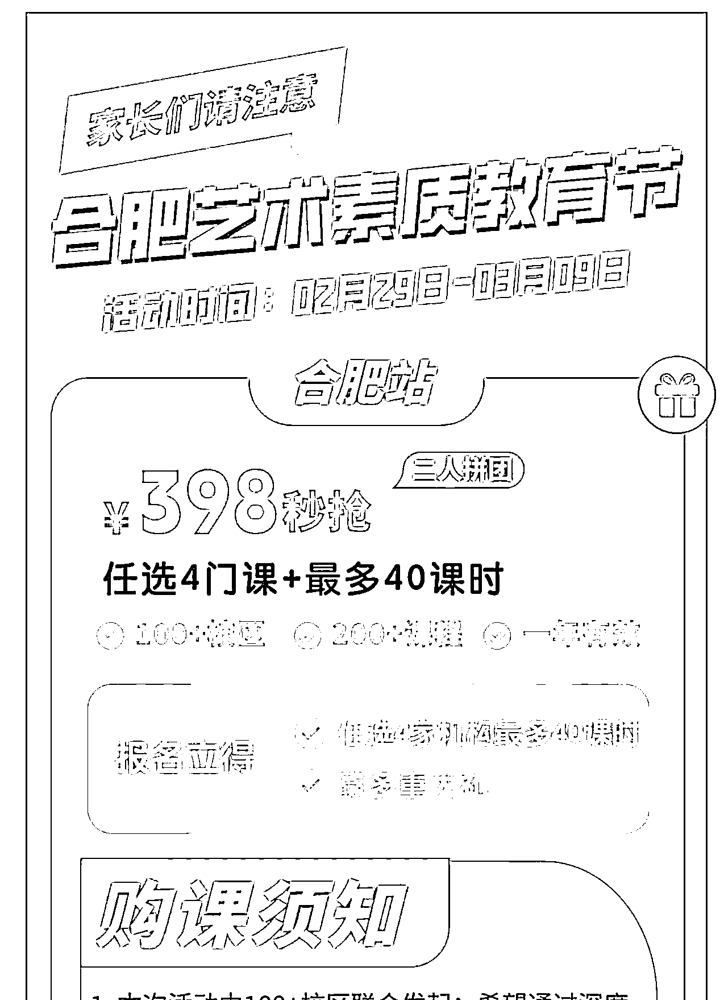

每家拿出 4 节课，用户可以选择 4 家 4 节课，共 16 节课，组成 299、399 的课包去售卖，参与的这 100 多家校区，共同用自己的私域卖这个 299、399 元的课包，这部分钱操盘手全部收走，再进行一些利润的分配

上面图的课时，是因为 1 节课等于 2 课时，16 节课等于 32 课时，对于艺术培训机构来讲，一节课大概是 100 多块钱，16 节课价值 1600 元，卖 299、399 元，对用户来讲还是很优惠的，

读到这里有朋友疑问，校区为什么愿意出 4 节课，课程是虚拟的，本质上校区的成本很低，进来体验生，再转化成高价课，这对校区来讲，

另外再进行一定的价值的提升，可以赠送一些口腔、医美、游乐场、摄影等等免费的权益包

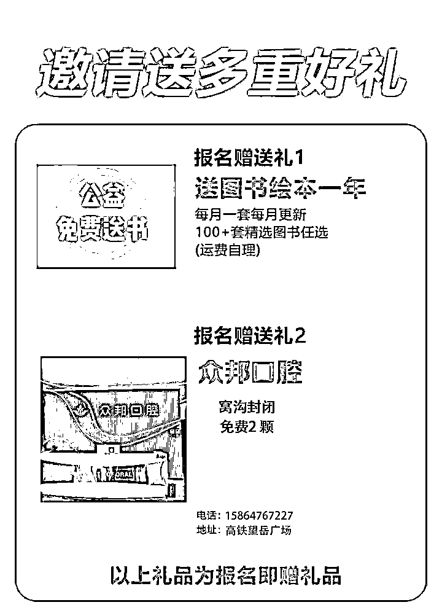

## 裂变设计-满足客户裂变

裂变机制设计，其实就是让家长买了 399 元课包之后，通过有价值的产品去驱动他们去拉身边的朋友

通过礼品裂变或者是超市购物卡裂变

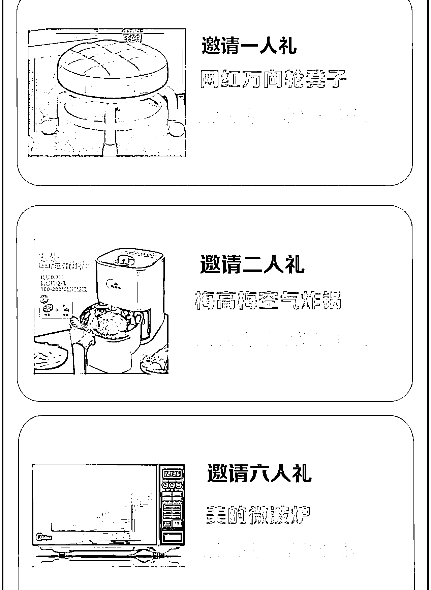

或着是

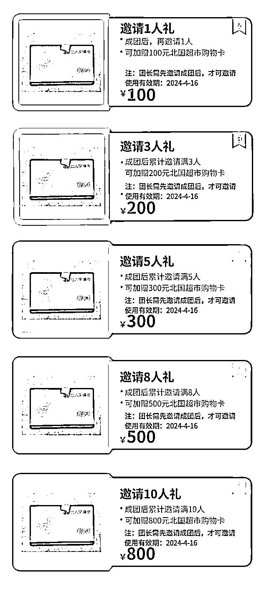

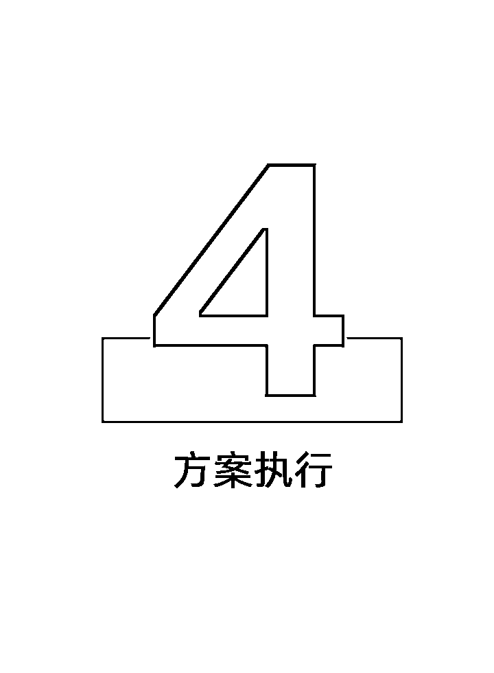

## 预售：

组织 100 多家校区，每个校区员工大概 3-4 个人，共 300-400 人做这个发售活动，有两个问题：

1、有的校区可能只想薅取别的校区资源，不动用自己的私域资源；

2、员工太多，传达不到位，执行不到位；

需要一个校长战略预售会来解决，也就说把所有的校长要聚集在一个会场，开一个会

1、把活动内容给所有校长讲清楚，解决校长所有的疑问，跟校长进行思想上的统一，

2、开始让所有的校区售卖 10 元的定金，通过每个售卖定金的数量，来判定校区的配合度，配合的留下，不配合的去掉，

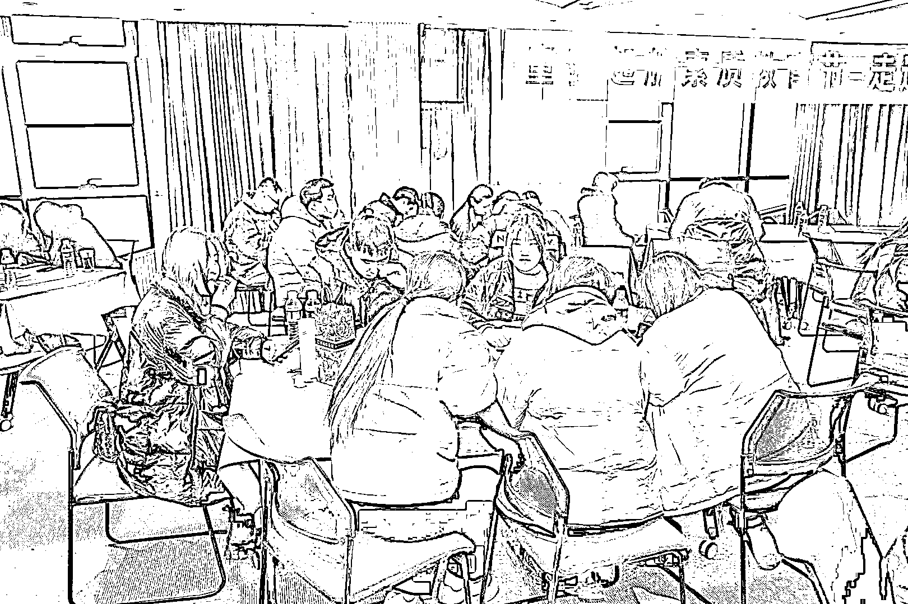

## 发售：

发售会租一个会场，把所有的校区聚在一块，组织 100 多家校区，每个校区员工大概 3-4 个人，共 300-400 人，每一个员工的私域储备大概是 500-1000 人，调用私域大概是 30 万-40 万人，开始进行链接的推送，

### 1、确保现场的参与的人多

老板、员工会缺席，来的人越少，调用的私域越少，效果越差，所以，我们把发售现场做成新闻发布会，并把所有的校区老板的名字做成嘉宾席，并给每个校区老板做了一个联盟单位的奖牌，并邀请他上去领奖，

这样就能确保老板出席，校区老板很少当嘉宾的机会，而且上台还可以领奖

校区所有员工出席，完成这三个动作，老板参加率 90%，员工全勤率也在 90%以上

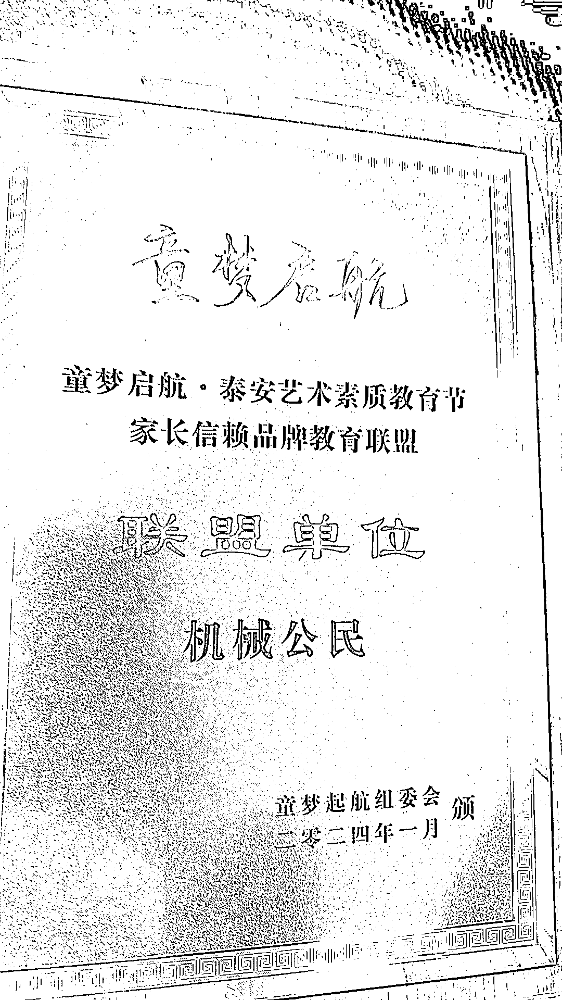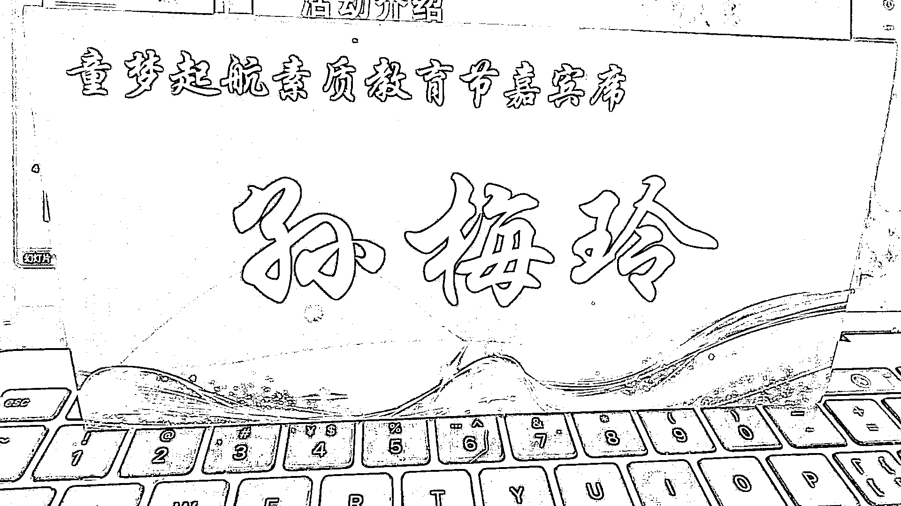

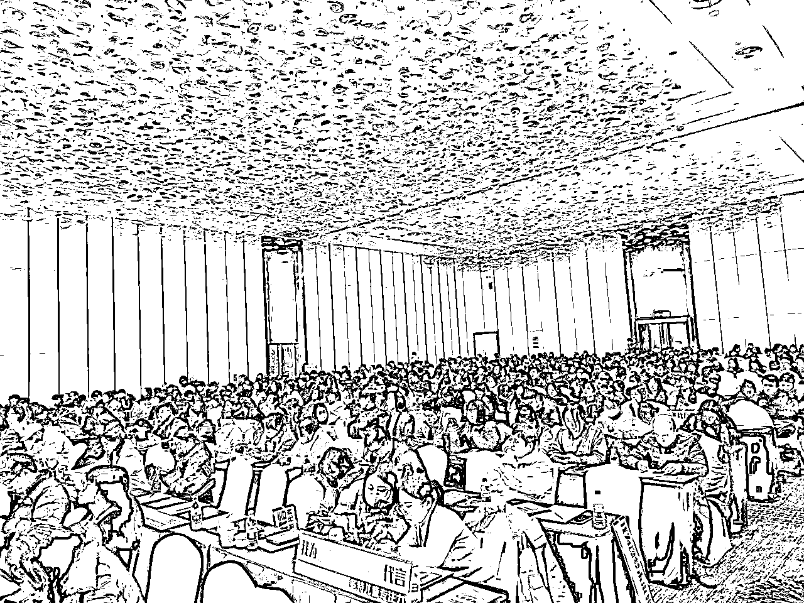

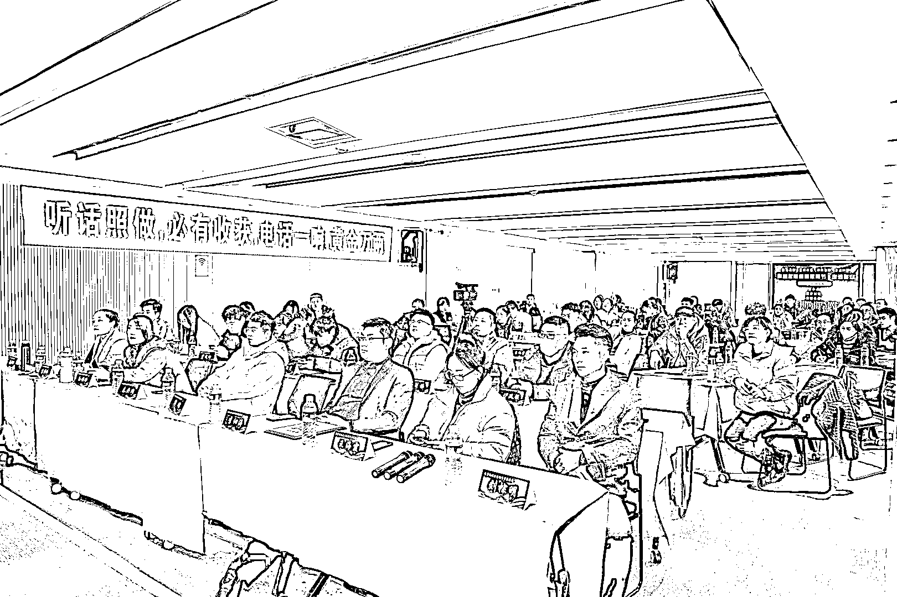

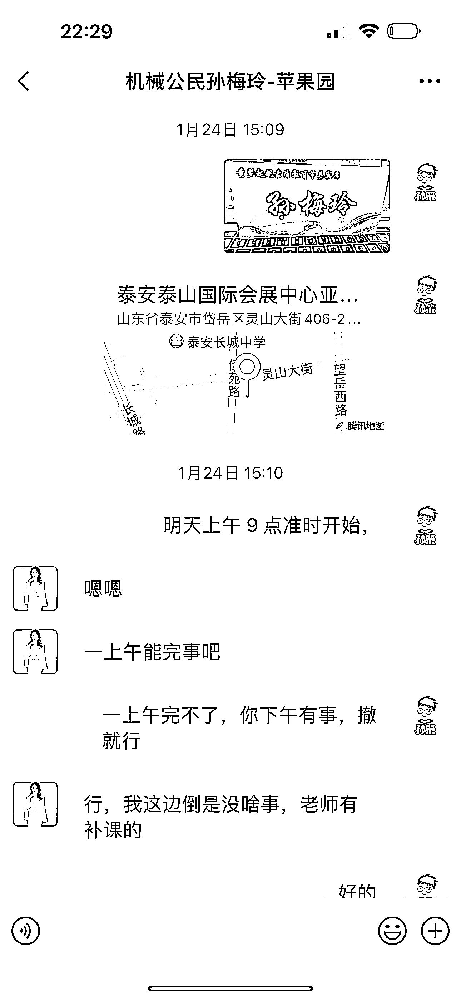

校长整体配合度直接提高

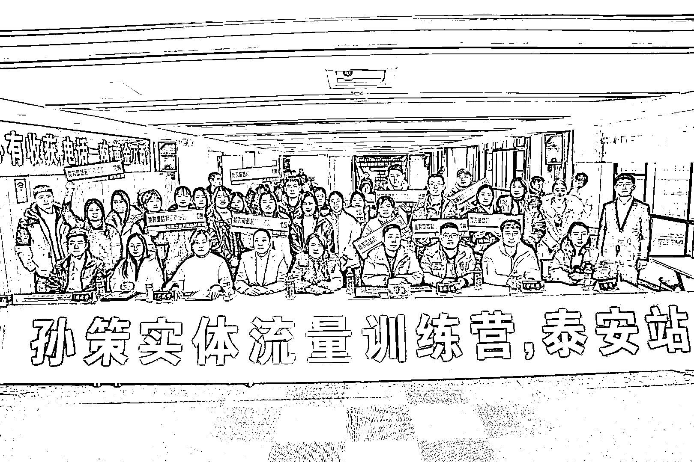

### 2、确保现场的人要调动自己的私域

我们设置了 100 元奖励给现场的人，100 元分成，立返 50 元，晒单返 50 元，只要现场的人卖出一单，直接发放奖励，

通过直接的现金发放让他们去卖，

会制作一个小程序，员工去现场卖，让家长去拉人，

### 3、达人分销

同时也邀请一些本地的社区团购达人、短视频达人，来会场去卖，去分销课包

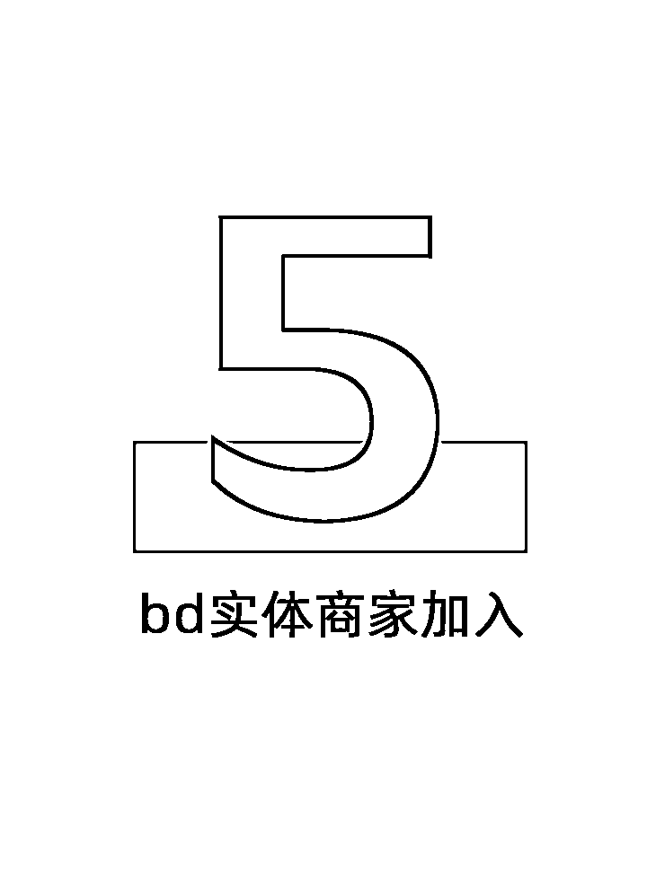

知道方案设计，方案执行，那我们就要邀请商家来参与我们的我们这个联盟，要说服商家参加，其实就是给商家一定的曝光资源，让商家愿意参与

我们提供了这些资源

1、提供本地公众号媒体的曝光；

2、大量混剪短视频的推送；

3、本地达人的探店；

4、本地私域达人的推送，

5、后面提供 1 对 1 的服务，

通过提供这样的资源，很多商家愿意加入，然后也愿意把自己的私域流量提供出来，共同去推送，

销售的方式主要有两个：电话销售、线下陌拜

电话销售：先把本地城市内所有的艺术培训的商家扒出来，先电话沟通一轮，愿不愿意参与这个活动，正常一个市区大概有个 1000 多个艺术培训商家，正常电话一轮，有个 10 多个参加，目的也是先让这些商家知道这个活动的存在；

线下陌拜：派一个人所有的商家上门一次，沟通一下这个活动，正常难度不大，并制作一个邀请函，邀请他们参与这个活动，老板不在的话，把邀请函给员工，让他传达给老板

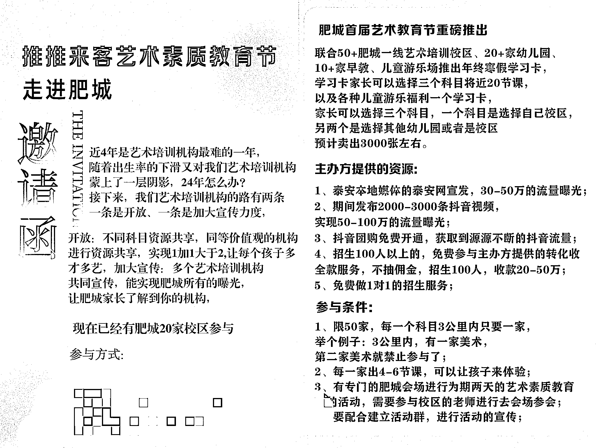

## 亲子节利润：

399 元的套餐的话，我们都收走，100 元给老师，30 元左右是礼品成本，还有会场成本，剩下的就是自己的利润

做 1000 单的话，399-130=269，269x1000=26.9 万，然后去掉会场成本，剩下的就是我们的利润了，

1000 单并不难，50 个商家的话，一家出个 20 单就够了

## 后端利润

1 对 1 深度服务的，裂变活动的利润是远高于亲子节的，

* * *

评论区：

戴巍 : 如果能找到地方教委的人做代理，是不是很容易号召这些教培？
孙策 : 不难
芷蓝 : 孙总，有没有适合成人培训的发售玩法？
孙策 : 有的，瑜伽什么的都可以操盘

* * *