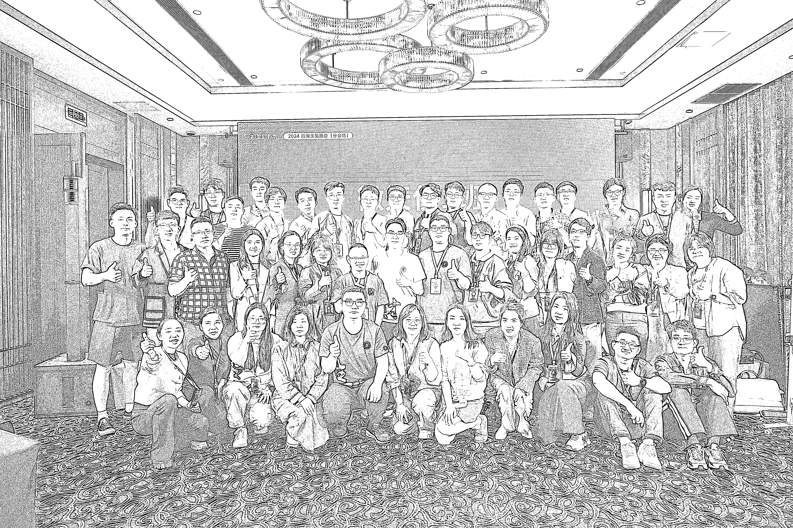
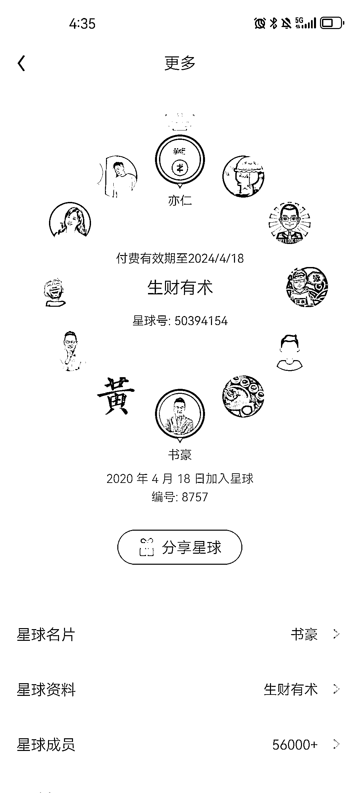
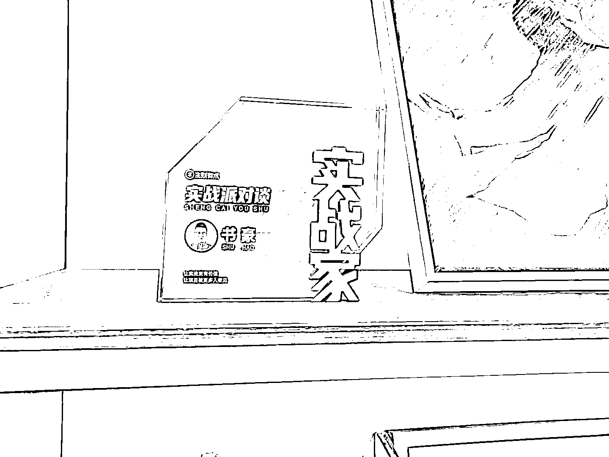
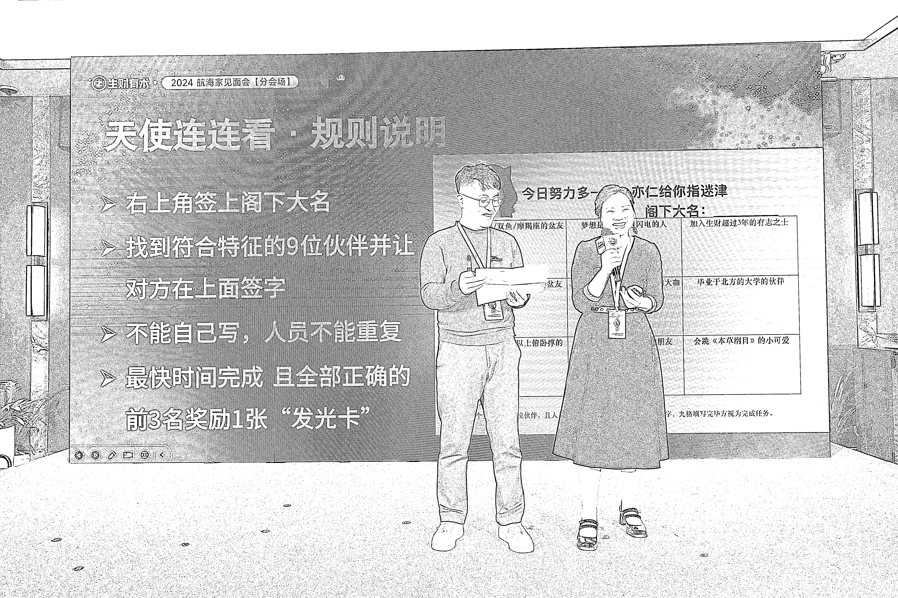
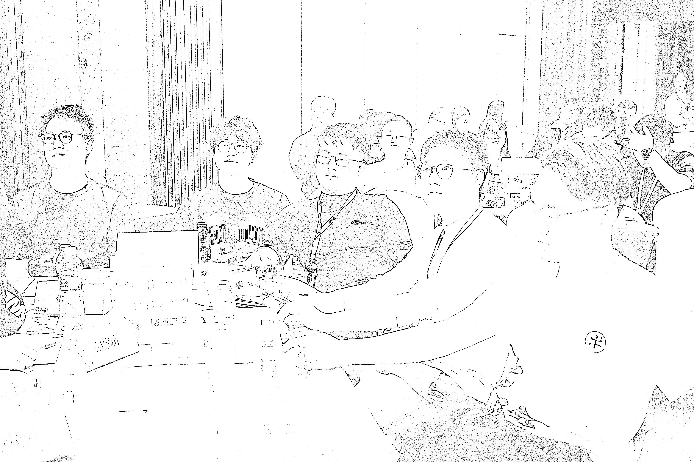
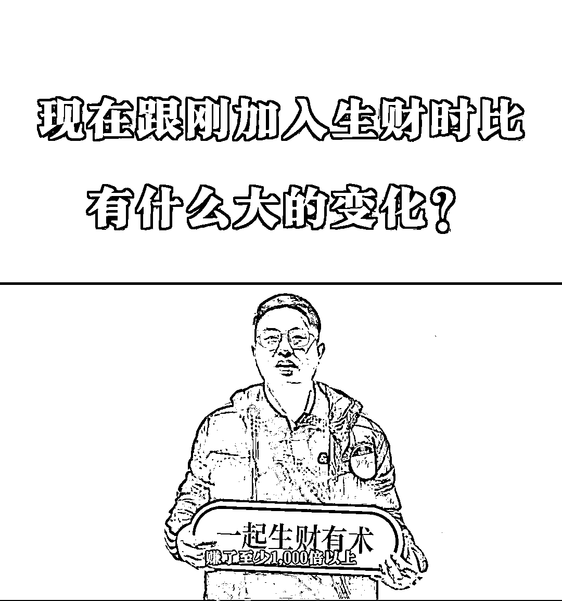

# 编号 8757 四年老圈友参加 2024 年赚钱有术航海家见面会的成长感想

> 原文：[`www.yuque.com/for_lazy/thfiu8/rg5cuzvnxrez1stm`](https://www.yuque.com/for_lazy/thfiu8/rg5cuzvnxrez1stm)

## (49 赞)编号 8757 四年老圈友参加 2024 年赚钱有术航海家见面会的成长感想

作者： 书豪

日期：2024-03-26

大家好，我是一直在努力提升利润的龙珠圈友书豪，也是小红书店铺和小公司聚光投放的航海教练。

周末结束了生财有术 2024 年的航海家聚会，见到了很多熟悉的老朋友，即便其中有些未曾谋面，相视间看看吊牌也能侃侃而谈。

仿佛认识多年的好友，这便是生财的魔力。

线上通过精华帖和各种航海社群，我们互相间又何止聊过百遍。

线下相聚，又让这一份革命友谊再添几分难舍。

听完了整整两天的分享，回家的路上看到麦洛发了一条他和生财四年间的故事，深深触动了我。

因为只有真正一路泥泞走过黑暗的人才会明白这四年间成长所经历的艰难困苦。

我和麦洛一样，2020 年 4 月加入生财，编号是 8757。

加入生财是因为疫情之下，时代的一粒灰落在普通人的肩膀上也是一座山。

还记得 2020 年的 1 月，我迎来了人生当中的第 5 次失业，这成了压死骆驼的最后一根稻草。虽然之前已经有过 4 次失业经历，但，都没有这次严重，它将我的信心完全摧毁。

彼时全国大面积封城，各行各业都在降薪裁员，而我自己的编程专业能力，又是半吊子，说出来不怕大家笑话，就算我自愿降薪，找工作也是处处碰壁。

年关将至，从公司打包离开的那一刹那，仿佛天都塌了下来，我不知道前途在哪。我不敢给父母家人打电话，害怕他们为异乡的我担惊受怕。

那段时间灰暗到回忆起来都有些可怕，我不断的埋怨命运，为什么只有我的未来越变越差？

就是这样的心态，我开始满互联网找着项目，因为之前还有过一些公众号的副业经历，便朝着这个方向研究发展。

2020 年 4 月，因为子木，我加入了生财有术。他是我公众号副业赛道上的小伙伴。

刚入圈时，我也被各种月入十万，年入百万的精华帖震撼得说不出话。

你要知道，在此之前我公众号副业最多的时候一个月也不到两万的收入。

也正是因为生财有术，我坚定了创业的想法，如果回到职场，仅仅靠着微薄的薪水，杭州的万家灯火也不会有属于我的那一盏。

抱着这种心态，我在公众号编程赛道上死磕。

由于当时全国封闭的大环境，市场利好在线教育，我的公众号收入也像风口上的猪一样，就这样被飞了起来。

我最大的广告客户是：开课吧，拉勾教育，图灵教育，极客时间，网易云课堂之类的大客户

我也第一次体验到，什么叫做时代的红利，线上教育公司为了抢占更多的市场，我们号主的广告费也赚的盆满钵满，每周的广告费都在不断上涨，直到 22 年初，才开始慢慢降了下来

就这样，我顺利积累到了人生当中的第一个 300 万。

也正是这 300W，让我在公众号大势已去的时候，顺利的找到了第二曲线：电商。

这两年，在电商上吃了不少苦头，从抖音、视频号、小红书，再到快手。

从第一个 100 万到 500 万，我花了整整 4 年的时间才拿到结果。

供应链的坑，平台的罚款，招人的坑，我都一一踩过，好几次都觉得生活都要扛不下去，都只能与圈友们彻夜长谈，互相加油打气，咬咬牙便挺了过来。

这一期线下新面孔有很多，一代新人换旧人，但你们可能不知道，生财里现在所看到的台前光鲜亮丽的大佬

多年前也是一群一无所有，同样背景荒凉的年轻人。

像盗坤，木易，梁靠谱，麦洛，Sky 等等，你们如果仔细翻阅过他们一路走来在生财留下的精华帖，便能从中窥探到成长的点点滴滴。

作为一名伴随生财有术 4 年成长的普通人，我们共同见证了彼此的酸甜苦辣。

这 4 年中，我觉得生命中最重要的事情不是我加入生财有术后赚了多少钱，而是生财让我明白了一个道理：

你想要获得他人无法获得的成就，就必须付出他人没有付出的努力，只要不下牌桌，我们每个人总会有属于自己的机会。

* * *

评论区：

周彦充 : 公众号，电商都做过，没大结果，有小结果。
执 笔 写 洪 顺 : 越努力，才能越幸运。

* * *