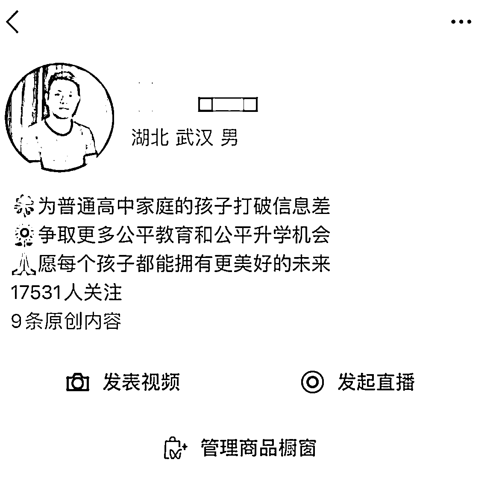

# 抖音、小红书、视频号从“0”到“1”的过程，我是这样做真人出镜教辅号的

> 原文：[`www.yuque.com/for_lazy/thfiu8/ehb7y2a6gt37bago`](https://www.yuque.com/for_lazy/thfiu8/ehb7y2a6gt37bago)

## (33 赞)抖音、小红书、视频号从“0”到“1”的过程，我是这样做真人出镜教辅号的

作者： Lee

日期：2024-03-29

大家好，我是 Lee！加入生财几个月了，初次决定把我的经验跟大家分享，先简单的介绍一下自己

**1\. 抖音项目：**

2019 年开始短视频运营，平台账号做矩阵，总粉丝量 100w。历史抖音爆款最高纪录 2700w+/点赞 46.7w+。

带货视频最高记录单视频 10w 单

**2.小红书项目：**

2023 年 1 月，开始玩小红书真人出镜带小学和初中教辅类，最高一个月的 GMV 有 20w，不过现在小红书的 GMV 单月只有 5w 左右了，而且发现出单和之前相比，低了好多，所以重新开始移到视频号项目。

  

**3.视频号项目：**

2024 年 3 月，开始玩视频号真人出镜带高考教辅类，一个月不到，佣金已经有 3 万了，视频号今年的爆发力确实是好。

  

今天这篇帖子，不谈结果，我就来谈谈抖音、小红书、视频号从“0”到“1”的过程，我是这样做真人出镜教辅号的

（之前一直都是自己一个人在搞，23 年刚开了个工作室，和一个小伙伴，我们既要自己写文案、真人出镜、还要剪辑、同时也是运营，那现在也找了好几个代剪的小姐姐，所以比较熟悉整个流程到底要怎么规划，怎么走）

言归正传，开始我今天的分享

**第一、口播起号**

**第二、****真人出镜**

**第三、选品    **

—————**我是一条分割线**————

以下是我 19 年入坑抖音，23 年入坑小红书，24 年入坑视频号，沉淀下来的所有东西，都是自己一**点点总结的**，希望看完对您有所**帮助**！

## **第一章、****口播起号**

所谓的真人出镜，就是把文案写好用剪映的提词器录下来就行

**1、文案怎么找**

抖音、视频号、小红书去找同行，我一般都会去抖音的创意中心，然后把文案改下，一定要改，现在各个平台的查重很厉害。

**2、蹭热点**

比如之前校园霸凌事件就很火，这种热门视频你去说一说一般流量都不会小。

## **第二章、****真人出镜**

### **1、语言表达**

看着提词器，不要和背书一样，眼神这点是最难的，你得把手机想像成一个人，而不是手机

### **2、场景布置**

不要搞的太专业，太专业给别人的预期会非常高。你比如边洗衣服边说育儿，边炒菜边说财经，这个别人刷到你之后会很轻松，可以增加你的完播率和转化率。

### **3、灯光**

建议找个公园，室外拍，边走边拍会很自然，但是如果在室内拍的话，一定要买 1-2 个补光灯，去淘宝搜个便宜的就可以了，不用太贵的，也没必要。

### **4、提词器：就用剪映的“提词器”，非常好用**

直接用【剪映】自带的提词器就 OK 了！之前是免费的，不过现在要充个会员才能用。

### 5、选品

去抖音橱窗里面的创意中心，每天都有新的爆款，非常好用

因为选品比较有感觉，抖音带货的图书类目，之前当月排名是第 9 名

最后：今年 2024 年我会把主要的经历放在视频号上，因为今年视频号的趋势不管是流量还是人群这块，都比去年好太多了，一个月的不到的时间，我也马上变现了 3 万的佣金。

起号也很非常容易，这周我又起了一个新号，5 天时间粉丝也已经突破 1.7 万了，以下是截图

我的分享到此结束，感谢你能读完这篇文章！这是我的**知识星球**，聚集了一帮**短视频带货**的朋友。就让我们**一起学习，共同富裕**！

* * *

评论区：

大树 : 很棒，期待更多的分享[强]
Lee : 圈友们对这个赛道有兴趣的，可以加入一起讨论[鼓掌][鼓掌][鼓掌]
华龙 : 你好，文章里面有句话，说同行的爆款文案一定要去改，各平台查重厉害。然而，生财航海里的教练说: 爆款文案都是验证过的，不要改，千万不要改。

这，到底听谁的？
Lee : 会查重的，建议改成自己的话
雄 : 武汉的圈友你好，你加我，我拉你进武汉生财群，18772107060
A 大熊 : 哈，老师，我正筹备这条赛道，期待加入跟你学习成长
A 大熊 : 没有说全改，是让改成自己的语言，换种说法，意思不变。
华龙 : 航海讲的，就是爆款音频全部保留。画面要改成自己的

* * *