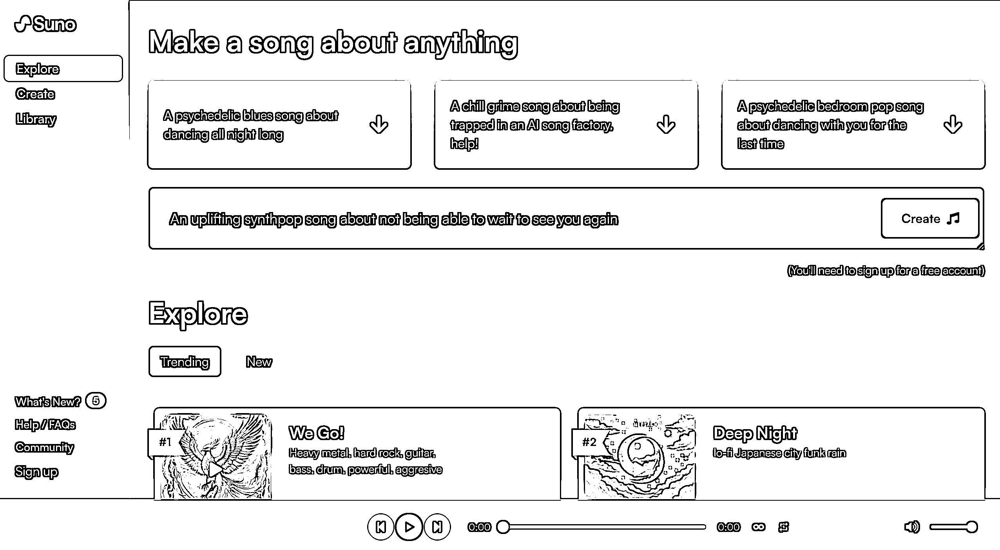
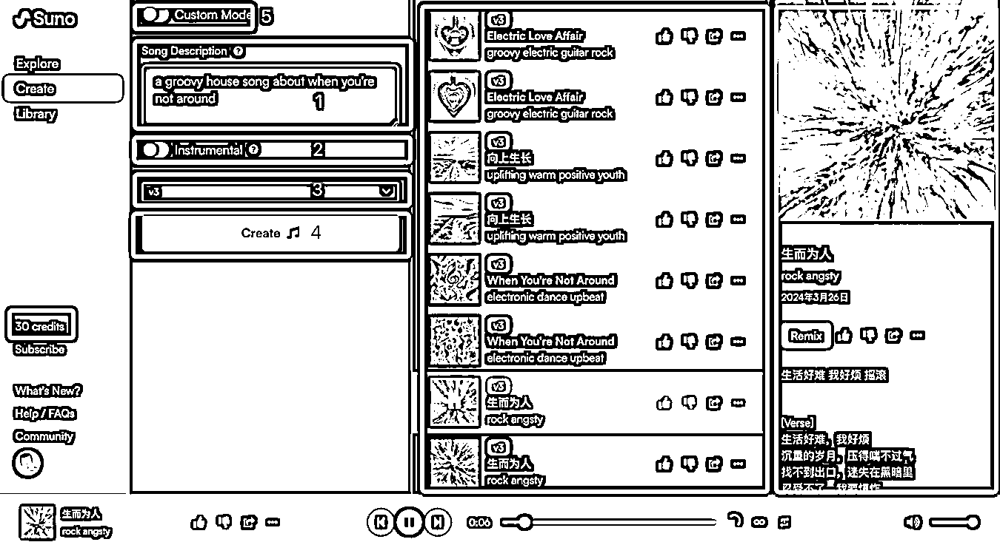
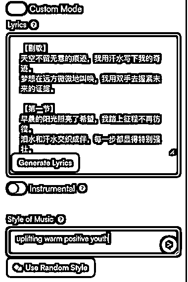

# 只要 5 分钟，Suno 助你写歌谱曲，免费拥有属于自己的爆款音乐

> 原文：[`www.yuque.com/for_lazy/thfiu8/hpodwxtv3elsiflv`](https://www.yuque.com/for_lazy/thfiu8/hpodwxtv3elsiflv)

## (55 赞)只要 5 分钟，Suno 助你写歌谱曲，免费拥有属于自己的爆款音乐

作者： hulei

日期：2024-03-27

今晚早睡航海的高手领航直播里，易仁永澄老师提到的 Suno，不知道有没有小伙伴们还没体验过，分分钟生成属于自己的爆款音乐，真的太好玩了。

这个被称作「音乐界的 ChatGPT」的 AI 产品，前两天把玩了个把小时，直接震惊到了，没想到我这个小白也能做出这么好听的歌😂

昨天还写了一篇公号文章，介绍怎么花 5 分钟学会使用 Suno 写歌。在这里我精简一下直接贴出来一个无废话版：

大家可能会问，做音乐是不是挺复杂的？要不要钱？对网络有要求吗？

在此明确告诉大家，用 Suno 做音乐非常简单，你花 5 分钟看完这篇文章，再花几分钟注册登录官方网址，就能用 1 分钟不到的时间做出一首歌，完全免费（收费会员的权限更多，但免费会员够用了），没有网络要求，直接就能用，真的是太良心了。

首先，在浏览器输入官方网址 [`app.suno.ai/`](https://app.suno.ai)

然后注册登录，熟悉一下界面：

整体界面分 4 个部分，最左侧的是导航菜单，你可以点“Explore”欣赏全球其他用户创作的音乐，也可以点“Creat”创造自己属于的音乐。注册后平台每天会送你 50 积分（credits），每次创作会消耗 10 积分，生成 2 首主题相同风格不同的音乐，因此你每天都可以生成 10 首音乐。

界面右边的两个部分，分别是你创作的音乐列表页和详情页，就不过多解释了。

咱们一起重点了解下标了一堆框的这个部分。

1、Song Description，是提示词填写框，就像你生成图片一样，需要填写一些提示词，是 Suno 的核心部分。

2、Instrumental，是切换人声歌曲和纯音乐创作模式的开关，默认关闭。当它关闭时，生成的是带人声的歌曲；当它打开后，生成的音乐是没有人声的纯音乐。

3、模型版本，可以选择 v2 或 v3，建议您选刚推出的 v3，效果好太多了。

4、Create，音乐生成按钮，以上内容设置好后点这里就能生成音乐了。

5、Custom Mode，自定义模式，选中后可以输入歌词（可以用 ChatGPT 生成歌词）和风格，让 Suno 根据你的歌词生成歌曲。

没了？

没了！

就这么简单，现在你就可以发挥你的创意，轻松地创作属于你的旋律了。

为了帮助各位伙伴更好地创作，我再做几点补充说明：

1、免费会员生成的音乐只能用来自娱自乐哦，不能用于商业用途；如果需要用于商业用途，得订阅付费会员并重新去生成。

2、免费会员每天可生成 5 次，共 10 首音乐，用完了需要等第二天重新获得积分。

3、提示词可以直接用中文，但是更建议您使用英文，因为会更准确，可以把中文提示词用翻译工具翻译成英文再提交。

4、提示词没有太多讲究的地方，你可以随意尝试组合，包括音乐风格、乐器、感受等等，比如钢琴曲可以用 piano，摇滚可以用 rock。

别犹豫了，快打开网址，给你自己或者你喜欢的人做一首只属于你/你们的音乐吧。

* * *

评论区：

暂无评论

* * *