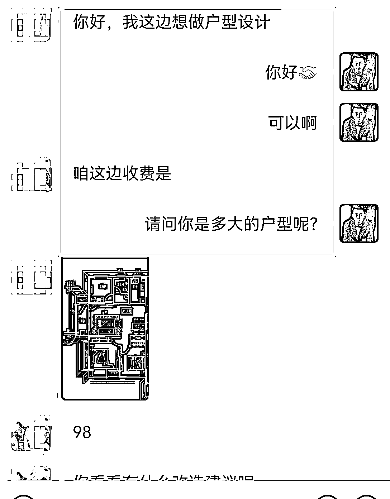
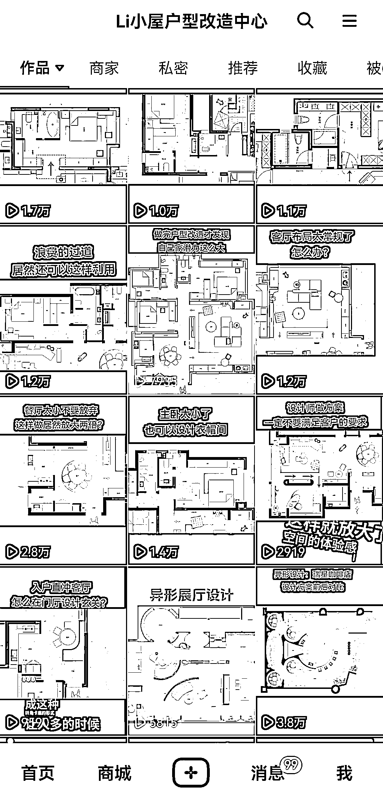

# 如何通过提升自身技能，赚到比打工高 10 倍的钱？

> 原文：[`www.yuque.com/for_lazy/thfiu8/ml08yihmkiqxxmyz`](https://www.yuque.com/for_lazy/thfiu8/ml08yihmkiqxxmyz)

## (35 赞)如何通过提升自身技能，赚到比打工高 10 倍的钱？

作者： 李勇

日期：2024-03-28

一个买房契机，我成为月入两万的室内设计师，走出“月入 2000”的困境。

刚毕业那会，我在外漂泊了两年，换了 7 家公司，不涨薪赚不到钱，就打算回家了，也正是因为这个契机，我找到了新的商机和痛点：

很多买房人，在买房选户型时，是发现不了户型存在的隐藏问题，但是一旦在开始装修设计的时候，就会发现这个户型存在各种各样的问题，而这些问题，在买房之前完全就可以避免的。

所以，我把这个痛点做成了产品，通过在抖音、小红书打造个人 IP 引流获客，开始有了第 1 个、第 10 个、第 100 个客户，也经过一年的沉淀，我光户型改造的这个业务，在第 2 年收入就直接破 20 万+了。

接下来，也和大家分享我这一路以来从打工人到独立设计师，月入 2000 到年入 20 万的经验和心得，希望能给到大家一些启发。

全文大致目录如下：

一、职场新人如何从月入 2000 到年入 20 万+

①刚入职场的糟糕经历。

②买房找到契机转折点。

③找到职业新方向，开启独立设计师之路。

二、如何玩转自媒体两大平台抖音、小红书

①关于自媒体平台运营的认知

②抖音运营心得与经验分享。

③小红书运营心得与经验分享。

三、如何通过运营打造微信朋友圈赚钱

# **一、职场新人如何从月入 2000 到年入 20 万+**

**你好，我是李勇，是一名独立室内设计师，全网粉丝 8 万+，今天给大家分享一下，我是如何从一个月入 2000 的职场新人，实现到年入 20 万+的独立设计师。**

可能跟很多生财有术的大佬比起来，年入 20 万只是起步，但对于我自身成长来说，我觉得他是我人生中的一次跃迁。

还记得在 6 年之前，我还是一个在装修公司，每天朝九晚五，按时打卡上班的设计菜鸟，那个阶段可能是我目前人生最低迷的阶段，每个月拿着不到 2000 元的工资，特别的迷茫。

因为刚走进社会进入设计这个行业，没有什么太多的工作经验，这也就导致得不到客户的认可和领导的赏识，每个月只能拿着微薄的底薪度日如年。

刚开始我以为只是公司平台的原因，导致我赚不到钱，所以在这两年，我不停的换公司，而且在两年的时间内还换了 7 家公司。

后来才发现，不管我怎么换公司，我的工资收入，一直都在 2000 元在这个位置上下浮动，没有发生任何改变，所以我就意识到了自身问题的严重性，然后开始思考如何改变。

因为在外漂泊了两年，也一直赚不到钱，导致生活压力太重，无法承担在外面的生活开销，长期这样下去也不是办法，所以就有了回老家发展的这种想法，而也正是这次回老家的这个契机，也开拓了我新的职业方向。

回老家之后，也找到了一个装修公司继续上班，既然决定以后准备在老家发展，所以刚回家不久，父母就准备给我买一套房，为以后结婚做打算，而也正是买房这个契机，让我找到了在室内设计这个行业的新方向，让我走出了困境。

既然准备要买房子，那买房子的第 1 件事情，就是要选一个好的户型，那作为一个室内设计师，每当给客户做设计量房时，总发现他们买到的这些户型，都会有各种不同的问题。

其实这些问题，在买房之前完全就可以避免的，只要选择一个好的户型，就可以完美规避这些问题。

所以买房之前通过先规划这些户型之后，再做选择，看适不适合自己，那在装修的时候会避免很多不必要的问题。

所以我就挑选了几个中意的户型，然后把这些户型的设计方案先做出来，当我把设计方案做出来了以后，我就会更清楚哪个户型会更适合自己，而也正是这个举动，让我发现了新的商机和痛点……

作为不是专业人士的买房人，在买房选户型时，是发现不了户型存在的隐藏问题，但是一旦在开始装修设计的时候，就会发现这个户型存在各种各样的问题，所以我就觉得这是一个需要被解决的痛点。

那我们能不能在选户型的时候，就把这个问题解决了，而不至于房子买了，在装修设计的时候才发现这个问题。

所以我就觉得，我可以把这个痛点做成一个产品，在买房之前帮助客户把设计给规划出来，然后让他们选择一个合适的户型，然后也提出了一个理念：“**买房之前，让设计先行**”。

当时想到这个想法的时候，我就开始兴奋了，然后我就在开始着手去做这件事情，我就通过我自己买房的这个经历和设计的这些方案去推广。

刚开始我推广的方式，因为是在县城里面，县城里面会有各种各样的微帮，微帮就是针对本地打广告的一个微信账号，他的微信上的好友都是本地的这些人群。

所以我就把我设计好的一些图纸和改造的一些方案，让他帮我发朋友圈做推广，希望通过这种方式，吸引到本地的一些客户，来找我做这个买房怎么选户型的这个业务。

做了一段时间，发现效果不好，所以我就觉得我的这个渠道和市场可能有点问题，毕竟是小县城，这种需求和意识还比较少，所以我又重新找到了一个新的渠道和市场，就瞬间打开了我的独立设计师之路的大门。

因为我是知乎的忠实用户，所以我就觉得我可以通过知乎这个平台来去分享我的内容，而知乎这个渠道，它面向的市场是全国，所以市场又会更大，市场大那需求也会更多。

所以我就决定通过把我自己买房选户型的这个经历，通过写成文章的方式发表在上面，然后吸引到那些潜在的客户群体，果然黄天不负有心人，通过在知乎上的分享和推广，终于有了第 1 个客户找到我，但是结果既让我兴奋又让我诧异……

因为我发现从知乎过来找我们咨询的客户，并不是买房之前想咨询我们怎么选户型的，而是已经把房子买好了，户型选好了。

然后正准备装修发现户型有很多问题和痛点，想要叫我们帮忙改造优化户型的，然后通过一段时间的观察，我发现全是找我们做改造优化户型的，并没有找我们做买房怎么选户型的。

所以我们业务的方向和我们起初启动这个项目的时候，其实是发生了一定的偏差，所以这个就是实践之后市场给你带来的反馈，可能和你预想的并不一样。

所以那我们就将错就错，就按照市场给我们的反馈来继续做这个业务，户型改造之路就从这里开始了。

当我有了第 1 个客户，通过线上这种方式，来找我们做设计之后，我就坚定这件事情一定是可以持续去做的。

因为只要有了第 1 个客户来找我们做设计，那说明这条路跑通了，那至于后面能不能有更多的人来找我们设计，那就看我们投入的时间和精力以及怎么运营了。

所以我觉得事在人为，既然这个路能跑得通，那通过我们后期的努力，我相信会有第 10 个、第 100、个第 1000 个客户来找到我们做设计，所以我就坚定这个方向是对的，我就决定从老家的装修公司辞职，把我所有的时间精力，全部投入在这个事情上来做这个项目，于是这个项目就顺利启航了。

然后通过第 1 年的沉淀，光户型改造的这个业务，在第 2 年收入就直接破 20 万+了。

所以事后我也会回想一下我的成长经历，我是怎么从一个月入 2000 的职场新人，实现年入 20 万+的独立设计师。

我发现刚开始我在装修公司赚不到钱的原因，其实就是因为我的能力不够，而我的这个能力不够的原因，主要是做这个事情，我要掌握的能力和知识太多了，我无法在短时间内把这些事情都做的很专业。

因为在装修公司里面做整体设计师，你需要各个方面都要专业，你才能够得到客户的信任和领导的赏识，做整体设计师你需要会做平面设计方案、又会需要会做施工图、又需要会做效果图、又要懂施工工艺、又要懂材料等等。

所以无法在短时间内把这些所有的东西都学的很专业，所以就导致刚出道的我很难拿到结果。

而后面我选择只做户型改造优化这个业务，会让我更快的看到结果，然后做起事情来也会更轻松，而且成长起来也会更快。

因为我把我所有的时间和精力，都集中在这个点上去发力，所以我在短时间内，也可以让自己变得很专业。

所以我总结，职场新人想要快速的脱颖而出拿到结果，我们要学会找到自身行业细分领域的切入点。

我们不用急于的去学习这个行业所有的专业知识，因为短时间我们不可能成为一个什么都专业的全才，而是选择先从这个行业一个点上切入进去发力，成为在这个行业方向的专才。

因为每个行业都有不同的细分领域，而作为职场新人在行业的细分领域发力，会更容易更快拿到结果。

当然职场新人想要快速脱颖而出，仅仅只是找到行业细分领域发力是远远不够的，除了专业上的能力，你还得学会如何把你的专业卖出去，所以你还得学会自媒体运营和微信私域运营的能力。

# 二、**如何玩转自媒体两大平台抖音、小红书**

接下来，分享我是如何通过自媒体和微信朋友圈的运营，成功的把设计这门生意，搬到线上操作的。

最开始我是从知乎开始推广，然后就是抖音、接着就是小红书，知乎就不详细展开分享了，因为现在的知乎，我认为已经错过了最佳时间进入了，接下来主要给大家分享，现在最火热的两个自媒体平台抖音和小红书。

**（1）抖音运营的技巧及心得：**

我是从 2018 年开始做的抖音，可以说是碰巧抓住了那个风口，那个时候的抖音好做，因为那个时候设计师做抖音的还很少，感觉只要发布内容，都很容易火，

也正是这个机会，让我尝到到了流量的甜头，每天都会有客户咨询找我做设计，所以在抖音内容运营上，也有一些小小的经验分享给大家。

**（2）关于做抖音的认知：**

在做抖音内容定位的时候，最好选择一个垂直细分领域的专业知识去分享，不要太过于追求泛流量和粉丝多，而是要追求流量和粉丝精准。

就像有很多做抖音的，虽然他们的粉丝多，但是变现能力并不好，但有的可能只有几百几千粉，但是他们也依然能变现。

所以我们对于做账号的定位，要有一个清晰的认知，我们要做一个变现能力强的账号，而不是看起来很厉害的一个账号，所以粉丝的数量，在变现能力的面前一文不值。

**（3）关于做抖音的技巧：**

给大家分享一个抖音视频播放，破 30 万的核心秘诀。

**① 视频的标题和内容，要把你的专业和社会性话题联系起来。**

比如我的这个视频的标题“为什么才四十几岁就开始分房睡了”？

这就是一个可以引起讨论的社会性话题，因为这个标题，会让那些结婚的人群，对这个话题去探讨和发表自己的观点，所以社会性话题就很容易引起探讨，而且社会性话题影响覆盖的范围也会很大，所以得到的播放量也会很大。

所以在做视频的时候可以思考一下分享的视频主题，有没有可能把你的专业和社会性话题联系起来，而且讨论话题的门槛越低效果会越好，只要掌握这个秘诀，就相当于掌握了流量密码。

像这三个视频都是用的这个方法，播放量都是二三十万。

**（4）小红书得运营心得及技巧：**

小红书我觉得目前来说是一个潜力比较大的平台，虽然他的用户人数没有抖音多，但是我觉得他的潜力可能会更大，而且可能没有抖音那么卷。

因为在抖音，现在无论是一线城市，还是八线小县城，很多人都在开始做抖音了，可以想象一下，这是一个多么竞争激烈的市场。

但是小红书就不一样，其实小红书现在它覆盖的范围，还是在一二线城市居多，还没有下沉到那些小地方，所以这个其实对我们来说它就是一个机会。

**接下来就给大家分享一下，我是如何用三个月的时间，把小红书的粉丝从 0 做到 10000+的。**

首先介绍一下背景：

1.  2022 年、花了一年的时间，涨了 500 粉丝。

2.  小红书分享的内容：平面户型改造方案

1.  2023 年、从 3-5 月份，3 个月的时间涨到了 10000 粉丝。

2.  小红书分享的内容：每天一个设计小知识

**接下来，就把我是如何从 0 涨到 10000 粉丝的心得和经验，毫无保留的分享给大家。**

我是一个专注做户型改造的方案设计师，2022 年，一直是通过分享自己的改造案例，在做小红书（感兴趣的朋友可以点开我的主页，看我以前分享的内容）。

但是效果一直也不好，花了一年时间就才涨了 500 粉丝，所以 2023 年开年之后，我就在思考我的小红书该如何运营……

其实我明白这种通过分享户型改造方案的方式，除非你的方案各方面特别惊艳，不然很难有大的流量。

所以我就察觉到，可能是我的这种分享形式不够直观，毕竟平面方案对于普通业主来说，还是有一定的理解门槛，应该换一种用户可以更直观的方式和内容。

所以转折点就从接下来开始了……

因为我每天都会在各大设计网站，通过浏览各种设计案例的方式，来提升自我的设计能力和水平，于是我就再想…

我能不能把学习和吸收到的这些设计知识点，把它保存下来分享给更多的人呢？

这既是一件顺带就可以做的事情，而且又是一个一举两得的事情，一边自己的学到了知识，又得到了归纳和总结，另一方面又能够为别人创造价值，这岂不是一件两全其美的事情吗？

于是我就开始把我每天学到的知识点，通过每天一个设计小知识的方式，分享到小红书。

分享的第 1 天就得到了，很好的反馈，让我觉得这个事情的确很有价值，于是就一直坚持的分享，通过 3 个月的时间和积累，终于也成了万粉户。

**①在小红书做内容，我的经验告诉我，分享的越细越好，越直观越好。**

不要把分享的内容，上升到普通人很难理解的程度，虽然你分享的很专业，但是如果用户看不懂或者不感兴趣，那就很难得到更多的曝光。

作为分享者这个思维一定要转换过来，因为我之前也是一直被这个点卡住，所以是深有体会。

**②还有就是分享的内容，要能够为用户创造价值。**

而不仅仅厉害、高大上就完事了，因为你厉不厉害关别人什么事，但是如果你分享的内容对别人有用、有价值，那用户就会关注你，所以要给一个用户关注你的理由。

**③还有就是分享的内容，最好能够结合到自己的成长上。**

就像我每天分享的每天一个设计小知识，其实就是我把我学习到的知识点分享出来了而已，我只是做了一个顺带的事情，所以也可以思考一下，在你自己的行业，平常学习到的东西，能不能把它总结出来进行分享。

上面，就是关于自媒体平台运营的一些心得和经验分享，但是想要做线上的生意，仅仅只是把这些自媒体平台运营好，还是远远不够。

因为最重要的一个环节还在后面，那就是微信私域的运营，因为后期客户的成交和沟通，全是要在这里完成的。

我们在抖音、小红书这些平台分享内容之后，目的其实就是要把，在抖音小红书的这些潜在客户群体，把它吸引到微信上面来做最后的成交，而微信的朋友圈又是客户了解你，最直接的展示渠道，所以微信的朋友圈一定是需要运营的。

# **三、如何通过运营打造微信朋友圈赚钱**

接下来，我就给大家分享微信的朋友圈，应该如何去打造运营，能够让你的用户追着给你打钱。

其实微信朋友圈，通过我这几年的运营总结，我觉得它主要分为 5 个方面：

**①要发一些关于你专业成果的内容。**

因为要让客户感觉到你很专业，所以朋友圈就应该去发一些关于你专业上的东西，包括产品，像我是做设计的，我就会经常去发一些我设计的一些方案案例。

**②要发一些客户给你的转账截图展示。**

发客户转账截图，其实它是一种客户认证，就是给那些还没有成交的客户看的，让他们知道他不是第 1 个吃螃蟹的人。

只要别人有转账，如果他们有这个需求，想选择我们，他们也会跟着转账的，毕竟已经有其他客户做示范，所以这个就是一种引导，也是增加信任的一种方式。

**③要发一些客户对你好评的截图展示。**

客户的好评也是一种权威的认证，自己说好远不如客户说你好，这样会更有说服力，也是增加潜在客户信任感的一种方式。

**④要发一些你对一些事物的认知感悟和思考。**

发这个是因为你要营造一种你是一个积极正能量的人，爱思考的人在学习这样的一种人设，他会让客户对你有更有好感。

**⑤要发一些你的生活方面的照片。**

发一些生活照片，也是要让你的朋友圈不要搞得过于的单调和枯燥，要让你的朋友圈有趣味一点，也是要让潜在客户看到你是一个有趣，有生活的人，而不是每天只知道工作无趣的人。

所以朋友圈时不时的，也要去分享一些关于生活方面的东西。

以上分享的内容，就是我从一个职场新人，到成为一个独立设计师的全路径分享。

**最后再给大家总结一下：**

①作为职场新人，我们无法在短时间内成为一个什么都专业的全才，但是我们可以在短时间内，找到行业细分垂直领域的方向，成为这个细分垂直领域的专才，这样才能在短时间内建立自己的核心竞争力，在这个行业站稳脚跟生存下去。

②作为职场新人，我们要学会通过互联网自媒体的方式，去传播分享自己专业领域的知识，也是通过互联网这个渠道来去获取客户，这样会让我们的市场会更大。

③在做线上这门生意的时候，大家一定要记得微信朋友圈的运营是我们的主战场，所以一定要学会朋友圈的运营，如何去展示自己的产品和内容，让那些潜在用户主动付费成交。

好了，以上就是全部分享，希望对大家有所启发。

* * *

评论区：

Joanna : 已关注
Leo : 逻辑很清晰，实操性强，很受启发，感谢分享
海里 : 感谢分享，很受启发

* * *