# AI双面人生短视频，完全拿捏情感共鸣

> 来源：[https://dik4wr1hyrw.feishu.cn/docx/Ba5Odvl5jo36HGxRaUnc94Kunsc](https://dik4wr1hyrw.feishu.cn/docx/Ba5Odvl5jo36HGxRaUnc94Kunsc)

双面人生？肯定会有疑问吧！一开始我也是，但是我看了小红书上的视频就完全理解咯~AI双面人生爆火也不是没有原因的，完全拿捏住情感共鸣，真的是绝绝子。

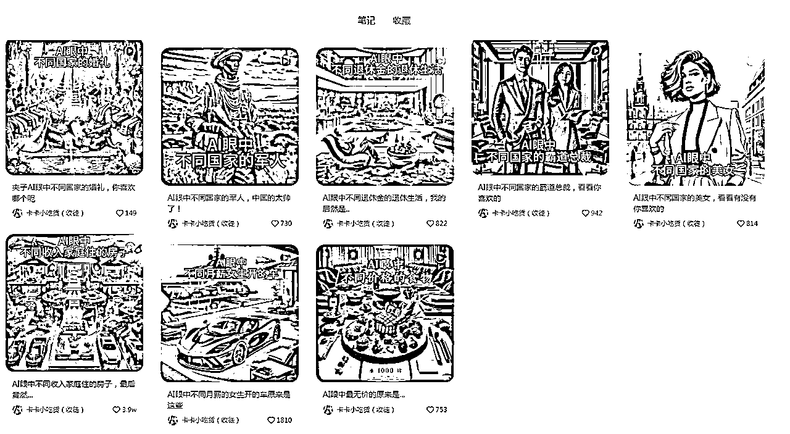

既然小红书爆火，其他平台也不是没有火的可能性，我们先来看看这类视频是如何做的？

## AI制作画面素材

我们要用到的是ChatGPT4.0，因为只有ChatGPT4.0才能进行AI绘画。

Prompt：我需要帮我创作一个故事，主题是一位好丈夫和坏丈夫对家庭的影响，生成的画面比例为4:3，左边是好丈夫，右边是坏丈夫，真实照片风格，如果了解请回复收到。后面按照我的指令进行创作绘画。

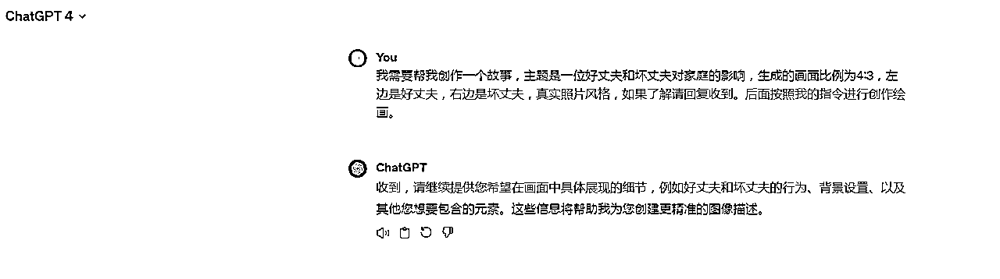

后面我们就可以根据情侣还没有结婚的时候，筹备婚礼，走入婚姻的殿堂，结婚后的生活来进行画面素材生成。

Prompt：情侣还没有结婚的时候

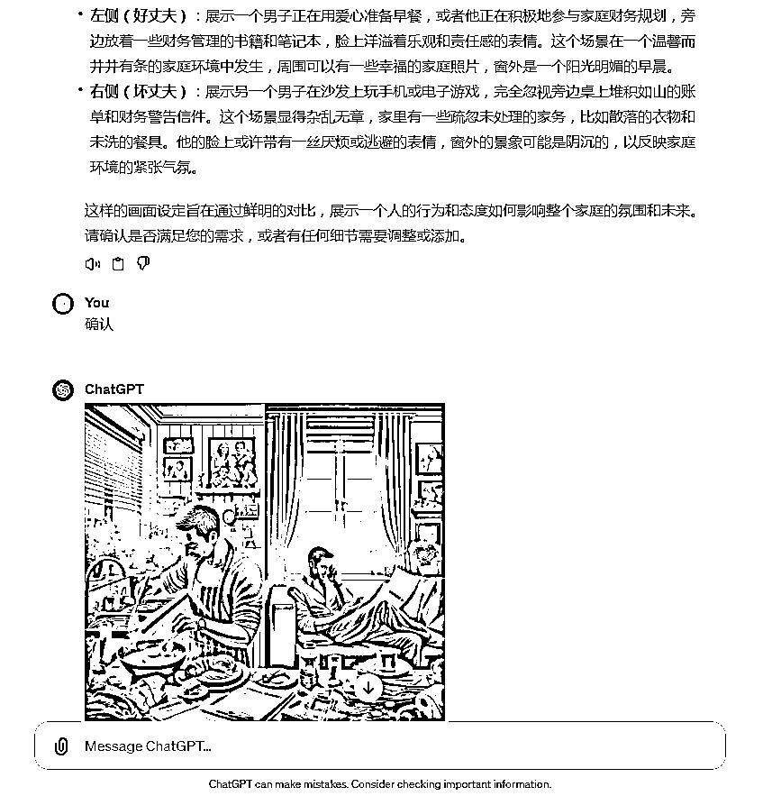

Prompt：情侣筹备婚礼的时候

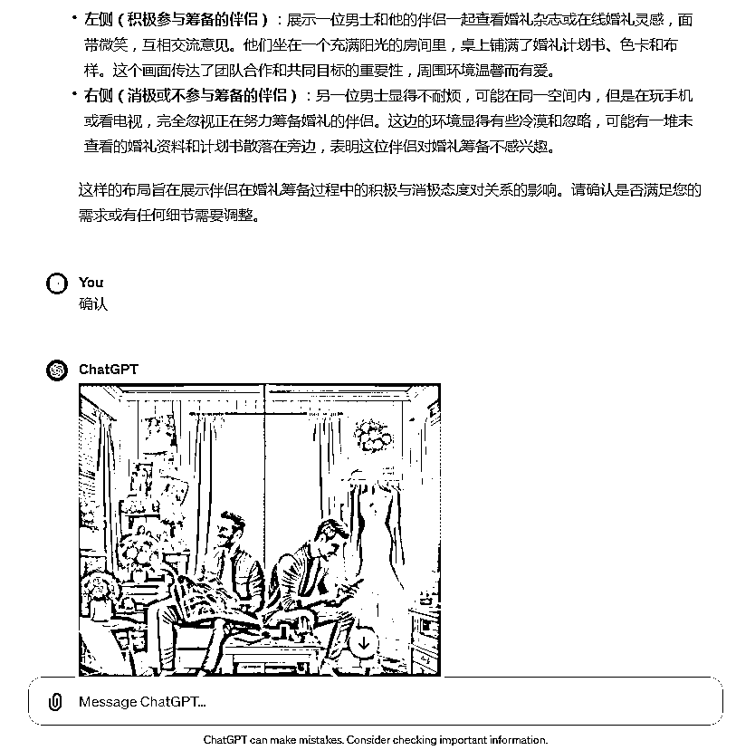

Prompt：情侣走入婚姻殿堂的时候

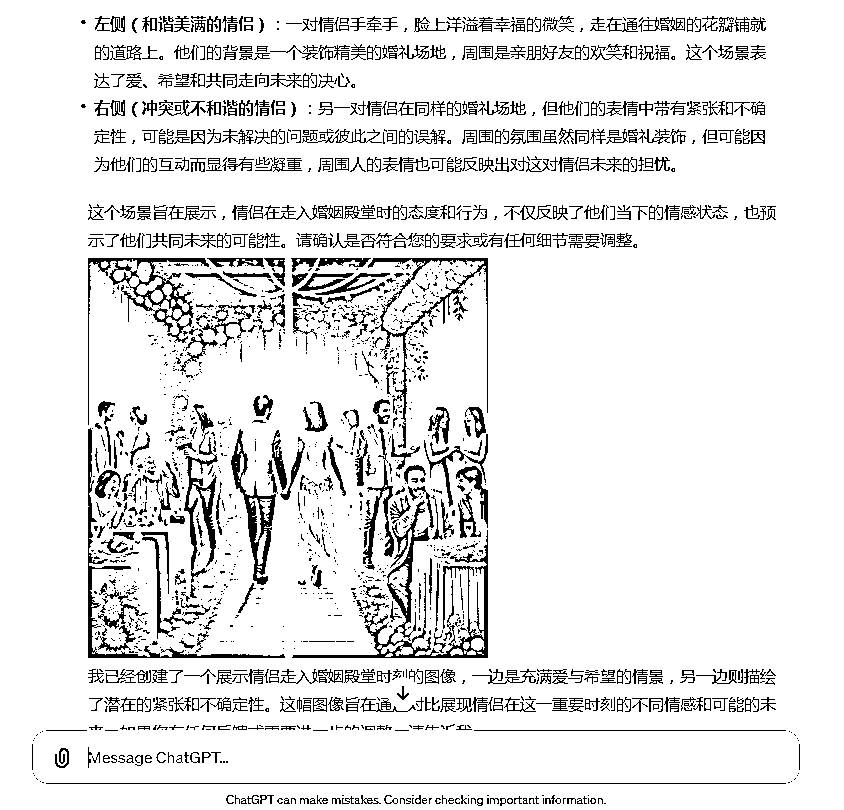

Prompt：情侣结婚后的生活

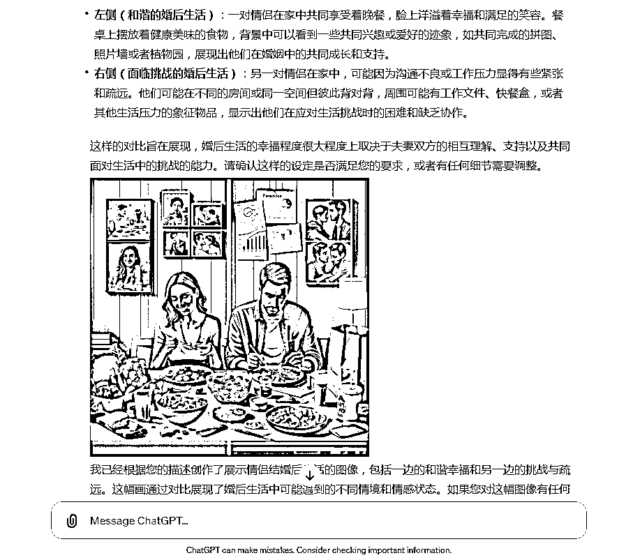

全部画面素材生成结束后，把图片全部保存下载。如果需要其他主题可以套用Prompt进行修改。

## 合成短视频

我们打开剪映，导入所有画面素材并拖入轨道，并把比例修改为4:3.

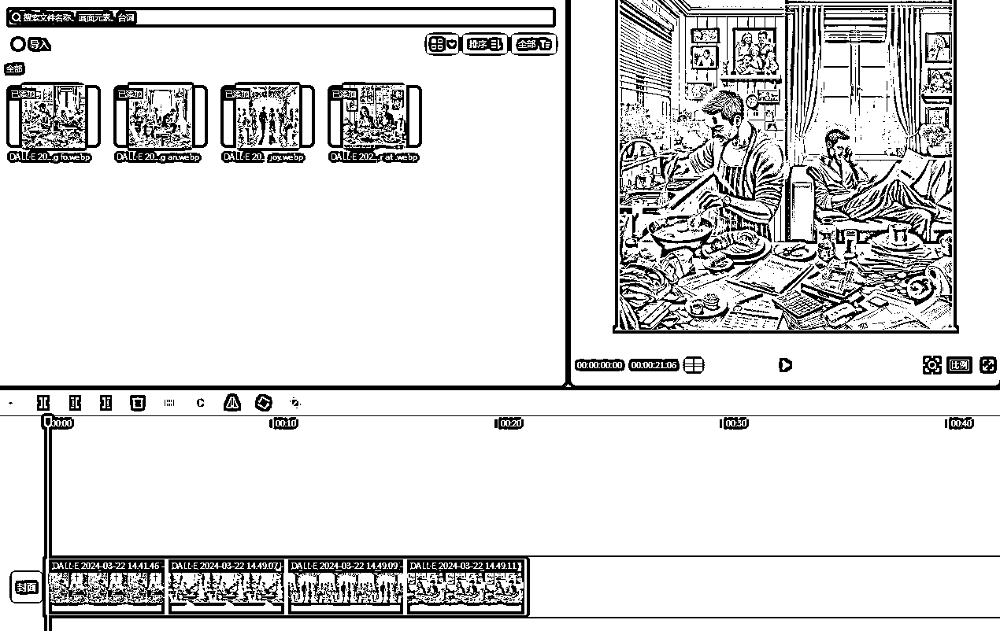

我们看到对标视频每段画面前面都有文字，我们添加同样的文字画面。点击文本，拉入轨道并放在每段画面前，调整文字大小，样式等。

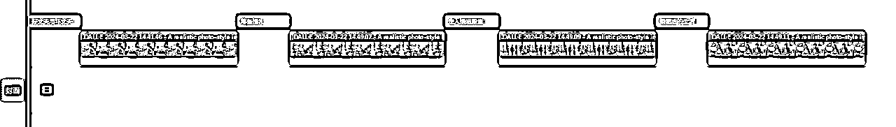

添加音频，调整到与画面同样的时间段，并设置淡入淡出。

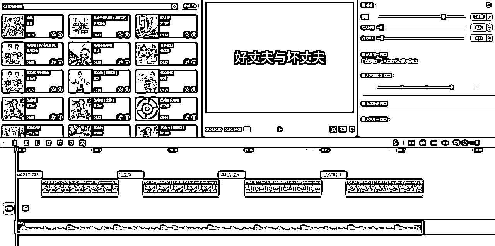

再对画面单独添加音效，比如走入婚姻殿堂画面添加音效，如果感觉声音太大或者太小都可以调整的。

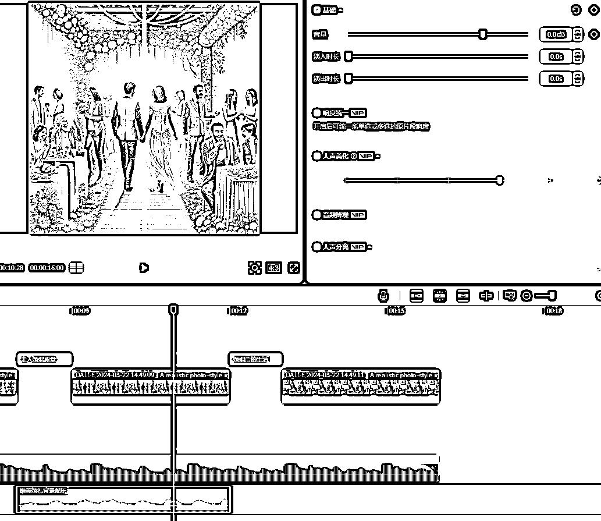

全部制作完成就可以设置封面进行短视频导出啦！！！

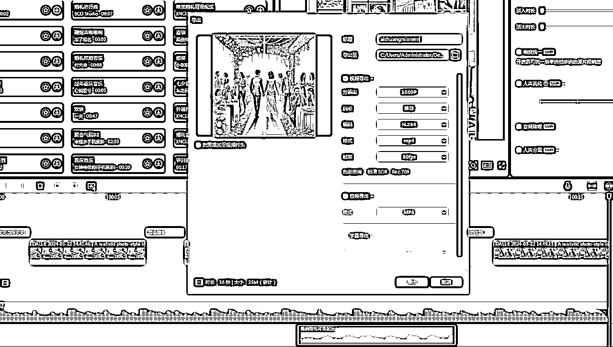