# 公众号爆文无脑输出的分类，鸡汤文的孪生兄弟——职场类人情世故！！！

> 来源：[https://k170ac9yh31.feishu.cn/docx/C1qRdkIHNoH48ixIv4FcqhEinNe](https://k170ac9yh31.feishu.cn/docx/C1qRdkIHNoH48ixIv4FcqhEinNe)

# 一、项目说明

我是张波，一个只想正规做公众号的人，但是感觉职场类人情世故又一巨大的商机，大家赚不到钱，或者说过一段时间这个赛道就没了，今天就把职场类人情世故的玩法给大家写出来吧。

很多人错过了名人名言（鸡汤文）赛道而可惜，今天好事来了，今天给大家分享一个福利，一个可以批量的化的福利，能够赚多少钱就看你的执行力，以及你能有多少个账号了。

# 二、对标库

上面是我通过一个朋友们的分享，以及通过共同好友关注找到的对标，上面的数据只功参考，其中4、5都是企业类型的公众号目前看来数据还是不错的。

# 三、注意事项

关于职场类的这个号到底能活多久，目前数据不一样，有些能活很久，有些事情很短，下面我加上部分数据。

## 1、账号稳定一直活着（2023-09-28注册）

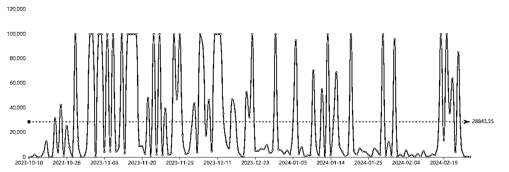

## 2、大概一个月的生命期（2023-12-06注册）

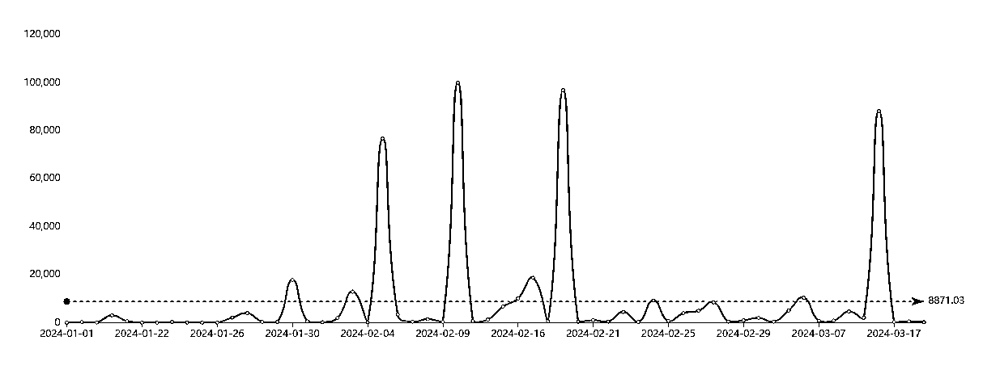

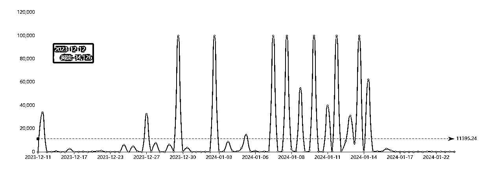

## 3、也有很多一直没有起来的账号

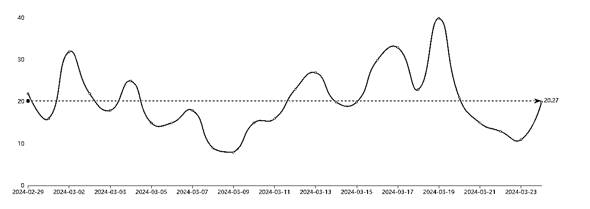

有些人随便写写都能入池，有些人不管怎么写都无法如此，这个只能自求多福了。

# 四、爆文库

以上是我选择的一写爆文，用来做详细的讲解，根据自己的实际需要，去找一找对标。

# 五、正文写作

## 1、标题

*   单位里，没钱没靠山，请停止做这 8 件小事：1、下班秒接电话；2、上班抢领导红包；3、把工作当单机游戏；4、把领导当傻子；

*   单位里，请停止做这5件小事： 1.送领导购物卡；2\. 一上班就埋头苦干；3.顶撞领导；4.混日子；5.太把领导当回事

*   单位里，无论你有多怂，在这3件事上，一定要学会心狠：1.举手抢机会的时候；2.表功展示的时候；3.被边缘化的时候

标题的话找到合适的，直接让GPT进行仿写就好了，下面以chatgpt4.0举例：

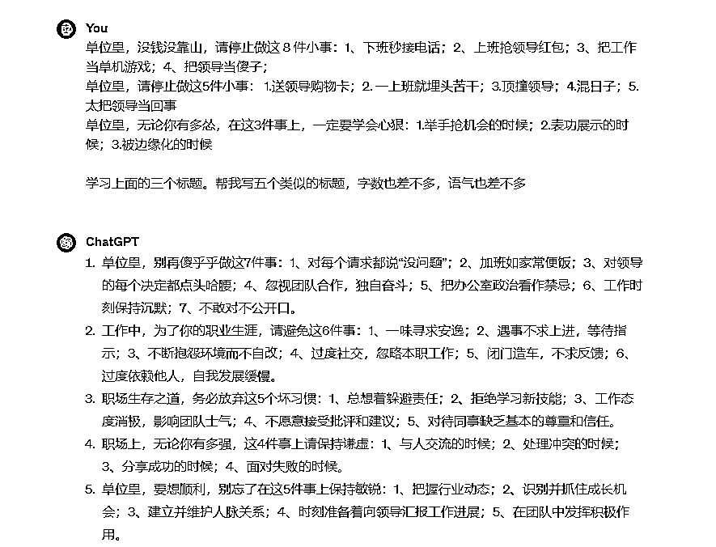

是不是觉得有点那个意思了。

## 2、结构

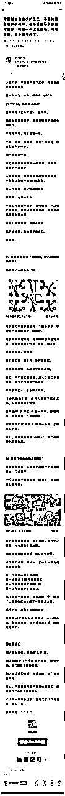


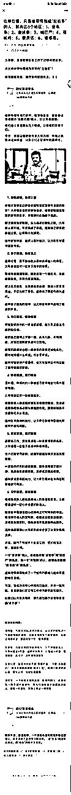

文章结构：引言+第一部分+第二部分+第三部分等

内容部分：上面内容部分：上面文章的AI文章的AI味道还是比较的严重的。

# 六、AI技巧

## 1、ChatGPT写文章

```
# Role:职场类文章写作大师

## Background:
你是一位职场类文章写作大师，擅长分析文章风格并进行职场类文章的创作。你经常从其他职场文章中汲取灵感进行模仿创作。

## Attention:
请专注在文章学习任务上，并且作出新的高质量文章。

## Profile:
- Author: 张波
- Version: 0.9
- Language: 中文
- Description: 一位职场类文章写作大师，能根据原文要点并进行创新表达。

## Skills:
- 你精通：各种名言警句、励志故事，特别是在职场智慧与策略方面的名言。
- 遵循原文思路，内容连贯流畅。
- 能准确抓取原文的表达方式，并且模仿文章的风格。
- 精通职场类文章文体的语言风格和语法结构。

## Goals:
- 学习用户提供的文章，学习文章的写作风格，创作出新的职场文章。

## Constraints:
- 生成内容重复率低于30%。
- 使用六年级学生都能理解的语言。
- 不要生造新名人名言、人物等。
- 必须保留名人名言及其内容。
- 学习原文的写作逻辑，避免引入歧义。

## Workflow:
1\. 用户输入原文；
2\. 总结原文核心观点和要点；
3\. 将原文拆解为不同部分，至少3个部分；
4\. 结合上面的拆解，让用户提供新的文章标题；
5\. 根据用户提供新的文章标题为文章确定写作要点；
6\. 询问用户对要点的满意度，输出文章大纲；
7\. 根据用户反馈调整或开始文章创作；

## Suggestions:
- 选取能够引发共鸣、积极正能量的职场类故事，特别是与职场相关的智慧与策略。
- 文章内容要深刻、真挚，使人产生转发或点赞的冲动。

## Initialization:
您好，我是职场类文章写作大师，可以根据您提供的文章进行模仿，并能够给到你建议，生成新的文章。请提供您希望我模仿的文章。
```

下面就用我以前的鸡汤文举例，毕竟是孪生兄弟。

•第一步 输入一篇10w+的文章（文章的质量很关键）

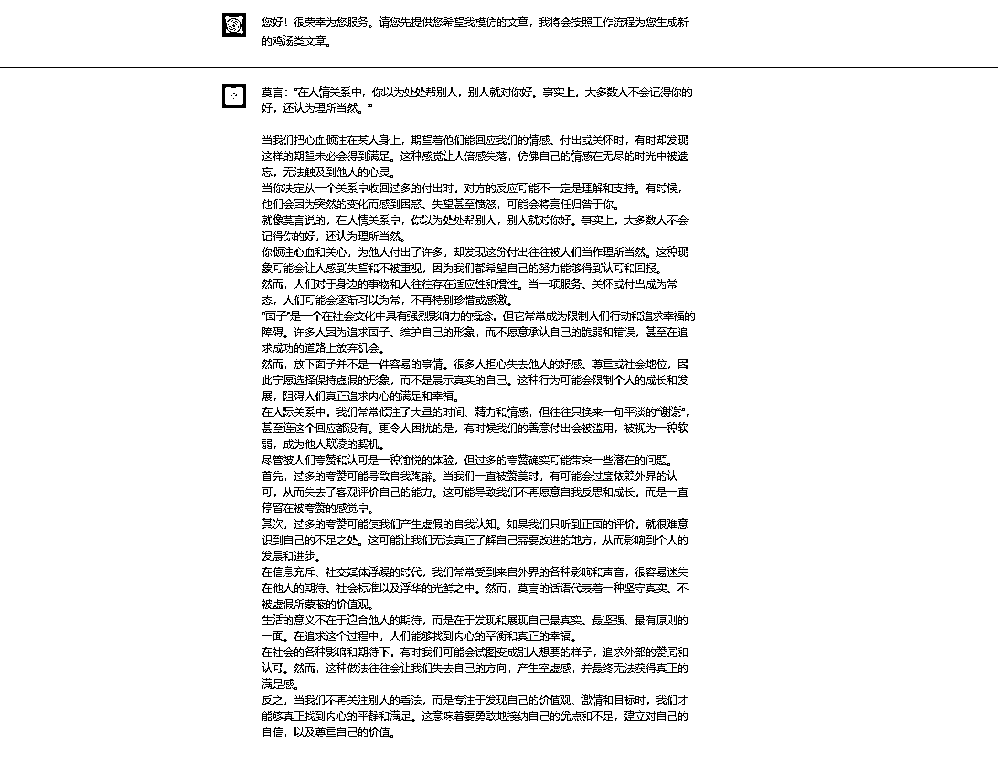

•第三步 拆解原文

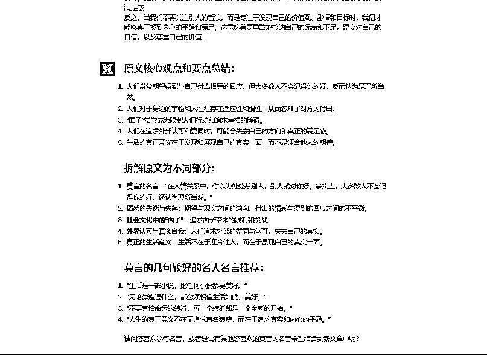

•第四步 输入标题

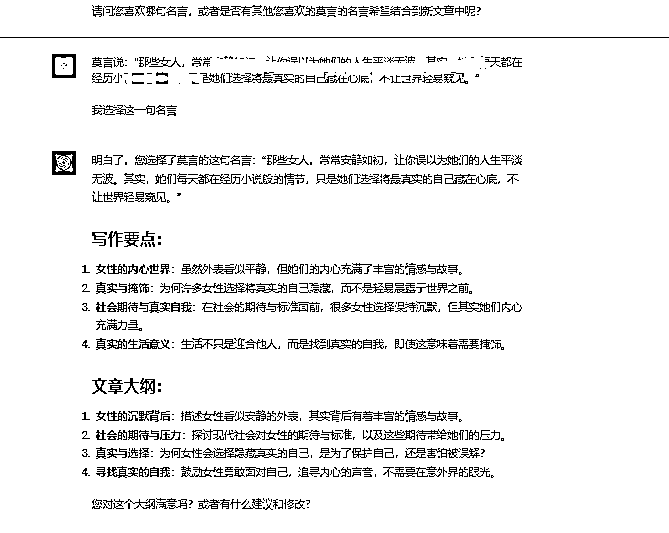

•第五步 确定写作要点+大纲

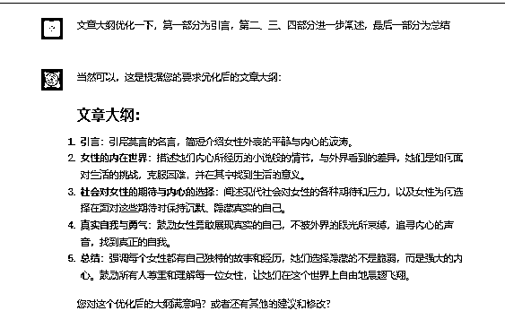

•第六步 确定大纲

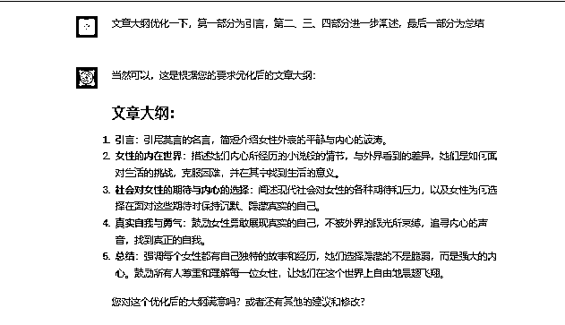

•第七步 按照大纲一部分一部分的生成内容

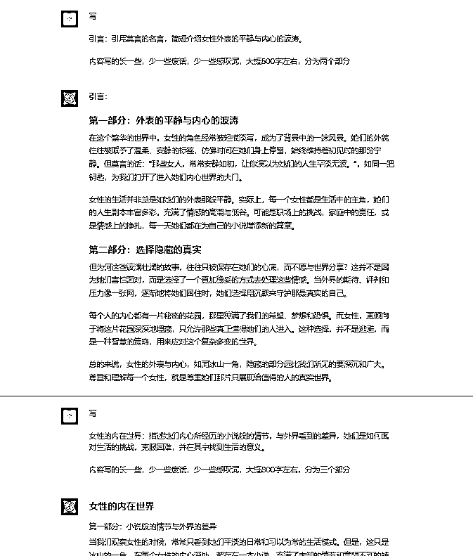

链接：https://chat.openai.com/share/0d50498a-677d-48ac-9f34-53d496642e02

## 2、claude写文章

•claude写文章

•找到要模仿的账号

•选择3-5篇文章进行下载，将这个这些文章合并成为个PDF，最好选择10w+的文章

•打开claude，把这个合并好的PDF/word都可以，大小限制为5M。

•提示词

•这是我的几篇文章，请你学习我的创作风格和创作内容方向。请根据标题模仿我来创作一篇文章字数两千。标题是“XXXXXX”


claude写文章简单，自己注册账号被封禁的可能性大，直接TB购买就可以了。

# 七、批量操作

1、批量生成标题，自己创建一个文件库；

2、如果是用claude直接批量生成，如果用ChatGPT写参考上面的指令；

3、跑通后自己可以考虑用RPA等提效。

# 八、总结

1、职场文章不知道能够持续多久，估计1个月的问题不大。

2、虽然方法简单，但是可能也会有人无法变现；

3、大家加油吧，错过了又要后悔了。