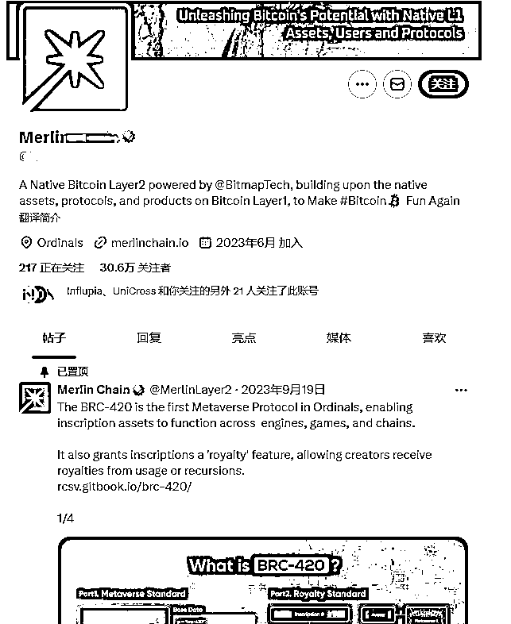
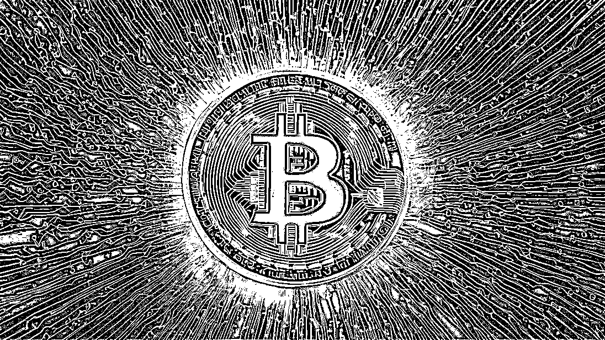
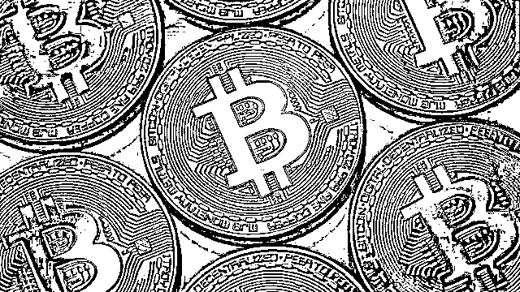
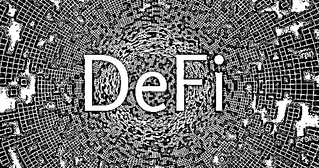
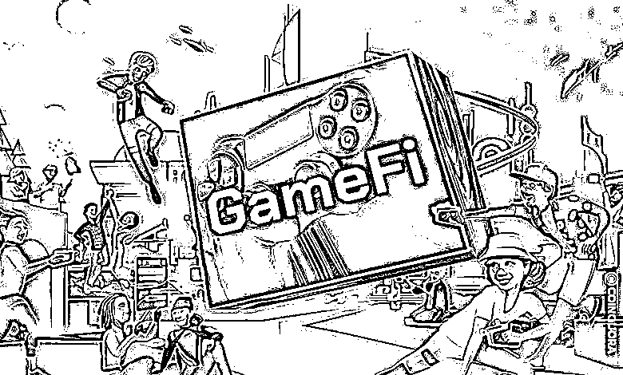
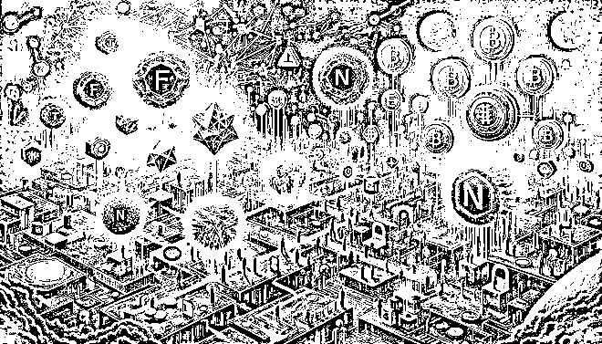
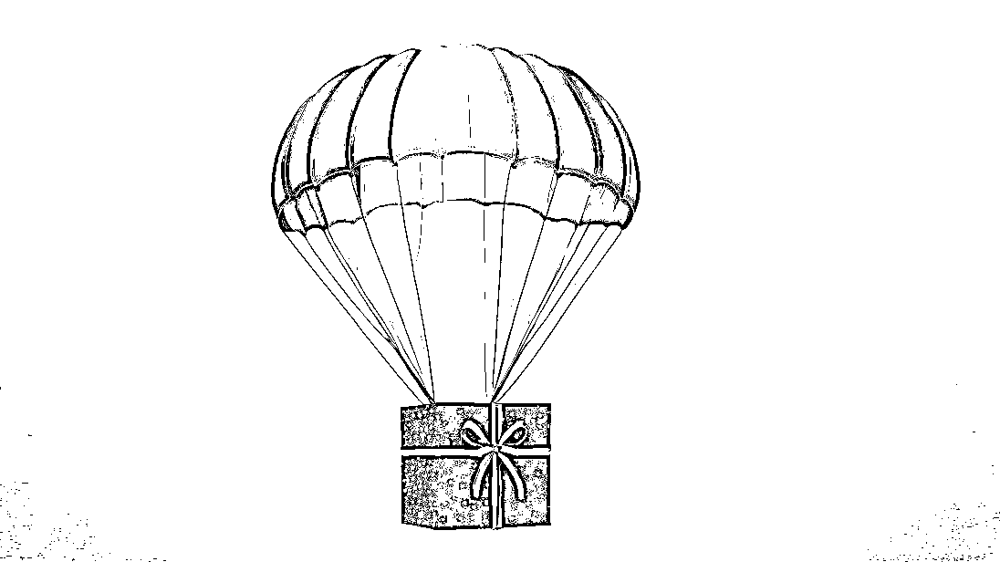

# 一篇小白能看懂的web3.0赚钱笔记

> 来源：[https://uklrrqhpyq.feishu.cn/docx/K9KhdcFpQoqcDcxcrhbc7hXnnId](https://uklrrqhpyq.feishu.cn/docx/K9KhdcFpQoqcDcxcrhbc7hXnnId)

大家好我是乔橘

接触web3有几年了，也有自己的web3社区，这几年一直追着web3风口走。

今天在生财搜索web3看了一圈帖子，发现对于小白来说，看完都是云里雾里的

全是一堆专业术语，完全看不懂，今天针对热门几个赛道给生财圈友们科普一下web3

只知道web3大概是什么，谈到怎么赚钱属实有点难以理解，

今天用最最最简单的大白话告诉小白，web3到底怎么赚钱。

小白可能会发现，你在抖音小红书各大主流平台，可能都搜不到很多关于web3包括比特币的详细信息，有的话也只是表面的概念信息，因为安全性原因，去中心化的东西国内目前是较为抵触的，所以很难搜到。

web3这个东西普通人很难自学！

我从0到1跟着大佬全职学，学了整整三个月，才把web3搞明白，跟考研一样...

基本上所有项目在推特上面都是英语的，基本上没有几个中文的项目方，如下图

每个币背后的区块链底层概念都是不一样的，想学概念是比较困难的，如同体育老师学代码

如巴菲特所说：投资必须是理性的，如果你不能理解它，就不要做。

国内人口web3玩家人数不到总人口的1%，而美国占20%左右，所以国内很多信息面一般在主流平台是看不到的。

web3最新信息一般都在推特和discord，这2个平台都需要科学上网才能正常浏览。

2024年，4年一次的比特币减半又来了，所以大家最近经常在新闻看到比特币暴涨的新闻

物以稀为贵，产量少了，意味着增值，今年也是牛市，多方面经济利好web3。

* * *

### 1：什么是web3？

从web1到web2到web3其实一直在围绕“去中心化”

web1.0：信息只能观看（只读）

web2.0：创造内容（只读+写入）

web3.0：拥有内容（只读+写入+拥有）

web3现在衍生了非常多的赛道板块，例如

*   元宇宙（虚拟现实+AR+游戏）

*   加密货币（比特币）

*   GameFi（游戏）

*   NFT（数字藏品）

*   DeFi（金融理财)

*   区块链生态（加密货币背后的价值生态）等等...

以上是比较简单容易理解的赛道，简单可以理解为（去中心化+赛道）=web3

* * *

### 2：去中心化是什么？

假设生财现在是一个中心化的平台，管理员和亦仁大佬就可以轻易的删除我的笔记

假设生财是一个去中心化的平台，我在上面发布内容，除了我自己没有人可以删除或者编辑

这就是去中心化的魅力，具完全私有化。

这个时候就会有同学问，去中心化无人监管，他是怎么样运行的？

这里就运用到了区块链技术。

#### 记账

假设生财就是一个区块链网络，里面包含了5万6千个生财用户

（用户1）支付了一笔金额为100元的资金给（用户2）

剩下的所有生财用户，都会收到一条信息

信息如下：（用户1）支付了一笔金额为100元的资金给（用户2）

每个人在区块链网络中发生的交易完全透明化，a和b发生的交易生财所有人都知道

因为每条信息每个人都能收到，因此保障了区块链的安全性，每位用户都能互相证实信息的真实性

#### 运行

没有人监管，区块链是如何运行的？

可以按照以下简单的理解。

相信大家都知道比特币矿工，矿工通过挖矿提供算力给区块链网络，获得区块奖励（比特币）

矿工提供算力-区块链获得算力正常运行-矿工获得奖励，正向无限循环

* * *

# 6个web3.0 热门赛道科普

*   元宇宙（虚拟现实+AR+游戏）

*   加密货币（比特币）

*   GameFi（游戏）

*   NFT（数字藏品）

*   DeFi（金融理财)

*   区块链生态（加密货币背后的价值生态）

### 1：什么是加密货币？

大家都在讨论比特币，比特币其实只是单一种类型的币，币分很多种

比如，ETH以太坊、SOL索纳拉、BTC比特币等...上千种类型的币。

这些币都可以自由兑换流通，只需要付相应的手续费即可。

最近非常火爆的比特币相信大家都有了解，这也是web3里面的其中一个板块“加密货币”

用比特币举例，比特币是目前市面上市值最高的加密货币，目前一枚的价值已经达到50w人民币

比特币总发行量2100万枚

1人民币=10毛（10个1毛钱的口香糖）

1枚比特币=1亿聪（一亿串不同的代码）

比特币并非需要一整枚的去购买，可以拆分为1亿份去购买，因此大家经常会看到有人在各大平台炒币购买比特币

加密货币类似于黄金，会增值会贬值，只是黄金是实物看得见摸得着的，加密货币是一串独一无二的代码，虚拟资产。

加密货币怎么赚钱呢？，很简单，低价买入高价卖出获利，

关注比特币的同学都知道，24年1月比特币才2-3w美金左右，短短2个月已经涨到了接近7w美金一枚

若当时买入现在获利不菲。

都说币圈一天A股一年，确实如此，

A股是需要T+1的，但是币圈的币每秒都能买入卖出，A股趋于稳定，一年平均涨跌10%左右已经很多了

但是币圈大部分币每天涨跌幅特别大，少的每天10%左右，多的每天涨跌100%-500%都是正常现象

* * *

### 2：铭文

铭文是近2年的新概念

1枚比特币=1亿聪（一亿串不同的代码）

在每个单位聪上面铭刻备注上一个字符，就称之为铭文

举例我有10粒米，每一粒米都是普通的米，但是我在其中1粒米上面刻了一个专属的符号，这一粒米就跟其他的米不一样了，这就是"铭文",也符合web3独一无二的概念。

因为铭文的稀缺性，被赋予独特编号的”聪“，也就是铭文

随着市场消息面的发酵，铭文生态的壮大都会让铭文增值或贬值。

低价买入铭文，然后高价出售铭文获利。

* * *

### 3：NFT数字藏品

非同质化数字代币数字资产，简单理解就是（一张图片+一串代码）=NFT

现在的nft藏品基本上都是联合一些品牌或者艺术家联合发行的，比如

”无聊猿“是近几年抄的非常火的NFT，近几年最高炒到了几千万美元一张图。

这些图背后是一串独一无二的代码和艺术家和加密代币生态的加持

当然也有很大的炒作成分，更多的是市场冲昏头脑的投机热度。

“NFT数字藏品”一般用于收藏，获取白名单低买高卖等

发行艺术家的形象和市场的热度，还有热点的消息面这样都能直接影响到数字藏品的价值。

举例我低买入一张上方的数字藏品，最近有新闻爆出发行该藏品的艺术家被誉为杰出艺术家，这个藏品大概率是会涨的，或某明星购买了同款数字藏品，这个藏品大概率会暴涨，消息面很重要，有热度就会溢价。

数字藏品一般早期发布的时候都会大量抽取”白名单“，白名单会有抽取条件，比如拥有过xx藏品的用户可以免费获得白名单资格等...

* * *

### 4：DiFi（金融）

*   去中心化金融（公开透明安全，不受中心化控制）

*   中心化金融（由政府或中心化机构自由控制调配市场）

举例政府募集100亿捐款，没人会知道政府实际收到了多少钱，实际捐出了多少钱

如果使用了DiFi每一笔交易都会被记录，而且完全公开透明，每个人都可以查询到

因为去中心化的特性，不管是收款方还是付款方，任何人都不能控制每一笔交易的金额，篡改任何信息

difi就是朝着实现去中心化金融概念发展的

很多加密货币在早期上市发行代币的时候价值都是很低的，

DiFi就衍生出了一些理财产品，活期年化收益产品等...

DiFi也有弊端，交易是去中心化也虽然是透明的但是也是匿名的，会让不法分子从中洗钱，基于安全性所以国内十分抗拒去中心化的产物。

Difi如何赚钱呢？，国内银行利息普遍在0.4%左右，但是在币圈的difi金融，基于2024年牛市年化最高能达到40%的理财产品，难以置信。

* * *

### 5：GAMEFI（游戏）

可以赚钱的游戏，每个游戏都会发行独特的代币，打游戏获得代币，代币可以在加密货币市场交易

随着游戏的发展，发行的代币也会增值。

有看好的游戏币可以去交易所购买，今年的游戏板块较为热门，而且还没有到爆发期

### 6：区块链生态

比特币是一个币，也会有自己的生态，每个币都会有属于自己的生态

生态是比特币的衍生品，比如用比特币购买的NFT，用比特币参加的活动等...

每个币的生态在不同的时期都有着不同的发力点，新技术的更新，新玩法的迭代，新叙事都会推动生态的发展

生态越好，生态的产品也就价值越高，长期持有生态产品是一种不错的投资方式。

### 7：元宇宙

虚拟现实+AR+虚拟游戏是元宇宙的出发方向

21年是元宇宙元年，当时国内特别火爆，因为前所未有的新概念，掀起了很大的风波

虚拟现实是什么？

简单来说就是在虚拟网络上搭建一个真实的世界

最近苹果新出的Vision Pro相信大家都知道，那就是AR启蒙产品了，一个头戴设备，看到虚拟+现实场景

综上结合一句话概括元宇宙

在虚拟世界搭建一个与真实世界一模一样的世界，然后通过AR去实现交互，让其像游戏一样可玩性高。

为什么当时元宇宙能这么火呢？

*   新概念

*   虚拟现实AR

*   虚拟资产

这三个新概念直接将元宇宙推向了高潮

新概念顾名思义，新的噱头出现肯定热度不会少

元宇宙概念近3年逐步消退很大部分原因，是因为技术层面太差了

导致大家只知道概念，看不到实际的东西，比如AR

21到24年长达3年，从VR到AR的迭代

现在苹果才研发出相对成熟的AR产品，未来的路还很长

元宇宙等到技术层面到一定高度的时候我相信还会再次爆发,web3概念就是一个很好的例子。

* * *

# 交易所

交易所就是链接web3最简单的方式，你可以在里面买到看好的加密货币或者生态产品。

类似与你要网购买东西，淘宝是二级市场，一级市场是1688

交易所就是二级市场，一级市场会较为复杂，新手一般无法顺利入门。

这里我推荐大家用全球最大的2家交易所，币安和欧易

点击官网下载币安：

全球最大交易所，上市的货币比较多，但是web3板块技术不太完善（适用于普通交易加密货币用户）

点击官网下载欧易：

上市的加密货币没有币安多，web3生态较为完善（适用于web3生态用户）

* * *

# 什么是web3钱包？

相信小白都听说过web3钱包，一个神奇的钱包！

最常见的私钥钱包由系统生成的12-24个单词组成，没有账号没有密码

这12个单词就是你的钱包，一但泄露就要面临着被盗的风险，而且被盗无法被找回

钱包无法实名，无法绑定手机无法绑定任何身份信息。

web3钱包用于存放你的所有数字资产

NFT、比特币、加密货币、铭文等...

* * *

# 什么是空投?

空投就是项目方新发售的项目，包括NFT，加密货币，代币等活动

前期发售的时候一定会做热度，会送出很多“空投（白名单）”类似于抽奖活动

拿到这些空投可以直接卖出也可以存着增值。

* * *

# 什么是撸毛？

就是薅羊毛，但是web3的薅羊毛是很夸张的，国内薅羊毛类似拉新，快手拉新一个人头才最多也才十几块钱

web3薅羊毛基本上都是百元千元起的，抓到好的机会一波10几w毫不夸张

具体怎么薅呢？

比如游戏项目方发布了一款游戏，进去打怪升级可以获得代币，经验，NFT等..这些都是可以在web3市场交易的

再比如项目方发布了一款新的NFT数字藏品，项目方会设置几个要求，比如关注转发，或者有该项目方以往发布过的藏品的，可以免费获得新上线的nft藏品...

还有一些预热的项目方会出一些活动，去签到拉新都会获得很不错的回报。

* * *

### web知识库：

如果你对以上内容非常感兴趣，web3全书（内容很纲）👇

* * *

web3黑话术语

* * *

以上内容为知识分享，不构成任何投资建议，请大家理性判断~

我是乔橘，如果你有任何问题，欢迎加我的微信：sup7772