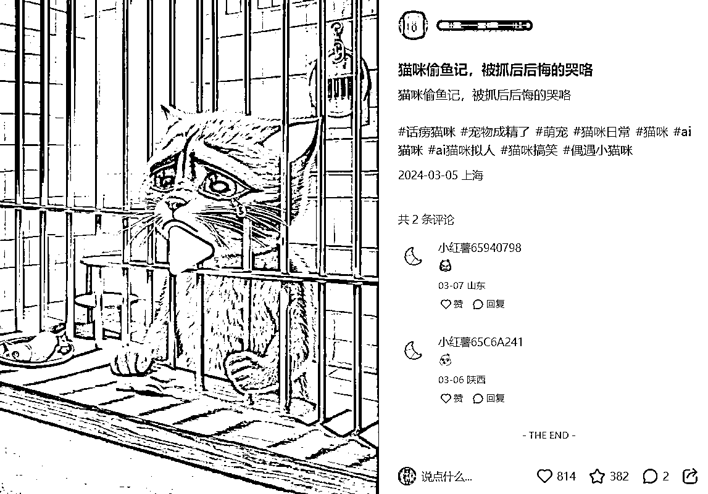
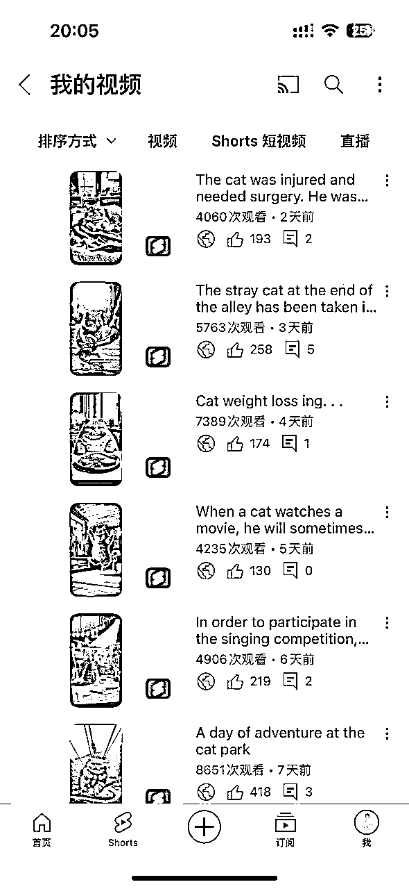
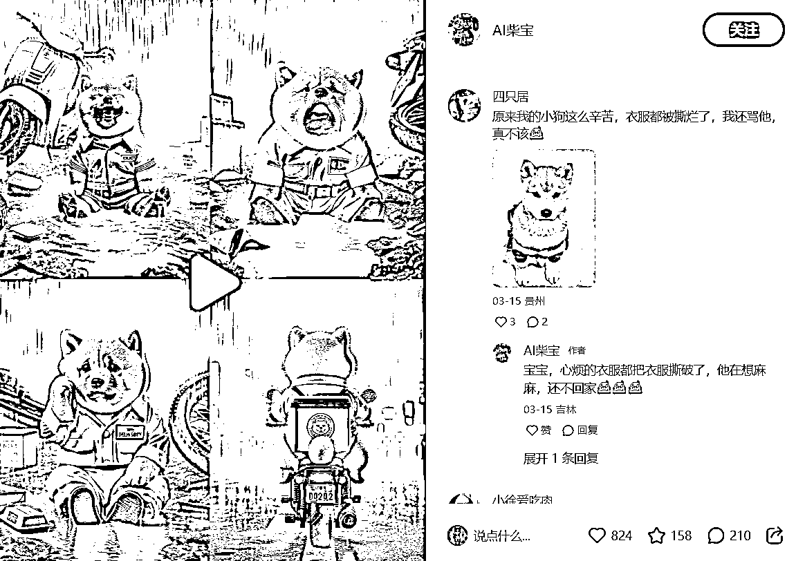
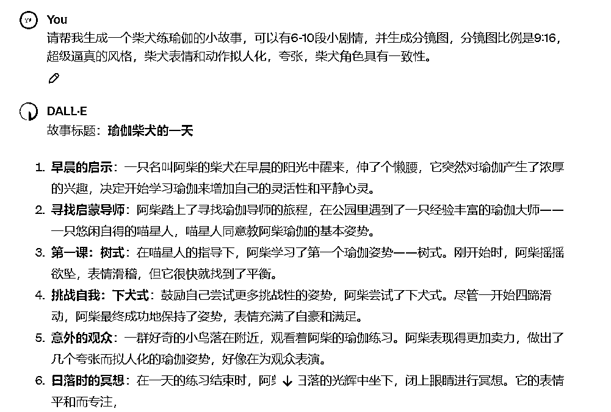
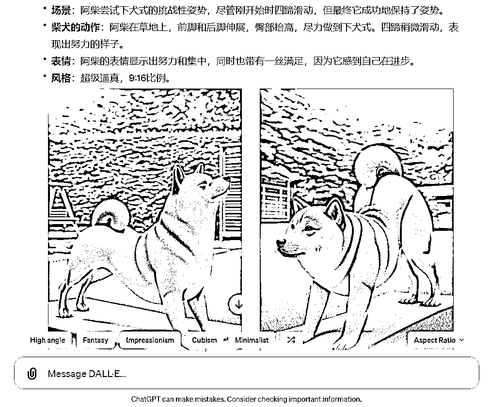
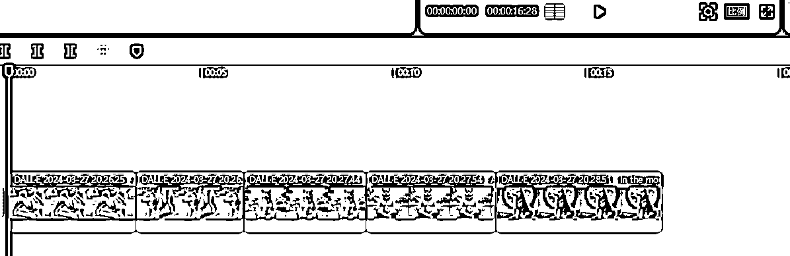
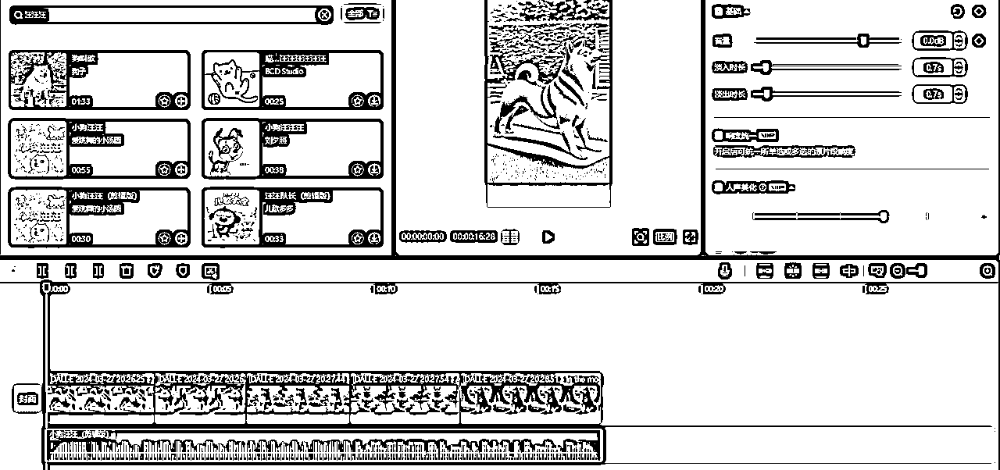
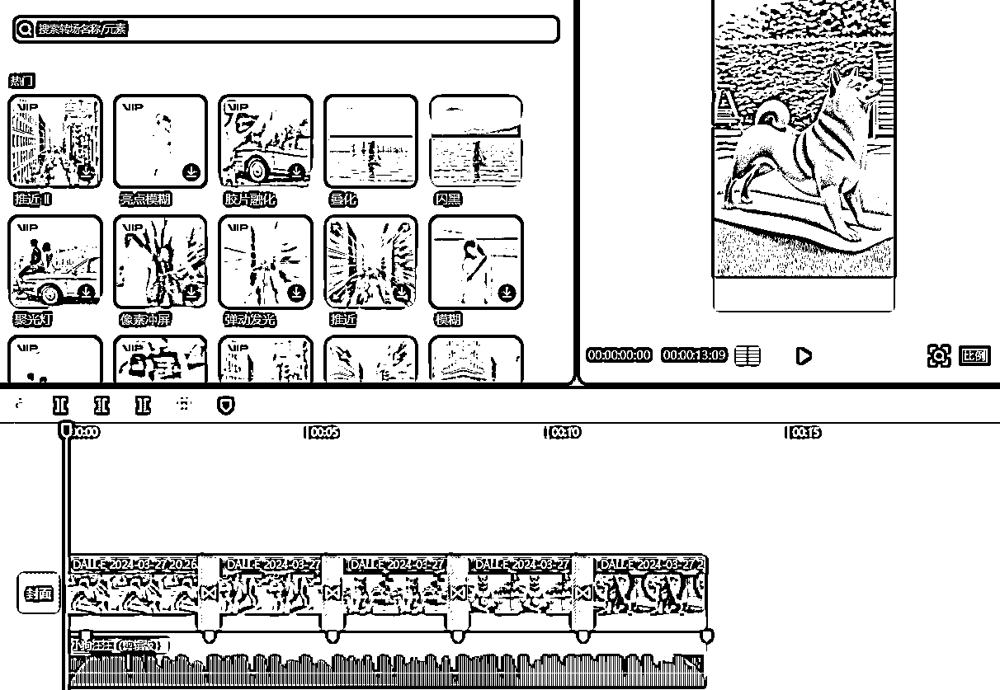
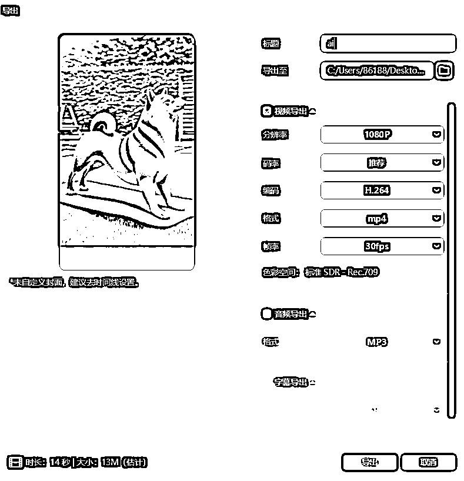

# AI柴犬剧情短视频，ChatGPT+剪映，一个Prompt全部搞定

> 来源：[https://dik4wr1hyrw.feishu.cn/docx/O2PedkkTUoTSu2xO9pKc80Gcnfc](https://dik4wr1hyrw.feishu.cn/docx/O2PedkkTUoTSu2xO9pKc80Gcnfc)

前段时间我给小伙伴们分享过AI猫咪剧情短视频，其实我自己一直也在做，分发到小红书，抖音，TikTok，YouTube，Instagram等平台上面的效果都很不错，小红书拿到了800+点赞，YouTube基本每条Shorts都是100+点赞，实打实的效果并不是吹牛皮。

我们也来看看AI柴犬有没有行情，别是竹篮打水一场空。小红书做AI柴犬的也在800+点赞，说明市场还是有的，现在入局的也不是很多，早入局早涨粉。

只要做过AI猫咪剧情短视频的，都会感觉So easy，一天完全可以做出一个月的短视频，我们今天所说的AI柴犬短视频只需要一个Prompt就可以轻松搞定。

当然，需要用到ChatGPT4.0，因为只有4.0版本才能用DALL.E

Prompt：请帮我生成一个“你想要生成的柴犬”小故事，可以有6-10段小剧情，并生成分镜图，分镜图比例是9:16，超级逼真的风格，柴犬表情和动作拟人化，夸张，柴犬角色具有一致性。

## AI柴犬分镜图

光说不练假把式，直接上Prompt，ChatGPT会先写出剧情故事。

剧情故事分享完之后，ChatGPT会根据剧情来画每部分的分镜图（画图成功取决于网络）

给大家个小提醒，每张分镜图画完之后直接下载保存，以防网络波动图片失效。

## 短视频制作

现在把保存的分镜图导入剪映，并拉入轨道中。

选择狗狗BGM，设置淡入淡出（根据BGM的效果）

添加音乐节拍标记，并把每张图片的时长卡在节拍点上。

对每张图片进行转场设置，我一直喜欢用的是叠化效果。

全部设置好导出就可以保存分发到各大短视频平台咯~

