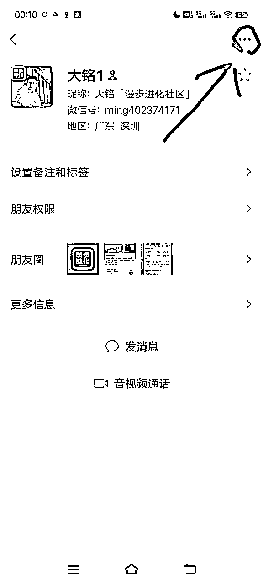
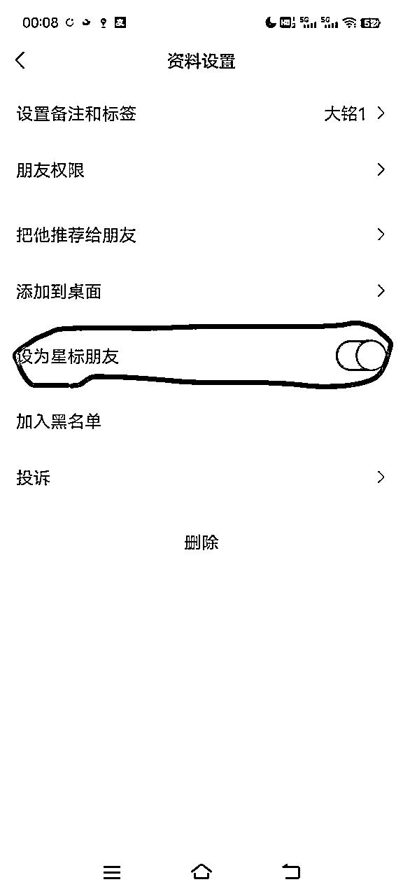
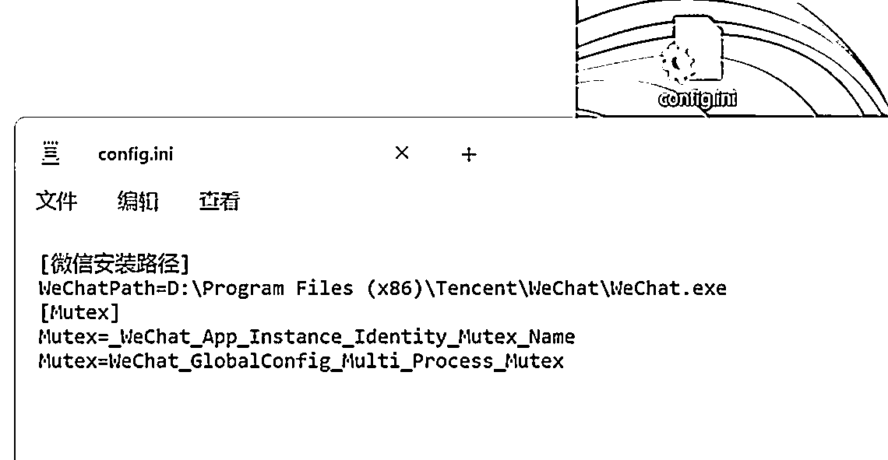
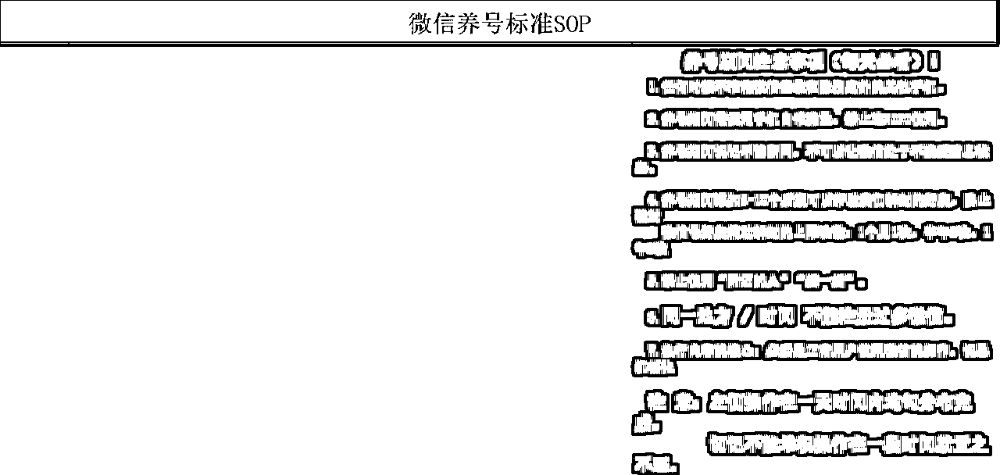

# 个人微信养号防封方法整理

> 来源：[https://puojikpj98.feishu.cn/docx/PqFwd1rnGoy9VZxPmKNcZnjenqe](https://puojikpj98.feishu.cn/docx/PqFwd1rnGoy9VZxPmKNcZnjenqe)

# 一、自我介绍

大家好，我是大铭，一个37岁转型中的大叔，创办了一个叫漫步进化的社群（目前只是试运营，免费征集种子用户，哈哈……）希望可以共同成长，如果有想了解我的朋友，可以看我之前发的文章

一位37岁大叔的硬核自我介绍：https://t.zsxq.com/18JaHjlva

我会持续分享我的项目经验和个人成长相关的知识到生财，一个是为了逼自己持续输出输入，另外也希望为生财做出贡献。

可能我分享的内容其他人或其他平台都有分享过，不过每个人的观点和方法也有可能有差异，大家可以做对比选择更好的直接拿去用。

如果我有说得不对的地方，大佬们帮忙指出

# 二、内容介绍

因为这段时间是一直在准备搞属于自己的社群，我又是小白一个，所以很多基础性的设施建设只能边做边学。而多个微信号也是必须准备的，毕竟私域是一个项目变现的终点。

但微信号毕竟也很脆弱，我翻查了很多资料（也包括生财里关于微信养号防封的文章），发现这里面真的大有学问，我也只能一点点地整理出来，当然这东西我相信很多人都需要，那肯定要分享给大家。

先说明一下，以下内容并非我自己测试过，都是通过网络整理出来，可能有些信息已过时，我个人并不保证所有内容都真实性和完整性。而且即便再全的养号防封方法，如果你的营销手段有问题还是会被封，即便你是用了十年的大号也一样难逃厄运。

如大佬们发现有误，请指出～

废话不多说，直接上干货

# 三、微信新号注册

简单来说就是一机一卡，全程流量，当然为了安全还是请看下面详细内容

## 流量卡注册

实名认证卡：要用实名认证卡，就是需要用我们身份登记的，有公司的可以以公司名义到营业厅进行办理（一个身份证可申请5个卡），千万不要用那些乱七八糟的流量卡和物联网卡，

0月租联通卡如果检测出异常会直接封一个号段的新号，淘宝虚拟卡、17X卡也不能用

国内电话卡：需要用国内的卡，国外卡不适合国内使用

## 批量注册

全程流量注册：当你需要批量注册时，一定要用流量进行注册，千万不要用wifi

四分注册法：即分时间段、分地点、分不同IP(一个IP下不要超过3个号）、分基站（一个基站下注册 1-2个号相对安全）

由于微信有一项技术是检测基站的，就是即便是使用了流量卡注册，但你在同一个范围里也很容易被封。

解决办法：

1、隔十几公里注册一个号

2、用不同手机，因为每个手机里都有个串码，注册时会被检测到，如果一台被封过号的手机重新注册也一样会被封，所以要避免使用那些被工作室淘汰的二手手机，除非你拿去给别人帮忙修改串码

# 四、新号设置

## 1、完善账号所有信息

包括但不限于：头像、性别、地区、签名

按个人生活号打造，先不要上任何营销资料

头像一个月内不要进行修改，如必须修改，请打开飞行模式再关闭后再修改（即换IP），但安全起见还是建议不要改

## 2、每个号里的资料要不一样

包括地区也要不一样，避免被系统检测出来

## 3、用老号加新号

通过后备注微信名并注明星标好友能提高存活率

# 五、必做环节

## 1、绑定手机号

绑定对应注册手机卡号，一个手机号绑定一个微信号

## 2、绑定银行卡

银行卡必须实名制（废话），而且里面要有存款，不要绑信用卡

## 3、绑定一个QQ老号

QQ太阳号：可以在淘宝购买，买回来后在跟微信同一IP下挂7天以上再进行绑定

## 4、关注公众号

关注公安政府单位公众号，如中国政府网

关注腾讯合作伙伴公众号，如京东、滴滴出行服务、腾讯文化（如果有文章积极留言、点评、转发）

可注册微信公众号，关注公众号安全助手、微信团队、微信公众平台

## 5、微信运动

非批量的可以打开，增加安全性，但如果是批量就不要打开，避免系统检测距离

## 6、微信钱包

钱包最好有钱：10元以上，越多越好

理财通购买理财产品：1-10元即可

关注腾讯公益，如果是主营账号打开自动捐款，每月10-20元即可

# 六、新号养号

## 1、养号15-30日，越长越好

批量的养号期间不要打开附近人，避免识别出自己其他号；

偶尔可以使用购物、游戏等相关功能；

腾讯新闻偶尔打开看看。

## 2、发朋友圈

每天发1~3条朋友圈，分时段发，不要连续发

切记：

（1）不要发广告营销等性质的内容

（2）要发生活相关的正常内容

（3）随便拍些视频发也可

## 3、添加朋友

（1）让好友推荐你的名片给别人加你，一天2个即可

（2）自己每天主动加1个好友

（3）养号期间不要一次性加太多好友，稳定增长

即便养好号后，也不要过分加好友，尽量控制在每天不超过20个主动好友，50个被动好友，而且要分时段通过

（4）虽然现在一个号好友上限达到1万，但建议主营号控制在3000~5000，因为人数太多，当你发朋友圈，信息的触达率很低。

## 4、第三方服务

第三方服务至少使用一次

滴滴出行、话费充值、火车票、酒店、大众点评、其他服务

批量的就不要使用有定位功能的服务了

## 5、微信登录

（1）连续登录45天左右就能成为正常号

（2）新号禁用第三方软件登录

（3）切记不要发任何敏感类信息，如大量广告、反动、政治敏感、色情等违规内容

（4）经常直接复制粘贴容易误判为机器人

## 6、微信加群

（1）每天2~3个群

太多不安全，进群不要发广告，万一被踢出群后台会有记录，下次被封号容易被检测出来

（2）用老号进群，然后拉新号进

进群打招呼，随便发什么都行

发红包，1元100个即可

（3）一个号的群不宜太多，容易卡顿

## 7、批量养号

（1）群控系统

云控：是不需要服务器的直接通过网络向手机下达指令，达到群控效果

服务器群控：根据开发者的不同，分别可以用不同的系统开发，是需要把手机连接电脑，通过电脑发送命令进行群控的效果，其中被315报道的那种将手机主板插到一个机箱里的也是这种，只是他解决了连接手机的稳定性

USB连控：适合15台以下手机，是不需要通过电脑，直接通过USB设备和技术，通过鼠标直接控制手机

一对一群控：一机一号用软件操作

代码手机群控：和云控道理相同，但是发送命令是手机，达到随时随地移动办公的要求

注意：

群控系统建议用苹果，够稳定。如果号太多想降低成本用安卓也行。

同一个wifi下不要超过20个号，不要来回切换，分时段切换其他号。

（2）NZT或AWZ

一键新机养号，几号可以，但不建议批量操作（都是老技术了，不清楚现在还能不能用）

（3）脚本养号

通过脚本批量自动化养号，但要注意，所有动作和内容都要不一样

# 七、登录环境

## 1、移动端

官方微信：最安全，一机一号，老号用手机系统自带双开也可

第三方：早晚被封，要定期备份客服

## 2、PC端

可用技术多开官方客户端，目前不封

以下是B站其中一种多开方式，大家可以自行尝试

第三方：早晚被封

# 八、实时监测

这个其实不用说大家都知道，反正就是不要做任何违法犯罪的事情

1、聊天禁止聊黄赌毒政治敏感内容，一般是被人举报，拿着截图就可以作为证据，非常刑

2、当你在大量群里从事违法行业就要注意了，很容易被定位到

# 九、防止降权

1、当微信认定你为营销号，初期你发朋友圈，你的朋友看不到（你的好友没屏蔽的情况）

2、每周每天发布的广告信息不要超过7条，当然最好的办法就是学习如何将广告做成不像广告那样

3、一个月切换一次IP：开关飞行模式切换、重启手机切换，变换场地（真人不会待在一个地方一个月不动）

4、建议不要群发信息，一个月群发1~2次即可，而且内容不要相同（频繁群发会被判定使用第三方软件）

5、频繁被拉黑、被举报也会影响微信质量

6、每天被动引流数量超过20人到同一个微信，下次遇到腾讯大规模监测很容易被封号

# 十、解封规则

## 1、永久封号

这种只有腾讯能帮你，网上说可以帮你解封的都是骗人，目前没有成功案例，真的遇到你也只能重新注册，或尝试去腾讯客服处理

## 2、用外挂软件多开被封

被封后登录官方按照提示解封，10天内没再被封说明变为正常号，一般会追封一次，解封后卸载官方再重新下载登录

解封后7天内不要修改任何资料，包括头像和添加好友

## 3、登录秒封

苹果系统：设置通用→还原→抹去所有→重新下载微信（90%不封，但需要养号）

安卓系统：尝试抹去手机数据，重新下载微信

# 十一、举报投诉

有专业恶意投诉团队，恶意投诉索取佣金，一般都是小号加的，举报多少朋友圈不合规，有敏感词、图片、视频等

联系微信客服：0755-83765566

还是那句话，不要做任何违法犯罪的事情，遵纪守法才长久

# 十二、特别注意

## 1、多好营销

如不是本人，切记不要多号使用美女头像，如果剧本营销，发现收了大量客户红包，无论多少，定性诈骗

如不是本人，切记不要群发敏感信息，比如博彩、时时彩、三五产品等0 轻则喝茶，重则判刑○遵纪守法

如不是本人，切记不要群发以及转发不确定信息，比如砍价(有恶习砍价团队盗取银行卡)、XX地方出什么事等，转发次数超限(500条包含被转发)以上会请去喝茶

如不是本人，切记不要群发任何关于军事以及政治的话题，这个不解释，发现肯定会去请喝茶

## 2、朋友圈以及聊天

朋友圈不要发违法广告法的信息，比如第一、超级等等，被报一定会罚款，最高可达20万

朋友圈不要晒太多成交图，除非你的产品完完全全合法合规，黑五类的就不要晒，严打举报这都有说法

尽量不要做三无产品，严打和产品无关，和你的销售手段有关，比如用美女号大量销售保健品、茶叶等

聊天成交过程中不要涉及太多违法广告法或者任何法律的词，品牌方一定要熟悉新广告法。总之，不要做违法之事，上面都知道，抓不抓人就在那么一瞬间

# 十三、永久封号行为（这个我也不太懂）

规范特殊识别码、口令类信息传播：朋友圈内不允许发布及传播特殊识别码、口令类信息

淘宝客解决：把自己的“淘口令”复制到草料网，然后生成文字二维码，用户扫码后显示淘口令，复制淘口令后，打开淘宝APP即可

规范视听内容传播：外部链接不得在未取得信息网络传播视听节目许可等法定证照的情况下，以任何形式传播含有视听节目的内容。

禁止更改用户返回路径：外部链接禁止更改用户返回路径，包括但不限于用户点击“返回”时强制跳转到非上一级页面等。

禁止使用含有用户隐私数据的浮层：鉴于外部链接中使用浮层可能导致用户头像昵称等信息泄露，外链分享将禁止使用含有用户数据隐私的浮层，否则视为违规处理。

对违规行为采取阶梯式处理机制：链接第一次违规修改完可申请解封。对于违规后仍进行恶意技术对抗的行为(包括但不限于用多域名、多帐号来规避平台限制),一经发现，永久封禁其帐号、域名、IP地址或分享接口。

# 十四、微信号养号标准SOP表

只作参考，可根据上文自行多加操作步骤，但还是那句话，再多的养号都经不住你一次的错误营销。

