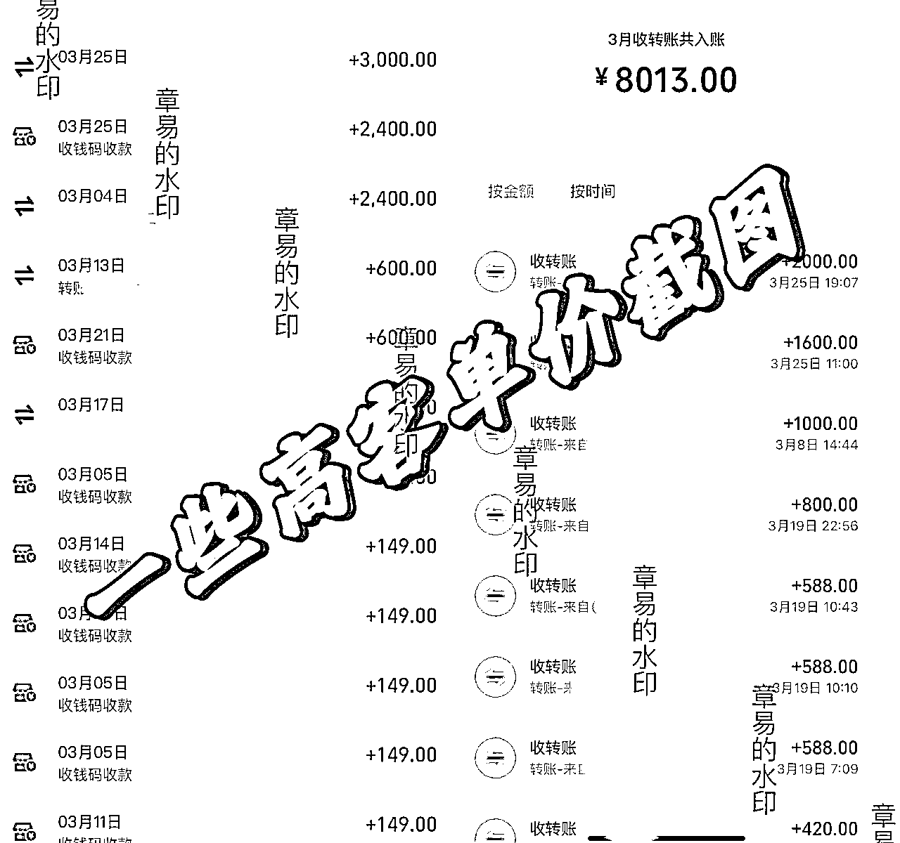
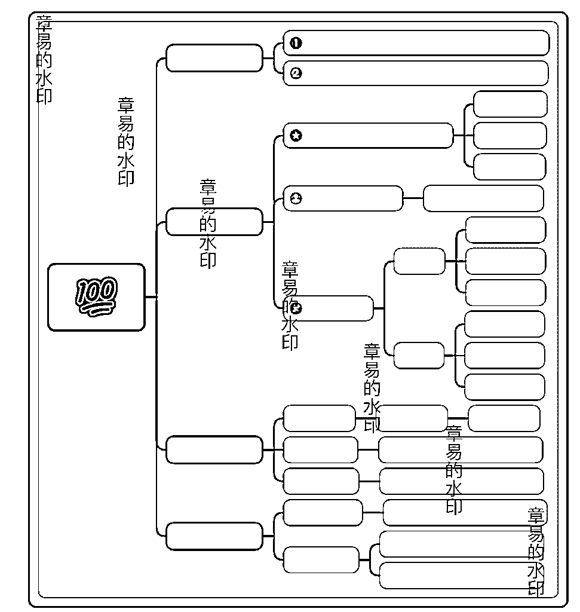
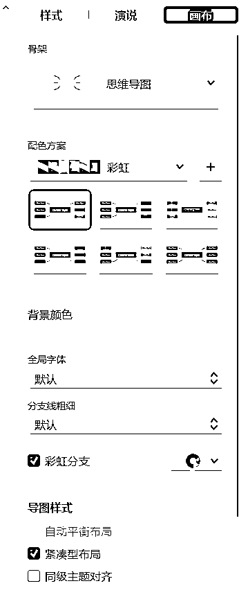
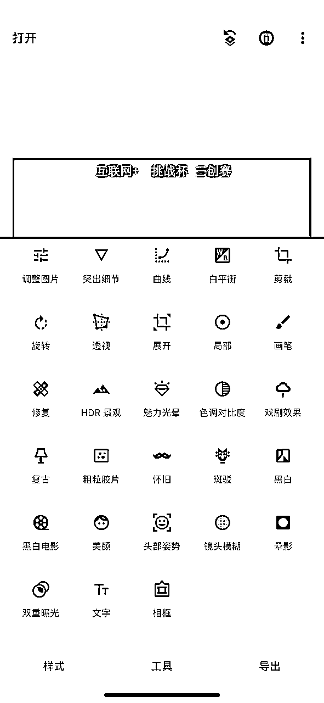

# 01年女大毕业后在家备考，从0开始做小红书虚拟资料垂直赛道，3个月变现7w＋

> 来源：[https://ogv8250mbw.feishu.cn/docx/Q6ASdyh2voRYSRxAK55cHe0bnJd](https://ogv8250mbw.feishu.cn/docx/Q6ASdyh2voRYSRxAK55cHe0bnJd)

大家好，我是章易，一名01年正在摸索自由职业努力实现财富自由的创业者。请允许我简单分享下我加入生财前后的变化。

去年刚刚加入生财，22年六月毕业后一直在家备考gwy和编制，但是完全脱产对于我来说精神压力太大了，没有经济收入的情况下真滴很容易焦虑，所以在没有了解到生财前有一段时间疯狂找项目，学费交了很多，但真实拿到结果的很少。有的是自己没有坚持下去的原因，也有些是项目没什么核心壁垒，像一阵风吹过，还没来得及拿到反馈就消失了。

加入了生财以后，像打开了新世界的大门，那段时间每天疯狂吸收大量的精华帖子，精华帖子都是免费分享，干货不断，个人认为外面不少收费的项目都没有精华帖写得好；风向标让我最迅速知道当前市场的热点风向，信息差在这不存在；各种大佬线上和线下的分享把一个认知还停留在在校大学生阶段的我，硬生生拉高了几个维度。也正如此，我慢慢知道我应该如何挑选赛道，如何测试赛道，并最终知道选择一个什么赛道去持续深耕，那就是：单价高+可持续+可复制+可复购。

方向是确定了，我循着这条思路不断测试了很多项目，也参加过拱卒大佬的实战营。在这个过程中虽然还没找到我一开始认定的方向，但基本功打扎实了，也为我后续指导学员提供了很多帮助。在持续测项目的过程中，比较幸运的是最终发现了一个小众赛道：大学生创新创业比赛。这个赛道需求强，人群付费意识高，单次服务价格高，并且还会有不少回购。这不正是我一开始确定的深耕方向吗？当方向，目标都确立后，就剩一件事：执行力拉满。

（先上图，有图有真相）

有一句话说得很好：越努力越幸运。在前进的方向遇到同频优秀且努力的人一起前行，抱团取暖的感觉真的太裤辣。遇到刚好是这个领域的专家，年纪轻轻就是国赛评委的 和个人能力超强一人顶一个团队的好大哥 ，还有就是销冠中的销冠低转高客单转化率很高的好大哥@鲍称称。他们已经开始运营把这个赛道做成公司化、品牌化、规模化了。于是，一拍即合，咱们分工合作，努力实现咱们的目标。今年我也开始线下组建公司团队，争取像生财其他大佬一样，做大做强。

再次感谢生财，让我收获的不仅是金钱，还有比金钱更贵的认知和人脉。因为生财帮助成就了我，所以我把下面这个拿出去可以收费几千的实战干货，毫无保留地分享给生财的各位宝子们，希望对你们有些帮助。（学会了笔记不爆，欢迎来找我）

本篇复盘，我将会详细分享我对虚拟资料的一些认识和自己深耕创赛赛道的实战经验。

在下面文章中，我将会从以下几点给大家详细分享：

一、从虚拟资料到垂直创赛赛道

1、虚拟资料基本认知

2、了解创赛（大学生创新创业比赛）

3、为什么要参加这个比赛？有什么好处（为什么要考这个证书/考试，是否刚需）

4、总结

5、有一个良好的心态

二、小红书起号方式＋封面制胜（快速打出差异化）

1、起号的五个流程

2、一篇爆款笔记是怎样诞生的？

3、手把手教你制作竖版思维导图封面流程

三、搭建自己的爆款选题库＋内容制作（自生成原创内容-打出差异化）

1、怎么选对标账号？

2、搜索关键字（还是以创赛举例）

3、小红书封面设计（只要是学习类资料思路通用）

4、封面制作的细节一比一像素级模仿

5、爆款选题库怎么搭建

6、怎么完成内容制作

7、爆过的笔记会持续爆

四、较为安全的小红书引流方法

1、图片手写微信号引流

2、创建粉丝群引流

3、小号主页引流

4、分享小号笔记

# 一、从虚拟资料到垂直创赛赛道

## 1、虚拟资料基本认知

为什么在小红书做虚拟资料？

大家应该也知道在抖音快手这种泛流量平台，底层消费人群占比很大，而小红书有天然的平台优势，单粉产值远大于其他平台，而我们的学习产品所针对的受众更是属于金字塔顶端的小部分人群。这意味着由于小红书的种草属性以及排他性，我们如果去发布一篇笔记更容易去获得客户认可（特别是学习产品以及刚需），只有认可才会去买单，试想一下你去别的平台发布一篇作品很容易遇到低素质认知度不高的人，且不说买单，沟通都很费劲因为他们根本不了资源价值信息差。

（做虚拟一定要规避有版权的资料，避免盗版侵权问题，规避不必要的麻烦。当做流量能力提高，可以找相对应领域专业的人合作，提高项目的壁垒，完善后端的体系，自然产品服务也能提高价格）

小红书客户对你是有天然的信任度在的，图文分享经验资料本身就不容易让他们第一时间有反感心理，特别是你在以一个学长/学姐这样一个前辈的身份在讲干货。成交链路很简单：提供价值——认可价值——买单。

所以你需要的只有一件事就是做好小红书图文笔记。

由于我自己深耕的领域是”大学生创新创业大赛“所以在此用这个比赛举例子，但是思路是通用的，万物可虚拟。

## 2、了解创赛

做任何赛道之前我们自己要先对这个赛道有基本认知。

不管做什么赛道，都建议去关注一些关于这个赛道的公众号，或者去官网看一看了解一下基本信息，哪个比赛/考试在报名阶段就是这个比赛的流量期，这样你发笔记更有针对性。

另外可以去微信搜索微信指数，订阅有关的关键词，当数据异常会自动提醒。以下两张图可以清楚了解这个创赛的基本知识。

## 3、为什么要参加这个比赛？有什么好处？（为什么要考这个证书/考试，是否刚需）

针对创赛客户主要分三种情况

第一种：保研综测加分、出国留学、奖学金、评奖评优、丰富个人简历等这种刚需

第二种：学校或导员强制参加（只是想混过去）

第三种：个别学校、省份比较特殊还有巨额的奖金，优秀项目甚至能拿到政府和企业投资

## 4、总结

明确个人定位并建立账号，持续创作符合小红书调性的笔记，不断复盘优化，打造出爆款笔记。

说到底就四步， 发布笔记——留钩子——引流私域——成交。

做好这四步就可以让你成功赚到钱。

不同于实体产品，不需要发货囤货垫资等等一系列复杂操作，要的只是你有基本审美能力和持之以恒的心态加上后端产品及服务，即是王炸。

新手建议不使用任何数据分析平台和爬取工具，每天自己去刷同行笔记提升网感，同时你在刷笔记的时候要思考这篇笔记

1.为什么爆？

2.他戳中了那些痛点

3.如果让我去写这篇笔记，我会做出那些优化？

切记封面要吸睛，标题要夸张、有反差、打痛点。网感不是天生的，来自于刻意练习且保持对事件的敏感，多看多思考平时养成没事刷刷小红书的习惯。

## 5、有一个良好的心态

“善败者不亡，不亡则终有胜”，前期不要因为流量问题而焦虑，情绪解决不了任何问题，爱迪生说“我没有失败，我只是找到了一 千种不行的方法”，在前期你找不到自己风格流量低迷时候不要轻易放弃，坚持发总会爆的，用数量打败质量未尝不可呢？

# 二、小红书起号方式＋封面制胜（快速打出差异化）

## 1、起号的五个流程（星球很多人分享过了，有经验的这里可以跳过）

### 第一道流程：账号注册

1.一机一卡一号，正常的账号注册，全程不要连wifi

2.两个手机注册两个小红书号，先从运营好2个账号开始（学生党没有手机用ipad也可以）

3.另外可以用微博号，微信号，qq等各注册账号拿来当引流号。

### 第二道流程：资料包装

1.注册时，年龄填写范围18-21岁，标签尽量选择跟学习有关的，除此之外再选择一个其他标签

2.取昵称（好名字是为了让对方快速对你建立认知，降低认知成本）

可以快速锁定目标用户，体现账号价值；如果一眼看不出你有何价值，别人为何要关注？

参考公式：IP名＋领域关键词、特定人群＋ip名，ip名＋爱＋领域关键词

3.头像 和名字相辅相成（加强印象，和你的内容风格要统一）

4.简介

简介要告诉别人你是个什么样的人，能为别人提供什么价值，给别人一个为什么要关注你的理由。

简单明了即可，不要罗里吧嗦，让别人看完你的简介有关注你的冲动。

5.顶部头图

尺寸：1000*800 和你头像调性相符即可

### 第三道流程：刷对标养号

设置完毕以后你就可以开始刷对标养号了，这点很重要，牢记一个原则：以素人的操作习惯去刷笔记，以运营的角度去分析同行数据，

让系统判定你是正常用户，有相同领域账号适当点点赞，关注收藏评论下，浏览笔记时速度不太过快，符合人正常的阅读习惯，停留一分钟左右，不要一下滑到底，可以适当关注一些相同领域的博主有利于提高账号垂直读，后续也可以借鉴爆款封面，标题正文等

养号期间不用急着发笔记，让小红书先判定你是个活跃真实账号，同时通过互动和评论，提升自己的权重。

### 第四道流程：账号发文

养号5到六天以后可以发笔记了，要注意的是

1.发文频率：前一个月最好天天发，实在不行前一周要天天发，后面两天一次，保持高频优质输出

（为了提高用户粘度，平台可能会给你一些数据的错觉系统什么时候给你推送、什么时候给你流量，都是设计好的，在这种大环境下，创作者是非常焦虑的。

但对平台来说，就是要让你焦虑，焦虑才会有产出。

如果一阵子不发文，会被打压，因为，平台要鼓励每天发文的创作者。

每个创作者和用户，都是产生数据的工具，平台当然要奖励、天天发布的创作者，或者说，区别对待日更和月更的账号。）

2.不要刷粉，不仅无法增加权重反而会降权，也不要批量注册消耗关注

最重要的是：坚持写原创的优质笔记，每周至少四个，保持稳定输出，100%搬运很难获得粉丝认可，可利用gpt生成原创爆款文案。

### 第五道流程：提升账号级别

小红书官方设置有自己的账号等级制度，可以依照官方的等级任务依次来提升账号级别，关注一些小红书的官方账号“薯管家、小红书成长笔记、创造者小助手”等等

除了可以和官方账号多评论互动，平常还能更早了解小红书官方活动，及时参与。

养号期间一定一定要培养自己的网感！！！！

一个刻意练习的小tips：打开小红书，当号养好时发现页给你推荐的一共有六篇笔记，不要看标题第一眼只看封面你想点进去哪个，那这个封面就是有“吸睛”效果的，去分析图片上的内容像素级模仿，这就是你的爆款素材库的素材之一，之后返回页面去研究标题。

之后逐渐增加数量，12篇笔记，18篇笔记，当你打开小红书刷三下，脑海里对那篇笔记封面印象最深，OK打开它，素材＋1。

## 2、一篇爆款笔记是怎样诞生的？

五要素：封面、选题、封面标题、内容质量、运营 ，在小红书一篇笔记发布后先小范围分发，根据高点击率高互动率高完播率判断是否能进入下一流量池。

封面刚刚已经讲了，那怎么确定一个选题是否能做？

在定选题时去小红书或者其他平台看看围绕这个话题大家的播放量和阅读量如何，搜索关键字看排名靠前的，思考是否能打痛点，有共鸣，有奇特性（推陈出新，角度独特）。

### 1.了解流量机制

小红书平台有两个最核心的流量来源:【推荐流量】+【搜索流量】

推荐流量：跟很多公域平台一样，小红书也有算法推荐机制，系统会根据你笔记的初始点赞、收藏(+)、评论、转发分享、转粉数据来打分，评论、转发和转粉这三个的分数占比较高。

CES评分=点赞数 x1分+收藏数x1分+评论数x4分+转发数x4分+关注数x8分

CES为小红书的内部评分体系，

当你的笔记分数越来越高，就会一级一级被系统推荐到更大的流量池，成为爆文。而这篇爆文还会带动其他笔记的整体数据增长。

搜索流量：小红书平台的用户除了来主页逛逛，还会通过搜索找到自己想要的内容。比如想买口红，会搜口红攻略想去哪儿旅游，会搜旅游攻略。

搜索结果排名靠前的笔记，会获得更多曝光和关注这部分流量近乎占据总流量的 50% 以上，不容忽视。

要想获得搜索流量，首先你的笔记要包含有效关键词，且被系统成功收录

### 2.起个好标题的5个方法

1.提问式

引发思考，吸引注意痛点

例如：xx必看丨零基础如何拿下xxx？

2.抓心理 （回报远大于付出，最好不付出）

例如：摊牌了 其实我的（某个荣誉）是抄出来的！

3.干货式(盘点式)

例如：以下干货整理，抓紧码下，很难找全！

4.话说一半隐藏一半

例如：xx的捷径，但不敢说....

5.对比式.

将结果，境遇等差距很大的两个事物做对比，营造冲突和反差

6.恐惧式

利用人的恐惧、避免损失和好奇的心理

例如：千万不要心存侥幸 xx违规可能导致努力白费

### 3.竖版思维导图 快速打出差异化

在这里要也要感谢生财研学社和罗卜老师~

之前对竖版的思维导图就非常感兴趣，因为平常学习生活里我都是用平板去作图制图的，我很清楚这种展现方式不仅能让知识点梳理的很清晰，再复盘时也很容易抓到重点。有期生财航海看到这种适合在手机上查看的思维导图，直觉告诉我，以这种方式换种思路放在小红书上一定可以爆。

事实证明，确实可以！！

我在此基础上做了几个符合小红书比例的竖版思维导图的模板图，发出去测试，果然第一篇就爆了，之后就是套模板＋gpt生成原创内容，连续爆。

模板长这样，在确定好一篇选题以后直接用调教好的指令去让gpt写，然后直接复制进文档里面，做好以后f7截图，把图片导入手机，美图秀秀3:4截一下，爆款封面get

## 3、手把手教你制作竖版思维导图封面流程（爆款因子都在这里）

##### 一、准备工作

有一台电脑下载XMind，https://xmind.cn/

##### 二、新建一个画布，刚开始就长这样

##### 三、选中“中心主题”，点击格式，样式栏，结构用逻辑图向右，分支选自己顺眼的就行

画布这里选一个配色，之后勾选紧凑型布局并把同级主题对齐那个勾勾去掉（这个注意一定要去掉否则你的导图没办法自由拖动宽度，各级主题是强制对齐的。）

##### 四、搭框架！可以拆解别人的思维导图也可以自己去做一个，这里我带大家正好熟悉下快捷键操作。

第一行是题目 我设置的宽度575 下面分支主题从左到右分别是 115 250 165

Tab 向右插入主题 enter向下插入主题

##### 五、填充内容，隐藏分支线条和中心主题

1.隐藏中心主题：点击中心主题，右侧格式栏“样式-形状”选择无填充、无边框，文本删除选择和底色一样的颜色

2.隐藏分支线条：在“样式-分支-线条”中选择无，先隐藏所有分支线条，再按ctrl 选中多个子主题把线条显示出来。

##### 六、添加外框，并且加一些小元素增加导图趣味性

全选后点击外框，调整下外框样式，填充选择和底色相近的

之后同理，把除标题以外的内容框选进去，点加号，加一些字在导图上方，可以是总结也可以是概述。

插入，点击贴纸，填充图片里你感觉比较空的部分，力求左右对称。

七、完成以后F7导出图片即可！一张适合小红书的竖版思维导图就完成了！

记得导出以后按照3:4的比例调整一下，这里我为了给大家展示指令就不做修改了。

如果导图过长了，要不就分开两张截图，要不就删掉一些子节点，虽然内容也很重要但是美观排在第一位！！

错误示范：

应该是对标我账号做的图和内容，但是为什么数据很差？

第一没有整体连贯性，外框最好用实线去框住，否则你看这个封面没有想往下了解的欲望。

第二空白太多了，整体不饱满，可以在左边加一些贴纸，让他左右对称。

第三颜色很乱，如果选定主色调为蓝色，那么整体画面就是蓝色底和黑色字，最多再有一个红色去标明重点就可以，

总结：还是没有用心，精心制作的笔记是可以一眼看出的，质量很重要，有时候一篇内容好＋封面漂亮的笔记是一百篇草草做出的笔记都抵不过的。

对了如果需要我做的模板也可以分享给大家~

# 三、搭建自己的爆款选题库＋内容制作（自生成原创内容-打出差异化）

#### 1.怎么选对标账号？

博主笔记点赞，收藏数据好，粉丝高，就是一个好的对标账号吗？

不是的，我们找对标要去找以引流变现为目的的对标账号，这类账号做出的优质笔记，一定是评论多的，观察下评论区如果都在求资料，那就是一个好的对标。

或可采用千瓜、蝉妈妈等第三方工具

第三方数据工具一般都有达人榜单和达人搜索，按分类、账号属性、粉丝级别等筛选，比较便捷，就是需要付费。

#### 2.搜索关键字（还是以创赛举例）

如“挑战杯”

选择最热-综合 ，观察那类笔记是你可以模仿的。

以上两种方法筛选出来的可以放入对标库内。

1.选择合适关键字并合理布局关键词

热词在文中的位置越集前越有效，直接在标题中呈现效果最好，既要被系统读懂，也要被人看懂。

2.做好账号的整体内容布局，构造整个账号的标签库

文章的收录效果不但取决于内容本身，更与账号本身的标签权重息息相关。

账号内容越垂直越好，尽量选择本分类的热词，人群定位才会精准。

多参考热词下的热门文章写法，热词是基础，内容的看点更是关键。

#### 4.小红书封面设计（只要是学习类资料思路通用）

小红书的机制是双排页面推送，清晰度高、颜值高、有吸引力的标题文字会是笔记点击率的重要影响因素，不管是曝光流量的推荐页还是搜索流量的结果页都是由笔记封面图占据主导。

封面图比例统一3:4。

我们常见的封面一般分为纯文字、纯图、图+文字、拼图对比等几种形式

制作人一种是主打美观精致赏心悦目，类似下面四张

另一种是纯素人，越普通越好。

最开始制作时可以先试着纯文字的内容，像我们这种知识类内容变现，制作成本低简单易上手。

纯文字:手写体、备忘录，也可以用拼图的形式

内容偏手写类，更加的真实，偏买家秀，用户来到小红书更多的是想要获取知识、得到别人的经验，而类手写体近期爆火的原因则正中用户的需求，有点类似上学的时候我们都喜欢抄，学习好的同学的作业。

如果有ps或者ppt基础的朋友也可以去做精致一点的封面，效果更好也容易打出差异化。

对比图做封面流量也很好，大家在养号过程中看到把图保存下来当素材。

封面图要注意色彩搭配

想让底图与文字有视觉冲击力，则采用深、浅色的对比

想让底图与文字在视觉上体现柔和舒服，则采用浅色系

字体使用频率最多的颜色:白色、黑色、黄色、红色、蓝色

若想突出图片主题，则字体不要占据过多面积，亦可降低透明度，不要让原图的颜色和字体颜色互相影响

字体的色彩搭配同整个封面的色彩搭配同理

一句口诀：

单色搭配和谐可靠，邻近色搭配和谐且有变化，互补色搭配颜色大胆冲击力强

字号：最多出现三个字号字体，一般为两个，一主一次

重量：正常字体与加粗字体

加粗用于大标题、小标题的突出

如果不做对比突出的话，单纯的文字标题更建议选择圆体、粗体文字，增加标题的“重量“

字体：字体一般推荐选择宽、厚的字体，如黄油相机中的新青年体、方正兰亭特黑体等

尽量不要选择太“瘦”的字体，没法撑住标题的重量

#### 5.封面制作的细节-一比一像素级模仿

点击小红书笔记右上角，复制链接，苹果手机自带的快捷指令，小红书去水印

把图片保存下来以后，用snapseed 将图片简单处理一下

先用修复工具把原本图片里的字抹除，再重新自己添加文字，封面的字体要求清楚，一眼能看清

看上面两张图片的对比，是不是后者给人的视觉冲击感更强一些，但字体排版我是没有做多改动的

按照我上面的方法，这样的图两分钟就可以做一张

如果你想添加更多元素可以选择用美图秀秀或可画、醒图、黄油相机去添加字体。

从最初封面到最终爆款封面的优化，总结为三点：

用户视角:明确用户的观看顺序，引导鲜明主体和爆款关键词，吸引用户点击

氛围营造:整体配色，背景，要与选题主题强相关，满足用户好感

标题指引:标题字体不予太长，要做到精准吸引且放大突出

快速判断封面是否合适方法推荐:

发图片到微信聊天框，只给自己 1-2s 的观看停留时间，确认是否可以快速 GET 到封面的主体和标题关键词如果可以，就说明封面内容是合适的

如果不能，还需要停留才能观察到，那就说明这个封面并不合适，排版，花字，需要优化改进

#### 6.爆款选题库怎么搭建

对标同行的热门选题及评论区选题。

关键词搜索的热门选题

同行笔记下的评论，部分用户的评论需求也即代表一大部分用户群体的需求

选题的核心不是自嗨，而是价值分享，而这个“价值"不是你认为的，是粉丝、用户所认为的。

#### 7.怎么完成内容制作

这里总结三种最受欢迎的内容模式

第一种：科普

可以理解为是新手小白必须懂的知识点整理，这类笔记可分成多篇做得轻量直观，也可做最全面的知识汇总。

注意：不要一大堆难懂的晦涩语言也不要像百度一样枯燥乏味，多运用表情和语气词，让人有想往下看的欲望。

首图特点:一张图汇总全部知识解析，或者体现出密密麻麻的知识点清单

第二种：避坑

内容架构有两种写法

1.直接参考爆款总结最容易踩的坑、千万别做哪几种事;

2.先盘点总结坑，给出正确的做法

首图特点:什么图都可以，图上要加标题花字重点突出主题。

第三种：攻略

攻略类笔记一般要从多个维度去总结，每个维度都清晰、详细描述具体怎么操作和对应的注意事项，体现的干货信息点越多越全越好。因为要全面，所以制作起来比较耗费时间，但做好了出爆款的概率很高，更能体现ip专业度也有利于用户转化。

首图特点:呈现部分攻略信息，或者直接拼图，用小标题花字标记所涉及的每个维度。常用【建议收藏】【最强攻略】【最全攻略】【必看】等文案花字吸引用户点击。

#### 8.爆过的笔记会持续爆

当你笔记出了一个小爆款后，可以一直重复发，发到没流量为止。可以做细微的改动，比如文案前后置换顺序或图文更改顺序

我在不同的号上以及同一个号上面都做过测试，没什么诀窍，就是反复发，等吃完这篇流量以后再换封面，停一段时间再换回来效果依然显著。

有一篇笔记给我带来的长尾流量让我持续收益起码上万元。

# 四、较为安全的小红书引流方法

没有绝对安全的引流办法，只有相对安全的引流办法。大家可以依据自身情况，选择自己的引流玩法。

#### 1.图片手写微信号引流

这个很好理解，就是手写自己的微信号，然后拍一张照片，发照片给主动私信的人。

#### 2.创建粉丝群引流

目前粉丝群是最安全的方法，设置成在主页展示，粉丝点击进入主页就可以看到，如果没有粉丝群的可以让有粉丝群的账号帮忙建，然后把你拉进去，创建人再退出来，你就会自动变成群主。

在评论区引导关注，之后回关，可以直接拉入群聊

在群管理中，设置成自动通过，后续用小号在群里发想要打卡和领取资料，+🛰️:XX，这样就可以引流到微信号。

个人主页展示一定要打开，这样才能显示到你的账号主页面上，凡是用户点击头像进入你的主页，都能看到。对新成员展示历史消息一定要打开，无论什么时候入群的朋友，都能看到以往的广告信息。

群引流方式一：

发起群投票，然后将消息置顶。在群公告里提醒看群置顶消息。

群引流方式二:群聊消息导流

每天发送一次群公告，提醒群成员添加你的微信号，最安全的玩法还是用助理号来操作，设置群管理员即可。

每天在群里发一遍微信号，单独发出来，方便用户复制粘贴。

#### 3.小号主页引流

在主页个人简介 @自己的小号，新人不建议一上来就直接弄，很容易被清空，建议一千粉丝以后，并且认证成为专业号。

然后在小号主页发一篇文章，把你的微信号展示出来。这种方法过滤后的粉丝超级精准。需要注意的是，小号不要发多条笔记，发得越多犯错的几率就越大，最好是只发一条带有微信号的笔记即可。

#### 4.分享小号笔记

小号发引流笔记，就是笔记中直接带微信号（可以倒着写），然后大号回私信的时候，分享这篇笔记给用户。

# 五、一些想说的话

生财里有很多大佬，但也有不少跟我一样刚毕业或还在上大学的小白，可能正在迷茫或者面对众多项目眼花缭乱不知道如何下场。

我毕业以后感触最深的其实就是很多事情都没有一个标准答案和做法，甚至没有一个标准的筛选机制，跟我过去所有的考试完全不一样。

你只能自己不断优化，不断去接近那个标准答案。

像我从一年前，开始接触小红书虚拟资料，自己做笔记，做引流，做成交，跑通所有闭环，不知道做了多少号又废了多少，后来再从一个个的学员里看他们忽视的东西，吸取经验教训，不断完善和迭代自己的知识体系。到现在才算可以做到“没有做不爆的号，只是你没有展现出该展现的内容”。

所以无论什么项目，确定好可行性，持续深耕，坚持就好，时间会给你最想要的答案。

总是会回想起我小时候打篮球怯场，队友问我怕什么，我说怕摔怕输怕受伤，他就一把拉住和我一起走进场内，头也不回的说“干就完事了”。那瞬间好像球场只有我一个人了。好像笨重的人摔倒再爬起来比天生更灵巧的人更酷。

哪怕我知道都没关系，失败也没关系，犯错也无所谓。

但这些自我安慰好像都不如那句“干就完事了”。

最后，如果你还是对小红书流量问题有疑惑，不知道发什么样的内容，或者在小红书虚拟领域没有方向不知道该往哪使劲，很长时间拿不到正反馈。欢迎评论区交流，帮你梳理思路，事半功倍~

祝大家天天发财！码字不易，觉得有帮助的话，点个赞再走吧！谢谢！