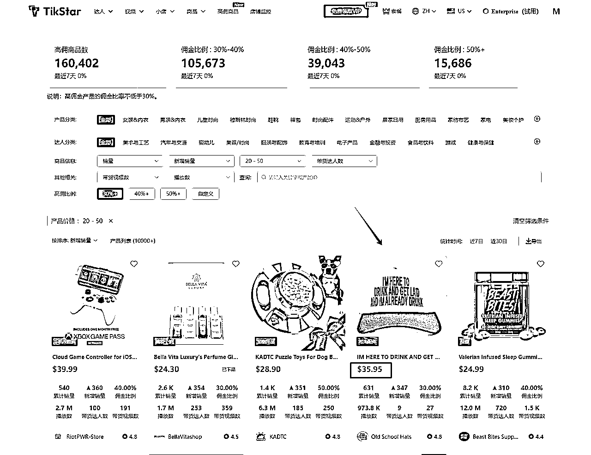
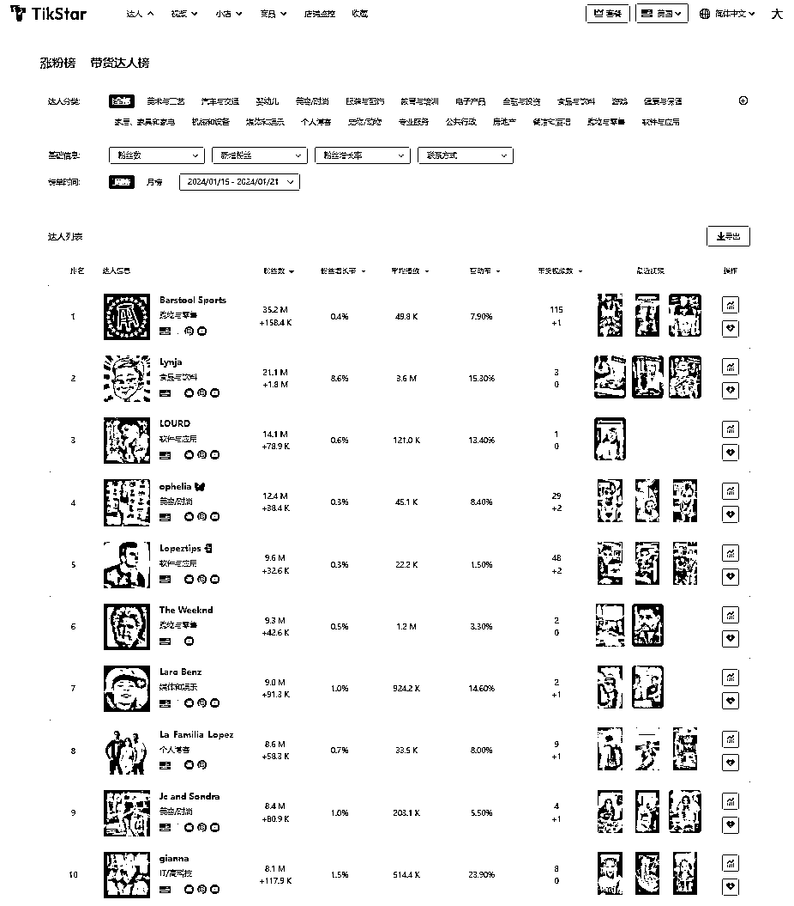

# 83万单，Halara的TikTok美国小店爆单拆解

> 来源：[https://za6kyadmdr.feishu.cn/docx/Tm3mdOxhNo8e22xHIfncOFiznde](https://za6kyadmdr.feishu.cn/docx/Tm3mdOxhNo8e22xHIfncOFiznde)

Halara US 2月小店销量榜排名第五 本次将会以Halara US 情况作为案例进行分析

小店销量榜

根据TikStar数据显示，截止到24年3月25日

Halara US TT美国小店累计销量838.5 K

销售金额2020万美金

售卖产品数359个

均价36.95

带货达人数3.5 K

带货视频数12.0 K

近三十日数据显示

新增销量：159.7k

新增销售额：4.1M

动销商品数：241

新增达人数：718

新增视频数：1.2k

Halara是一家成立于2020年的快时尚跨境出海品牌。尽管Halara成立时间不长，在创立的一年时间内，Halara 分别完成天使轮和 A 轮融资，2021年6月17日拿到今日资本、红杉中国、IDG等资本1亿美元融资。被称为lululemon平替，定位其定位是做“中国版的ZARA”，专注于运动休闲品类。该品牌以高质量、高性价比为特点，致力于提供覆盖全天候场景的运动休闲服饰，适合不同类型和身材的女性穿着。主要销售价格20$到40$的时尚运动休闲女装。尤其受到欧美运动女士的青睐。

Halara US多渠道布局Facebook，Instagram，YouTube，TikTok上使得Halara覆盖多个渠道的用户，Halara自从10月中旬入驻TikTok Shop美国站以后，迎来了快速增长。在tiktok上通过达人带动品牌宣传曝光产品。平均每天合作达人数24个。

达人分析

目前Halara US建联带货粉丝量排名前十的达人名单如下：达人粉丝数破千万 达人粉丝数排名前十多为时尚博主，符合品牌调性。

达人注意事项

1.粉丝数量 粉丝数量固然重要，更重要的是是粉丝的质量。只有拥有与产品目标客户群体相契合的忠实粉丝，才能实现更高的带货转化率。

2.达人风格 寻找和目标客户群体相符的，粉丝人群更精准，激发购买欲望。

3.带货数据 低粉丝量并不意味着转化率低，有些红人在努力提升视频质量和用户粘性，这些粉丝可能会带来更高的转化率。

当然，这是对品牌而言，目前很多中小商家不筛选，直接通过海量邀约铺达人的方式去广撒网，伴随的也是回复率越来越低。

解决思路

tikstar可批量导出带货的达人信息

如Halara US近期带货达人的Ins 油管 邮箱等联系方式

通过增加曝光渠道去增加成功率

ins联系，邮件联系，其他渠道联系，去打差异化（很重要）

继续观察Halarar排名前十达人的情况

以位居第十AGGAYUCITA<3举例 粉丝基数6.2M 平均带货播放5M 相比排名第一粉丝基数粉丝基数少 但是带货播放量数据非常可观转化率比较高

进入TikStar查看达人详情页面

主要标签关于美妆时尚和带货产品风格较一致 这样粉丝更垂直数据精准 带货视频效果显著（垂类博主的垂直粉粘性更强，信任度更高

商品销量分析

目前店铺主要是运动装

Halara US小店带货产品 359个 总带货视频10000+

Halara US TT小店销量榜这款休闲裤共7个sku 小店售价$26.94 官网售价$29.95 小店优惠约3美金

佣金比例10% 总销量318.36k 近一月新增销量15.4k 累计销售额6.7M 带货达人数1.5k

tikstar可每天观察到小店商品具体的出单详情

通过每天的出单情况，反推即将爆单，和爆单的规律。

休闲裤单品累计带货达人超过1500人

休闲裤带货视频数就达到3000+

Halara 官网风格比较简约 风格鲜明 带有设计感休闲运动的女装品牌

从Halara US品牌的案例中要想打造知名度较高品牌 定位和宣传非常重要

1.独特的产品选择和准确的市场定位：商家需深入了解目标客户需求和市场趋势，确保产品选择能满足客户需求并契合市场。打造属于自己的品牌故事 对于大众的印象更加明确扩大影响力 同时产品有一致性

2.多渠道社媒布局 通过与TikTok等社交媒体平台上达人的合作，扩大产品曝光并吸引更多潜在客户。

产品播放情况

观察Halara US主账号播放情况 主账号656.8.8k粉丝 主要拍摄手法是对比展示产品功能性进行情景化演示，平均视频播放量：3000-1万+

通过PiPiADS观察投流情况

PiPiADS是目前市面上广告数据量最丰富，历史数据最久的TikTok投放数据分析平台。

广告数：1k

https://www.pipiads.com/zh/advertiser-analysis/60bf09b62980dde5e956bcef/

休闲裤广告数362条

运动紧身裤 广告数160条

https://www.pipiads.com/zh/tiktok-shop-store/7495304734897637668

广告展现最高视频素材36.4M

达人试穿直接展示产品效果 根据不同场景搭配 讲述产品百搭的特点 吸引粉丝购买下单

达人分析

1.通过TikTok Shop的达人广场，商家可以主动私信达人进行沟通

2.邮件建联 广撒网方式联系达人，美区市场不断发展，每月都有新的带货达人加入，商家有大量达人资源可挖掘，与大量达人合作能够快速推动店铺销售。

tikstar可以通过达人分类和带分类筛选出垂直达人 查看达人带货信息 批量获取达人邮箱

达人沟通技巧

付费合作邮件要点：

1.  突出本身优势： 在邮件中突出强调自身在某个平台的表现不错或者产品高质量好评很多。可以让达人加深信任感，提高合作可能性。

1.  明确合作条件： 指明你愿意提供的付费金额和可能的佣金。让达人清楚知道合作的价值和利益。

1.  具体合作内容： 说明合作的具体内容，例如你会提供免费样品，希望达人为你的产品制作独立视频，并授权混剪使用。明确的合作内容可以让达人更容易理解和接受，并提高合作的效率。

纯佣合作邮件要点：

1.  介绍自己和产品： 简要介绍自己的品牌背景和产品特点，让达人对你的品牌有基本了解。

1.  高额佣金： 强调你愿意提供的高额佣金，这是吸引达人合作的关键点之一。高额佣金可以激励达人为你的产品进行推广，并增加合作的吸引力。

1.  持续投流： 表明你希望与达人建立长期合作关系，并愿意持续提供佣金回报。这种稳定的合作关系对于达人来说是有吸引力的，因为可以保证持续的收入流，并增加合作的稳定性。

根据成本预算选择达人 成本有限时可以先寻找中腰部和尾部的达人。这些达人只需寄送样品，他们就愿意为我们制作宣传视频。有预算情况下再合作头部达人粉丝基数大和宣传影响力成正比

达人数据参考指标：

1.  达人标签：需要与产品相匹配，例如，如果产品主要面向美妆市场，更适合选择时尚美容类博主。

1.  目标群体的粉丝比例：针对目标市场中的主要群体进行粉丝数量及比例的分析。例如，如果产品主要面向女性市场，那么需要确保达人的粉丝群体中女性数量及比例较高。

1.  GPM（GMV per Mille，千次观看成交额）：GPM指标越高，代表带货成功率越高，要关注达人的GPM水平。

1.  视频的平均播放量：观察达人近期视频的平均播放量，了解其在平台上的影响力和受欢迎程度。尽管粉丝量重要，但实际上播放量受平台推荐算法影响。因此，需要了解近期视频的平均播放量，以评估账号受到限流的情况。

1.  视频发布频率：考察达人的视频发布频率，频繁更新的达人可能具有更好的内容生产能力和影响力。

重点关注达人的近期视频更新频率。频繁更新代表着达人的内容生产能力较强且收益较好。可以对比过去和近期的更新频率，若发现最近更新频率下降，则可能反映出该账号最近的收益并不理想。

总结：

TikTok达人推广已经成为品牌营销战略中不可或缺的一部分。正确选择合适的达人进行合作，可以充分利用他们的影响力，快速提升品牌的曝光度和受众认知度。美区达人广场越扩越大想要快速找到最匹配的达人，就必须扩大样本量，利用一些工具来提升建联速度。不断清洗标签，更快地找到能够帮助推动店铺增长的达人。

TikStar新功能上线：

一、高佣产品页面

该功能页面将高于30%佣金的产品直观的展现给大家看

高佣金产品下蕴藏的商机

1.高利润产品挖掘

单角度分析：高佣金大概率可以筛选出高利润产品，相当于产品本身将投流的费用，变成给到达人佣金

反之，高佣金产品可以用于投流选品

2.新品挖掘

市场推广过程中，新品刚开始面向市场，为了尽快拿到基础数据，一些品牌主或商家会让利激活市场（或许产品利润还不到30%）

同样的， 我们可以通过高佣商品页面，观测到新产品的推广及营销情况

二、下架商品库

获取平台下架商品数据库，方便跟踪下架后的商品情况

下架产品下蕴藏的商机

爆品挖掘

（1）很多玩家通过资料店测品，但资料店大多走向被封的道路，通过下架商品库去挖掘好品，减少测品成本。

（2）很多店铺单量很爆，但后续平台审核，最终含泪退场，同样也可以挖掘出商机。

总结：

Tikstar介绍

tikstar是一站式 Tik Tok美区小店数据分析平台、涵盖带货达人库、视频库、小店库和商品库以及各类榜单，支持筛选优质达人、批量查看达人联系方式、寻找低粉爆款潜力视频、分析小店及商品数据等功能

tikstar带货达人榜单周榜 带货达人榜以带货视频的播放增长速度为衡量指标，可以更客观得评判带货达人的带货视频质量，更多的播放量以及更高的增长速度，往往意味着产品的大卖。同时辅以带货商品数和新增带货视频，可以快速了解达人是否为积极的带货博主。通过最近带货一栏可以迅速了解达人近期带货的产品，直观的表现达人带货的具体偏好。

PART\

01

tikstar达人涨粉榜单周榜 带货达人榜以粉丝增长率为排名指标，抹去了大小达人之间的基数差距，更客观地呈现每周、每月的涨粉达人。搭配带货视频和平均播放数，可以大致把握该达人的视频质量以及带货经验。

PART\

02

查询Tik Tok美国小店销量榜

销量的增长往往意味着正确的运营和爆款的存在，而增长率则更有助于挖掘刚刚起步的竞争对手。小店销量榜可以帮助你快速定位并挖掘出销量正处于井喷阶段的小店。

带货达人数和带货视频数则是另外2个重要的参考指标，可以判断小店商品被达人接纳的程度以及是否被市场认可。

PART\

03

查询小店商品销量榜

商品销量榜展示销量增速靠前的商品，支持全品类检索。

除了常规的销量、增速和佣金比例数据外，还提供带货视频播放量、带货达人数和带货视频数，可以更直观的看到销量增长背后的机会。

销量基数小，但销量爆增的产品，且带货视频和带货达人都很少，则往往意味着可以迅速抢入，分享早期爆款红利。

PART\

04

查询热推商品榜

热推商品榜以播放增速为排列指标，支持全品类检索，反映有哪些商品正在被推广/投放。可先于爆款产生前，快速了解业内同行正在进行哪些测款/推广。

PART\

05

查询全托管爆品榜

全托管爆款榜与商品销量榜相似以销量增速做为排列指标，唯一的差异是全榜的商品均来自全托管店铺。

PART\

06

小店销量监控功能

店铺监控为需要细腻了解竞争对手的用户提供了强有力的支持。

支持按分组监控/统计小店数据，看板提供今日、昨日、近7日和近30日的维度统计()。

独享数据服务，每个店铺的数据（包括销量、商品数、带货达人数和带货视频数等）均单独统计，每小时更新一次，以获得更精确的数据。

储存历史监控方便找回，并支持监控数据导出。

07

高佣商品

高佣商品将佣金比例高于30%的产品集合在一起，便于带货达人发掘当前分佣与销量兼具的爆款产品。

同时仪表盘提供高佣销量所在的Top3类目以及Top3小店，商家也可以借此掌握时下哪个板块最为走俏，哪些竞争对手正在快速通过高佣产品爆单。

08

下架产品

总有一些产品/小店因为各种原因被下架或弃售，Tikstar将这些短期内下架并销量表现优异的产品/小店收纳起来。在这个功能中，你可以选择任意区间的下架时间，并且可以知晓下架前7日、30日的销量表现，便于挖掘其中的跟卖商机。

如果你已知晓如何规避下架，又或是掌握优势明显的供应链，从下架产品/小店库探寻商机会是一个不错的选择。

我最近一直在输出自己所收获的实战经验，关于TikTok营销相关的教程，涵盖选品，投流，工具，技巧等等，它完全免费，如果需要领取，请添加下方微信二维码，我会免费发送给你，同时还有TikStar的试用会员

tt小店数据请访问(www.tikstar.com)

联系皮皮领取Halara 500个带货达人的联系方式

往期文章：

2000个达人带出500万美金销售额？Anker TT美国小店数据分析及达人建联干货技巧分享