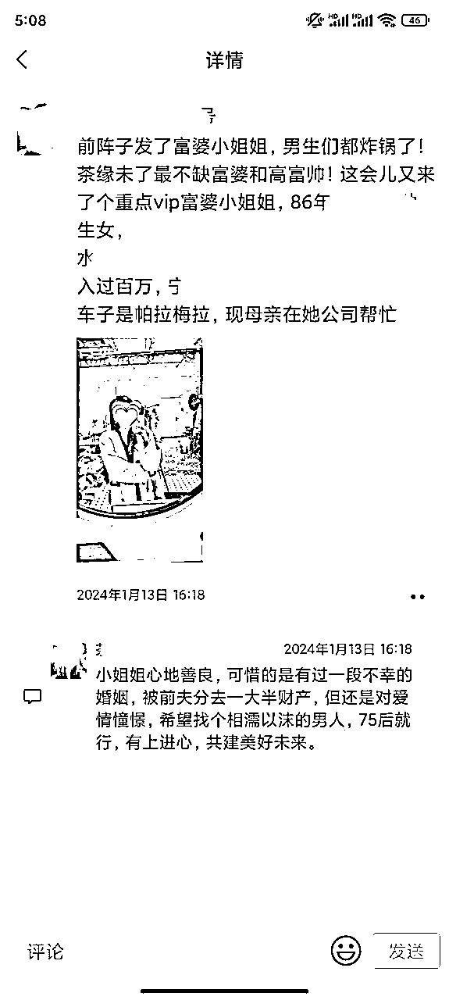
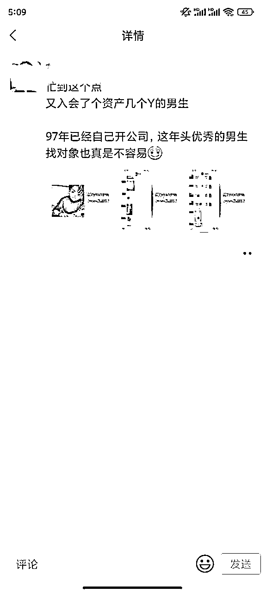
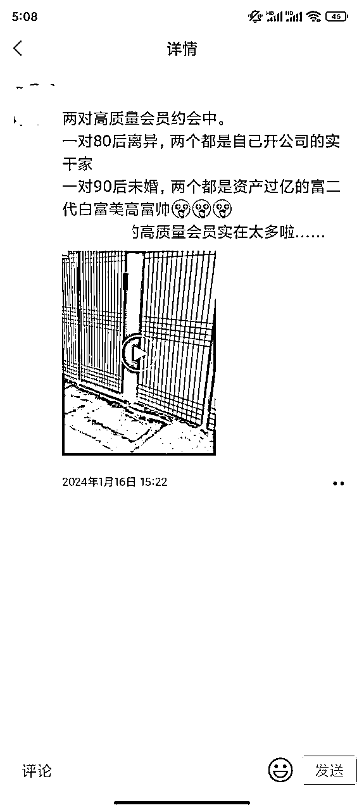
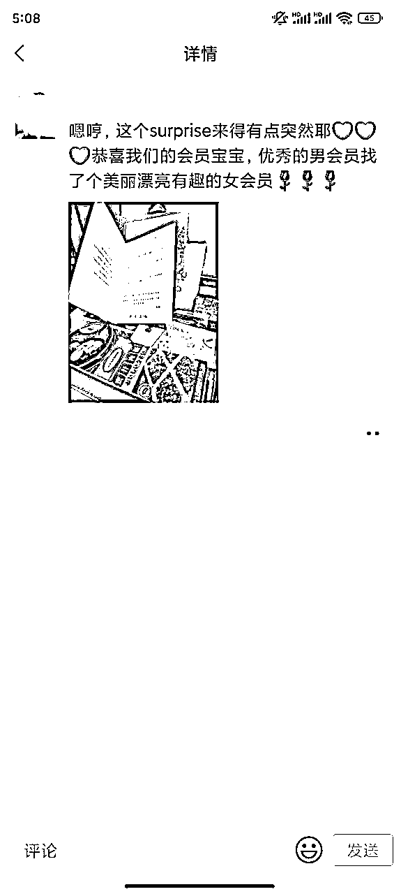

# 如何实现线上线下模式结合做到一个月600w利润

> 来源：[https://fxx6d3i9bl.feishu.cn/docx/UKNSdMBMfo6KQNxy5bDcH6LrnDb](https://fxx6d3i9bl.feishu.cn/docx/UKNSdMBMfo6KQNxy5bDcH6LrnDb)

大家好，我是周婵洁，也是沐一。

这几天跟金坐老板意外聊起，之前做的一个茶室的业务，帮茶室老板运营整个实体客群以及策划，很有意思，今天打算复盘一下这样的业务，可能很多实体店老板有玩过，分享一下，希望能给到更多想要线上线下结合的老板们帮助。

大致分为以下几个板块：

1、茶室原有业务

2、客群转型

3、线上线下模式转变

# 一、茶室原有业务

先说一下背景，原先这家是一家比较常见的茶室，那么主要是以包厢费用以及茶叶费用两类型的产品。跟大家常见的茶室差不多，主要服务就是提供一个场地喝茶，有人要送伴手礼的话可能会带走茶叶礼盒。

但是当时经营过程中有几个问题：

1、好茶叶成本高，差的茶叶成本低，内行的客户一喝就喝不对位，外行的客户不是常客；

2、人力成本高，茶艺师需要两班倒的情况下，可能也会面临人手不够、需要很多兼职的情况；

3、来喝茶的客户，如果不是常客，很难第二次再上门，因为附近的茶室的环境、服务、价格差异化不大；

于是一家茶室在实体成本的压力下，客流与业绩不好保证，时好时坏，包厢空置率决定了利润的高低，且客户来茶室没有其他链接，不会容易有二次复购的想法；虽然现在有很多无人茶室的兴起，但是也只是省下来比较多人力成本；

当时只能用一句话来形容：不知道出路，不知道怎么拓客，不知道怎么拉高业绩；三无嘛

我当时接触到这位老板，也很意外，这样的模式，我都很担心，这家店能开多久，该不会没多久就要倒闭了吧，因为业务很传统，也没有看到可以增长的空间；

但是往往，有困境，就有转机。

# 二、客群转型

在传统茶室的模式下，虽然赚的不多，甚至可能没得赚的情况下，至少有那么一点客户，当时老板还比较外向、爱社交，经常也拉来了不少好友到茶室捧场；

当时呀，我们和这些客户聊天喝茶的过程中，就发现一个需求就是：好多人有相亲的需求，但是不喜欢父母催婚式相亲；自己也愿意出去相亲，但是相亲场合不知道怎么选，也不知道万一聊不好了有没有人能救场；带自己的好朋友去一起相亲吧，多多少少比较尴尬，不带吧，心里确实是没啥底；

这一下，感觉茶室有救了，我们在问过大量客户后发现，爱喝茶的客户多多少少有品质生活的需求，所以对另一半的择偶要求也高，这也导致这批客户大量单身；还有一批年龄大的客户，他们没有相亲需求但是他们的儿子女儿需要，传统相亲自己的孩子也不乐意接受；

于是我们结合这个需求，推出了第一个新产品：

*   12800元/位的相亲会员费，可进入独有的相亲系统

*   承诺1v1介绍3位高质量相亲对象

*   以及每次相亲的约会场地服务（茶室包厢、茶水、小吃）

*   每次约会都会有一次免费“破冰”陪聊（茶艺师，可以不要）

*   3个月价值32000的茶室免费使用（客户不会天天来茶室）

这个产品推出以后，结合茶室原本就是附近5公里的生意，本地人相亲跟老一辈看法上最大的矛盾也是想就近，不想要另一半的老家特别特别远；还有一个就是很多相亲平台是线上的，而茶室相亲是有实体，信任度与优质度上会感觉比线上的要好；

这样一匹配，私域营销以及运营跟上，第一个月就有20多个客户购买会员，由于这个产品成本全是原有茶室的固定成本，也就是说这个新业务基本是纯利，这个月就有25-26w的利润；

有了这个模式以后，服务会员过程中，发现很多人相亲很多次还不成功的原因：跟自己差不多的看不上，比自己好的人家看不上自己，比自己差的根本不见面；并且随着这块的私域营销做的越来越广，很多本地的单身客户也会找上门，会问有没有终身服务，服务到结婚那种；

于是就推出了第二个相亲业务的产品：

*   39800元/位的终身会员费，可进入独有的相亲系统

*   承诺1v1介绍8位高质量相亲对象

*   以及每次相亲的约会场地服务（茶室包厢、茶水、小吃）

*   每次约会都会有一次免费“破冰”陪聊（茶艺师，可以不要）

*   一年价值128000的茶室免费使用（客户不会天天来茶室）

*   可终身免费参与单身男女线下活动（50人以内的，婚后终止）

是的，我们直接开始组织单身男女在茶室进行线下活动，茶水、小吃、场地，都是茶室原有的硬件，空着也是空着，拿来做活动，每月1次，终身服务有了吧；那么小活动也会涉及到一些人员服务，这不茶艺师破冰这么多次了，做主持人也是绰绰有余了；

最绝的是，我们后面发现了这个小活动来的嘉宾确实很优质（毕竟门槛筛过了），于是也会微信上问某些客户，有没有推广自己业务的需求，没有找对眼的没关系，多一个广告位也不亏 ~ 对主办方来说，伴手礼的档次也提升上来了，不再只有茶叶这么单调了，客户交付感拉满；

转到3万的客单以后，差不多一个月有120多个从原有一万多客单补差价补到三万多的，有80多个直接付的三万多的客单；合计600多w利润；

# 三、线上线下模式转变

当时，前期基础人数够了以后，又发现一个问题，就是线下见面虽然很好，但是很多优质客户真的很忙呀，就会问能不能线上先沟通；

线上沟通，这不就有一点网恋哪个味道出来了，当时我们很担心，网上聊的好好的，一见面就不行了，这不是更折腾时间吗！

于是，从以前的1v1私聊，尝试转型出了一个单身男女相亲群，群名肯定没有这么土，大概就是这么个意思；

群里大家可以聊聊自己的生活或者业务，有看对眼的，私下问我们要资料，在进行匹配，我们也会做好预期管理；这个社群运营好了以后，一个是案例出的更多了，一个是朋友圈能发的素材也多了很多，线上通过私域的运营，又出了不少；

后期，前面有客户成功谈恋爱以后的，也会推荐他们单身的朋友，我们还会设置一笔小小的红娘费，这个就是交付以后再跟客户说的，所以客户很多也特别愿意帮我们推荐。

放几个案例吧，近期的：

现在这个茶室，已经开了八九年了，走进去还是常规的茶室，但是这块的利润确实吃得很香，这个模式简单分享一下，希望对想运营实体或者想运营私域的老板有帮助~