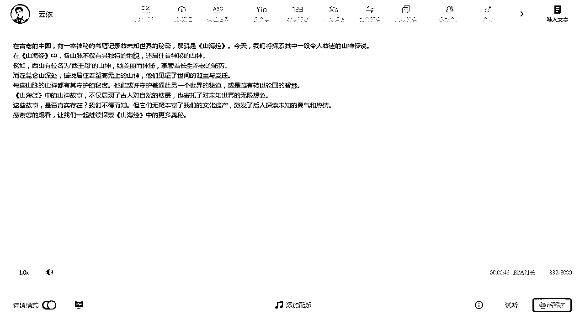

# 10分钟用AI制作山海经神话短视频，红利期赛道，起号优选

> 来源：[https://dik4wr1hyrw.feishu.cn/docx/UrXsdv8w7oWhGrxIhRVcj7AanWd](https://dik4wr1hyrw.feishu.cn/docx/UrXsdv8w7oWhGrxIhRVcj7AanWd)

闲来无事，刷刷小红书，看到了山海经神话故事视频，点开仔细一看都是AI做的，根据之前分享的文章，现在真的是各行各业都离不开AI了。

AI神话山海经神话短视频赛道现在入局的并不算多，也是红利期，对于起号还是有优势的。我们随便看一个视频点赞都在1000以上。

废话不多说，我们也来试试能不能做出这类的短视频。视频原理：输出故事脚本+AI绘画+配音+视频剪辑合成

## Prompt

你知道【山海经】这本书么？罗列出所有章节。

请帮我将【山海经】四大部分内容，每个章节再细分出10个主题内容，并详细概述给我吧！

请帮我将【山海经】山神故事编写为1分钟时长的短视频脚本，需要的是叙述式讲解，能够博人眼球。

请帮我将【山海经】山神故事主题内容段视频脚本的画面，逐一生成3:4的图片。

## 输出故事脚本

说到故事脚本，第一想到的就是ChatGPT，我们先来确认下ChatGPT是否知道山海经。然后罗列出【山海经】每个章节吧！

我们刷的短视频基本都是续集更新的，那我们就让ChatGPT把四大部分细分出10个主题故事吧！

每部分10个主题故事已经搞定，我们再进行细分，先让ChatGPT编写【山海经】山经中的山神故事。

## 画面配图

故事脚本也有了，我们进行AI绘画，最简单的是用DALL.E，可以直接根据脚本画出图片。当然也可以用起来AI绘画工具，比如Midjourney，这里就不研究咯~

## 脚本配音

现在我们就要进行脚本旁白的配音咯~之前用过腾讯智影的文本配音，也还不错，今天还是用腾讯智影。把生成的脚步旁白复制到文本框，生成音频即可。

## 视频剪辑合成

我们打开剪映，把画面配图与配音都导入并拉入轨道。

点击文本，智能字幕，进行识别字幕。

现在我们根据脚本来进行图片显示时长的调整，切记我们在拖动图片显示时长时，字幕轨道一定要锁定，不然字幕也会移动。并对字幕文字的大小，显示进行调整。

我们再来每个画面进行转场设置，我用的叠化转场，效果还不错。

当然，也可以增加一点特效，全部搞定后导出视频。

## 如何获利？

一，小红书接商单，其他平台也可以有广告分成等。

二，进行视频带货，比如【山海经】书籍或者周边等。