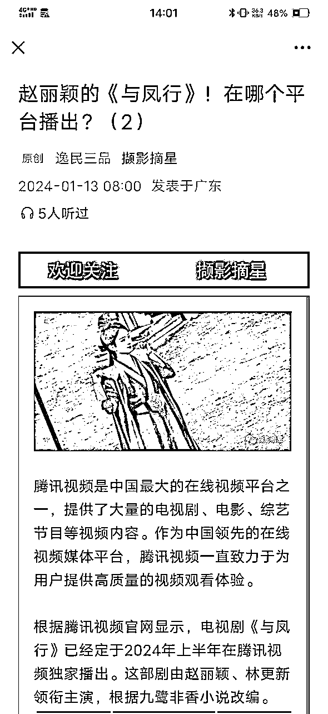
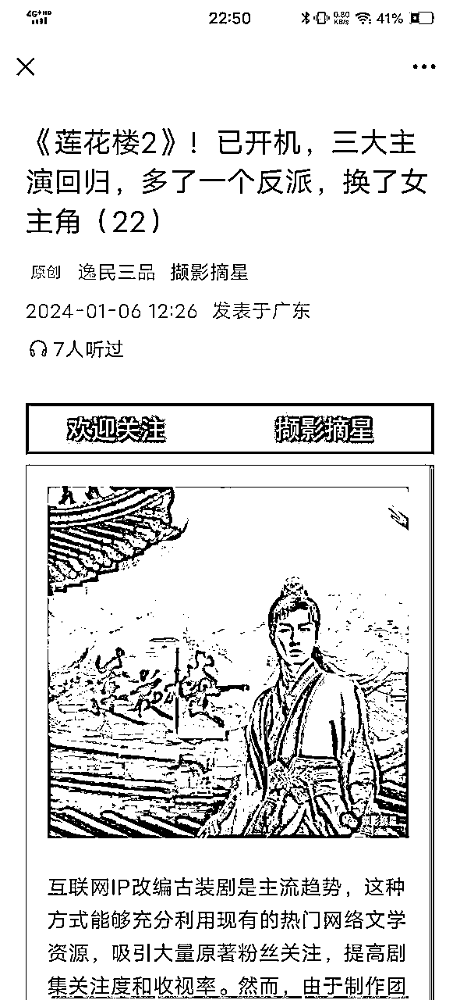
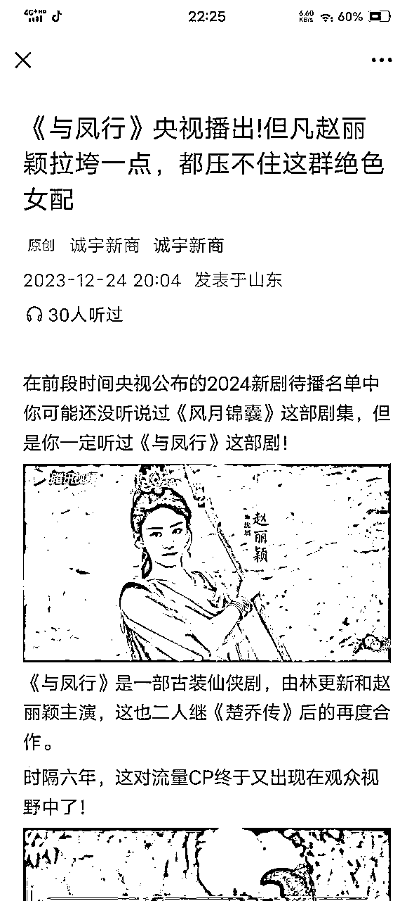
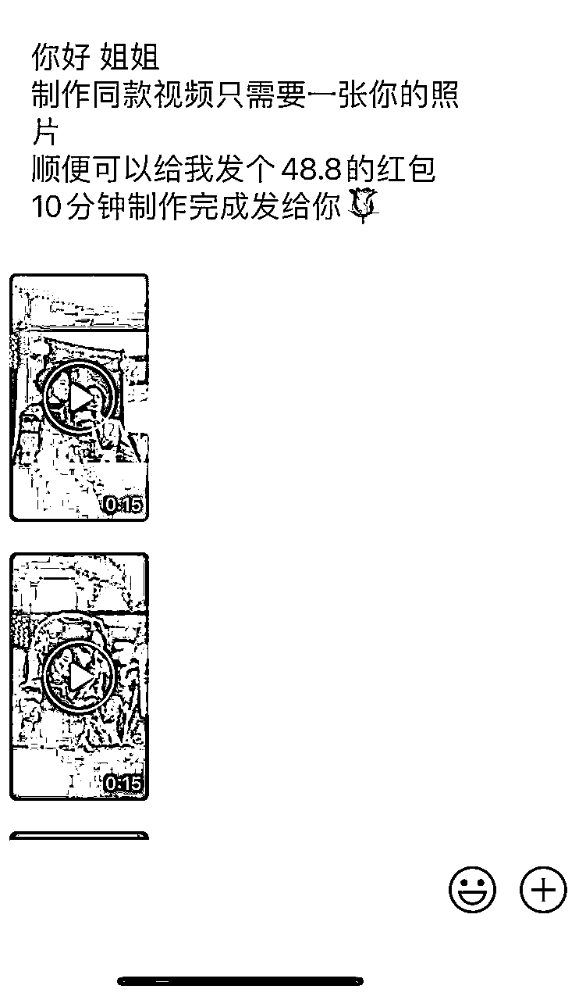

# 如何做一个赚钱的剧评公众号?

> 来源：[https://gd7vhxq16l.feishu.cn/docx/WznBdHWTUovPlZxrr4sc7yd4nxc](https://gd7vhxq16l.feishu.cn/docx/WznBdHWTUovPlZxrr4sc7yd4nxc)

圣贤说母慈子孝

这是母慈子才孝

不知狗头嘴脸的姨母

三天两头来摆臭架子充老大

这不要脸各有各的花样

更有那装傻充愣的

奔丧都没这么勤快的

我告诉你们黑心肝的

你们若不肯平安地过

自然有不平安的 等着你们

这是知否里的一段经典骂人话，狂喷康姨妈，这块儿简直就是观众的嘴替！妙语连珠，一针见血！护了顾廷烨最爱之人，同时打击了顾家大娘子的气焰。

也是我做剧评开始觉得有意思的一点。

大家好，我是亦小亮，作为公众号爆款写作航海教练，我想分享一下关于剧评这个领域跟我有大半年了。

为什么选择剧评?

怎么会选择剧评这个领域?

剧评到底好不好做?

剧评该怎么做?

选择这个领域来做公众号爆款写作，既是实属无奈，也是战略得当。

当6月、8月航海，大家都在前仆后继的去用AI写情感领域，名言名句、养老金的时候，我试了一个星期的情感领域，既没有得到收益上的安慰，也没有得到做这个项目的开心点、成长点。

索性放弃这几个热门领域，换个领域，思来想后，自己比较喜欢追剧，无论美剧、英剧、韩剧、日剧、国内剧，也不管什么类型悬疑、喜剧、科幻（黑镜、）、奇幻（权利的游戏）、僵尸（行尸走肉）、脑洞剧（死神来了）。

做着做着，发现国内一些爆款剧、经典剧，挺洽流量的，当然经典剧和爆款剧，两个类型的流量不同，前者是慢而长，后者是快而短。

想到我写了一部经典剧，一个月后才拿到第一个10w+的流量，为此还在生财发过。

慢慢一个账号起来了，就起两个，三个，就用这个战略，换了另一个蓝海领域，这个战略其实就是。

一般都容易认为“如何竞争”是长期的计划，可是竞争战略教材却是完全相反的想法，也就是考虑在长期的时间里，如何才能避免竞争。

这样就规避了这些因为强烈竞争带来的不良后果。ecpm低了，推荐少了，读者厌了。

战略对了，路就大步流星走着，这半年下来，也验证了这条路这个战略是对的。

说完这个战略，咱们来详细说说每个人拥有一个剧评号的长期性。

为啥长期性？

（1）这个领域，完全不缺素材，每天源源不断的素材，真的取之不尽用之不竭，也不缺话题和流量，不像一些领域，来来回回就那些，比如养老金、体制类等领域。

（2）风险相对律例、体制、职场薪资低很多。

（3）单价也会在一个比较高的范围内。

（4）最最最重要的是ai不容易进来，可以说是留给手搓的人的最后一些机会。

我们来看看如何运营一个剧评账号，保持长久？

## 一、账号类型

1、一部电视剧一个账号

尽量不要一集写一篇文章，这样容易平庸，而是找大场面、精彩剧情、重要出彩的主配角，比如天龙八部里，萧峰几个名场面：少室山大战、聚贤庄等等，当然还可以拿5个版本名场面做对比。

至于经典剧的选择，甄嬛传、亮剑、知否、大宅门、父母爱情等等。

每一个剧都能挑大梁，就看你的功力深不深厚。

而热播剧，比如近期的与凤行，和网飞的三体。

经典剧和热播剧的区别就是前者流量来的慢、稳，后者快、准，没有谁不好一说。

这类起号的内容，可以讲剧情，也可以把这部剧的演员，之后演过什么，拿来对比。

2、一种类型一个账号

比如悬疑、古装、动漫、港风（动作片、喜剧片、武侠片）、历史剧（故事、人物、野史）。

我看悬疑的有不少，还有美剧和英剧的写手。

一些国产热播剧，像写庆余年、繁花的也不少。

3、一种就是包罗万象

俗称影视什么什么，这种就是紧追热点剧，典型的就是毒眸，Sir电影。

4、一种就是人迷类账号

只写自己喜欢的明星出演的剧，或者导演，一个或者多个。

六神磊磊就是紧紧抱住金庸的大腿。

## 二、内容体裁

包括图文、图片集（小绿书）、短视频（影视剧解说、图文转换）。

## 三、内容选题

1、剧情介绍

具体可以到经典场面，刚才上面讲到经典场面，还有背景音乐附带的场面。

2、人物分析

对于电视剧每个角色深度刨析。这种就是剧里人物和演员的分析，封面也很吸精。

3、演员演技

上升到男女角、配角、老戏骨等等，都可以拿来讲。

4、心灵鸡汤

电视剧折射出的人生道理。这块配合你其它号做的，可以提供素材，相互渗透。

5、电视剧资讯

什么时候播出，什么电视剧谁担任男女主等八卦消息。

6、电视剧豆瓣评分

烂片排名、好剧排名，都是可以写的，一般流量挺高的。

7、电视剧得奖

比如金鸡奖、百花奖等等。

8、其他

根据具体影视剧具体分析，比如你写甄嬛传，就可以写点历史，这个朝代的真实情况，和剧里做比较。写知否，你可以写写这个朝野的动荡。

下图就是踩韩剧捧国产剧，话题拉满。

9、回忆杀

这个可以反复蹭流量，就是8090后以前看得剧，太多了。

像国内的寻秦记、大唐双龙传、武林外传、家有儿女、仙剑系列，还有更早的

韩剧有悲伤恋歌、爱在哈佛、浪漫满屋。

日剧有一公升的眼泪、龙樱、麻辣教师、铃木老师、东京爱情故事等等。

## 四、爆款标题

1、关键词：剧名、豆瓣、差评、央视、主演名字。

2、女一，女配颜值对比

3、情绪：好奇、失望、人迷

4、剧排名，比如年度排名、热度排名、收视排名等等。

5、倒计时，就是剧还有多久开播，每天一篇。

6、两部剧的对比，杀伤性很强。

7、其他

总之：做好剧评方向要始终坚持贯彻执行三点：

热点、经典，情绪点。

最后我们谈谈剧评领域的变现方式和注意事项。

一、变现方式

视频会员

夸克网盘拉新

电视剧ai变脸

二、做剧评类账号几个注意事项

1、图片版权问题，这个只要使用剧中营销宣传的图片，就没事。

2、如果你特别想用AI写，一定要注意别张冠李戴，我就才开始吃过亏，被投诉了。

3、选择剧的时候，一定选经典剧和爆款剧，不要选一些你认为好的，多看评分和热度。

4、剧情分析这块，对一些没有写作能力的人来说，有点难，但是也有一些好办法。

我是亦小亮，如果你也喜欢追剧，欢迎一起唠嗑搞钱。

关注【宸叔的研究所】，了解更多公众号信息与技法。