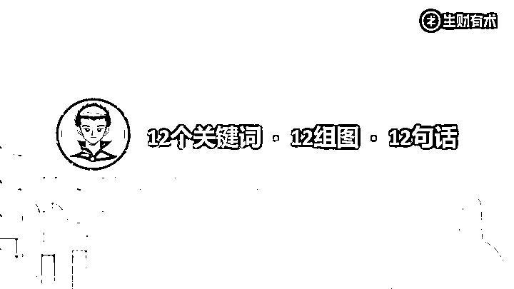
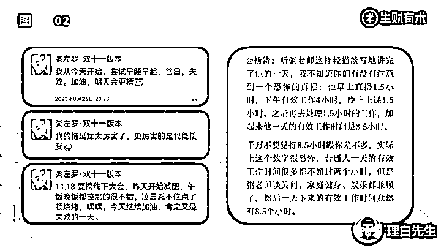
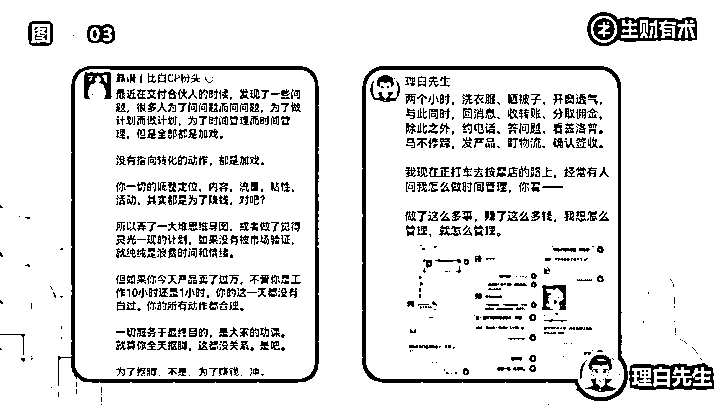
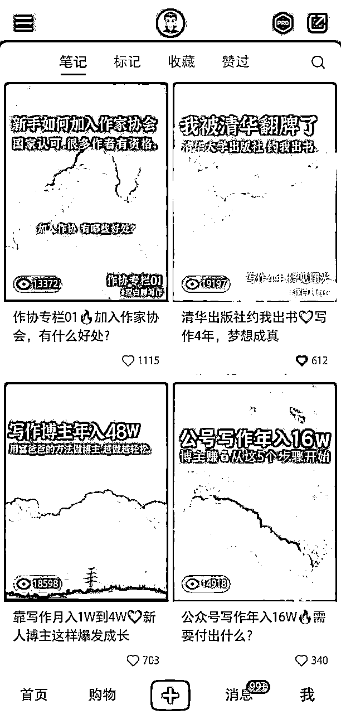

# 主业医生，副业互联网，如何利用4小时下班时间，撬动300%精力，实现7位数营收

> 来源：[https://fcjmogm9bc.feishu.cn/docx/VqDLdZxsLo8TGVxBhx7cpPGvnce](https://fcjmogm9bc.feishu.cn/docx/VqDLdZxsLo8TGVxBhx7cpPGvnce)

大家好，大家好，见贴欢喜，我是航海家俱乐部的理白，也是生财福建圈友年会的分享嘉宾。本月初，众星聚拢、宾临城厦，从主办方到志愿者，细节拉满、诚意满满、情得意满。

当天往返厦门，途中惊喜地发现，我演讲中的“命最重要”、“跟渣男学时间管理，跟舔狗学目标管理”等PPT，造成了很多圈友小范围的刷屏，甚至还有好多非福建圈友辗转加到我，跟我要我分享的PPT和逐字稿，那我想，也许这次分享，确实给不少小伙伴一些启发，也能够帮助一部分总是被ddl追着屁股跑，时间不够用，工作副业生活都想兼顾，但力不从心的小伙伴，提供一些降本增效的方法论。

那么，我将我的分享稿，用书面语重新梳理了一遍，配上我的PPT，全部送给生财圈友。

今天的12 个关键词、 12 组图、以及 12 句话，构成了我今天的分享主题。

# 1、时间管理

理白本职工作是医生，本身上班是八小时工作制，还有门急诊值班甚至上手术啥的，每天除了睡觉吃饭时间，可能就不剩几个小时。

但我依旧可以利用摸鱼时间、闲暇时间以及下班时间，稳准狠且能不断持续获客高客单用户，经常一天过去了，活没干多少，但是营收好几万甚至六位数。

可能很多人对时间管理会有个误区，会觉得我们时间管理就是做计划，就是不断地去设想下个月要干什么，我下个周要干什么，我明天要干什么，把计划列到每一分、每一秒。

但实际上，复盘比计划更重要。与其问时间要怎么用，不如好好的想一想，时间花在哪。

这个时间花在哪，该怎么计算呢？

很简单，每天晚上睡前做一个统计，比如说，我把我的时间分成了：休息时间、娱乐时间、专注时间，以及睡眠时间，还有就是，比如说发呆的、刷短视频的这种无效时间。

区分出来之后，做了一个饼图，就可以分析出我的时间花在哪。

知道了时间用在哪里，就可以有的放矢地，掌控自己的时间了。

# 2、目标管理

很多小伙伴对目标管理也有误区——

*   有些，用了非常多的时间管理APP，但是光管理这些APP，就得花个把小时的时间，最后把时间浪费到APP的完成率、精美度上面，得不偿失。

*   有些，明明有自己的主线课程，还非要同步做一个打卡营，做了打卡营不说，这个打卡营又没有任何收益，和我沟通过之后，决定扔给自己的男朋友去做，但是男朋友也是人啊，好男友要用在刀刃上。

*   有些，执拗于每天完成计划和打卡，不搞完不睡觉，或者搞不完就彻底崩盘驮着，最后身体搞垮了，也干啥啥没成。

当我们知道时间用在哪里之后，其实需要去做的一个准备，是要知道目标是什么。

大家看一下这组图，左边是我很崇拜的嘉宾粥左罗老师的朋友圈，右边是杨涛老师和粥老师的一段采访逐字稿。粥老师是我做事的偶像，涛爸是我做人的偶像。在这里用这两个偶像的这样的一段对话，是想要说明一个观点：自律不是标签，而是习惯；自律不是目的，只是手段。

所有不以目标为前提的动作设计，都是耍流氓。所以，咱们在设计路径的时候，一定不要给自己加戏。围绕着目标，我们要去做关键的，有价值的事。

# 3、结果管理

当你知道自己的结果是什么的时候，你就自然有能力去倒推你的过程。

前几天一个客户找到我，说最近除了做项目，还想做IP，除了做IP，还想做社群，除了做社群还想做成交发售，我说你一个人同时做这么多的事情，第一你的精力顾不过来，第二同时做很多事情就很难把一件事情做透。

其实最好的精力管理，就是别接那么多活儿，别做那么多事儿，为结果服务，只做好自己最核心的业务，与之无关的自我介绍也好，标签也好，产品也好，内容也好，通通砍掉。

当你只专注于做好一件事，你会发现这件事情你做透了，慕名而来的高客单价人群变多了，你变得在一个领域更有话语权了，同时你的流量也更精准了，而这部分精准流量，在面对其他产品需求的时候，你可以通过与人合作分销的形式，占到一笔不菲的分成。

这就是我经常提出的IP簇的概念。

有的人擅长成交，有的人擅长流量，有的人擅长内容，有的人擅长产品，而一个好的IP，要知道自己更擅长的部分在哪里，和别人进行相应的组合。

结果管理，有三个原则：

## 第1个是不要从众。

不要说别人做了一个什么产品，我也要模仿，不要说别人用了哪种形式，我也要参与，别人适合的不一定适合你，别人跑通的，自己可能存在先天的资源缺陷或短板。

因为很多人在介绍自己的产品模式的时候，更多的都会夸赞自己或夸大自己，有的时候一些隐藏的坑啊，一些必须要解决的核心资源问题呀，是被忽略的。

## 第2个是核算成本。

我记得年初的时候。很多人模仿我和靠谱，做年度陪伴交付式社群，最后把自己活活给坑死了，不是很多人都能像我们这么能熬的。

也有很多年初的时候信誓旦旦说要做一个付费星球的，请了很多人来背书，要么就做嘉宾，要么就帮忙分销，结果更了不到两个月就不了了之了，搞得付费的客户被鸽了，帮他分销的大咖为他背书过，也有点里外不是人。

同样的，最近不知道从哪开始突然刮起一股做免费星球的热度，到处有人花重金买到免费邀请码。

你像我做免费的星球，我是有自己的成本控制和未来愿景的，这是在为我未来出书做铺垫以及其他的一些核心规划做铺垫。

因为我的新书已经过了二审了，要提前开始预热，所以拉一个新的触点更多的流量池是非常必要的。

但是如果不明真相的小白觉得也可以开一个免费星球，然后迅速让它冷却掉，这不止浪费了一个邀请码，也浪费了一次用户对你的信任度。

在一个长期拿不到正反馈的事物上，一个人是很难坚持下来的，除非是有长远布局。你想想，你做一个付费星球收不到钱，做一段时间都停了，做免费星球能坚持多久呢？

所以说呀，不要人云亦云，不要看到什么都想给自己加点戏。

## 第3个是想清未来。

我们做一件事情，一定要想到这件事情能够带来的正向收益是什么，如果与自己的核心产品线无关就不值得做，要么呢你就培养客户粘性，要么呢就能够提供转化基础，要不呢就是通过交付这件事情，能够为未来的低转高提供更好的台阶。

如果这件事情没有任何正向收益，成本又很高或消耗很多时间，这件事情就不要轻易去尝试。

核心业务成交量，就是你的尊严，重要板块完成度，就是你的底气。当结果跑正的时候，你就可以说：我有底气，我有尊严。

# 4、路径管理

围绕着这个结果，我们自然就可以倒推另外一个关键词，叫做路径。

在我自己的群里和靠谱老师的群里，我们都会经常性地会说一句话：你今天赚到 2700 了吗？

如果你今天没有赚到 2700，是没有资格水群的。

大家知道 2700 是什么吗？ ——是年入 100 万的路径拆解。

如果你想一年赚 100 万，那它的标准就是一天要赚到 2700，你就要围绕着这一天如何赚到 2700 去做你的计划安排和管理。

很多时候我们会吃很多种苦，所以吃什么样的苦这件事情很重要，以及在吃苦的过程当中，路径是什么也很重要，因为我们的路性一定是围绕着一个波段去有升有降，但如果你总在消耗自己，路径就一定会跑偏。

咱们大家做内容的主要目的，都是为了引流成交变现，所以时间成本都很值钱，能够压低这个时间成本，真正实现降本增效，哪怕每天省20分钟，都可以让自己把更多精力放在更宝贵的业务上。

那我具体是怎么操作的呢？

答案就是三句口诀：

内容输出，自己干，

素材分发，团队理，

封面设计，助理做。

## 第一，内容输出，自己干。

首先就是日常的输出本身就要跟上，相信每一个做知识付费交付的小伙伴都会面临大量的输出问题，那么如何实现一鱼多吃，就是要把你的每一次输出，都能尽可能多地释放在不同的平台之上。

你像我，日常要发满6条朋友圈，每条朋友圈至少就是200字打底，每天会在我的社群里边做30分钟的加餐分享，会沉淀一个又一个的风向标和搞钱干货。

那这些内容输出出来，如果不加以利用，就浪费掉了，所以呢，我把它每一次的输出内容都会刻意地进行相应的截图和规范，沉淀在我的素材库里。

## 第二，素材分发，团队理。

然后，我的内容团队会把所有的内容打好标签，分门别类放在不同的库里，这样子，方便我在发布小红书之前，调取使用我在发布小红书之前，只要找到这些素材整理一下，就可以截图形成一篇篇笔记的正文部分。

有团队的小伙伴可以参照我这样的模式，搭建自己的内容库，没有团队的小伙伴也可以用打标签的形式，形成自己的知识管理体系，这便于我们未来，去反复利用我们的内容结构。

## 第三，封面设计，助理做。

紧接着在封面设计这个环节，我会专门找一个已经适应了我的封面模板的小伙伴，给他提供素材和标题，然后小伙伴会批量为我制造封面，我只需要每月给他发一笔固定工资就可以了。

我们都说，做内容，小爆靠勤，中爆靠德，大爆靠命，所以这样的方式：

一是让我们不用再为灵感发愁，有一个稳定的输出内容来源，

二是降低了我们设计封面，琢磨文案，想排版的成本，让我们永远有最高效的发文，

三就是这些内容可以不断去触碰不同的关键词和长尾词，进而改变我们的内容发布方向，还可以倒逼我们改变朋友圈和社群的内容输出方向，形成一个正反馈循环。

无论你是做什么样的平台，都可以参照这样的降本增效逻辑。

最妙的一点是，因为我的小红书内容全部都是我的社群截图或朋友圈截图，我的转化意图会更明显，每一个关注到我的小红书粉丝，都会默认我的朋友圈很精彩，默认我有一个付费群，所以引流过来的人，大概率会在24小时之内直接询问我的产品线，减少了很多沟通成本。

当然，大家的流量获取通道，是可以微调的。

比如，有的小伙伴适合做精准内容引流营销。

比如，有的小伙伴适合在社群内做群红引流。

比如，有的小伙伴适合在直播间做用户沉淀。

找到自己更擅长发挥作用的引流池，并持续降低成本，增加时间利用率。

而后，就能所向披靡。

# 5、定位管理

最开始我给自己的定位是自律教练，比如帮助一个人自律考研、自律成长、自律写作等等，那时候，大多数学员都是学生，我的客单价在1000左右。

但后来，我开始接B端的线下培训，一场一万，我开始给小微创业者和自媒体人提供精力管理私教服务，客单价3W，同样都是一套思维方式和交付体系，因为客户群体的不同和认知的不同，我的价值放大的程度，也会不同。

我举一个我们圈友的例子，也是厦门的一个美女叫彩卉，她是我们今天的会场主持人。彩卉的定位经历过一段变化，她原来是帮助小白从 0 到 1 做一个付费社群，现在的定位是帮助已经有产品的大佬操盘群发售，一下子就获得了新的机会和赛道的想象力。

我前段时间在生财发过一篇跟精力管理相关的帖子，很多小伙伴找到我私聊说，没想到一个人的时间颗粒度可以这么细，原来真正的时间管理是这样子的。

我说基础的认知谁都有，难的是执行，比时间管理更重要的，是精力管理，因为这不只涉及到时间的切割和使用，更涉及到抉择、成本、情绪、能量等多个维度的统一。

就拿目标管理这一分支来说，都知道最终的结果，但是路径又有很多，有需要依赖的路径，有需要破局的路径，更有自己还暂时想不到的路径，创业也好，上班也好，难的并不是在对与错之间做选择，那个不用选，也不是在错与错之间做选择，那个没得选，而是在对与对之间做抉择，因为这背后牵扯精力管理。

所谓定位思维，就是在对与对之间做选择，知道自己想要什么，有一条清晰的路径，然后用一套可供执行的方法论去推进，事儿就比较容易成。

找到自己更擅长发挥作用的引流池，并持续降低成本，增加时间利用率。

# 6、闭环管理

越早打造自己的项目闭环，也能从单位时间边界成本的损耗中解脱出来，借由系统的力量实现更大的价值。

我会给大家举三个例子，全部来源于厦门年会的现场。

## 先说产品维度

### 案例一，咱们生财自己的例子。

生财的这个产品线，第一个层级为星球会员，它所配套的所有的航海、风向标，其实是围绕着生财星球搭建的。

而航海家俱乐部，是在星球之上的第二个，它解决的是创业者信息差和资源差勾兑的问题，是陪伴的问题。

在亦仁哥的倡导之下，微天使投资、大天使计划、赛道合伙人构成了更高的层级，解决的就是十倍增长的问题。

我认为，精力管理的本质，也是解决十倍增长的问题，即在现有的业务模型当中提炼出有可能十倍放大的部分。

### 案例二，咱们厦门年会的赞助商，黄总。

黄老板有一座茶园，他把那些茶园承包给了不同的超级个体，而这些个体又可以用茶园来赋能他们的用户。

### 案例三，圆桌嘉宾，张可粒。

可粒作为女明星，是一个非常率性的洒脱女孩，基本一年当中有一半的时间在旅行，但她的游学群，每时每刻都在交付，旅行和生活本身，就变成了她的赚钱方式。

## 再说流量维度

在产品这个维度上做足减法后，在流量的获取一定有其背后的原因。

### 比如说生财的流量，我认为最重要的一个板块叫做“共识”。

甚至可以说整个知识付费行业为什么会赚钱？还是因为“共识”。什么叫共识？就是所有人都说它有价值，这个叫共识，所有的KOL、KOC都在互联网中发出一个声音叫做：“生财有术，是有价值的，大家快来吧。”

那生财有术，就因为这些声音产生了一个共识。

### 黄老板的例子，我认为它的流量获取的关键词，叫“身份感”。

所有的人，因为我可以把我的 logo 和标签赋能给我的用户，所以我拥有了这个身份感，因为身份感获取了流量增长的可能。

### 那么可粒的例子，它的流量来源，是“美好生活的向往”。

因为我想成为跟你一样好的人，所以我愿意为了靠近你，而付出一些我的代价。

这就是不同的产品模型所产生的流量获得的可能性，而在交付层面上，每个人因为其不同的可能性，就产生了足够可以让自己边际效率递减的交付模式。

在模式这个层面上你想的多一点，会比在执行这个层面上做得多一点，更有利于提高我们的效率提升。

# 7、用户管理

用户管理的问题，是一个很细的，大家非常需要的话题。

我认为，普通的、基础的时间管理，是管理自己的时间，但更复杂一点的方式是：管理用户的时间。

我会清晰地让用户感知到，我什么时候是有空的，什么时候是没空的。

很多时候，我们做时间管理为什么做不成？特别是有主副业的同学，就是你既有主业又有副业，为什么可能会出现时间不够用的情况？是因为你的时间总是被打扰。有可能就是本来我决定聚焦专注了，按了番茄钟，但有一个不得不接的客户或者老板的电话要接，那就没办法做到绝对专注。

而如何管理用户的时间呢？

## 第一，重复的构建你的价值边界。

你所有的输出内容都是在告诉用户，我要用一种什么样的价值观跟你相处，这样的价值观会让用户尊重你的时间。

## 第二，设置可以被邀约的时间，就是在变相地空出自由时间。

我以前做过一些公众号的主编，当我去约稿的时候，我一定会要求“你一定在星期六的晚上8 点-9点之间投稿，哪怕你提前写完了，你也不要给我，我默认这个稿子没收到”。

我会给所有的作者传递这个信息，所以对我而言这就是一个很清晰的管理，就是在收稿这个层面上，我只在星期六晚上的8点到9点之间工作，其他的时间我不管，你要配合我的时间。

## 第三，不断建立用户的正反馈机制。

比如说，我的付费用户如果私信问我一个问题，我可能会回答他2-3条的有效信息量，但是他一定会发现，他如果在群里问我同样的问题，我回答的起效量会超过 3 -5 倍之多。

也就是说，我的用户会越来越发现，在群里问你问题，会得到比基础答案还要多 3- 5 倍的更多的答案，这样的话，我就可以让更多用户主动选择在群里向我提问，我的一对一时间就可以被稀释掉了。

# 8、信息管理

信息管理，是我自己摸索了多年所掌握的一套特种兵式作战方案，咱们看图说话。

## 微信页面管理

左图是我的微信主页面，日常就是信息量很少的状态，因为我手动隐藏掉了无用信息。

这样的无用信息屏蔽，需要我们日积月累，养成一个习惯：随时随地“隐藏”无用信息。

何为“无用信息”？

已回复且无需自己关注的信息，就是“无用信息”。

所以对我来讲，我要做的日常动作，就是在每天晚上睡前，隐藏我认为已经处理完的信息。

那我的页面就会非常干净——只要某条聊天记录暴露，它就一定是我没处理的，因为我处理了它就会被我隐藏掉，那我就可以动态的在我的手机聊天主页面，完整地掌握我的信息处理速度。

这就是我对信息的基本管理。

## 群聊分区管理

我对群的管理可能跟大多数人不太一样，我不会把“置顶”当成一个重要的区间，因为你会发现，置顶的内容多了，其实也是会有折叠的。

所以对我而言，置顶区起到的是“信息流”的概念，我要求这部分信息当天能看到，但是看到之后我不希望他继续打扰我，所以置顶的内容，因为自带折叠功能，只要点一下，它就自动消失了。

而主界面的非置顶、非折叠区域的内容，是我一定在今天内回复完毕的内容，那就必须在当晚前处理完毕。

折叠的社群，不代表它不重要，而是代表我要定期去回看，一般针对折叠的群聊，我会隔一周的时间全部回看一遍，看看有没有错过啥，如果一个折叠的社群反复几次无法带给我信息增量，我就会退出这个群。

## 用户标签管理

我的所有的好友，全部都是像右图这样标签的，并会自带一些描述，有好的有不好的，因为，修炼屏蔽力就要解放自己的大脑，大脑要用来想战略重要的事儿，不能用来记忆一些不重要的人和情绪。所以，这个人的基础信息，哪怕是和自己发生的交互关系，哪怕是是否得罪过我的这种信息，我都会如实记录，在未来的某一天把这个人删掉。

现场提问：那我为什么不立刻删掉他？

理白作答：因为如果这个人当天他对你产生了冒犯，而你当天晚上就删掉他，他一定会知道你是因为这条内容删掉他的，他就可能会举报你。所以我隔 3 个月之后才删掉，咱们的微信是很宝贵的，我不希望有任何的负面舆情出现，所以我要让这个用户不知道自己什么时候被删了。

## 日常运营管理

给大家随机分享理白的一天。

### 第一件事

摸到手机的第一时间，把从昨晚睡后到现在的所有消息全部回一遍，处理掉的就隐藏掉，没处理掉的就打好标签、定好时，保证事事有回应，不错过任何一条内容。

这样，你的手机聊天主页面是绝对意义的干净，你永远知道自己的待办事项在哪里。

### 第二件事

通过从昨晚到现在，所有的未添加好友，有的是在其他社群做分享加来的，有的是小红书和公众号关注来的，有的是其他合伙人推名片的，每天基操是50个，偶尔有爆量，一天有300多个，就需要分好几天慢慢通过，保护账号。

然后，就是发见面礼、送福利、打标签备注来源和基本信息，提醒对方加入免费星球，别错过每日的干货分享。

### 第三件事

回复养生群里所有客户的购买信息，核对订单，完成发货，准备抽免单的福利，以及拍单后三个高能量社群的赠送。

### 第四件事

与私塾客户约定1V1语音沟通时间，破除一个又一个卡点，就能所向披靡。

这样基础问题标准课解决，陪跑问题交付小群解决，卡点疑难问题语音通话解决，确保每一个客户，得到个性化的，有针对性的长期主义指导。

### 第五件事

在星球进行每日干货输出，同时查阅行业动态，准备晚上在付费星球＋社群，进行内容输出。

以上，时间管理大师理白学长的一上午，仅仅耗时40分钟，可以完成所有操作。

这就是构建信息系统的价值，既能屏蔽杂音，又能屏蔽情绪。

# 9、精力管理

细节的部分说完了，我们再说一些宏观的，精力管理的部分。

## 首先，是一些基础精力认知。

### 一是睡眠

充足的节律睡眠+轻量级的午睡，是支撑生命质量的基础。

### 二是营养

基础营养素的充沛摄入+摄入适度的控制。

### 三是运动

基础运动量的保持。

## 其次，是一些个人管理系统。

*   比如所有衣服，加起来不超过10件，除了一两件贵的重要场合穿，其他的都是地摊淘来的便宜货，穿个几个月，就可以扔掉或者捐掉。

*   比如我的微信，一共才一万好友，每天习惯打标签，每天习惯删人，相册里的照片不超过100张，随发随删，就这样，也靠这个破破烂烂的旧手机，赚了7位数。

*   比如以前出门，因为要写作，还需要带电脑，现在有了讯飞输入法，一部手机＋充电宝，就能承接90%的业务，出差顶多带一个小箱子，带着给朋友们的礼物就好。

*   哪怕是在社交场景中，需要我发声的局，我才会努力输出，不是我的主场，我就是个透明人，从不在陌生人面前卖弄我的知识，也不会过度消耗注意力。

*   去到新的城市，以前穷的时候会选择住在朋友家里，或者请朋友给我出攻略，现在直接订高楼层的酒店，也基本会婉拒朋友们的车接车送，就是我不想把太多注意力浪费在感谢、纠结，以及行进路途中的搭话上——不妨把碎片用来打盹或者回消息，等到吃饭的时间，或约好见面的时间，再好好聊天。

装作自己很懂社交，其实是挺累的一件事儿，所以，无论是在物质上，在环境上，还是在社交上，保护好自己的注意力，就是保护自己的生产力、生财力。

# 10、极限管理

在保证健康的大前提之下，我们有的时候会被迫出现一些极限情况。

比如，单位无法请过夜假，就是我的一个极限。如果要参加线下的活动，就必须当天早来，晚上晚走。

我是医生，是有日常的门急诊值班的，为了更好地平衡主副业，所以我在过年放假时间，主动申请值了4 天的班，把其他的周末班跟别的医生去调换。

这样做有几个好处：

第一是其他的医生他们可以过年回家；

第二是他们会觉得，我很好，然后欠我一个人情；

第三是过年期间本身病号就比较少，我可以把我的时间用在做自己的业务上。

所以，我的时间就是这样一点一点挤出来的，我认为，在极限的时间内，就是要去极限地处理一些问题啊。因为请不下假，所以可以做到赶最早的航班去飞到一个城市，见了面之后，再赶最晚那班航班回来，当天来当天回，是我的基本日常。

在极限情况下，我们是可以做出一些更有效率的选择，这也是我想说的，“尊重二八定律，相信天道酬勤”，因为当你真正知道想要的是什么的时候，你会为其付出自己的代价。

# 11、稳态管理

刚刚聊了健康，也聊了极限这一环节，要聊聊稳定性这个问题。

平衡=PlanB+SOP。

在时间的分配上，我们要学皇帝，因为他每个月的初一、十五要去陪一下皇后，然后要照顾到年大将军的情绪，所以要去陪一下华妃，和自己喜欢甄嬛也要经常贴贴，后宫前朝的势力都要平衡，所以你必须像一个渣男一样，去珍惜和平衡自己的时间。

而安陵容，我认为他是一个很会谋生的人，她的所有的技能全部都是围绕着这个男人（项目），死了目标，可以多线并行。

所以我认为，要跟渣男学时间管理，要跟舔狗学目标管理，搞反了就完蛋了。

# 12、框架管理

行至尾声，最后一个关键词叫做框架管理。

我会很有意识地在最开始就梳理出我要讲什么，带着大的框架，再结合现场进行微调，会更容易条理清晰地达成目标。

当你确信自己做的是对的时候，周期就战胜不了你，但理解周期很重要。

有了系统，你就知道规定动作在哪里，比如每天发满6条朋友圈、所有社群盯一遍、看完所有的分享，只要完成这并不影响主要业务和工作量，就知道，你的系统行动，一定可以战胜周期。

找到那件可以持续给自己带来正反馈的事儿，然后不断去重复这件事，建立sop，降低操作成本，在第一曲线上取得重要的结果，再去发展第二曲线，这是一个正常路径。

所以我会认为：“你的每一次内容输出，都是千锤百炼之后的肌肉记忆；你的每一次随机应变，都是身经百战之后的应对自如”。

# 结语

时间管理的核心是：

1、明确自己的人生目标，以目标为导向拆解实现路径和具体步骤；

2、以始为终，把好的精力和好的时光用在刀刃上；

3、不要自欺欺人的努力，鼓励高效自如的成功。

这就是我对每一个想要提高效率的人所作出的注解， 12 个关键词， 12 张图、 12 个句子。

祝愿大家，都能找到自己的十倍杠杆、撬动百倍精力，做时间的主人，生财有术，精力管理，亦有术。