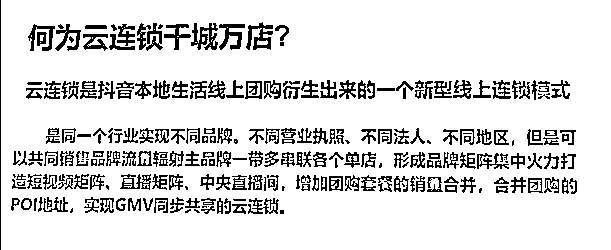

# 本地生活新模式——云连锁之打爆单店

> 来源：[https://ycgc2f717o.feishu.cn/docx/XNuTdXgPFoaGzixtK3ocz2OGnxg](https://ycgc2f717o.feishu.cn/docx/XNuTdXgPFoaGzixtK3ocz2OGnxg)

# 一、云连锁

你刷抖音是不是会看到一种团购套餐，直播间或者短视频链接的销量是几万，几十万，甚至上百万。

这是云连锁模式。

什么是云连锁。

云连锁是一个新型的线上连锁模式，主要通过抖音获取流量，实现不同品牌，不同营业执照，不同法人，不同地区门店通过主品牌串联，共同享受流量辐射，形成品牌矩阵。

这样做的好处是什么呢。

最直接能把所有店铺销量合并到单个链接，让用户更容易下单。

其次是门店统一运营，获取流量，降低运营成本。

这个模式美团时代就有，但现在抖音的流量更大，容易单店爆单。店铺承接不住，那就白白损失流量。

# 二、本地生活

从现有本地生活的终局来思考，大致可以分为几个阶段

单店模式，培训招商，连锁经营（云连锁），自营加盟，资本收购

云连锁处于第三阶段。

从阶段看，大钱是自营加盟和最后的资本。

我们先放下资本部分，这是可遇不可求，就像结婚一样，看对眼才行。

云连锁的意义是什么呢

个人认为，是可以低成本运营，快速拉升规模，建立势能，再规范自营盘，转到传统的加盟店形式。

怎么理解这句话呢。

云连锁优势在于可以通过打爆单店，造成流量外溢，把这部分流量分发给其他门店。这样就把竞争对手变成了合作伙伴。

如果单店能跑通，掌握了流量密码，就可以把核心能力无限复制给合作店铺。

作为合作店铺来说，不用运营抖音，不用拍视频就能获得用户。如果成本能支撑，肯定愿意合作。

为什么呢

因为线下商家的痛点是如何获取用户。但大部分商家不懂抖音线上运营。

所以就找代运营或者达人来帮忙宣传。但很多代运营很水，不能很好交付，无法达到商家预期。

如果店铺能低成本获客，就能【连接】其他店铺，快速铺大规模。

扩大规模后会面临联营店铺管理问题。就需要精简店铺数量，把联营店铺改变成自有品牌，形成强管理。也就是最终变回传统的加盟店形式。

云连锁起到的作用是：快速扩张规模、招商。

可以说，云连锁就是招商连锁的10X思维。

# 三、如何入局

那问题就回到开始：实体店商家想入局这个模式，如何做呢？

什么，你不想，你只想把店做好，赚点钱就够？

你店铺能有多少承接能力，一天忙到晚，也赚不到多少钱。

如果你隔壁同行开始运营抖音，可能短期内就会把你流量吸走。

你看着对方顾客络绎不绝，还有很多学员来学习。你觉得是你想不想的问题吗。

很简单，你不做，那别人做，别人不仅赚钱，还会吸走你的流量。

干掉你，与你无关。

所以，实体店商家就要往前走一步，积极拥抱新平台、新模式。

废话这么多，是想说清实体店利用抖音获客是势在必行的趋势，是生死问题。

那如何开始第一步呢。那就需要先跑通单店的盈利模式，引爆店铺流量，

只有单店跑通了，才能接着做后续的步骤。

下面我们正式进入正题。

先说说抖音对于店铺经营分的评判标准

以上5个板块获得60分曝光量将会增加5倍，如果做到90分以上那曝光将会增加19倍， 业绩会增长31倍。

作为店铺，能拿的分数一定要拿满。

今天这一篇，我们重点说说第二部分：内容分。也就是店铺视频如何发，怎么发才有效。

可以从三个方面来做。分别是：为什么发，发什么，如何发。我们一个一个说。

### 1.0 为什么发视频

说一个实体店老板更容易理解的比喻。

你把发视频看做是发传单，传单的目的是让更多人看到店铺信息。

短视频跟传单是一个性质。

一个播放量＝一个传单

那就可以理解为：多发视频，就能让更多人看到，那账号矩阵化就是多请几个人来发。

这是为什么发视频。

老板们最头痛可能是：内容。

一天店内事情都忙不完，没时间去拍视频，剪辑，发布。

那如果有一种方式，速度快，不麻烦，还有效呢

是不是就能实操落地。

往下接着看

### 2.0 发什么内容

想要视频内容效果好，有三大核心

内容吸引，标签精准，大量分发

#### 2.1 内容吸引

我们的目标是吸引同城用户，那就需要制造同城话题。

发什么内容可以吸引同城的用户呢

我们可以分为3种内容：同城，产品，人设。

##### 2.1.1 同城流量内容

在一个视频上，简单写几个字。就能被系统识别标签，引发同城话题。

试想下，如果成都人看到这条，是不是想在评论区说一句的冲动。

这就拉高了视频的数据，让系统识别出这条视频成都人爱看，就能更精准的推流。

这样的视频制作不困难，把【成都】改成其他城市名，就能吸引到本地的用户。带上地址，还能提升poi热度。

同城视频的流量密码可以总结为三个字：借、造、蹭。

借：借助本地人感兴趣话题。比如美食，小区，景点，学校，酒吧等

造：找到一个有争议的话题。

蹭：借助热门事件提升流量。

这里简单展示几种视频内容。自己能拍哪种，就拍哪种，重点是，你要知道有这种方式，用关键词去搜索更多类似视频。

##### 2.1.2 产品营销内容

营销内容可以分为两类。产品驱动和人物驱动。

产品驱动可以有四种形式：新闻体，广告体，探店体，图文体

重点说新闻体，这种视频更容易落地。

发几个案例一眼就能明白。

###### 产品新闻体

这样的视频不难拍，只需要把服务过程拍下来，制作一个几秒钟到几十秒的视频。

那你会问，这样的视频会有效吗。一点不精良，不美观，视频字体就像牛皮癣一样

我们要理解，你的目的是顾客上门，不是做好看的视频。实体店做抖音的唯一目的，是引流顾客到店。不能带来顾客的视频，没有意义。而最简单的方式就是直接告诉他，【你这里干什么，能解决什么问题，多少钱】。

还记得之前说，发视频=发传单，这个理念吗

理论上来讲，发的越多，看到的人就越多。

那你会问，这样的视频是有效的吗

当然有效，我们来拆解下。

吸引顾客到店和咨询是由以下两部分组成：系统标签+客户理由

通过：字幕、声音、画面、封面、发布文案话题、POI地址、评论。

视频上写着“某个地方”，是地域标签；“肩颈spa”是行业标签；“办公室低头族”是人群标签。

购买理由：便宜，手法专业，体验好。

有了这些元素，就是一个有效的视频。

###### 产品广告体

广告体视频是把素材混剪，加上配音解说。

这样的视频也不难。把文案写好，用剪映的智能配音就行。

###### 产品探店体

第三方视角，有解说。适合达人使用。

人物驱动：新闻体，广告体，探店体

###### 人物新闻体

人物驱动的视频最简单，落地可操作的也是新闻体。

俗称：走两步。我们来看看案例

人物新闻体

就这么走的视频，别人发了有1年以上了，证明是有效果的。

###### 人物广告体

###### 人物探店体

这种形式比较吃人设，适合能出镜的老板。

##### 2.1.3 人设IP内容

人设IP类要求就比较高，甚至需要围绕IP来组建团队。不适合小店老板。

#### 2.2 标签精准

标签是让系统识别你的视频，判断哪些用户需要。

前面也提到，系统识别标签才能决定推送给什么样的人群。

那就需要在能够展示的地方都打上标签。

标签分别是：地域标签，行业标签，人群标签

在哪些地方展示呢？

分别是：字幕、声音、画面、封面、发布文案话题、POI地址、评论。

推什么流量取决于：1、内容标签 2、停留人群 3、成交人群

首先是做到把标签做的足够多，足够准。系统就会判断视频推送的人群，如果能够获得这部分人群的停留，就又获得一个权重。当看到的人足够多，成交的概率就会提高。

### 3.0 如何发视频

店铺发视频有个123公式：一个店铺一天发布2条视频，1条同城流量拉热度，1条产品营销或者人物内容。

如何发视频有三方面技巧：

#### 3.1 短视频矩阵

第一批准备5-10个账号，批量分发视频。后期持续追加账号数量。

只有大量发视频才能更更多人看到。

前期预算有限，用尽可能低的成本来获取流量。就是大量申请账号，大量发视频。

一个账号=一个分店。开得越多，曝光量越大。

那可能会问，如何制作这么多视频呢。10个账号每天2条视频，就相当于20条视频。

就算拍摄简单，也需要剪辑，制作，发布。每个动作都需要时间。

确实是这样。

那就可以把这样重复性的动作外包。包给工具或兼职。

很多老板都会使用批量剪辑工具。利用这些工具大批量制作视频，一天制作几百条都是可以的。

如果不会使用工具，就花钱找兼职做。可以到闲鱼上搜索【远程客服】，定位到偏一点的地方。比如宁夏，甘肃，内蒙。能找到20块一小时的兼职。

你把制作流程拆解为单个动作。比如，剪辑请一个人，一套sop；发布请一个人；一套sop。每个人只做一件事，效率和效果就很高。

算个账，每天找3个人，也不过60块，一个月1800块，这能让你剩下很大的精力。你这么想，你店都开了，员工都请了，几十万的成本都投入了，在营销上投入一点点资金是不是很有必要。

#### 3.2 探店

探店可以分为两种：云探店、达人探店

云探店就是人不到现场，只利用素材剪辑和发布。

达人探店就是回到店铺进行体验，把产品核心通过视频展示出来。

达人也可以矩阵化操作，但要看预算。

云探店价格便宜，可以大量怼。这和找兼职剪辑是一个道理。区别在达人账号有权重，对播放和POI热度有加持。

#### 3.3 poi热度

POI热度会影响店铺的综合评定和搜索权重，发布的视频都需要带上POI。不仅更好转化用户下单，也提高POI热度。

三个方面

1，店铺图片。门头，环境等图片上传

2，用户评论。好评也能提升POI搜索权重。

3，位置曝光。视频带上POI，精确标签，提升权重。

# 四、总结

今天的话题是实体店如何入局抖音。

第一部分是为什么要发视频。抖音已经是国民级APP，作为实体店商家需要把线上宣传作为主阵地，投入足够的资源和预算。

第二部分是发什么内容。可以发同城流量类，产品营销类，人物IP类。

第三部分是如何入局。第一步就是通过低成本方式，打爆店铺同城流量。通过批量制作短视频，做好精准标签，矩阵化账号分发。

24年是抖音云连锁个人还有红利的机会，一但错过，下一步资本入场，用投流的方式来打，个体就彻底失去机会。

作为曾经半个餐饮人，打造过年营收过亿的好吃街。还因为一篇小店经营的帖子，有幸获得龙珠。看到本地生活的机会，又让我对实体经济燃起新的希望。

今年的重点就会放到打造本地生活品牌。也希望和更多的老板们交流。

下一篇聊聊云连锁具体如何执行。

感谢阅读到这里，希望带给你启发。