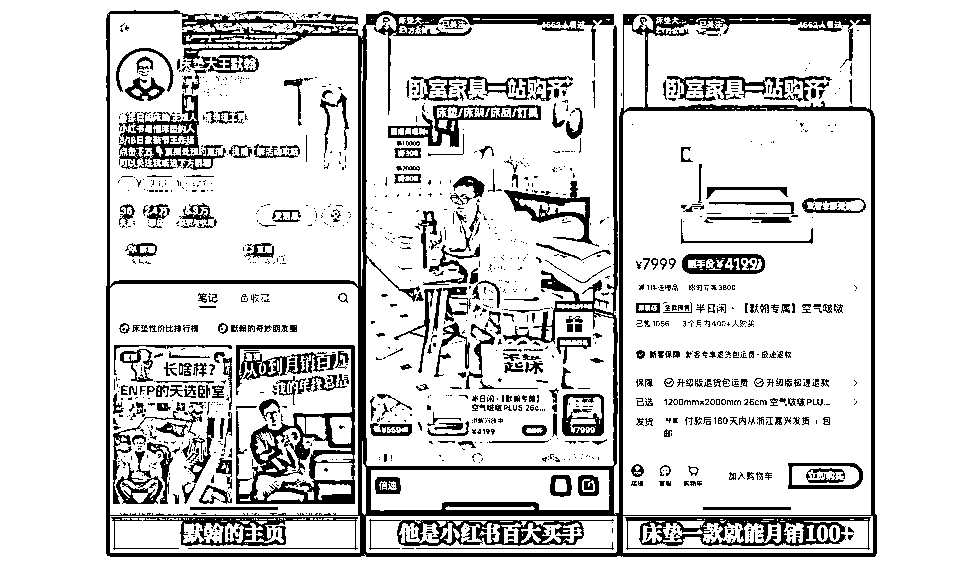
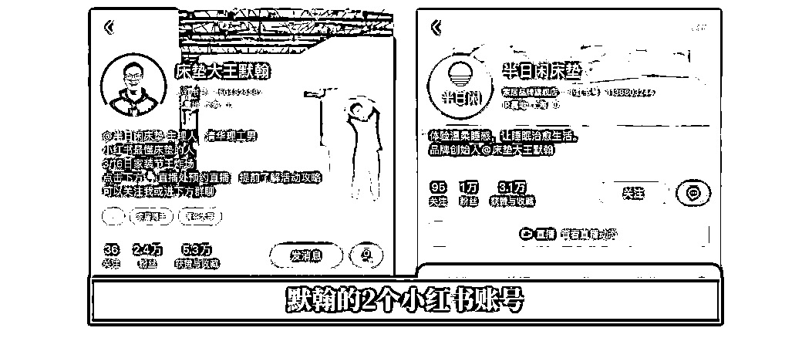
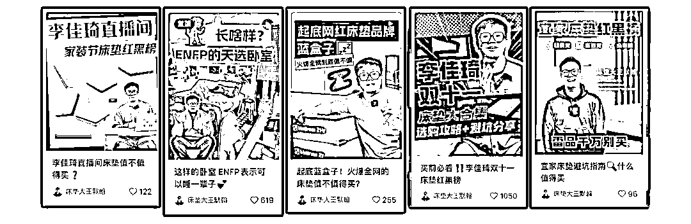
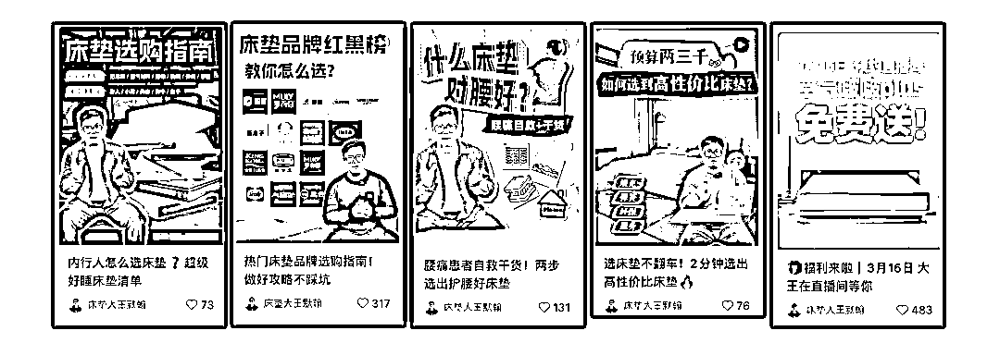

# 2.4w粉博主，自创品牌月销百万：谁说老实人赚不到钱？

> 来源：[https://m08zlw24sg0.feishu.cn/docx/PcmWdK18aoxxGIxC1B0cDSKWnyw](https://m08zlw24sg0.feishu.cn/docx/PcmWdK18aoxxGIxC1B0cDSKWnyw)

自媒体上一直有2种误解：

1、老实人做不好自媒体，

2、粉丝多的更赚钱，20w粉比2w粉更赚钱。

但他的经历，成功打脸了这2种说法。

2.4w粉的“老实人”、家居博主@床垫大王默翰 ，自创高端床垫品牌“半日闲”，一年之间从0做到月销百万，对比一些同赛道20w粉博主，变现能力强了十倍百倍。

他是怎么做到的？

子木今天就从如何模仿学习的角度，结合自己10年品牌营销、4年自媒体运营的经验，拆解一下床垫大王默翰的成长路径，希望能给想要打造个人IP、或通过自媒体赚钱的人一些启发。

# 01、高变现第一步：发现需求，找到痛点

赚钱的本质其实很简单：你为有需求的人提供价值，他获取价值之后，给你回报，这个回报，往往就是金钱。

所以，通过个人IP、自媒体赚钱，也是一样，为有需求的人提供价值，他们付出金钱来换取这份价值。

那么赚钱的第一步，当然就是挖掘需求、找到别人愿意为之花钱的痛点。

床垫大王默翰发现的痛点是：大家对于睡眠的关注越来越高，但是，哪怕花了钱，却也很难买到适合自己的床垫。想要买好的床垫，不知道怎么选，或者花了大价钱，买回来的床垫并不好。

既然有这个痛点，就会有对于如何挑选床垫、买到好床垫的需求，于是，就有了提供别人需要的价值、获得回报的机会。

# 02、高变现第二步：明确变现方式，打磨产品

找到需求之后，要来明确：我们要通过提供什么样的产品，来满足需求？

对于挑选床垫、买到好床垫的需求，有2种可以满足的产品：

1、选品能力，作为一个买手，帮助消费者去挑选好用的、合适的床垫，这时，消费者是为我们的选品能力买单，因为我们能选到好的，而愿意从我们这里购买，同时，品牌方为我们的带货能力买单，因为我们能帮他们卖出去床垫，他们愿意提供佣金。这时，选品能力是一种产品，直播带货的买手，他们的变现产品就是选品能力。

2、好的床垫，也可以作为一个品牌方，为消费者生产真正好用的、有性价比的、好的床垫，提供给他，这时，消费者是为好的物品买单。

这2种产品，哪种更适合自己？这是在找到需求之后、第二步的变现阶段需要明确的。

床垫大王默翰选择的是第二个产品：直接做一个好的床垫品牌，为消费者提供好用的床垫。于是，他创立了高端床垫品牌“半日闲”。

做这种选择的前提是，他具有成功的创业经验：曾经是住范儿的COO，也有一些资源，可以去做实体品牌的创业。

做品牌的好处也很明显：

1.  对产品品质的把控力更强，

1.  可以变现的方式更多，

1.  变现的天花板更高，

1.  未来的发展更多元。

不过，而对于没有成功创业经验、也没有太多财力资源的伙伴，子木的建议是，从第1种产品-买手能力开始，等到积累了一定资源之后，可以再挑战第2种产品。

确定了变现的产品之后，请记住：一定要打磨产品，保证产品质量，这样，才能赚长久的钱，有复购、有转介绍，而不是赚一时的钱，做坏一个项目，又去换到下一个项目。

# 03、高变现第三步：确定渠道，做好输出

有了产品之后，就要通过渠道、内容输出，让别人知道，你有这个产品，而且品质不错，值得体验。

所以，要选择合适的渠道，以及内容输出的方法。

床垫大王默翰的“半日闲”品牌是高端床垫品牌，一个床垫的价格在3000~10000元之间，此时淘宝等电商平台的竞争很激烈，抖音等平台的消费力又没有那么高。

所以，他将渠道选在了小红书：一个天然就适合进行生活种草、女性用户较多、对于产品品质要求比较高、消费能力也比较强的平台。

在输出的策略上，他选择了做2个账号：

一个买手身份的个人IP号，也就是床垫大王默翰，一个半日闲的品牌账号，名字就叫半日闲。

在内容上，分别用2个账号提供2种价值：

*   买手号床垫大王默翰提供的是“选品能力”创造的价值，主要内容是评测各类床垫，帮助消费者闭坑，提供选购知识，通过买手的体验来指导消费者选购适合自己的床垫，有意思的是，他也不拒绝为其他品牌做推广。

*   品牌号提供的是好床垫带来的产品价值，不讲成分，而是展示伴随着好床垫而来的舒适的生活、放松的环境。

一个用来吸引精准流量，打造个人IP、提高信任度，一个用来展示品牌形象，促进产品的直接成交。

我们重点来分析参考性更强的买手号-床垫大王默翰的内容策略。

# 04、变现亮点：床垫大王默翰的内容策略

1，贴标签

为了让粉丝更快的认识、信任自己，不断给自己贴标签是一个很好的方式。

默翰在内容中重复给自己贴了3个标签：

*   清华毕业进厂做床垫，一有反差，清华毕业进厂，这种反差对流量天然有吸引刘，二增加可信度，清华毕业是做的产品，天然会让人觉得更有保障、更可信；

*   半日闲品牌创始人，用上这个标签也有两个好处，给自己的品牌带货，更加顺理成章，另外作为“品牌创始人”，也是体面、有身份的象征，更容易获取信任；

*   拆过几百张床垫的产品研发专家，如果说前面两个标签都是外在的身份，这个标签，就是实实在在的经历，能说明他是一个较真的、认真做产品、认真帮消费者挑选的人，进一步增加了他的专业度、可信度。

有了这样的标签，他在带货时的可信度会提高，带货能力也会更强。

2、专注的同时，有选择性地追热点

默翰是一个能守住本心的人，他知道追热点的好处，但也不会去追无关的、甚至关系不大的热点，所以，可以看到他的内容，追的热点，都是跟床垫紧密相关的:

mbti人格的卧室、双十一的床垫选择、李佳琦直播间的红黑榜、宜家的床垫怎么选……每一个都跟“床垫”紧密相关。

符合垂类IP追热点的3个原则：当下热点、大IP相关、品类强相关。

这样虽然不会有万赞的大爆文，但是流量很精准，并且能很好地保持个人IP的专业形象、不会被其他信息冲淡，是他能够高变现的内容原因之一。

3、做对用户有价值的内容

默翰的内容，除了少数几条讲自己的故事的内容之外，几乎都是关于床垫的干货、和送福利的直播预告。

*   热销床垫红黑榜、喜临门红黑榜、李佳琦直播间红黑榜；

*   床垫选购指南；

*   购买床垫的省钱攻略；

*   就连直播预告，也是送福利。

这些，都是需要选购床垫的消费者，真正关注、需要的内容。

所以，哪怕默翰没有篇篇爆款，也不会影响他的变现能力，因为，流量是精准的，内容是有用的，信任是积累起来了的，成交也就更加容易和自然了。

4、内容形式可以多测试

默翰的内容形式，也是经过了测试的，从图文，到视频，从短视频，到2-4分钟的长视频。

不同的人，适合不同的内容形式，不同的形式，又能有不同的转化效果，所以，不需要认准一种形式不变，可以调整、测试。

5、做个老实人

最后，也是最关键的因素之一：做个老实人。

这个老实，指的是：

*   做品牌时，踏踏实实做产品；

*   做买手时，老老实实花钱买来拆开对比、好好选品；

*   给客户推荐时，认认真真推荐适合他的，而不是贵的；

*   做内容时，兢兢业业做有用的，不做空有噱头的。

这样的老实人涨粉可能没那么快，但大家的眼睛是雪亮的，这样的老实人，会被认可、被信任，会有人愿意找他买1w块钱1个的床垫，然后把他介绍给自己的很多朋友，让他们也来这里买床垫。

总结一下，床垫大王默翰之所以能2.4w粉时，实现自创品牌月销百万的成绩，因为他并不是盲目去做自媒体，而是先发现需求、找到了消费者没有被满足的痛点，然后，通过满足用户的需求，提供价值，并通过对产品的打磨，让自己能够长久的赚钱。第三步，才是根据自己的产品、用户，选择一个合适的平台，并且通过内容策略，让自己成为一个具有更高可信度的、在某个细分赛道专业的买手，为自己的品牌带来精准的流量。

这三个步骤，缺一不可，如果没有一、二，而去追求三，追求自媒体的流量，只是无根之木，舍本逐末。