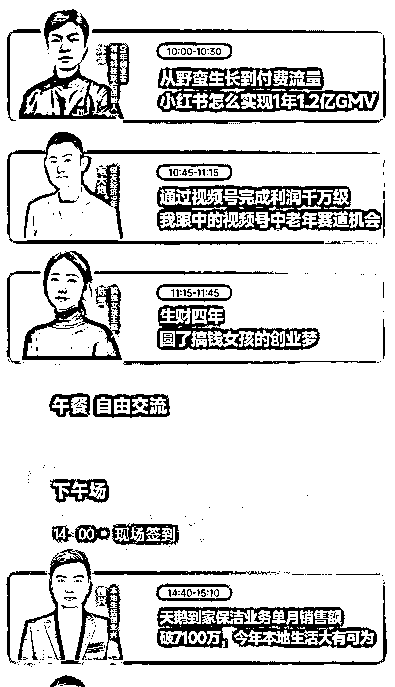

# 从个体户到企业家

> 原文：[`www.yuque.com/for_lazy/thfiu8/nyl2xds1uotsqimf`](https://www.yuque.com/for_lazy/thfiu8/nyl2xds1uotsqimf)

## (355 赞)从个体户到企业家

作者： 刘小排

日期：2024-03-29

哈喽大家好，我是刘小排。好久没跟大家分享了。

上周参加生财有术 2024 航海家见面会线下活动，收获良多。

我们暂且把个体户定义为“5 人以下团队”，把企业家定义为“10 人以上团队”。

在线下活动和数名年入数千万的嘉宾和圈友聊过之后，我对于以下问题有了新的理解。 在这里跟大家分享一些我的心得。

> # **一、越赚钱的人，生意模型越简单**
> 
> 你没看错。越赚钱的人，生意模型越简单。
> 
> 我们举一个简单的例子来说明。
> 
> 比如，咱们生财有术社群内有一个陈年老项目：港股打新。  直到今天，都有很多人在项目里闷声赚大钱。
> 
> 港股打新，明面上的基本原理：
> 
> 1.  平均中签率不到 10%。有时候甚至不到 1%。
> 
> 2.  从过去数年的数据来看，如果打新成功，新股当日（含暗盘交易）上涨的概率约 65%，下跌的概率约 35%。 以过去一年为例，一共有 57 只新股，首日上涨 38 只，下跌 19 只，首日上涨概率是 66.6%。过去三个月，新股一共 11 只，首日上涨 8 只，占比 72.7%
> 
> 表面上看，上涨概率远大于下跌概率，赢面很大，值得干，个体户也可以干、当成副业也可以干。
> 
> 但普通的个体户和副业人士，会遇到两个大问题：
> 
> 1.  中签概率实在是太低，就像买彩票
> 
> 2.  就算运气好买到了彩票，它居然还有 1/3 的概率会亏。去年的新股，首日最大跌幅高达 42.86%
> 
> 那这个生意怎么做得大呢？
> 
> 企业家思考问题的路径会有所不同。对于企业家而言，模型成立，已经足够好了，接下来是复制。
> 
> 对于企业家来说，港股打新生意的核心着力点：放大概率、控制损失。
> 
> 如何放大概率？
> 
> 首先：数量。港股打新有一个规则上的“漏洞”。起源于大陆和香港体制上的不同。
> 
> 香港人一个身份证只能开一户，一个新股只有一次申购机会。 而大陆人靠护照，一本护照可以在每个券商那里都开一个户，同时参与申购。
> 
> 香港的券商很多，相对优质的、有口碑的至少有 20 个左右。
> 
> 这就意味着，大陆人的中签概率，是香港人的 20 倍！ 何况，这还仅仅是一个身份证的情况。如果加上你的配偶、父母、兄弟、合作伙伴，还可以再扩大几十倍。
> 
> 其次，质量。 企业家做港股打新，享受的并不是 65%的平均成功率。他们会组建投研团队，提前排除一些下跌概率大的新股。他们首日打新的上涨率可以做到 80%以上。
> 
> 如何控制损失？
> 
> 基本的数学原理。
> 
> 就和玩德州一样。所谓的 All in，其实是“有限 All in”。 你激动地喊”All in”的时候，推出去的是此时此刻此局此桌的筹码，不是你兜里的所有资产，更不是你的身家性命。
> 
> 每次下注多少，有很多成熟的数学工具。一个常用的数学工具是约翰·拉里·凯利于 1956 年提出的“凯利公式”。有兴趣的同学可以自行 Google 一下。 凯利公式提供了一种科学的方法来优化投资和赌博中的投策略，通过计算每次赌局中应投的资金比例，以期达到最大化的长期增长率。
> 
> 自此，我们就有了一个“生意模型”，它非常非常的简单。
> 
> 特别提示
> 
> 1\. 上面提到的那个存在多年的规则“漏洞”，近期已被修复。最新的玩法有所升级。
> 
> 2\. 咱们生财有术里做港股打新有很多大神。其中一位是：胭脂王。感兴趣的圈友可以翻翻他的帖子，或者去微信搜索公众号
> 
> 借上面拆解港股打新，我们展示了，什么是一个好的生意模型 —— 每一次投入赚的都是小钱，但重要的是，它可以被大量的复制。
> 
> 正因为需要大量复制，企业家才需要把生意模型做得越简单越好。 越复杂的模型，越难复制。复杂模型的复制门槛包括并不限于资金门槛、人才门槛、时间门槛等等。
> 
> 我们看到生财有术的航海实战项目，里面有大量这样的生意模型。无论是小红书、视频号还是抖音、咸鱼、淘宝。
> 
> 一些圈友会抱有疑问： 他们看起来不能赚很多钱，参加小航海，使出吃奶的劲来卷一个月，也就只挣了几千块钱而已。
> 
> 他们忽略了复制的重要性。
> 
> 我们跳出生财有术看看，蜜雪冰城不也和港股打新一样吗？
> 
> 蜜雪冰城的加盟商，按照总部给定的 SOP 进行操作，一个月也能挣小几万，简简单单 —— 这是个体户。
> 
> 但对于蜜雪冰城来说，它有 32180 家店，把一个小的生意模型，复制了 32180 次 —— 这是企业家。
> 
> 我们也可以从这个角度理解生财有术正在共读的《10x is Easier Than 2x》一书。
> 
> 为什么 10 倍比 2 倍容易？因为提升 2 倍，依靠的是做得更复杂、更卷；提升 10 倍，依靠的是做得更少、更简单。
> 
> 更简单，就更容易复制。
> 
> 大量复制，是企业家思考问题的出发点。 这是个体户和企业家的第一个区别。
> 
> # **二、个体户专注于 How，企业家专注于 Who**
> 
> “Who Not How” 这个概念由 Benjamin Hardy 和 Dan Sullivan 在其作品《Who Not How》中提出。 对了，他俩也是生财有术正在进行的共度活动《10x is Easier Than 2x》一书的作者。
> 
> 他们认为，在很多情况下，人们往往过于关注于实现目标的具体方法和步骤，而忽略了更为重要的因素——关键人物或因素的作用
> 
> 这个概念我早就知道，书也看过。但真正让我深刻理解，源于在上周生财有术航海家线下活动，盗坤兄弟的演讲。
> 
> 普通人、副业人士、个体户，怎么做直播呢？ 一个很好的路径是跟随生财有术的实战，有老师和助教按头喂饭，告诉你怎么一步一步打怪升级。
> 
> 他们关注的是“How”，脑海中的问题总是以“怎么”(How)开头 —— 怎么让视频有更多播放量？怎么节省成本？怎么做出来更好的话术？怎么提升下单率？
> 
> 这当然是对的。复制前人的成功经验，少走弯路，这是常识，也是正道。
> 
> 但这不是盗坤的做事方法。
> 
> 盗坤的公司孵化了一些成功主播，其中一些主播，直播的同时在线可以做到 4 万，单月利润千万级。这一点大家已经知道了。
> 
> 但大家可能不知道的是：主播并不是盗坤培养出来的，而是筛选出来的。
> 
> 盗坤的方法是：每天面试 140 人。
> 
> 每天面试 140 人，持续很久。
> 
> 只为了筛选出来的万中之一的 Who。他并没有在考虑“如何让我普通员工直播能够做到 4 万同时在线的”How“。
> 
> 茅塞顿开。
> 
> 我和其他一些拿到大结果的航海家交流，都发现了类似的情况。
> 
> 做到了“Who Not How”的企业家，他们平时看起来格局很大、云淡风轻、生活潇洒。他们坚信自己的“生意模型”和自己找到的“Who”。
> 
> “Who Not How”。 这是个体户和企业家的第二个区别。
> 
> # 三、如果你是生财有术新人，这是你的成长地图
> 
> **1、从生财有术实战小航海活动中，找到一个适合自己的****生意模型。**
> 
> 不用从其他地方找，甚至不用从浩如烟海的精华帖当中找。小航海列出来的项目，都是久经考验的、能够复制的生意模型。
> 
> **2、把小模型跑通，达到同行****前 2%****的水平。**
> 
> 2%是什么意思呢？如果与你同期参加的小航海群里有 500 人，那么，你不应该允许群里有超过 10 人比你赚到的钱更多。
> 
> 如果竟然存在超过 10 个人，请你继续修炼。
> 
> 据我的了解，大部分生财有术的实战项目，top 2%都能做到月入几万元。
> 
> 一个月不行，就两个月。两个月不行，就三个月。
> 
> 日拱一卒，移山填海。
> 
> **3、  组建团队，开始****复制****。**
> 
> 亦仁告诉我，团队发生质变的门槛是 10 人。一旦超过 10 人，以后成长就非常快。
> 
> 大家可能会发现一个现象：生财有术的精华帖，“小红书”和“矩阵”两个词语总是高度相关。 他们正是在复制。
> 
> 上周的航海家线下活动有很多嘉宾，佳兴、毛大炮、沐泽……   成功关键词都是“复制”。 没有参加线下活动的朋友，可以带着这个认知去看看上周的活动海报，看看他们分享内容的标题。
> 
>   
> 
> **4、****找 Who****，持续找**
> 
> 这个 Who，可以是帮你搞定核心业务关键节点的人。比如，我的技术负责人、我的产品经理。虽然我是全栈程序员，也是产品经理，但今天我不需要写程序也不需要写产品需求。我放心把关键节点交给他们，自己腾出精力，做更重要的事：做决策、找方向。
> 
> 这个 Who，可以是帮你搞定现有业务闭环的人。  正如亦仁在生财有术的合伙人。
> 
> 这个 Who，也可以是帮你组建团队的人。咱们一些优秀圈友比如做 TikTok 年 GMV 过亿的 Albert，手上有四只团队，每个团队都需要一个主将。
> 
> # 总结
> 
> 欢迎大家在留言区与我讨论。
> 
> * * *
> 
> 评论区：
> 
> 唐葫芦 : 看来得去翻翻这本书了，谢谢小排老师的分享
> 冯巧杰(小冯妮儿) : 个体户时候的思维就是做卷做复杂成壁垒，这反倒是规模化的掣肘，有时候成就你的也会羁绊你
> 沐轩 : 感谢，这句话让我茅塞顿开[握手][握手]
> 家蒙 : 睡前不敢看，怕太兴奋
> 冯巧杰(小冯妮儿) : 有用就好
> 冯巧杰(小冯妮儿) : 强烈建议把小排老师的帖子撸一遍，我已经泡上茶开撸了，
> 烽火 : 写的真好，思维打开了！
> 思齐 : 看到小排老师用港股打新举例子，想问问有没有玩期货的圈友[嘿哈]
> 
> 
> 
> * * *