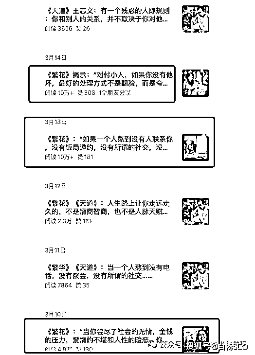
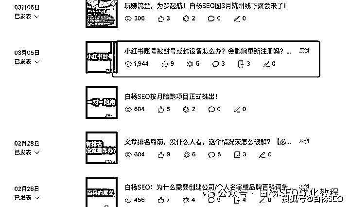
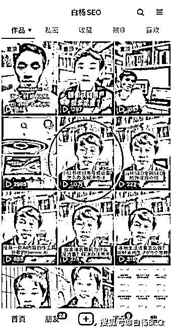
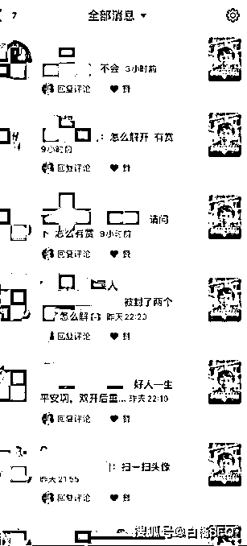
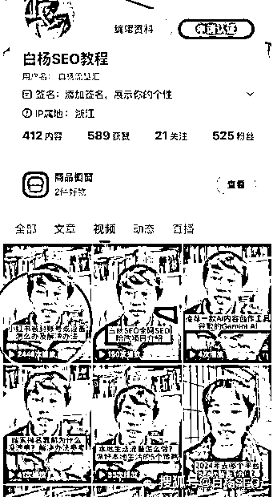
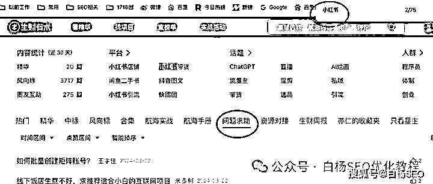
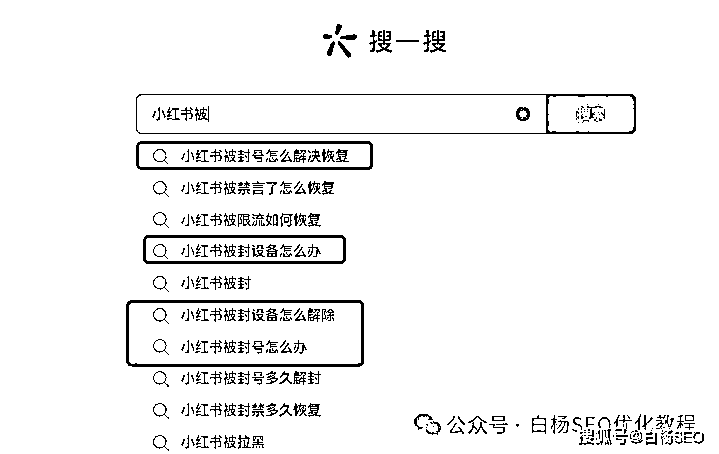
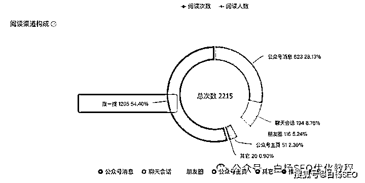

# 找准用户痛点，搞到更多自然精准搜索流量和平台推荐流量

> 原文：[`www.yuque.com/for_lazy/thfiu8/yzvunfbdy1t3m1a0`](https://www.yuque.com/for_lazy/thfiu8/yzvunfbdy1t3m1a0)

## (24 赞)找准用户痛点，搞到更多自然精准搜索流量和平台推荐流量

作者： 白杨 SEO

日期：2024-03-25

有人说，做公众号文章要有流量，提高用户打开率，容易上平台推荐，标题一定要短，比如：

2024 一定要做小红书，马上！

第一批靠 XXX 的人已经赚翻了！

XXX，才是最牛逼的流量密码！

也有人说，做公众号文章爆款流量，标题是一定要长，一定要有更多吸引用户的点。

比如之前《繁花》爆火的十万+文章标题：

《繁花》看懂了婚姻，女人最值得嫁的男人不是身价过亿的宝总，也不是怕老婆的陶陶，而是这个吃 5 毛钱油墩子的他。

《繁花》揭示：“对付小人，如果你没有他坏，最好的处理方式不是翻脸，而是夸赞。你要知道，凡是小人多半虚心和嫉妒心都极强”

假如正好你也在做微信生态公众号的这个图文流量，你是不是会疑惑，这 2 种方式到底哪种才是正确的打开方式？

如果你是白杨 SEO 的老读者，并且看过我一些文章，你是不是也在疑惑我这个文章标题形式也在变来变去？

先回答下第一个问题，不管标题是短还是长，这两种打开方式都正确！

因为前者是基于公众号已经有一定的用户量，是为了更加吸引关注用户打开率，用户打开率高，所以上推荐概率也越高！比如我之前那篇《除了抖音，这 2 个平台流量必做！》，目前已破 2 万+阅读了，其实偷偷说，是个毛遂自荐的广告！

再比如后者，因为后者基本就是做的新公众号，没有多少基础粉丝，主要就是去做平台推荐流量的。用日更的方式，以前用 AI 写作都能入池（进入平台推荐流量就叫入池，如图看推荐来的流量占比），现在要 AI+手工，甚至更专业来写。一般是两周到一个月左右，这个项目他们叫公众号爆文搞流量主变现。

比如上图是我的原创文章《[一句话让我如履薄冰！说说百度搜索新变化与月之暗面 kimi Chat【白杨 SEO】](http://mp.weixin.qq.com/s?__biz=MzU2NTQzMzA4Nw==&mid=2247499454&idx=1&sn=5d8fb64f38fcd2da2991aae4c44c928c&chksm=fcb9792ecbcef038d7c2540f9a617e6bfdd623c209942cdff82dc8b536a425a8ba515a7f2e74&scene=21#wechat_redirect)】》，这篇标题就比较长。

回答第 2 个问题，白杨 SEO 公号的文章标题之所以会变来变去，因为我也在测试啊。老朋友知道，白杨 SEO 一直自称实战派，所以实战测试是我必须要做的，这下懂了吧。

好了，前面那点实战案例分享只算是开胃菜，咱们正式进入正题。

**为什么说找准用户痛点，做爆流量很容易，可以搞到更多的搜索流量或推荐流量？**

这里的用户痛点是指什么？是用户很急切的需求，并且会为这个需求付费！

上面我实战举例的公众号短标题和长标题，其实都是击中了用户痛点！比如，第一批靠 XXX 已经赚翻了，是一批想赚快钱用户找项目的痛点，他在想自己能不能干。

比如，后面繁花长标题里小人要多夸赞，不就是解决那些不会处理小人的痛点吗？

你可能会问，怎么发现用户痛点，用什么形式去解决？为什么用户痛点跟流量有直接关系？

所谓用户痛点跟流量关系，就是指在做某个事遇到问题，需要某个解决方案。他可能是主动去搜索找答案（这里就是跟我们做搜索流量，关键词 SEO 排名有关），也可能是看到某个平台推荐的内容，自然点进去了。用户搜索查看或者通过推荐点进去，对于做这个解决方案的就是流量来了。

用户痛点用什么形式去解决？

其实形式不限，如果你擅长做图文，那你就以图文形式。如果你擅长做短视频，就以短视频形式。

怎么发现用户痛点？可以看看这两篇：

[白杨 SEO：从百度一下到抖音搜索，挖掘用户需求流量新机会！](http://mp.weixin.qq.com/s?__biz=MzU2NTQzMzA4Nw==&mid=2247490668&idx=1&sn=99ae1e302fff65e313cda2d533795741&chksm=fcba9bfccbcd12ea40efae813aa91fed96c74527d66a6f9bf948cf54236c1c4286ad3ee8c4f5&scene=21#wechat_redirect)

[白杨 SEO：写文章或拍短视频时，如何找到自己用户的真正需求？](http://mp.weixin.qq.com/s?__biz=MzU2NTQzMzA4Nw==&mid=2247493275&idx=1&sn=14a6a3d1b8ce4e78b236370ee298906b&chksm=fcb9610bcbcee81d53aa4c15fb41cbb72ecd906407f3790f18c4bd4d9f064da1e867396a9775&scene=21#wechat_redirect)

接下来就以之前不久写过的一篇文章名为：小红书账号被封号或封设备怎么办？会影响重新注册吗？小红书负面处理参考为例，后面又把这个录成视频发在了各个短视频平台，基本都来了不错流量，如图。

看图，不管是公众号还是抖音，快手，百家号都比一般的流量大，甚至小红书也是，没截图。

你可能会说，我们都是十万百万千万数据，你这点数据也能拿出来举例？但我告诉你，我的账号只是垂直讲 SEO 流量的，同时我是做搜索流量的。

你可能会说，是因为小红书是 2024 年的热点平台，所以你的有流量。但我的主要词不是小红书，而是小红书账号或者设备被封啊。

**1、怎么发现这个用户痛点需求呢？**

最开始是我付费群里有一个人在提问，小红书被封了还能不能再去用这个设备之类。

大家知道，生财有术搞了个网页版里有一个问题求助版块，我就用这里去看看，看看这个是不是共性问题。

然后我看到很多人在问小红书账号怎么解封，小红书设备封禁怎么办等等，所以基本就可以判断了。

当然，如果你没有这样的社群或者资源，你可以全网各平台的搜索下拉框，输入你的产品或业务，去看看是否有共同想搜的那个问题就是。

**2、如何解决这个痛点呢？**

如果是我自己有被封过号和解封过，最好。如果没有，可以问问身边的朋友。

我自己因为是做个人 IP，还没用到小红书批量号几十几百甚至更多去操作，所以没有遇到封号问题。恰好我的一个小红书 SEO 私教同学有在这样做，我就去问他怎么处理的，他告诉了方法，然后我再去生财看其它圈友的回答参考，这样不就综合能解决了吗？

因为我最终不做付费解封或者指导什么服务，我是用来测试流量，以及吸引感兴趣用户关注我，所以你不能直接看出我的变现路径哈。

**3、如何把搜索关键词与推荐结合起来搞流量？**

偷偷的说，写小红书解封这个公众号标题，其实我用搜一搜搜过别的怎么写的。

然后我自己懂搜一搜 SEO，所以我用了关键词挑选方法，如图。

看到没，这篇文章在搜一搜来的流量搜索占比 50%以上，这就是搜索来的流量为主。

**我为什么又把推荐要结合起来了呢？**

因为我想这个文章在微信有人需要，在其它平台也需要。而且抖音本来流量也大，小红书平台本身也有很多人在做。所以我就把文章重要观点口述做成视频（可以去抖音或者快手看白杨 SEO 的这个视频数据）

如何把推荐流量结合了呢？短视频上推荐，一般需要一些热门 BGM，需要热门标签，需要用户的互动，恰好我这个视频都用了。

当然，最最最重要的事，我核心还是做搜索流量为主，虽然在当下推荐流量，付费买流量为王的时代，搞 SEO 搜索有点落伍，但这个需求永远有人需要。

这个虽然是讲的小红书平台搞流量账号问题，假如你是做美容或者 XX 培训或者什么产品，都有痛点，我的实战经验，你都能参考通用哦。

**作者介绍：**

白杨 SEO，专注 SEO 十年，全网 SEO 流量实战派，对互联网精准流量有深入研究。全网同名：白杨 SEO。

* * *

评论区：

暂无评论

* * *