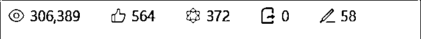
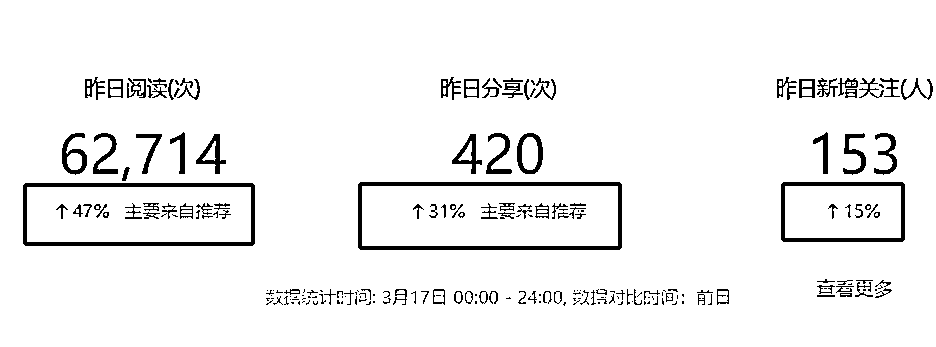
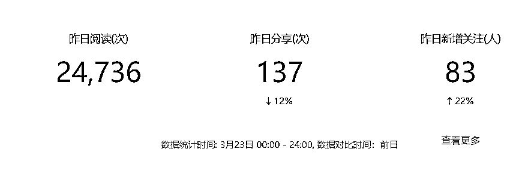
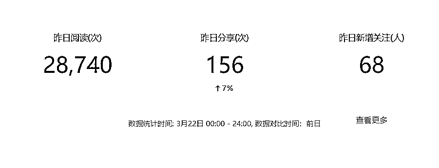
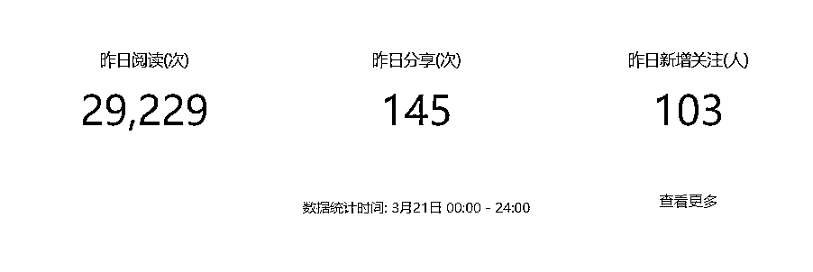

# 众号爆文：写出 30w+阅读后，流量陷入困境，公号这条路后续应该怎么走？

> 原文：[`www.yuque.com/for_lazy/thfiu8/ps3txz423ttekknv`](https://www.yuque.com/for_lazy/thfiu8/ps3txz423ttekknv)

## (40 赞)众号爆文：写出 30w+阅读后，流量陷入困境，公号这条路后续应该怎么走？

作者： Adrian

日期：2024-03-28

大家好，我是 Adrian，没啥标签，非要自己打的话，**就是一个靠谱的人**。

去年 4-5 月份我写过一篇公号爆文从 0-1 启动号的文章（[`wx.zsxq.com/dweb2/index/topic_detail/584441848825454`](https://wx.zsxq.com/dweb2/index/topic_detail/584441848825454)），因为太忙就一直没分享，最近正好借着航海把这小一年多的心得分享给大家。

**读前郑重提示：个人经验，仅作参考。**

公号爆文我是第一次有航海就参加了，当时做的是情感领域，**单月收入 3000-4000，最高阅读 8w 多**。后来情感领域整体流量下降，就改做其他领域去尝试，陆陆续续有试过**民生、读书、热点、剧评等赛道，效果都还行，每个月都能保持 6000 多的收入**。

因为当时还在职，仅仅把公号当成一个副业来做，每天花费时间不多，有这个收益我觉得过得去，也挺满意的。

直到去年 9 月我主动辞职出来做事儿的时候，才发现钱真 tnd 难赚。目前手上能稳稳带来收益的好像就公号爆文，所以就布了 10 个不同领域的公号开始做。刚开始还是按照之前的方式来操作，效果还行，有时候高，有时候低，但过的去。

而且在 11 月写出一篇 30w+的阅读后，更是让我信心满满，每天在公号花费的时间更多了。但更多的时间带来的却不是更多的收益，而是阅读量断崖式下降。

那个时候挺慌的，**不明白为啥流量突然没了**，选题也是找爆款选题，文章也是通过精心试验过的 prompt 来写，怎么就没了？

自己也被其他人割了几次，但交付的都没啥效果，都快想放弃了。

不过总觉得坚持了这么久，项目方向没问题，自己也有点小成绩，现在放弃太可惜了，就给自己半个月，沉下心来好好研究。

想着要是半个月都没方向的话，就战略性放弃了。

还好功夫不负有心人，还是成了，不过整体做的挺大的变化，所以下面进入到干货阶段。

**我总结了 4 个相对关键的问题，大家可以看看：**

## 1、公众号爆文究竟应该怎么做？

我之前是把公号爆文当做流量主来做，通过广告赚钱，走的路子是铺矩阵，走量，用数量来博取概率。

但公号这个东西是半私域流量啊，无论公号现在怎么落魄，它的基础盘子是在的。而且公号和视频号、小程序、企微、个微的链接是所有产品中最好的。

所以，我将纯流量主的生意改成了三部分，**一部分是做流量主生意，第二部分是通过公号引流，引流到个微中卖产品，第三部分是通过公号来拓展供应商**。

在这个前提下，我把 10 个不同领域的公号都更改成同一领域更细分的账号（**不用注销，直接换名字、头像、简介就行）**，为我们主营的电商业务服务。

让公号成为我们主营业务的引流渠道之一。

同时因为有同领域公号矩阵的加持，除了能在 BD 供应商的时候提供账号，还能被动吸引很多同领域的品牌方来找我们合作。**（当然，这是在公号做起来的基础上）**

对于公号这个项目，**我更建议将它和自身业务想结合去做，这样更有积累**，如果暂时没有业务，也可以和自身工作想结合，能为未来做积累。不要追一时的热门赛道，每个热门赛道都有周期，追一时，赚几个月钱，后续还是做重复工作。

## 2、公众号爆文怎么能做起来？

其实，公号怎么做起来归根结底还是到内容上，公号的逻辑是【原创且优质】的内容给于流量，如果你的量没被推荐，一般大概率是内容问题。

验证内容好坏的方法也很简单，我主张一鱼都吃，按照我自己的试验来看，公号爆的文章百家号也会爆，这就是好内容。

一个好内容大体分为三个部分：

**选题+框架+内容**

记住这 3 点，在内容逻辑没跑通之前，不要费劲儿搞什么排版，那都是小术，浪费时间。等内容逻辑通了，再慢慢优化。

选题要找好的对标，有选题库，这个我就不说了。

**框架！这个很重要，别自己整框架，要按照你找的选题文章来。**

举个例子，比如这篇文章：[`www.sohu.com/a/766410037_120020376?scm=`](https://www.sohu.com/a/766410037_120020376?scm=)，90w 的阅读

**你就直接抄架构：**

1、刘亦菲是一个“女神”般的存在

2、刘亦菲的演技还很好

3、刘亦菲这几年不演电视了

4、刘亦菲的气质也很好

5、刘亦菲在娱乐圈的颜值也比较挑剔

6、刘亦菲这么久没恋爱了

快速抄写出 6 点，然后总结一下：**1、刘亦菲是很多观众中心中的女神；2、这个女神有哪些特点（演技好、气质好、颜值好）；3、女神这几年没演电视，是不是情感问题？4、原来不是情感问题，女神还是单身，原因是...**

用总结出的结构写新文章，一个是大选题还是一样，第二个是没太大洗稿风险，第三是有些文章会有博眼球的内容，不太真实，我自己的习惯是会去掉这些，给更真实的内容，这也是根据业务来定的，比如我要引流后成交，肯定不能写那种纯博眼球的文章，会降低信任。

**最后就是内容**

内容部分用 AI 就行，但我自己的测试，现在公号对 AI 的识别越来越精准了。

所以 AI 仅仅是你的助手，别全靠 AI，还是要自己修改的。

内容这个东西，提升最好的办法就是找人改文章，改个几篇你就有感觉了。

## 3、为什么我模仿的对标爆不了

这个是很多人问我的问题，为啥我同样的标题，同样的选题，对标能爆，我就不行？

朋友们，对标是已经在这里领域成功了，所以写这个选题才能爆，而不是靠着这个选题爆的。

我们找对标，**要找低粉爆款的号，别找那种大号**。最好找的公号是好多文章都低，突然有一篇高的这种，或者你找头条，找那种阅读高，留言也多的，这种都不错。

还有，公号我自己测试的是账号在领域有**权重的**，你的权重高，在这个领域和你同类型同体量的号发一样的内容，大概率它的推荐量不如你。

## 4、【稳定】比【曝光】来的更长久

最后再说一下，别追求曝款，追求稳定。

之前我也追求曝，但曝这个事情真的不好说，与其你要一篇百万➕，不如要好多篇 2w、5w 的，天天都这个数，稳稳的，还是不错的。

**最后的最后，再说一下被割这个事情，你看他发的数据**

举个例子，公号这个浏览量是有日环比的，如果他给你发的数老高了，但下面有绿色的增长数据，这就是有某一篇文章起来了。

比如我这个，就是某一篇文章起来了

最好让他多发点看看，**比如我另外一个号，虽然有起落，但每天大差不差，这就是比较稳，所以多留心**。

这段时间比较忙，有空再分享公号其他内容，祝各位老板发财！

（ps：**写历史赛道的朋友，可以试试袁世凯、慈禧、溥仪这三个人，说不定有惊喜**）

* * *

评论区：

小胖 : 非常感谢分享！

* * *