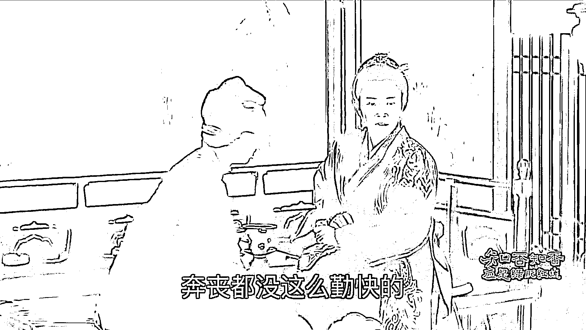
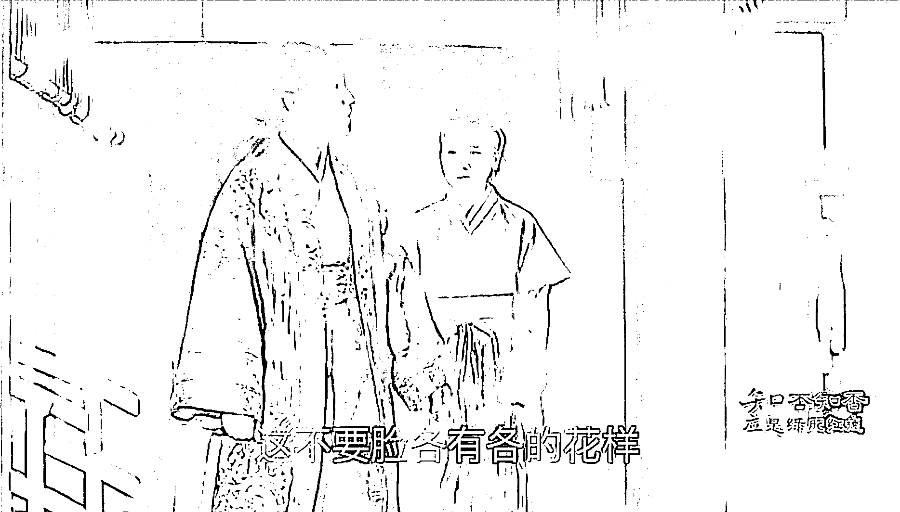
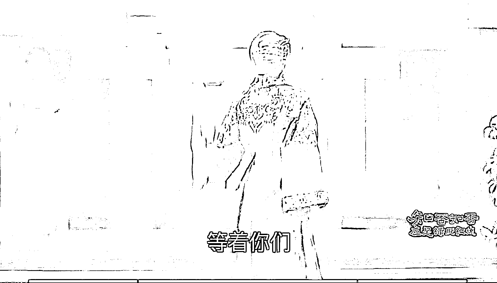

# 如何做一个赚钱的剧评公众号？

> 原文：[`www.yuque.com/for_lazy/thfiu8/haeeeqfr9a8tsin9`](https://www.yuque.com/for_lazy/thfiu8/haeeeqfr9a8tsin9)

## (54 赞)如何做一个赚钱的剧评公众号？

作者： 亦小亮

日期：2024-03-28

《如何做一个赚钱的剧评公众号?》
圣贤说母慈子孝
这是母慈子才孝
不知狗头嘴脸的姨母
三天两头来摆臭架子充老大

这不要脸各有各的花样
更有那装傻充愣的
奔丧都没这么勤快的

我告诉你们黑心肝的
你们若不肯平安地过
自然有不平安的 等着你们

这是知否里的一段经典骂人话，常嬷嬷狂喷康姨妈，这块儿简直就是观众的嘴替！妙语连珠，一针见血！护了顾廷烨最爱之人，同时打击了顾家大娘子的气焰。

也是我做剧评开始觉得有意思的一点。

[`gd7vhxq16l.feishu.cn/wiki/VUQVwN5X9iFRjIkR4P8cet73nng?from=from_copylink`](https://gd7vhxq16l.feishu.cn/wiki/VUQVwN5X9iFRjIkR4P8cet73nng?from=from_copylink)

* * *

评论区：

暂无评论

* * *